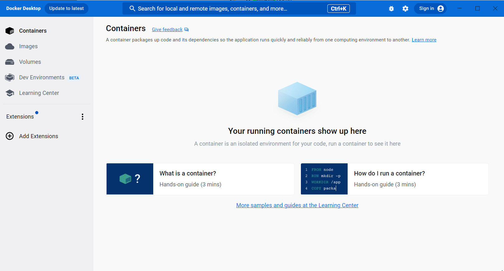
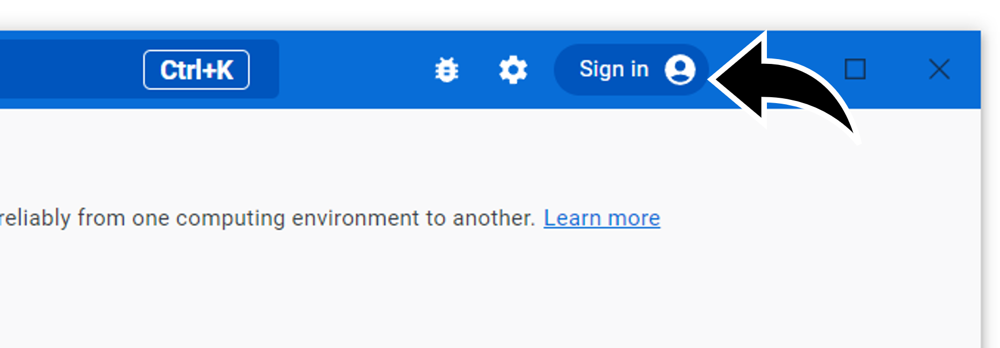
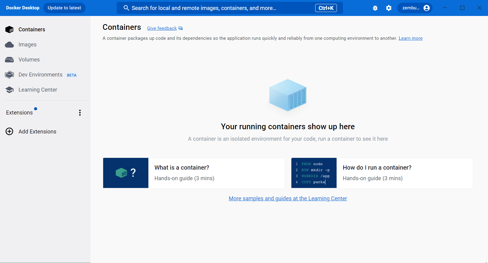

.. -*- coding: utf-8 -*-
.. URL: https://docs.docker.com/get-started/publish-your-own-image/
   doc version: 24.0
      https://github.com/docker/docs/blob/main/get-started/publish-your-own-image.md
.. check date: 2023/07/20
.. Commits on Mar 29, 2023 2bb51097108a4de4259828fc299d54b358a76baf
.. -----------------------------------------------------------------------------

.. Run Docker Hub images
.. _run-docker-hub-images:

========================================
Docker Hub イメージの実行
========================================

.. sidebar:: 目次

   .. contents:: 
       :depth: 2
       :local:

.. Follow this guide to learn how you can share your packaged application in an image using Docker Hub.

以下のガイドでは、イメージ内にパッケージ化したアプリケーションを、Docker Hub を使って共有できる方法を学びます。

.. Step 1: Get an image
.. _Step-1-Get-an-image:

ステップ1：イメージの取得
==============================

.. Before you publish your image, you need an image to publish. For this guide, use the welcome-to-docker image.

イメージを公開する前に、公開するイメージが必要です。このガイドでは ``welcome-to-docker`` イメージを使います。

.. To get the image, use Docker Desktop to search for the welcome-to-docker image, and then select Pull.

イメージを取得するには、 Docker Desktop で ``welcome-to-docker`` イメージを検索し、それから **Pull** を選びます。

.. Step 2: Sign in to Docker
.. _step-2-sign-in-to-docker:

ステップ2：Docker にサインイン
==============================

.. To publish images publicly on Docker Hub, you first need an account. Select Sign in on the top-right of Docker Desktop to either sign in or create a new account on Docker Hub.

Docker Hub にイメージを公開するには、アカウントが必要です。Docker Desktop の右上にある **Sign in** を選び、Docker Hub にサインインするか新しいアカウントを作成します。

.. Step 3: Rename your image
.. _Step-3-Rename-your-image:

ステップ3：イメージの名前変更
==============================

.. Before you can publish your image to Docker Hub, you need to rename it so that Docker Hub knows that the image is yours. Run the following docker tag command in your terminal to rename your image. Replace YOUR-USERNAME with your Docker ID.

イメージを Docker Hub に送信できるようにする前に、イメージの名前を変更する必要があります。これは Docker Hub にイメージが自分のものだと識別させるためです。ターミナル内で以下の ``docker tag`` コマンドを実行し、イメージの名前を変更します。 ``YOUR-USERNAME`` は自分の Docker ID に置き換えてください。

.. code-block:: bash

   $ docker tag docker/welcome-to-docker YOUR-USERNAME/welcome-to-docker

.. Step 4: Push your image to Docker Hub
.. _Step-4-Push-your-image-to-Docker-Hub:

ステップ4：Docker Hub にイメージを送信
========================================

.. In Docker Desktop, go to the Images tab and find your image. In the Actions column, select the Show image actions icon and then select Push to Hub. Your image uploads to Docker Hub and is publicly available for anyone to use.

Docker Desktop 上で **images** タブに移動して、自分のイメージを見つけます。 **Actions** 列で、**Show images action** アイコン（⋮）を選び、 **Push to Hub** を選びます。イメージが Docker Hub にアップロードされれば、誰でも使えるように公開状態となります。

.. Step 5: Verify the image is on Docker Hub
.. _step-5-verify-the-image-is-on-docker-hub:

ステップ5：Docker Hub 上でイメージを確認
=======================================

.. That’s it! Your image is now shared on Docker Hub. In your browser, go to Docker Hub and verify that you see the welcome-to-docker repository.

以上です！ イメージは Docker Hub 上で共有されています。ブラウザで `Docker Hub <https://hub.docker.com/>`_ を開き、 ``welcome-to-docker`` リポジトリが見えるのを確認します。

.. What’s next

次は何をしますか
==============================

.. In this guide you learned how to publish your own image to Docker Hub. Continue to the following language-specific guides to learn more about creating images for applications in other languages:

このガイドでは Docker Hub に自分のイメージを公開する方法を学びました。他の言語によるアプリケーションのイメージ構築について学ぶには、以下の言語別ガイドに進んでください。

* :doc:`Node.js </language/nodejs/index>`
* :doc:`Python </language/python/index>`
* :doc:`Go </language/golang/toc>`
* :doc:`Java </language/java/toc>`
* :doc:`C# (.NET) </language/dotnet/toc>`

.. seealso::

   Publish your images
      https://docs.docker.com/get-started/publish-your-own-image/

