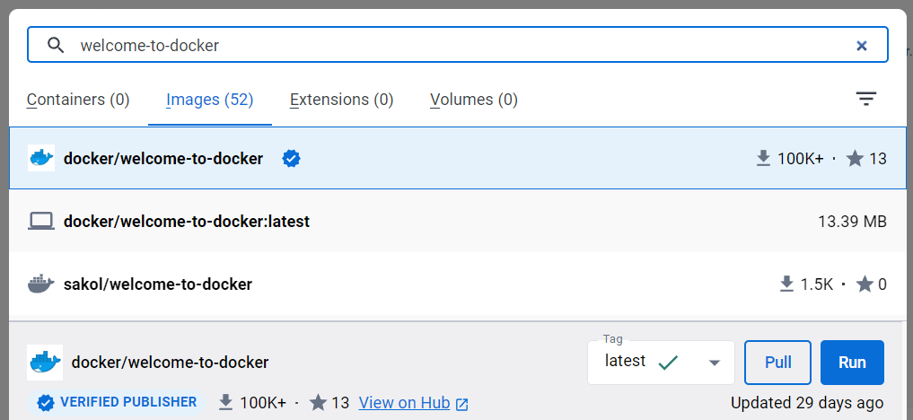
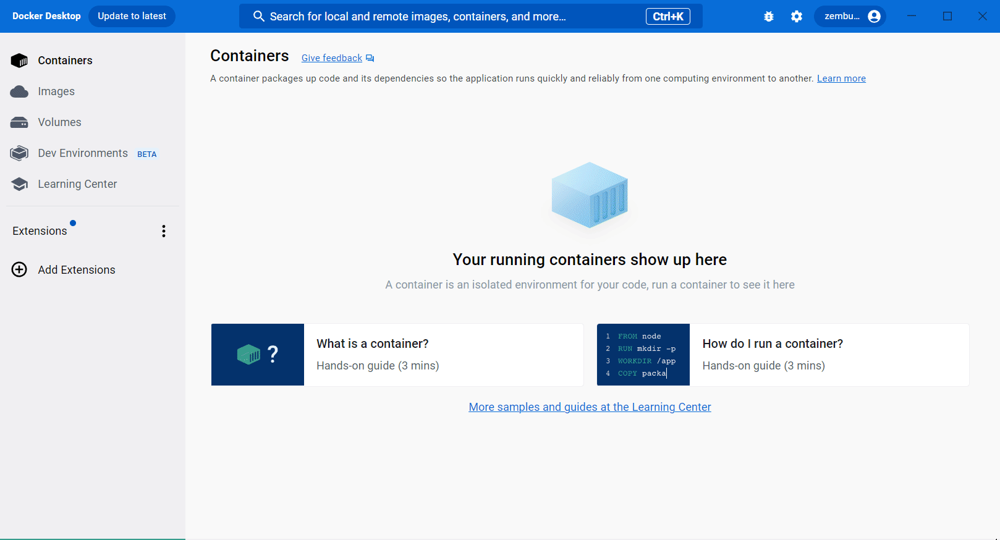
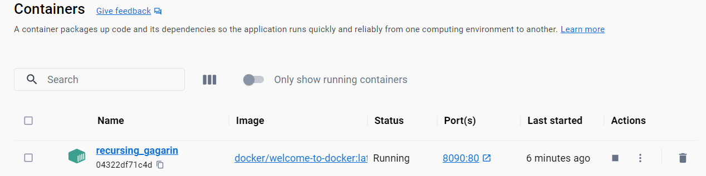

.. -*- coding: utf-8 -*-
.. URL: https://docs.docker.com/get-started/run-docker-hub-images/
   doc version: 24.0
      https://github.com/docker/docs/blob/main/get-started/run-docker-hub-images.md
.. check date: 2023/07/20
.. Commits on Mar 29, 2023 2bb51097108a4de4259828fc299d54b358a76baf
.. -----------------------------------------------------------------------------

.. Run Docker Hub images
.. _run-docker-hub-images:

========================================
Docker Hub イメージの実行
========================================

.. sidebar:: 目次

   .. contents:: 
       :depth: 2
       :local:

.. You can share and store images in Docker Hub (http://hub.docker.com). Docker hub has over 100,000 images created by developers that you can run locally. You can search for Docker Hub images and run them directly from Docker Desktop.

Docker Hub （ https://hub.docker.com ）でイメージの共有や保管ができます。Docker Hub では開発者によって作られた 100,000 以上のイメージがあり、それらをローカルで動かせます。Docker Desktop から直接 Docker Hub のイメージを探したり実行したりできます。

.. Step 1: Search for the image
.. _step-1-search-for-the-image:

ステップ1：イメージの検索
==============================

.. You can search for Docker Hub images on Docker Desktop. Use the search bar, or use the shortcut ⌘K on Mac or Ctrl + K on Windows. In the search bar, specify welcome-to-docker to find the docker/welcome-to-docker image used in this guide.

Docker Desktop 上で Docker Hub のイメージを検索できます。検索バーを使うか、Mac os ではショートカット  ⌘K または Windows ではショートカット Ctrl + K を使います。このガイドで使うイメージ ``docker/welcome-to-docker`` を探すには、検索バーで ``welcome-to-docker`` と入力します。

.. Step 2: Run the image
.. _step-2-Run-the-image:

ステップ2：イメージの実行
==============================

.. To run the docker/welcome-to-docker image, select Run. When the Optional settings appear, specify the Host port number 8090 and then select Run.

``docker/welcome-to-docker`` イメージを実行するには、 **Run** を選びます。 **Optional settings** が表示されたら、 **Host port** 番号を ``8090`` にしてから **Run** を選びます。

.. note::

   .. Many images hosted on Docker Hub have a description that highlights what settings must be set in order to run them. You can read the description for the image on Docker Hub by selecting View on Hub or by searching for the image directly on https://hub.docker.com.
   
   Docker Hub 上にあるイメージの多くには、イメージを実行するために必要となる主な設定についての説明があります。 Docker Hub 上でイメージの説明を読むには、 **View on Hub** を選ぶか、 https://hub.docker.com 上で直接イメージを検索します。

.. Step 3: Explore the container
.. _Step-3-Explore-the-container:

ステップ3：コンテナの調査
==============================

.. That’s it! The container is ready to use. Go to the Containers tab in Docker Desktop to view the container.

これで終わりです！ コンテナを使う準備が調いました。Docker Desktop の **Containers** タブに移動し、コンテナを表示しましょう。

.. What’s next

次は何をしますか
====================

.. In this guide, you ran someone else’s image from Docker Hub. Continue to the next guide to learn how you can publish your own image to Docker Hub.

このガイドでは、Docker Hub 上にある他人のイメージを実行しました。続いてのガイドでは、自分のイメージを Docker Hub に送信する方法を学びます。

* :doc:`イメージの公開 <publish-your-own-image>` 

.. seealso::

   Run Docker Hub images
      https://docs.docker.com/get-started/run-docker-hub-images/

