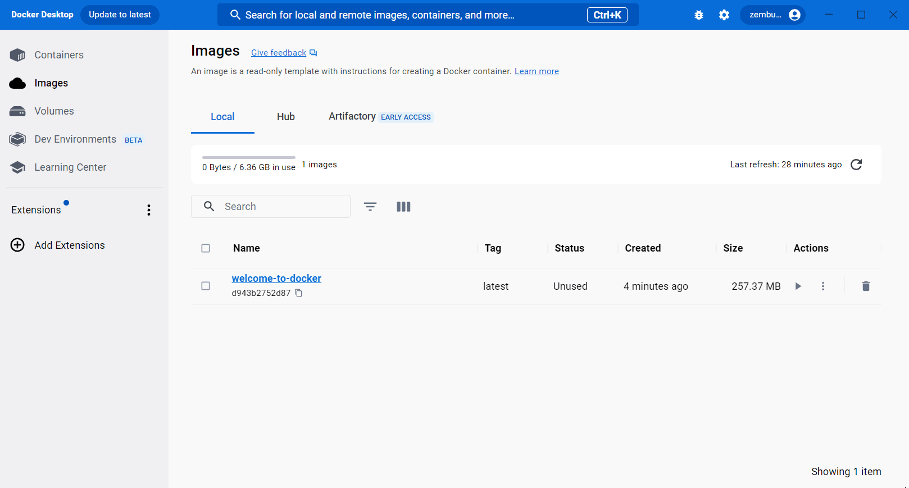

.. -*- coding: utf-8 -*-
.. URL: https://docs.docker.com/get-started/run-your-own-container/
   doc version: 24.0
      https://github.com/docker/docs/blob/main/get-started/run-your-own-container.md
.. check date: 2023/07/19
.. Commits on Apr 19, 2023 8515030b54e9857e52b45dba9064c50a40fa9226
.. -----------------------------------------------------------------------------

.. How do I run a container?
.. _how-do-i-run-a-container:

========================================
どのようにしてコンテナを動かせますか？
========================================

.. sidebar:: 目次

   .. contents:: 
       :depth: 2
       :local:

.. Follow this guide to learn the basic steps of running a container from scratch. This guide uses a sample Node.js application, but it’s not necessary to know Node.js.

ゼロからコンテナを実行するための基本な手順を学ぶには、こちらのガイドを読み進めてください。このガイドではサンプルとして Node.js アプリケーションを使いますが、 Node.js の知識は不要です。

.. Step 1: Get the sample application
.. _step-1-get-the-sample-application:

ステップ1：サンプルアプリケーションの入手
===================================================

.. If you have git, you can clone the repository for the sample application. Otherwise, you can download the sample application. Choose one of the following options.

git を持っていれば、サンプルアプリケーション用のリポジトリを複製（クローン）できます。あるいは、サンプルアプリケーションのダウンロードもできます。以下どちらかを選んでください。

**git で複製**

   .. Use the following command in a terminal to clone the sample application repository.
   以下のコマンドをターミナル内で実行し、サンプルアプリケーションのリポジトリを複製します。
   
   .. code-block:: bash
   
      $ git clone https://github.com/docker/welcome-to-docker

**ダウンロード**

   .. If you don’t have git, download the source and extract it.
   git を持っていなければ、ソースをダウンロードして展開します。
   
   * `ソースのダウンロード <https://github.com/docker/welcome-to-docker/archive/refs/heads/main.zip>`_ 

.. Step 2: Explore the Dockerfile
.. _step-2-explore-the-dockerfile:

ステップ2：Dockerfile を調べる
==============================

.. To run your code in a container, the most fundamental thing you need is a Dockerfile. A Dockerfile describes what goes into a container. Open the sample application in your IDE and then open the Dockerfile to explore its contents. Note that this project already has a Dockerfile, but for your own projects you need to create a Dockerfile. A Dockerfile is simply a text file named Dockerfile with no file extension.

コンテナ内でコードを実行するにあたり、最も基本となるのが Dockerfile です。Dockerfile はコンテナ内に何を入れるか記述します。統合開発環境でサンプルアプリケーションを開き、 ``Dockerfile`` を開き、その内容を調べます。注意点として、このプロジェクトでは既に Dockerfile がありますが、自分自身のプロジェクトでは、自ら Dockerfile を作成する必要があります。Dockerfile は拡張子を持たない ``Dockerfile`` という名前の、シンプルなテキストファイルです。

.. Step 3: Build your first image
.. _step-3-build-your-first-image:

ステップ3：初めてのイメージを構築
========================================

.. An image is like a static version of a container. You always need an image to run a container. Once you have a Dockerfile in your repository, run the following docker build command in the project folder to create an image.

イメージとは固定されたコンテナのようなものです。コンテナを実行するには、常にイメージが必要です。イメージを構築するには、リポジトリ内に Dockerfile が既にあれば、プロジェクトのフォルダ内で以下の ``docker build`` コマンドを実行するだけです。

.. code-block:: bash

   $ docker build -t welcome-to-docker .

.. Building the image may take some time. After your image is built, you can view your image in the Images tab in Docker Desktop.

イメージの構築には少々時間がかかります。イメージの構築が終われば、Docker Desktop 内の **images** タブにイメージが表示されます。

.. Step 4: Run your container
.. _step-4-run-your-container:

ステップ4：コンテナを実行
==============================

.. To run your image as a container, go to the Images tab, and then select Run in the Actions column of your image. When the Optional settings appear, specify the Host port number 8089 and then select Run.

イメージをコンテナとして実行するには、 **Images** タブに移動し、それからイメージの **Actions** 列にある **Run** を選びます。 **Optional settings** が表示したら、 **Host port** 番号を ``8089`` に指定し、それから **Run** を選びます。

.. Step 5: Verify that your container is running
.. step-5-verify-that-your-container-is-running:

ステップ5：コンテナが動作しているのを確認
==================================================

.. You can use Docker Desktop to view and access running containers. Go to the Containers tab to view your container and select the link in the Port(s) column or go to http://localhost:8089 to verify that the application is running.

Docker Desktop を使い、実行中のコンテナを表示し、アクセスできます。 **Containers** タブで対象のコンテナを表示し、 **Port(s)** 列のリンクを選ぶか、 http://localhost:8089 を開けば、アプリケーションが実行中だと確認できます。

.. What’s next

次は何をしますか
====================

.. In this guide, you built your own image. When running containers on Docker Desktop, you don’t need to build your own image from scratch. You can also run images created by others on Docker Hub.

このガイドでは、自分のイメージを構築しました。Docker Desktop 上でコンテナを実行する時は、必ずしもゼロからイメージを構築する必要はありません。他の人によって作られた Docker Hub 上のイメージも実行できます。

.. Run Docker Hub images

* :doc:`Docker Hub イメージの実行 <run-docker-hub-images>`

.. Dive deeper
より深い理解
====================

.. Language-specific guides

言語別ガイド
--------------------

.. If you want to learn more about creating images for applications in other languages, check out the following language-specific guides:

アプリケーション用イメージを他のプログラミング言語で作成する方法は、以下の言語別ガイドを御覧ください。

* :doc:`Node.js </language/nodejs/index>`
* :doc:`Python </language/python/index>`
* :doc:`Go </language/golang/toc>`
* :doc:`Java </language/java/toc>`
* :doc:`C# (.NET) </language/dotnet/toc>`

.. Breaking down the docker build command
.. _breaking-down-the-docker-build-command:

``docker build`` コマンドの分解
----------------------------------------

.. When you built the image, you used the docker build command. Here are what the different parts of the docker build command do:

イメージの構築時に ``docker build`` コマンドを使いました。コマンドの各部分が何なのかを説明します。

..  docker build: This command builds the image. It needs one argument, the source folder for the Dockerfile that needs to be built. In this case, it’s the Dockerfile in the current folder, ..
    -t welcome-to-docker: The -t flag tags the image with a unique name. In this case, welcome-to-docker.

* ``docker build`` ： このコマンドはイメージを構築します。構築のためには1つの引数が必須で、 Dockerfile があるソースのフォルダを指定します。この例では、 Dockerfile は現在のフォルダのため ``.`` です。
* ``-t welcome-to-docker`` ： ``-t`` フラグはユニークな名前でイメージにタグ付けします。この例では ``welcome-to-docker`` です。

.. seealso::

   How do I run a container?
      https://docs.docker.com/get-started/run-your-own-container/

