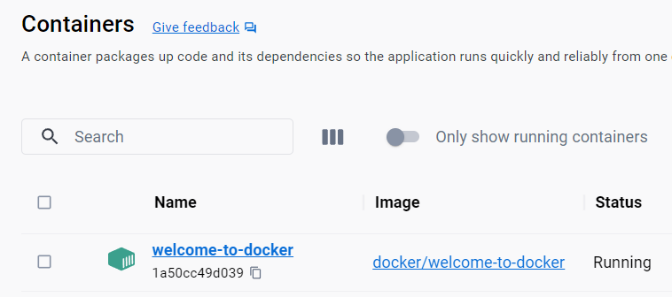
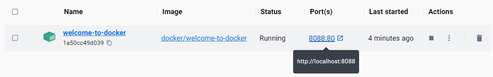
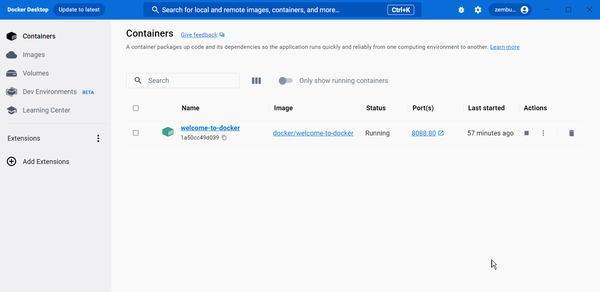
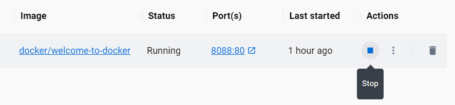

.. -*- coding: utf-8 -*-
.. URL: https://docs.docker.com/get-started/what-is-a-container/
   doc version: 24.0
      https://github.com/docker/docs/blob/main/get-started/what-is-a-container.md
.. check date: 2023/07/18
.. Commits on Mar 27, 2023 f4258c0c1e6f339ee37d8156877eb33bbcc81517
.. -----------------------------------------------------------------------------

.. What is a container?
.. _what-is-a-container:

========================================
コンテナとは何ですか？
========================================

.. sidebar:: 目次

   .. contents:: 
       :depth: 2
       :local:

.. A container is an isolated environment for your code. This means that a container has no knowledge of your operating system, or your files. It runs on the environment provided to you by Docker Desktop. This is why a container usually has everything that your code needs in order to run, down to a base operating system. You can use Docker Desktop to manage and explore your containers.

:ruby:`コンテナ <container>` とは、コードのための :ruby:`隔離された <isolated>` 環境です。これが意味するのは、コンテナはオペレーティングシステムやファイルについての知識を持ちません。コンテナが動作するのは、Docker Desktop によって提供される環境上です。コンテナが通常あらゆるものが入っているとされる理由は、コードを実行するために必要なものや、ベースとなるオペレーティングシステムに至るまであるからです。Docker Desktop を使ってコンテナの管理や調査が行えます。

.. Continue with the following steps to view and explore an actual container in Docker Desktop.

実際のコンテナを Docker Desktop で表示や調査するには、以下の手順を進めます。

.. Step 1: Set up the guide
.. _step-1-set-up-the-guide:

ステップ1：セットアップガイド
==============================

.. The first thing you need is a running container. For this guide, use the premade welcome-to-docker container. To get started, start Docker Desktop and then run the following command in your local terminal:

最初にコンテナを実行する必要があります。このガイドでは、あらかじめ作られた ``welcome-to-docker`` コンテナを使います。始めるには、 Docker Desktop を起動し、自分のローカルターミナル上で以下のコマンドを実行します。

.. code-block:: bash

   $ docker run -p 8088:80 -d --name welcome-to-docker docker/welcome-to-docker

.. Step 2: View containers on Docker Desktop
.. _step-2-view-containers-on-docker-desktop:

ステップ2：Docker Desktop 上でコンテナを表示
==================================================

.. You just ran a container! Open Docker Desktop to take a look. This container runs a simple web server that displays HTML text. When working with more complex projects, you’ll run different parts in different containers. For example, a different container for the frontend, backend, and database. In this guide, you only have a simple frontend container.

今しがたコンテナを実行しました！ Docker Desktop を開いて見てみます。このコンテナは、 HTML テキストを表示するシンプルなウェブサーバを実行しています。複雑なプロジェクトを扱うようになれば、異なるコンテナ内で異なるパーツを実行するでしょう。たとえば、フロントエンド、バックエンド、データベースに対する異なるコンテナです。このガイドでは、シンプルなフロントエンドのコンテナのみ扱います。

.. Step 3: View the frontend
.. _step-3-view-the-frontend:

ステップ3：フロントエンドの表示
========================================

.. The frontend is accessible on port 8088 of your local host. Select the link in the Port(s) column of your container, or visit http://localhost:8088 in your browser to check it out.

フロントエンドには、自分のローカルホスト上にあるポート 8088 からアクセスできます。確認をするには、コンテナの **Port(s)** 列内にあるリンクを選ぶか、ブラウザで http://localhost:8088 を開きます。

.. Step 4: Explore your container
.. _step-4-explore-your-container:

ステップ4：コンテナの調査
==============================

.. Docker Desktop allows you to easily view and interact with different aspects of your container. Try it out yourself. Select your container and then select Files to explore your container’s isolated file system.

Docker Desktop により、コンテナを簡単に表示したり、様々な様子を簡単に調べられます。自分自身で試しましょう。コンテナの隔離されたファイルシステムを調べるには、コンテナを選択し、 **Files** を選びます。

.. Step 5: Stop your container
.. _step-5-stop-your-container:

ステップ5：コンテナの停止
==============================

.. The welcome-to-docker container continues to run until you stop it. To stop the container in Docker Desktop, go to the Containers tab and select the Stop icon in the Actions column of your container.

``welcome-to-docker`` コンテナは停止するまで実行し続けます。 Docker Desktop でコンテナを停止するには、 **Containers** タブに移動し、対象コンテナの **Actions** 列にある **Stop** アイコンを選びます。

.. What’s next
.. _container-whats-next:

次は何をしますか
====================

.. In this guide, you explored what a container is. Continue to the next guide to learn what you need to create and run your own container.

このガイドでは、コンテナとは何かを学びました。次のガイドでは、自分のコンテナを作成・実行するために必要なことを学びます。

* :doc:`自分のコンテナを実行 <run-your-own-container>` 

.. Dive deeper
より深い理解
====================

.. Breaking down the docker run command
.. _breaking-down-the-docker-run-command:

``docker run`` コマンドの分解
------------------------------

.. When setting up the container, you used the docker run command. Here are what the different parts of the command do:

コンテナのセットアップ時に ``docker run`` コマンドを使いました。コマンドの各部分が何なのかを説明します。

..  docker run: This is used to run containers. It needs at least one argument, and that argument is the image you want to run. In this case, it’s docker/welcome-to-docker.
    -p 8088:80: This lets Docker know that port 80 in the container needs to be accessible from port 8088 on your local host.
    -d: This runs the container detached or in the background.
    —-name welcome-to-docker: This sets the name for your container. If you don’t do so, Docker selects a random name for you.

* ``docker run`` ： これはコンテナの実行に使います。少なくとも1つの引数が必要で、実行したいイメージを引数にします。今回のイメージは ``docker/welcome-to-docker`` です。
* ``-p 8088:80`` ： これは Docker に対して、コンテナのポート 80 にアクセスするには、ローカルホスト上のポート 8088 からアクセスする必要があると伝えます。
* ``-d`` ： コンテナを :ruby:`デタッチド <detached>` 、あるいは、バックグラウンドで実行します。
* ``--name welcome-to-docker`` ： これはコンテナ名を指定します。指定しなければ、Docker はランダムな名前を選びます。

.. Continue following What’s next to learn how to intuitively run an image using the Docker Desktop GUI.

:ref:`container-whats-next` に戻り、 Docker Desktop GUI を使ってイメージを直感的に実行する方法を学びましょう。

.. seealso::

   What is a container?
      https://docs.docker.com/get-started/what-is-a-container/

