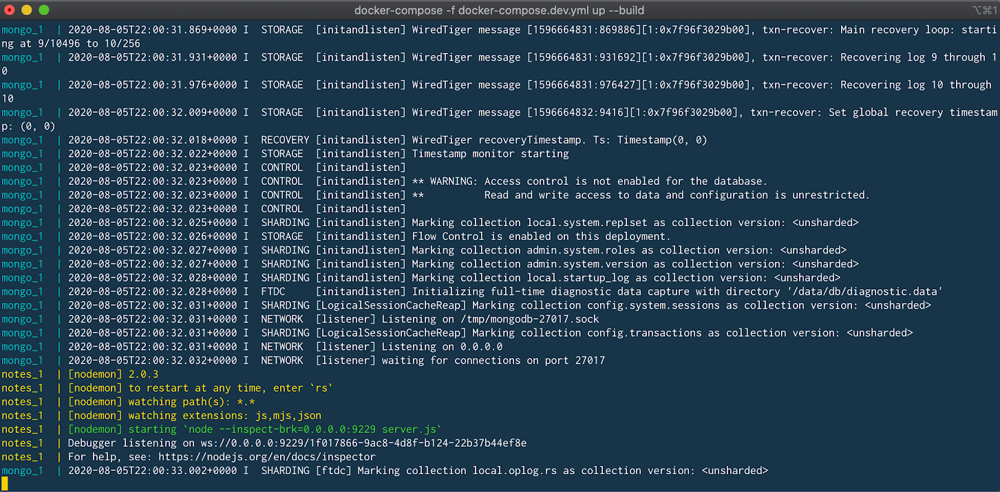
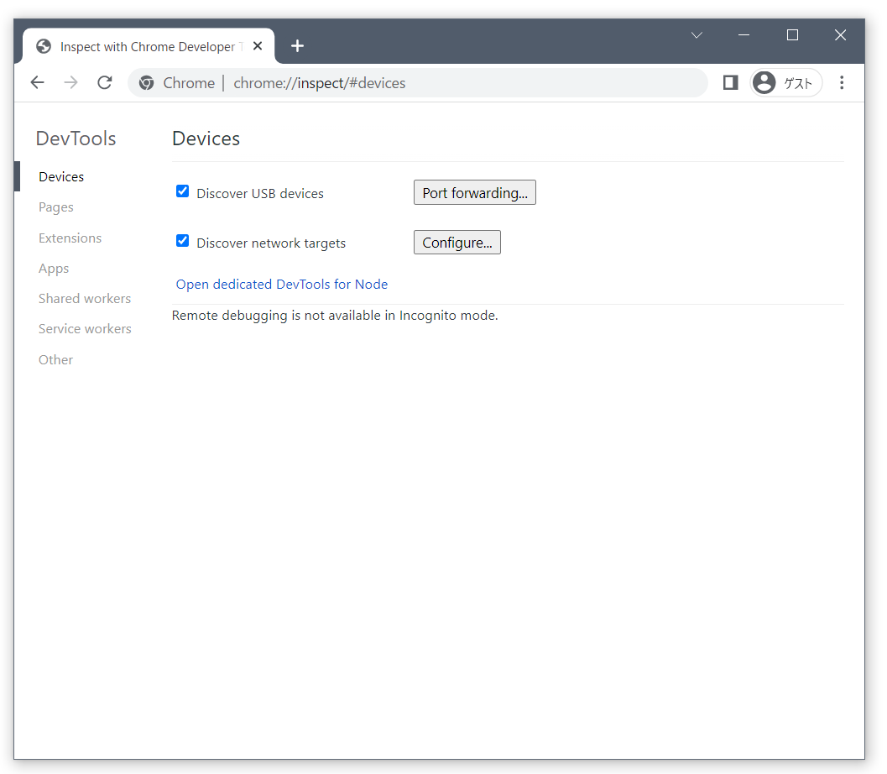
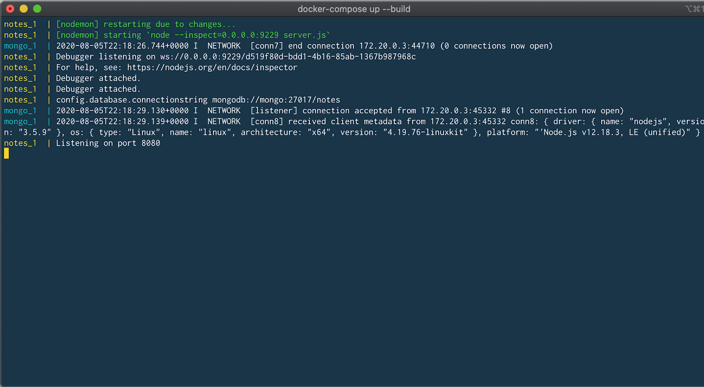

.. -*- coding: utf-8 -*-
.. URL: https://docs.docker.com/language/nodejs/develop/
   doc version: 20.10
      https://github.com/docker/docker.github.io/blob/master/language/nodejs/develop.md
.. check date: 2022/09/30
.. Commits on Sep 29, 2022 561118ec5b1f1497efad536545c0b39aa8026575
.. -----------------------------------------------------------------------------

.. Use containers for development
.. _nodejs-use-containers-for-development:

========================================
開発にコンテナを使う
========================================

.. Prerequisites
.. _nodejs-develop-prerequisites:

事前準備
==========

.. Work through the steps to build an image and run it as a containerized application in Run your image as a container.

:doc:`run-containers` で、イメージ構築をし、それコンテナ化アプリケーションとして実行します。

.. Introduction
.. _nodejs-develop-introduction:

概要
==========

.. In this module, we’ll walk through setting up a local development environment for the application we built in the previous modules. We’ll use Docker to build our images and Docker Compose to make everything a whole lot easier.

この章では、これまでのモジュールで構築したアプリケーションの、ローカル開発環境をセットアップする方法を説明します。イメージの構築には Docker を使い、すべてをとても簡単にする Docker Compose も使います。

.. Local database and containers
.. _nodejs-local-database-and-containers:

ローカルデータベースとコンテナ
==============================

.. First, we’ll take a look at running a database in a container and how we use volumes and networking to persist our data and allow our application to talk with the database. Then we’ll pull everything together into a compose file which will allow us to setup and run a local development environment with one command. Finally, we’ll take a look at connecting a debugger to our application running inside a container.

まず、コンテナでデータベースを実行する方法と、データを保持するためにボリュームとネットワーク機能を使い、アプリケーションがデータベースと通信できるようにする方法を説明します。それから、compose ファイルの中にすべてを入れ込みます。このファイルは1つのコマンドで、ローカル開発環境のセットアップと実行をできるようにします。最後に、コンテナ内で実行しているアプリケーションに、デバッガを接続する方法を説明します。

.. Instead of downloading MongoDB, installing, configuring and then running the Mongo database as a service, we can use the Docker Official Image for MongoDB and run it in a container.

MongoDB をダウンロードし、インストールし、設定し、Mongo データベースをサービスとして実行する代わりに、MongoDB 用の Docker 公式イメージを使い、コンテナとして実行できるようになります。

.. Before we run MongoDB in a container, we want to create a couple of volumes that Docker can manage to store our persistent data and configuration. Let’s use the managed volumes feature that docker provides instead of using bind mounts. For more information, see Use volumes.

コンテナ内で MogoDB を実行する前に、2つのボリュームを作成しておきたいです。これは、Docker が :ruby:`保持し続けるデータ <persistent data>` と :ruby:`設定ファイル <configuration>` を保存できます。バインド マウントを使う代わりに、 docker が提供するマネージド ボリューム機能を使いましょう。詳しい情報は :doc:`/storage/volumes` をご覧ください。

.. Let’s create our volumes now. We’ll create one for the data and one for configuration of MongoDB.

それでは、ボリュームを作成しましょう。作成するボリュームの1つは MogoDB のデータ用で、もう1つは設定ファイル用です。

.. code-block:: bash

   $ docker volume create mongodb
   $ docker volume create mongodb_config

.. Now we’ll create a network that our application and database will use to talk with each other. The network is called a user-defined bridge network and gives us a nice DNS lookup service which we can use when creating our connection string.

次は、アプリケーションとデータベースが相互に対話できるようにするためのネットワークを作成します。ネットワークは :ruby:`ユーザ定義ブリッジネットワーク <user-defined bridge network>` と呼ばれ、優れた DNS 名前解決サービスを提供するため、 :ruby:`接続文字列 <connection string>` を作成するために使えます。

.. code-block:: bash

   $ docker network create mongodb

.. Now we can run MongoDB in a container and attach to the volumes and network we created above. Docker will pull the image from Hub and run it for you locally.

次は、コンテナとして MongoDB を実行し、先ほど作成したボリュームとネットワークに接続できるようにします。Docker は Hub からイメージを取得し、ローカルでイメージを実行します。

.. code-block:: bash

   $ docker run -it --rm -d -v mongodb:/data/db \
     -v mongodb_config:/data/configdb -p 27017:27017 \
     --network mongodb \
     --name mongodb \
     mongo

.. Okay, now that we have a running MongoDB, let’s update server.js to use MongoDB and not an in-memory data store.

うまくいけば、これで MongoDB を実行していますので、 ``server.js`` を更新し、MongoDB を使いメモリ上のデータストアを使わないようにしましょう。

.. code-block:: bash

   const ronin     = require( 'ronin-server' )
   const mocks     = require( 'ronin-mocks' )
   const database  = require( 'ronin-database' )
   const server = ronin.server()
   
   database.connect( process.env.CONNECTIONSTRING )
   server.use( '/', mocks.server( server.Router(), false, false ) )
   server.start()

.. We’ve added the ronin-database module and we updated the code to connect to the database and set the in-memory flag to false. We now need to rebuild our image so it contains our changes.

``ronin-database`` モジュールを追加済みであれば、データベースに接続し、メモリ上のフラグは false にするよう、コードを変更します。そして、コンテナに変更を含めるため、イメージの再構築が必要です。

.. First let’s add the ronin-database module to our application using npm.

まず、アプリケーションで npm を使い ``ronin-database`` モジュールを追加しましょう。

.. code-block:: bash

   $ npm install ronin-database

.. Now we can build our image.

それから、イメージを構築できます。

.. code-block:: bash

   $ docker build --tag node-docker .

.. Now, let’s run our container. But this time we’ll need to set the CONNECTIONSTRING environment variable so our application knows what connection string to use to access the database. We’ll do this right in the docker run command.

次はコンテナを実行しましょう。ですが、アプリケーションがデータベースに接続するために使う接続文字列を知るため、環境変数 ``CONNECTIONSTRING`` の設定が今回は必要です。これを ``docker run`` コマンドで実行します。

.. code-block:: bash

   $ docker run \
     -it --rm -d \
     --network mongodb \
     --name rest-server \
     -p 8000:8000 \
     -e CONNECTIONSTRING=mongodb://mongodb:27017/notes \
     node-docker

.. The notes at the end of the connection string is the desired name for our database.

接続文字列の最後にある ``notes`` は、データベースの名前です。

.. Let’s test that our application is connected to the database and is able to add a note.

アプリケーションをデータベースに接続し、メモを追加できるかどうか確かめましょう。

.. code-block:: bash

   $ curl --request POST \
     --url http://localhost:8000/notes \
     --header 'content-type: application/json' \
     --data '{"name": "this is a note", "text": "this is a note that I wanted to take while I was working on writing a blog post.", "owner": "peter"}'

.. You should receive the following json back from our service.

サービスからは以下の JSON が返ってくるでしょう。

.. code-block:: json

   {"code":"success","payload":{"_id":"5efd0a1552cd422b59d4f994","name":"this is a note","text":"this is a note that I wanted to take while I was working on writing a blog post.","owner":"peter","createDate":"2020-07-01T22:11:33.256Z"}}

.. Use Compose to develop locally
.. _nodejs-develop-use-compose-to-develop-locally:

Compose を使ってローカルで開発
==============================

.. In this section, we’ll create a Compose file to start our node-docker and the MongoDB with one command. We’ll also set up the Compose file to start the node-docker in debug mode so that we can connect a debugger to the running node process.

このセクションでは、 node-docker と MongoDB を1つのコマンドで起動するための Compose ファイルを作成します。また、 node-docker をデバッグモードで起動するための Compose ファイルも作成しますので、実行中の node プロセスにデバッガを接続できるようになります。

.. Open the notes-service in your IDE or text editor and create a new file named docker-compose.dev.yml. Copy and paste the below commands into the file.

IDE のメモ機能やテキストエディタを使い、 ``docker-compose.dev.yml`` という名前の新しいファイルを作成します。ファイル内に以下の命令をコピー＆ペーストします。

.. code-block:: yaml

   version: '3.8'
   
   services:
    notes:
     build:
      context: .
     ports:
      - 8000:8000
      - 9229:9229
     environment:
      - SERVER_PORT=8000
      - CONNECTIONSTRING=mongodb://mongo:27017/notes
     volumes:
      - ./:/app
     command: npm run debug
   
    mongo:
     image: mongo:4.2.8
     ports:
      - 27017:27017
     volumes:
      - mongodb:/data/db
      - mongodb_config:/data/configdb
   volumes:
    mongodb:
    mongodb_config:

.. This Compose file is super convenient as we do not have to type all the parameters to pass to the docker run command. We can declaratively do that in the Compose file.

この Compose ファイルは ``docker run`` コマンドに一切パラメータを渡す必要がないため、とても便利です。Compose ファイル内で宣言的にパラメータを指定します。

.. We are exposing port 9229 so that we can attach a debugger. We are also mapping our local source code into the running container so that we can make changes in our text editor and have those changes picked up in the container.

ポート ``9229`` を公開していますので、デバッガをアタッチできます。また、ローカルのソースコードを実行中のコンテナにマッピングしていますので、テキストエディタで変更できるだけなく、それらの変更をコンテナに取り込めます。

.. One other really cool feature of using a Compose file is that we have service resolution set up to use the service names. So we are now able to use “mongo” in our connection string. The reason we use mongo is because that is what we have named our MongoDB service in the Compose file as.

Compose ファイルを使う上で、もう1つの素晴らしい機能は、サービス名を使ってサービスの名前解決をできるようになります。そのため、接続文字列として ``mongo`` が使えるようになります。 mongo という名前を使えるのは、 MongoDB サービスに対して Compose ファイル内でそのように名付けたからです。

.. To start our application in debug mode, we need to add a line to our package.json file to tell npm how to start our application in debug mode.

デバッグモードでアプリケーションを起動するには、 ``package.json`` ファイルで、 アプリケーションをデバッグモードで起動するよう、 npm に命令行を追加する必要があります。

.. Open the package.json file and add the following line to the scripts section:

``package.json`` ファイルを開き、scripts セクションに以下の行を追加します。

.. code-block:: json

     "debug": "nodemon --inspect=0.0.0.0:9229 server.js"

.. As you can see, we are going to use nodemon. Nodemon starts our server in debug mode and also watches for files that have changed, and restarts our server. Let’s run the following command in a terminal to install nodemon into our project directory.

お分かりのように、 nodemon を使おうとしています。nodemon はサーバをデバッグモードで起動し、ファイルの変更も監視し、変更があればサーバを再起動します。以下のコマンドをターミナルで実行し、プロジェクトのディレクトリ内に nodemon をインストールします。

.. code-block:: bash

   $ npm install nodemon

.. Let’s start our application and confirm that it is running properly.

アプリケーションを起動し、適切に動作しているか確認しましょう。

.. code-block:: bash

   $ docker-compose -f docker-compose.dev.yml up --build

.. We pass the --build flag so Docker compiles our image and then starts it.

``--build`` フラグを渡したため、 Docker はイメージをコンパイルした後、イメージを起動します。

.. If all goes well, you should see something similar:

正常に動作すると、次のような画面が見えます。

.. Now let’s test our API endpoint. Run the following curl command:

それから、API エンドポイントをテストしましょう。以下の curl コマンドを実行します：

.. code-block:: bash

   $ curl --request GET --url http://localhost:8000/notes

.. You should receive the following response:

次のような反応を受け取るでしょう：

.. code-block:: json

   {"code":"success","meta":{"total":0,"count":0},"payload":[]}

.. Connect a debugger
.. _nodejs-develop-connect-a-debugger:

デバッガを接続
====================

.. We’ll use the debugger that comes with the Chrome browser. Open Chrome on your machine and then type the following into the address bar.

``about:inspect``

.. It opens the following screen.

.. Click the Open dedicated DevTools for Node link. This opens the DevTools that are connected to the running Node.js process inside our container.

**Open dedicated DevTools for Node** （ Node 用の専用 DevTools を開く）のリンクをクリックします。これはコンテナ内で実行している Node.js プロセスに接続した DevTools が開きます。

.. Let’s change the source code and then set a breakpoint.

ソースコードを変更し、ブレイクポイントを設定します。

.. Add the following code above the existing server.use() statement, and save the file. Make sure that the return statement is on a line of its own, as shown here, so you can set the breakpoint appropriately.

次のコードを既存の ``server.use()`` 宣言の上に追加し、ファイルを保存します。ブレイクポイントを適切に設定できるようにするため、ここで示すように、 return 宣言がその行の中にあるのを確認します。

.. code-block:: js

    server.use( '/foo', (req, res) => {
      return res.json({ "foo": "bar" })
    })

.. If you take a look at the terminal where our Compose application is running, you’ll see that nodemon noticed the changes and reloaded our application.

Compose アプリケーションを実行しているターミナルを見ると、nodemon が変更を検出し、アプリケーションを再読み込みします。

.. Navigate back to the Chrome DevTools and set a breakpoint on the line containing the return res.json({ "foo": "bar" }) statement, and then run the following curl command to trigger the breakpoint.

Chrome DevTools に移動し直し、 ``return res.json({ "foo": "bar" })`` 背源を含むブレイクポイントを設定し、それからブレイクポイントをトリガとするため以下のコマンドを実行します。

.. code-block:: bash

   $ curl --request GET --url http://localhost:8000/foo

.. You should have seen the code stop at the breakpoint and now you are able to use the debugger just like you would normally. You can inspect and watch variables, set conditional breakpoints, view stack traces, etc.

ブレイクポイントでコードが停止するのが見えれば、通常通りにデバッグのために利用できるようになります。変数の調査と監視、ブレイクポイントの条件設定、スタックトレースの表示等ができます。

.. Next steps
.. _nodejs-develop-next-steps:

次のステップ
====================

.. In this module, we took a look at creating a general development image that we can use pretty much like our normal command line. We also set up our Compose file to map our source code into the running container and exposed the debugging port.

この章では、通常のコマンドラインとほとんど同じように使える、一般的な開発用イメージ作成方法を説明しました。また、 Compose ファイルもセットアップし、ソースコードを実行中のコンテナにマップし、デバッグポイントを公開しました。

.. In the next module, we’ll take a look at how to run unit tests in Docker. See:

次の章では、 Docker で単体テストを実行する方法を説明します。

.. Run your tests

:doc:`テストの実行 <run-tests>`

.. Feedback
.. _nodejs-develop-feedback:

フィードバック
====================

.. Help us improve this topic by providing your feedback. Let us know what you think by creating an issue in the Docker Docs GitHub repository. Alternatively, create a PR to suggest updates.

フィードバックを通し、このトピックの改善を支援ください。考えがあれば、 `Docker Docs <https://github.com/docker/docs/issues/new?title=[Node.js%20docs%20feedback]>`_ GitHub リポジトリに issue を作成して教えてください。あるいは、更新の提案のために `RP を作成 <https://github.com/docker/docs/pulls>`_ してください。

.. seealso::

   Use containers for development
      https://docs.docker.com/language/nodejs/develop/

