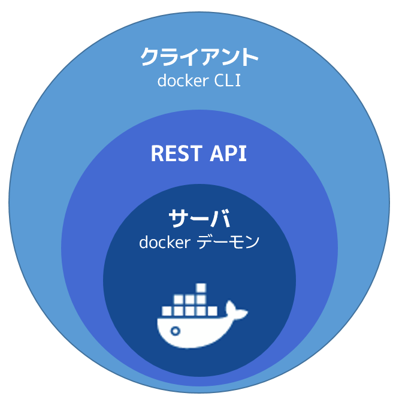
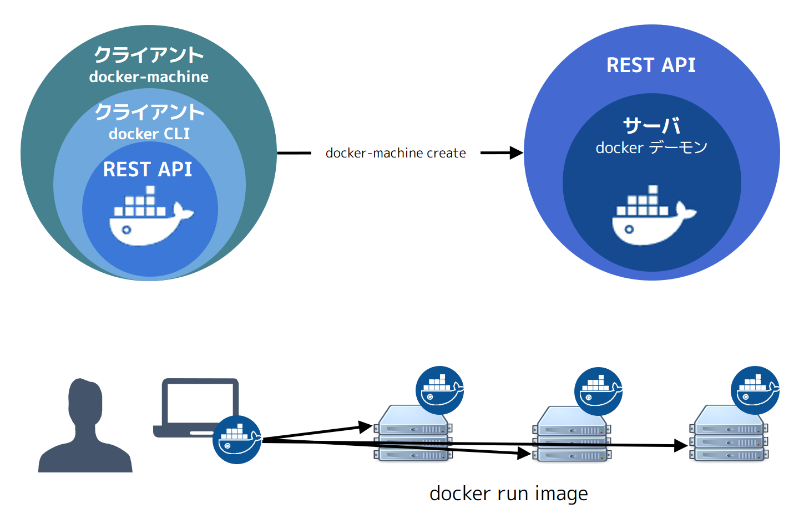

.. -*- coding: utf-8 -*-
.. URL: https://docs.docker.com/machine/overview/
.. SOURCE: https://github.com/docker/machine/blob/master/docs/overview.md
   doc version: 1.11
      https://github.com/docker/machine/commits/master/docs/overview.md
.. check date: 2016/04/28
.. Commits on Feb 11, 2016 0eb405f1d7ea3ad4c3595fb2c97d856d3e2d9c5c
.. -------------------------------------------------------------------

.. _machine:

.. Docker Machine Overview

=======================================
Docker Machine 概要
=======================================

.. sidebar:: 目次

   .. contents:: 
       :depth: 3
       :local:

.. You can use Docker Machine to:

Docker Machine を使いますと、以下の操作ができます。

..    Install and run Docker on Mac or Windows
    Provision and manage multiple remote Docker hosts
    Provision Swarm clusters

* Mac や Windows 上に Docker をインストール・実行
* 複数のリモート Docker ホストを構築・管理
* Swarm クラスタの構築（プロビジョン）

.. What is Docker Machine?

.. _what-is-docker-machine:

Docker Machine とは何ですか？
==============================

.. Docker Machine is a tool that lets you install Docker Engine on virtual hosts, and manage the hosts with docker-machine commands. You can use Machine to create Docker hosts on your local Mac or Windows box, on your company network, in your data center, or on cloud providers like AWS or Digital Ocean.

Docker Machine は仮想マシン上に Docker Engine をインストールするツールであり、 ``docker-machine`` コマンドを使ってホストを管理します。Machine を使えば、自分のローカルの Mac や Windows 上に Docker ホストを作れるだけでなく、あなたの会社のネットワーク上や、データセンターや、AWS や Digital Ocean のようなクラウド・プロバイダ上でも作れます。

.. Using docker-machine commands, you can start, inspect, stop, and restart a managed host, upgrade the Docker client and daemon, and configure a Docker client to talk to your host.

``docker-machine`` コマンドで、管理ホストの起動（start）、調査（inspect）、停止（stop）、再起動（restart）ができます。他にも Docker クライアントとデーモンの更新や、Docker クライアントが対象のホストへ接続できるような設定もできます。

.. Point the Machine CLI at a running, managed host, and you can run docker commands directly on that host. For example, run docker-machine env default to point to a host called default, follow on-screen instructions to complete env setup, and run docker ps, docker run hello-world, and so forth.

Machine のコマンドライン上で管理対象のホストを参照するように指定したら、 ``docker`` コマンドが対象ホストを直接管理します。例えば、 ``docker-machine env default`` を実行したら、操作対象のホストは ``default`` という名前のホストにするため、画面上に ``env`` コマンドの指示が表示されます。これを使ってセットアップしたあとは、 ``docker ps`` や ``docker run hello-world`` コマンドなど、指定したホスト上で直接処理できます。

.. Machine _was_ the _only_ way to run Docker on Mac or Windows previous to Docker
   v1.12. Starting with the beta program and Docker v1.12,
   [Docker Desktop for Mac](../docker-for-mac/index.md) and
   [Docker Desktop for Windows](../docker-for-windows/index.md) are available as native apps and the
   better choice for this use case on newer desktops and laptops. We encourage you
   to try out these new apps. The installers for Docker Desktop for Mac and Docker Desktop for
   Windows include Docker Machine, along with Docker Compose.

Docker Machine は、Docker v1.12 以前は Mac および Windows 上において Docker を実行する唯一の方法 **でした**。
Docker v1.12 のベータ版として始まったプログラムが、:doc:`Docker Desktop for Mac </docker-for-mac/index>` と :doc:`Docker Desktop for Windows </docker-for-windows/index>` というネイティブ・アプリとして利用可能になり、これが最新のデスクトップやノート PC に対しての最適な選択肢となりました。
現在ではこれらの新しいアプリケーションの利用をお勧めしています。
Docker Desktop for Mac や Docker Desktop for Windows のインストーラには、Docker Machine や Docker Compose が含まれています。

.. If you aren't sure where to begin, see [Get Started with Docker](../get-started/index.md),
   which guides you through a brief end-to-end tutorial on Docker.

どこからはじめたらよいのか不明であれば、:doc:`概要説明とセットアップ </get-started/index>` を確認してください。
このガイドでは Docker の全般的なチュートリアルを示しています。

.. Why should I use it?

.. _why-should-i-use-it:

なぜ使うべきですか？
=====================

.. Docker Machine enables you to provision multiple remote Docker hosts on various
   flavors of Linux.

Docker Machine を利用すると、さまざまな種類の Linux に対して、リモート Docker ホストを複数プロビジョングできます。

.. Additionally, Machine allows you to run Docker on older Mac or Windows systems,
   as described in the previous topic.

さらに Docker Machine は上で述べているように、Mac や Windows の古いシステムにおいて Docker を起動させることができます。

.. Docker Machine has these two broad use cases.

Docker Machine は主に２つの使い方があります。

.. * **I have an older desktop system and want to run Docker on Mac or Windows**

* **Mac や Windows のデスクトップシステムが古いけど Docker を実行したい**

   ..  {: .white-bg}

   .. image:: ./img/machine-mac-win.png
      :scale: 60%
      :alt: Mac と Windows 上の Docker Machine

   .. If you work primarily on an older Mac or Windows laptop or desktop that doesn't meet the requirements for the new [Docker Desktop for Mac](../docker-for-mac/index.md) and [Docker Desktop for Windows](../docker-for-windows/index.md) apps, then you need Docker Machine to run Docker Engine locally. Installing Docker Machine on a Mac or Windows box with the [Docker Toolbox](../toolbox/overview.md) installer provisions a local virtual machine with Docker Engine, gives you the ability to connect it, and run `docker` commands.

   主に作業をしているマシンが Mac や Windows の古いデスクトップやノート PC であって、:doc:`Docker Desktop for Mac </docker-for-mac/index>` や :doc:`Docker Desktop for Windows </docker-for-windows/index>` という新たなアプリを利用する前提条件を満たしていない場合、Docker Engine をローカルで実行するには Docker Machine が必要になります。
   :doc:`Docker Toolbox </toolbox/overview>` のインストーラを通じて Mac や Windows に Docker Machine をインストールすると、Docker Engine を利用するローカルの仮想マシンがプロビジョニングされます。
   これに対して接続を行い ``docker`` コマンドを実行します。

..     I want to provision Docker hosts on remote systems

* **リモート・システム上に Docker ホストをプロビジョンしたい**

   ..  {: .white-bg}

   .. image:: ./img/provision-use-case.png
      :scale: 60%
      :alt: 複数システムをプロビジョニングする Docker Machine

   .. Docker Engine runs natively on Linux systems. If you have a Linux box as your
      primary system, and want to run `docker` commands, all you need to do is
      download and install Docker Engine. However, if you want an efficient way to
      provision multiple Docker hosts on a network, in the cloud or even locally,
      you need Docker Machine.

   Docker Engine は Linux システム上でネイティブに動作します。
   主に利用するシステムが Linux であって ``docker`` コマンドを利用したいのであれば、やるべきことは、単に Docker Engine をダウンロードしてインストールするだけです。
   ただしネットワーク上に複数の Docker ホストを効率よくプロビジョニングしたい場合は、クラウド上とローカル上は問わず Docker Machine が必要になります。

   ..  Whether your primary system is Mac, Windows, or Linux, you can install Docker
       Machine on it and use `docker-machine` commands to provision and manage large
       numbers of Docker hosts. It automatically creates hosts, installs Docker
       Engine on them, then configures the `docker` clients. Each managed host
       ("**_machine_**") is the combination of a Docker host and a configured client.

   ふだん利用するシステムが Mac、Windows、Linux のどれであっても、Docker Machine をインストールして ``docker-machine`` コマンドを使えば、いくらでも Docker ホストのプロビジョニングと管理が可能になります。
   Docker Machine からはホストが自動生成され、そのホスト内に Docker Engine がインストールされます。
   そして ``docker`` クライアントが設定されます。
   こうして管理される各ホスト（「**マシン**」）が、Docker ホストと設定済みクライアントを結びつけます。

.. What’s the difference between Docker Engine and Docker Machine?

.. _machine-difference:

Docker Engine と Docker Machine の違いは何ですか？
==================================================

.. When people say "Docker" they typically mean **Docker Engine**, the
   client-server application made up of the Docker daemon, a REST API that
   specifies interfaces for interacting with the daemon, and a command line
   interface (CLI) client that talks to the daemon (through the REST API wrapper).
   Docker Engine accepts `docker` commands from the CLI, such as
   `docker run <image>`, `docker ps` to list running containers, `docker image ls`
   to list images, and so on.

「Docker」と言えば、普通は **Docker Engine** のことを意味します。
これは Docker デーモンによって構成されるクライアント・サーバ・アプリケーションであり、デーモンとのやりとりを行うためのインターフェースを規定する REST API であり、デーモンとの対話を（REST API ラッパーを通じて）行うコマンドライン・インターフェース（CLI）をすべて意味しています。
Docker Engine は CLI から ``docker`` コマンド、たとえば ``docker run <イメージ名>`` を受けつけます。
あるいは ``docker ps`` によって実行中コンテナの一覧を表示し、``docker image ls`` によってイメージ一覧を表示するといった具合です。

.. Docker Engine

.. Docker Machine is a tool for provisioning and managing your Dockerized hosts (hosts with Docker Engine on them). Typically, you install Docker Machine on your local system. Docker Machine has its own command line client docker-machine and the Docker Engine client, docker. You can use Machine to install Docker Engine on one or more virtual systems. These virtual systems can be local (as when you use Machine to install and run Docker Engine in VirtualBox on Mac or Windows) or remote (as when you use Machine to provision Dockerized hosts on cloud providers). The Dockerized hosts themselves can be thought of, and are sometimes referred to as, managed “machines”.

**Docker Machine** は Docker ホスト（Docker Engine が動くホスト環境）のプロビジョニングと管理用のツールです。一般的には Docker Machine を自分のローカルシステム上にインストールします。Docker Machine とは ``docker-machine`` というコマンド・ラインのクライアントと ``docker`` という名称の Docker Engine クライアントです。Docker Machine を使えば仮想システム上に Docker Engine をインストールできます。仮想システムとはローカル（Machine を使い、Mac または Windows 上の VirtualBox に Docker Engine をインストール、実行します）でも、リモート（Machine を使い、クラウド・プロバイダ上に Docker をプロビジョン）でも構いません。Docker に対応したホストであれば、何でも常に 「 **マシン** 」として管理できるのです（訳者注：Docker Machine の管理対象のホストは、ローカルでもクラウド上でも「マシン」という概念で抽象化できる、という意味です）。

.. Where to go next

次はどこへ行きますか？
==============================

..    Install a machine on your local system using VirtualBox.
    Install multiple machines on your cloud provider.
    Docker Machine driver reference
    Docker Machine subcommand reference

* :doc:`install-machine`
* machine を :doc:`ローカルの VirtualBox を使ったシステム </machine/get-started>` にインストール
* 複数の machine を :doc:`クラウド・プロバイダ </machine/get-started-cloud/>` にインストール
* :doc:`/swarm/provision-with-machine`
* :doc:`concepts`
* :doc:`Docker Machine ドライバ・リファレンス </machine/drivers/index>`
* :doc:`Docker Machine サブコマンド・リファレンス </machine/reference/index>`
* :doc:`migrate-to-machine`

.. seealso:: 

   Docker Machine Overview
      https://docs.docker.com/machine/overview/
