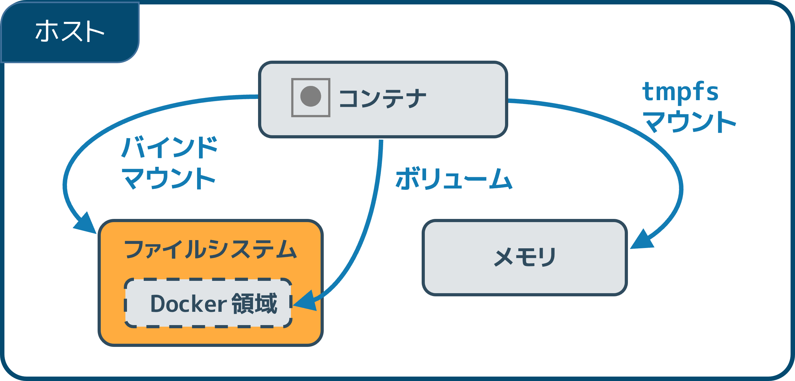

.. -*- coding: utf-8 -*-
.. URL: https://docs.docker.com/storage/bind-mounts/
.. SOURCE: https://github.com/docker/docker.github.io/blob/master/storage/bind-mounts.md
   doc version: 20.10
.. check date: 2022/05/01
.. Commits on Apr 25, 2022 51a49dc4bf2016727ad3200cce6f336283f30937
.. ---------------------------------------------------------------------------

.. Use bind mounts
.. _use-bind-mounts:

==================================================
:bury:`バインド マウント <bind mount>` の使用
==================================================

.. sidebar:: 目次

   .. contents:: 
       :depth: 3
       :local:

.. Bind mounts have been around since the early days of Docker. Bind mounts have limited functionality compared to volumes. When you use a bind mount, a file or directory on the host machine is mounted into a container. The file or directory is referenced by its absolute path on the host machine. By contrast, when you use a volume, a new directory is created within Docker’s storage directory on the host machine, and Docker manages that directory’s contents.

:ruby:`バインド マウント <bind mount>` は初期の Docker から存在しています。 :doc:`ボリューム <volumes>` と比較すると、バインド マウントは機能が限定的です。バインド マウントを使う時、「ホストマシン」上のファイルやディレクトリを、コンテナ内にマウントします。ファイルやディレクトリは、ホストマシン上の絶対パスとして参照されます。対照的に、ボリュームを使う場合は、新しいディレクトリがホストマシン上の Docker のストレージディレクトリ内に作成され、 Docker が内容を直接管理します。

.. The file or directory does not need to exist on the Docker host already. It is created on demand if it does not yet exist. Bind mounts are very performant, but they rely on the host machine’s filesystem having a specific directory structure available. If you are developing new Docker applications, consider using named volumes instead. You can’t use Docker CLI commands to directly manage bind mounts.

ファイルやディレクトリは Docker ホスト上にあらかじめ存在している必要はありません。存在しなければ、必要に応じて作成されます。バインド マウントは高性能ですが、ホストマシンのファイルシステムで利用可能な、特定のディレクトリ構造に依存します。新しい Docker アプリケーションを開発する場合は、代わりに :doc:`名前付きボリューム <volume>` の利用を検討してください。バインド マウントは Docker CLI コマンドを使って直接管理できません。

.. Choose the -v or --mount flag
.. _bind-choose-the-v-or-mount-flag:
-v と --mount フラグの選択
==============================

.. In general, --mount is more explicit and verbose. The biggest difference is that the -v syntax combines all the options together in one field, while the --mount syntax separates them. Here is a comparison of the syntax for each flag.

一般的に、 ``--mount`` は説明的かつ冗長です。最大の違いは、 ``-v`` 構文は１つのフィールドに全てのオプションをつなげるのに対し、 ``--mount`` 構文はそれらを分けます。以下は各フラグの比較です。

..  Tip
    New users should use the --mount syntax. Experienced users may be more familiar with the -v or --volume syntax, but are encouraged to use --mount, because research has shown it to be easier to use.

.. tip::

   新しいユーザは ``--mount`` 構文を使うべきです。経験のあるユーザは ``-v`` や ``--volume`` 構文に慣れているでしょうが、調査によって、より簡単に利用できると分かっている ``--mount`` の利用を推奨します。

..  -v or --volume: Consists of three fields, separated by colon characters (:). The fields must be in the correct order, and the meaning of each field is not immediately obvious.
        In the case of bind mounts, the first field is the path to the file or directory on the host machine.
        The second field is the path where the file or directory is mounted in the container.
        The third field is optional, and is a comma-separated list of options, such as ro, z, and Z. These options are discussed below.

* ``-v`` か ``--volume`` ：コロン記号（ ``:`` ）で区切られた、３つのフィールドで構成。フィールドは正しい順番で記述する必要があり、それぞれのフィールドの意味は直ちに分からない

  * バインドマウントの場合、1つめのフィールドは **ホストマシン** 上のファイルやディレクトリのパス。
  * ２つめのフィールドは、コンテナ内にマウントされるファイルやディレクトリがどこにあるかのパス。
  * ３つめのフィールドはオプションで、 ``ro`` 、 ``z`` 、 ``Z`` のようなオプションをカンマで区切ったリスト。これらオプションについては、後ほど扱う。

..  --mount: Consists of multiple key-value pairs, separated by commas and each consisting of a <key>=<value> tuple. The --mount syntax is more verbose than -v or --volume, but the order of the keys is not significant, and the value of the flag is easier to understand.
        The type of the mount, which can be bind, volume, or tmpfs. This topic discusses bind mounts, so the type is always bind.
        The source of the mount. For bind mounts, this is the path to the file or directory on the Docker daemon host. May be specified as source or src.
        The destination takes as its value the path where the file or directory is mounted in the container. May be specified as destination, dst, or target.
        The readonly option, if present, causes the bind mount to be mounted into the container as read-only.
        The bind-propagation option, if present, changes the bind propagation. May be one of rprivate, private, rshared, shared, rslave, slave.
        The --mount flag does not support z or Z options for modifying selinux labels.

* ``--mount``  ：複数のキーバリューのペアで構成。それらは、カンマで区切られ、かつ、それぞれが ``<key>=<value>`` のセットで構成。 ``--mount`` 構文は ``-v`` や ``--volume`` よりも冗長だが、キーの順番は意味が無く、フラグの値は理解しやすい。

  * マウントの ``type`` （形式）は、 ``bind`` 、 ``volume`` 、 ``tmpfs`` のどれか。このトピックで扱うのはバインド マウントのため、形式は常に ``bind`` 。
  * マウントの ``source`` （マウント元）。バインド マウントでは、これが Docker デーモン ホスト上のファイルやディレクトリのパスになる。 ``source`` もしくは ``src`` として指定。
  * ``destination`` （マウント先）の値は、コンテナ内にマウントされるファイルやディレクトリのパスがどこかを示す。 ``destination`` 、 ``dst`` 、 ``target`` のどれかを指定。
  * ``readonly`` （読み込み専用）オプションがあれば、バインド マウントは  :ref:`読み込み専用としてコンテナ内にマウント <bind-use-a-read-only-volume>` される。
* ``bind-propagation`` オプションがあれば、 :ref:`bind propagation （バインド伝搬）<configure-bind-propagation>` を変更。 ``rpriavte`` 、 ``private`` 、 ``rshared`` 、 ``shared`` 、 ``rslave`` 、 ``slave`` のどれか。
  * ``--mount`` フラグは selinux ラベルを変更する ``-z`` と ``-Z`` オプションをサポートしない。

.. The examples below show both the --mount and -v syntax where possible, and --mount is presented first.

以降の例では ``--mount`` と ``-v`` 構文の両方を可能であれば表し、かつ、 ``--mount`` を先に表します。

.. Differences between -v and --mount behavior
.. _bind-differences-between-v-and-mount-behavior:
``-v`` と ``--mount`` との挙動の違い
========================================

.. Because the -v and --volume flags have been a part of Docker for a long time, their behavior cannot be changed. This means that there is one behavior that is different between -v and --mount.

``-v`` と ``--volume`` フラグは長い間 Docker の一部のため、これらの挙動は変更できません。これが意味するのは、 **「-v」と「--mount」間では、各々の挙動が異なります** 。

.. If you use -v or --volume to bind-mount a file or directory that does not yet exist on the Docker host, -v creates the endpoint for you. It is always created as a directory.

``-v`` や ``--volume`` をバインド マウントに使う時、Docker ホスト上にファイルやディレクトリが存在しなければ、 ``-v`` はエンドポイントを作成します。 **常にディレクトリとして作成されます** 。

.. If you use --mount to bind-mount a file or directory that does not yet exist on the Docker host, Docker does not automatically create it for you, but generates an error.

``--mount`` をバインド マウントに使う時、Docker ホスト上にファイルやディレクトリが存在しなければ、 Docker は自動的に作成**しません** し、エラーを起こします。

.. Start a container with a bind mount
.. _start-a-container-with-a-bind-mount:
バインドマウントを使ってコンテナを起動
==============================

.. Consider a case where you have a directory source and that when you build the source code, the artifacts are saved into another directory, source/target/. You want the artifacts to be available to the container at /app/, and you want the container to get access to a new build each time you build the source on your development host. Use the following command to bind-mount the target/ directory into your container at /app/. Run the command from within the source directory. The $(pwd) sub-command expands to the current working directory on Linux or macOS hosts. If you’re on Windows, see also Path conversions on Windows.

``source`` ディレクトリがあると想定します。ここをソースコードの構築時に使いますが、アーティファクト（構築結果）は他のディレクトリ ``source/target/`` に保存します。アーティファクトをコンテナの ``/app/`` で使いたい場合や、コンテナが新しく構築するたびに、開発ホスト上のバインド元へとアクセスしたい場合があるでしょう。以下のコマンドを使い、 ``target/`` ディレクトリをコンテナの ``/app/`` にバインドマウントします。そして ``source`` ディレクトリの中でコマンドを実行します。 ``$(pwd)`` サブコマンドは、Linux や macOS ホスト上での、現在の作業ディレクトリを展開します。Windows の場合は、 :ref:`Windows 上でのパス変換 <path-conversion-on-windows>` をご覧ください。

.. The --mount and -v examples below produce the same result. You can’t run them both unless you remove the devtest container after running the first one.

以下の ``-v`` と ``--mount`` 例は、どちらも同じ結果になります。一度実行すると、 ``devtest`` コンテナを削除しないと、両方実行できません。

* ``--mount``

  .. code-block:: bash
  
     $ docker run -d \
       -it \
       --name devtest \
       --mount type=bind,source="$(pwd)"/target,target=/app \
       nginx:latest

* ``-v``

  .. code-block:: bash
  
     $ docker run -d \
       -it \
       --name devtest \
       -v "$(pwd)"/target:/app \
       nginx:latest

.. Use docker inspect devtest to verify that the bind mount was created correctly. Look for the Mounts section:

``docker inspect devtest`` を使い、バインドマウントが正しく作成されているのを確認します。 ``Mounts`` セクションを見ます。

.. code-block:: json

   "Mounts": [
       {
           "Type": "bind",
           "Source": "/tmp/source/target",
           "Destination": "/app",
           "Mode": "",
           "RW": true,
           "Propagation": "rprivate"
       }
   ],

.. This shows that the mount is a bind mount, it shows the correct source and destination, it shows that the mount is read-write, and that the propagation is set to rprivate.

この表示は、マウントしているのはバインド マウントであり、正しいマウント元（Source）とマウント先（Destination）が指定され、かつ、マウントは読み書きでき、さらにプロパゲーションは ``rprivate`` に設定されています。

.. Stop the container:

コンテナを停止します。

.. code-block:: bash

   $ docker container stop devtest
   
   $ docker container rm devtest

.. Mount into a non-empty directory on the container
.. _mount-into-a-non-empty-directory-on-the-container:
コンテナ上の空ではないディレクトリにマウント
==================================================

.. If you bind-mount into a non-empty directory on the container, the directory’s existing contents are obscured by the bind mount. This can be beneficial, such as when you want to test a new version of your application without building a new image. However, it can also be surprising and this behavior differs from that of docker volumes.

コンテナ上の :ruby:`空ではない <non-empty>` ディレクトリにバインド マウントする場合、ディレクトリの既存の内容は、バインド マウントによって :ruby:`隠されます <obscured>` 。これは、新しいイメージを構築せずに、アプリケーションの新しいバージョンをテストしたいような場合に有益になり得ます。一方で、 :doc:`docker ボリューム <volumes>` とは挙動が違うため、予期しない挙動となる可能性もあります。

.. This example is contrived to be extreme, but replaces the contents of the container’s /usr/ directory with the /tmp/ directory on the host machine. In most cases, this would result in a non-functioning container.

以下は外部から扱う例ですが、コンテナの ``/usr/`` ディレクトリの内容は、ホストマシン上の ``/tmp/`` ディレクトリに置き換えられます。多くの場合、非機能的なコンテナに結果としてなります。

.. The --mount and -v examples have the same end result.

``--mount`` と ``-v`` の例は、どちらも同じ結果になります。

* ``--mount``

  .. code-block:: bash
  
     $ docker run -d \
       -it \
       --name broken-container \
       --mount type=bind,source=/tmp,target=/usr \
       nginx:latest
     
     docker: Error response from daemon: oci runtime error: container_linux.go:262:
     starting container process caused "exec: \"nginx\": executable file not found in $PATH".

* ``--v``

  .. code-block:: bash
  
     $ docker run -d \
       -it \
       --name broken-container \
       -v /tmp:/usr \
       nginx:latest
     
     docker: Error response from daemon: oci runtime error: container_linux.go:262:
     starting container process caused "exec: \"nginx\": executable file not found in $PATH".

.. The container is created but does not start. Remove it:

）コンテナは作成されますが、開始できません（訳者注：見ての通り、実行してもエラーが出ます）。削除します。

.. code-block:: bash

   $ docker container rm broken-container

.. Use a read-only bind mount
.. _use a read-only bind mount:
読み込み専用のバインドマウントを使用
========================================

.. For some development applications, the container needs to write into the bind mount, so changes are propagated back to the Docker host. At other times, the container only needs read access.

アプリケーション開発では、コンテナがバインド マウントへの書き込みを必要とするなら、変更は Docker ホスト側へと反映されます。一方で、コンテナがデータの読み込みだけを必要とする場合があります。

.. This example modifies the one above but mounts the directory as a read-only bind mount, by adding ro to the (empty by default) list of options, after the mount point within the container. Where multiple options are present, separate them by commas.

以下は前述の例を変更したもので、コンテナ内へのマウントポイントの後に、 ``ro`` をオプションのリスト（デフォルトは空）に追加し、ディレクトリを :ruby:`読み込み専用 <read only>` のバインドマウントとしてマウントします。複数のオプションを指定するには、それらをカンマで区切ります。

.. The --mount and -v examples have the same result.

例にある ``--mount`` と ``-v`` は、どちらも同じ結果になります。

* ``--mount``

  .. code-block:: bash
  
     $ docker run -d \
       -it \
       --name devtest \
       --mount type=bind,source="$(pwd)"/target,target=/app,readonly \
       nginx:latest

* ``-v``

  .. code-block:: bash
  
     $ docker run -d \
       -it \
       --name devtest \
       -v "$(pwd)"/target:/app:ro \
       nginx:latest

.. Use docker inspect devtest to verify that the bind mount was created correctly. Look for the Mounts section:

読み込み専用のバインドマウントが正しく作成されたかどうかを確認するには、 ``docker inspect nginxtest`` を使います。 ``Mounts`` セクションを探します。

.. code-block:: json

   "Mounts": [
       {
           "Type": "bind",
           "Source": "/tmp/source/target",
           "Destination": "/app",
           "Mode": "ro",
           "RW": false,
           "Propagation": "rprivate"
       }
   ],

.. Stop the container:

コンテナを停止します。

.. code-block:: bash

   $ docker container stop devtest
   
   $ docker container rm devtest

.. Configure bind propagation
.. _configure bind propagation:
バインド プロパゲーションの設定
========================================

.. Bind propagation defaults to rprivate for both bind mounts and volumes. It is only configurable for bind mounts, and only on Linux host machines. Bind propagation is an advanced topic and many users never need to configure it.

:ruby:`バインド プロパゲーション （伝搬）<bind propagation>` は、バインド マウントとボリュームの両方で ``rprivate`` がデフォルトです。Linux ホスト マシン上のバインド マウントのみ設定変更が可能です。バインド プロパゲーションは高度なトピックであり、多くのユーザは変更の必要がほとんどないでしょう。

.. Bind propagation refers to whether or not mounts created within a given bind-mount or named volume can be propagated to replicas of that mount. Consider a mount point /mnt, which is also mounted on /tmp. The propagation settings control whether a mount on /tmp/a would also be available on /mnt/a. Each propagation setting has a recursive counterpoint. In the case of recursion, consider that /tmp/a is also mounted as /foo. The propagation settings control whether /mnt/a and/or /tmp/a would exist.

指定したバインドマウントや名前付きボリューム内で作成されたマウントを、そのマウントの複製に :ruby:`伝搬 <propagated>` できるかどうかで、バインド プロパゲーションを参照します。マウントポイント ``/mnt`` は ``/tmp`` もマウントしていると仮定します。 ``/tmp/a`` をマウントしている場所の :ruby:`伝搬設定 <propagation setting>` の制御は、 ``/mnt/a`` にも有効です。それぞれの伝搬設定は、再帰的に補完されます。再帰的な例として、 ``/tmp/a`` が ``/foo`` にもマウントしていると仮定します。伝搬設定の制御は、 ``/mnt/a`` と ``/tmp/a`` にも及びます。

.. warning::

   .. Mount propagation doesn’t work with Docker Desktop.
   
   マウント 伝搬は Docker Desktop では機能しません。

.. list-table::
   :header-rows: 1

   * - 伝搬設定
     - 説明
   * - ``shared``
     - オリジナルマウントのサブマウントは、 :ruby:`複製されたマウント <replica mount>` として現れます。また、複製されたマウントのサブマウントもオリジナルマウントへ伝搬されます。
   * - ``slave``
     - :ruby:`共有マウント <shared mount>` と似ていますが、一方通行です。オリジナルマウントがサブマウントとして現れると、複製されたマウントで見えるようになります。しかし、複製されたマウントがサブマウントとして現れる場合は、オリジナルマウントが見えません。
   * - ``private``
     - マウントは :ruby:`プライベート <private>` です。この中のサブマウントは、複製されたマウントに現れません。また、複製されたマウントのサブマウントは、オリジナルマウントにも現れません。
   * - ``rshared``
     - 共有マウントと同じですが、マウントポイントをネストして、あらゆるオリジナルもしくは複製されたマウントポイントまで、伝搬が広がります。
   * - ``rslave``
     - slave と同じですが、マウントポイントをネストして、あらゆるオリジナルもしくは複製されたマウントポイントまで、伝搬が広がります。
   * - ``rprivate``
     - デフォルトです。プライベートと同じであり、あらゆるオリジナルもしくは複製されたマウントポイントから、他の場所に現れないのを意味します。

.. Before you can set bind propagation on a mount point, the host filesystem needs to already support bind propagation.

マウントポイントにバインド伝搬を設定する前に、ホストファイルシステムで既にバインド伝搬をサポートしている必要があります。

.. For more information about bind propagation, see the Linux kernel documentation for shared subtree.

バインド伝搬についての詳しい情報は、 `shared subtree に関する Linux Kernel ドキュメント <https://www.kernel.org/doc/Documentation/filesystems/sharedsubtree.txt>`_ をご覧ください。

.. The following example mounts the target/ directory into the container twice, and the second mount sets both the ro option and the rslave bind propagation option.

以下の例は ``target/`` ディレクトリをコンテナ内に2度マウントし、2つめのマウントに ``ro`` オプションをつけ、さらに ``rslave`` バインド伝搬オプションを付けます。

.. The --mount and -v examples have the same result.

``--mount`` と ``-v`` 例は、どちらも同じ結果になります。

* ``--mount``

  .. code-block:: bash
  
     $ docker run -d \
       -it \
       --name devtest \
       --mount type=bind,source="$(pwd)"/target,target=/app \
       --mount type=bind,source="$(pwd)"/target,target=/app2,readonly,bind-propagation=rslave \
       nginx:latest

* ``-v``

  .. code-block:: bash
  
     $ docker run -d \
       -it \
       --name devtest \
       -v "$(pwd)"/target:/app \
       -v "$(pwd)"/target:/app2:ro,rslave \
       nginx:latest

.. Now if you create /app/foo/, /app2/foo/ also exists.

これで ``/app/foo`` を作成し、 ``/app/foo/`` も存在します。

.. Configure the selinux label
.. _configure-the-selinux-label:
selinux ラベルを設定
====================

.. If you use selinux you can add the z or Z options to modify the selinux label of the host file or directory being mounted into the container. This affects the file or directory on the host machine itself and can have consequences outside of the scope of Docker.

``selinux`` を使う時、コンテナ内にマウントされている **ホストファイルやディレクトリ** の selinux ラベルを、 ``z`` か ``Z`` オプションを追加して変更できます。これはホストマシン上自身のファイルやディレクトリにも影響し、結果的に Docker の範囲外となります。

..  The z option indicates that the bind mount content is shared among multiple containers.
    The Z option indicates that the bind mount content is private and unshared.

* ``z`` オプションは、バインドマウントの内容が、複数のコンテナ間で共有されるのを示す
* ``Z`` オプションは、バインドマウントの内容が、プライベートかつ非共有を示す

.. Use extreme caution with these options. Bind-mounting a system directory such as /home or /usr with the Z option renders your host machine inoperable and you may need to relabel the host machine files by hand.

これらのオプションは極度に注意して使います。 ``/home/`` や ``/usr/`` のようなシステムディレクトリを ``Z`` オプションでバインドマウントすると、ホストマシンが操作不可能な状況になり、手動でホストマシン上のファイルを :ruby:`リラベル <relabel>` する必要があるでしょう。

..    Important: When using bind mounts with services, selinux labels (:Z and :z), as well as :ro are ignored. See moby/moby #32579 for details.

.. important::

   サービスでバインドマウントを使う場合、 selinux ラベル（ ``:Z`` と ``:z`` ）だけでなく、 ``:ro`` も無視されます。詳細は `moby/moby #32579 <https://github.com/moby/moby/issues/32579>`_ をご覧ください。

.. This example sets the z option to specify that multiple containers can share the bind mount’s contents:

以下の例は ``z`` オプションを設定し、バインドマウントの内容を、複数のコンテナが共有できるように設定します。

.. It is not possible to modify the selinux label using the --mount flag.

``--mount`` フラグを使う場合は、 selinux のラベルを変更できません。

.. code-block:: bash

   $ docker run -d \
     -it \
     --name devtest \
     -v "$(pwd)"/target:/app:z \
     nginx:latest

.. Use a bind mount with compose
.. _Use-a-bind-mount-with-compose:
compose でバインドマウントを使用
========================================

.. A single Docker Compose service with a bind mount looks like this:

バインドマウンドを使う1つの Docker Compose サービスは、このようにします。

.. code-block:: yaml

   version: "3.9"
   services:
     frontend:
       image: node:lts
       volumes:
         - type: bind
           source: ./static
           target: /opt/app/staticvolumes:
     myapp:

.. For more information about using volumes of the bind type with Compose, see Compose reference on volumes. and Compose reference on volume configuration.

compose で ``bind`` 型のボリュームを使うための詳しい情報は、
:ref:`volumes の Compose リファレンス <compose-file-v3-volumes>` と、 :ref:`ボリューム設定の Compose リファレンス <compose-file-v3-volume-configuration-reference>` をご覧ください。

.. Next steps
次のステップ
====================

..  Learn about volumes.
    Learn about tmpfs mounts.
    Learn about storage drivers.

* :doc:`ボリューム <volumes>` について学ぶ
* :doc:`tmpfs マウント <tmpfs>` について学ぶ
* :doc:`ストレージ ドライバ <storagedriver/index>`  について学ぶ

.. seealso:: 

   Use bind mounts
      https://docs.docker.com/storage/bind-mounts/