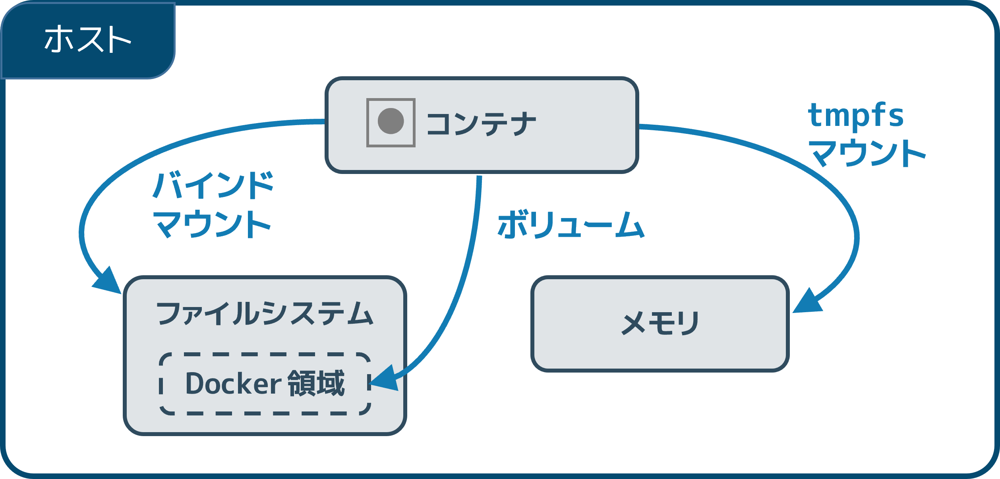

.. -*- coding: utf-8 -*-
.. URL: https://docs.docker.com/storage/
.. SOURCE: https://github.com/docker/docker.github.io/blob/master/storage/index.md
   doc version: 20.10
.. check date: 2022/04/30
.. Commits on Feb 4, 2022 f5676f4557414487cb68aaf60acb3ea7dd46f8dc
.. ---------------------------------------------------------------------------

.. Manage data in Docker
.. _manage-data-in-docker:

==================================================
Docker でのデータ管理
==================================================

.. sidebar:: 目次

   .. contents:: 
       :depth: 3
       :local:

.. By default all files created inside a container are stored on a writable container layer. This means that:

コンテナ内で作成された全てのファイルは、デフォルトで :ruby:`書き込み可能なコンテナ レイヤー <writable container layer>` に保存されます。つまり、これが意味するのは：

..  The data doesn’t persist when that container no longer exists, and it can be difficult to get the data out of the container if another process needs it.
    A container’s writable layer is tightly coupled to the host machine where the container is running. You can’t easily move the data somewhere else.
    Writing into a container’s writable layer requires a storage driver to manage the filesystem. The storage driver provides a union filesystem, using the Linux kernel. This extra abstraction reduces performance as compared to using data volumes, which write directly to the host filesystem.

* コンテナを削除すると、データは保持されません。そして、コンテナの外から他のプロセスが必要なデータを取得するのが困難になります。
* コンテナの書き込み可能なレイヤーは、コンテナを実行しているホストマシンと密接につながっています。データをどこかへ移動するのは簡単ではありません。
* コンテナの書き込み可能なレイヤーに書き込むには、ファイルシステムを管理するための :doc:`ストレージ ドライバ <storagedrive/index>` が必要です。ストレジ ドライバは Linux カーネルを使う :ruby:`ユニオン ファイルシステム <union filesystem>` を備えています。この特別な抽象化のため、 ホスト ファイルシステムに直接書き込む「 :ruby:`データ ボリューム <data volume>` 」に比べ、性能が劣ります。

.. Docker has two options for containers to store files on the host machine, so that the files are persisted even after the container stops: volumes, and bind mounts.

コンテナがホストマシン上にファイルを保存するため、Docker には「 :ruby:`ボリューム <volume>` 」と「 :ruby:`バインド マウント <bind mount>` 」という、２つのオプションがあります。

.. Docker also supports containers storing files in-memory on the the host machine. Such files are not persisted. If you’re running Docker on Linux, tmpfs mount is used to store files in the host’s system memory. If you’re running Docker on Windows, named pipe is used to store files in the host’s system memory.

また、 Docker はホストマシン上のメモリ内へのファイル保存もサポートしています。ですが、これらのファイルは保持されません。 Linux 上で Docker を実行している場合は、「 tmpfs マウント」がホストのシステムメモリ内への保存に使われます。Windows 上で Docker を実行している場合は、「 :ruby:`名前付きパイプ <named pipe>` 」がホストのシステムメモリ内への保存に使われます。

.. Keep reading for more information about persisting data or taking advantage of in-memory files.

メモリ内でデータを保持する利点についての情報を知るには、このまま読み進めてください。

.. Choose the right type of mount
.. _choose-the-right-type-of-mount:
正しいマウント形式を選択
==============================

.. No matter which type of mount you choose to use, the data looks the same from within the container. It is exposed as either a directory or an individual file in the container’s filesystem.

どのマウント形式を使っても、コンテナ内からデータは同じように見えます。データはディレクトリや個々のファイルとして、コンテナのファイルシステム内に提供されます。

.. An easy way to visualize the difference among volumes, bind mounts, and tmpfs mounts is to think about where the data lives on the Docker host.

データが Docker ホスト上のどこに存在しているかを考えるには、ボリューム、バインド マウント、 ``tmpfs`` マウントの違いを図にすると簡単です。

..    Volumes are stored in a part of the host filesystem which is managed by Docker (/var/lib/docker/volumes/ on Linux). Non-Docker processes should not modify this part of the filesystem. Volumes are the best way to persist data in Docker.
    Bind mounts may be stored anywhere on the host system. They may even be important system files or directories. Non-Docker processes on the Docker host or a Docker container can modify them at any time.
    tmpfs mounts are stored in the host system’s memory only, and are never written to the host system’s filesystem.

* **ボリューム（volume）** は、 「Docker によって管理されている」ホストファイルシステム上の一部に保管します（ Linux 上では ``/var/lib/docker/volumes`` ）。 Docker 以外のプロセスは、このファイルシステム上の一部を変更すべきではありません。ボリュームは Docker 内のデータを保持するために一番良い方法です。
* **バインド マウント（bind mount）** は、ホストシステム上の「どこにでも」保管できます。これには重要なシステムファイルやディレクトリも含みます。Docekr ホスト上の Docker 以外のプロセスも、 Docker コンテナも、常にデータを変更できます。
* **tmpfs マウント** は、ホストシステムのメモリ上にのみ保管します。そして、ホストシステムのファイルシステムには一切書き込まれません。

.. More details about mount types
.. _more-details-about-mount-types:
マウント形式の詳細
====================

..    Volumes: Created and managed by Docker. You can create a volume explicitly using the docker volume create command, or Docker can create a volume during container or service creation.

* :doc:`ボリューム <volumes>` ：Docker によって作成と管理されます。ボリュームは ``docker volume create`` コマンドを使って自明的に作成できます。また、 Docker はコンテナやサービスの作成j時にボリュームを作成できます。

  .. When you create a volume, it is stored within a directory on the Docker host. When you mount the volume into a container, this directory is what is mounted into the container. This is similar to the way that bind mounts work, except that volumes are managed by Docker and are isolated from the core functionality of the host machine.

  ボリュームを作成すると、Docker ホスト上のディレクトリ内に（ボリュームが）置かれます。コンテナ内にボリュームをマウントする時は、この（ホスト上に作成された）ディレクトリがコンテナ内にマウントされます。これはバインド マウントと似たような手法ですが、異なるのは、 Docker によってボリュームが管理され、ホストマシン上のコア機能からボリュームが :ruby:`分離 <isolate>` されています。

  .. A given volume can be mounted into multiple containers simultaneously. When no running container is using a volume, the volume is still available to Docker and is not removed automatically. You can remove unused volumes using docker volume prune.

  既定のボリュームは、複数のコンテナから同時にマウント可能です。ボリュームが実行中のコンテナから一切使われていなくても、ボリュームは Docker 上で利用可能なままであり、自動的には削除されません。使わないボリュームは ``docker volume prune`` で削除できます。

  .. When you mount a volume, it may be named or anonymous. Anonymous volumes are not given an explicit name when they are first mounted into a container, so Docker gives them a random name that is guaranteed to be unique within a given Docker host. Besides the name, named and anonymous volumes behave in the same ways.

  ボリュームのマウントは **名前付き（named）** か **無名（anonymous）** です。 :ruby:`無名ボリューム <anonymous volume>` とは、コンテナに初めてマウントする時、特定の名前が与えられません。そのため、 Docker は ランダムな名前を割り当てます。この名前は、 Docker ホスト内で確実に使われていないユニークなものです。名前付きボリュームと無名ボリュームの呼び方こそ違いますが、挙動はどちらも同じです。

  .. Volumes also support the use of volume drivers, which allow you to store your data on remote hosts or cloud providers, among other possibilities.

  また、ボリュームは「 :ruby:`ボリューム ドライバ <volume driver>` 」の利用もサポートします。これは、データをリモートホスト上や、クラウドプロバイダ、その他利用可能な所にデータを保管します。

.. Bind mounts: Available since the early days of Docker. Bind mounts have limited functionality compared to volumes. When you use a bind mount, a file or directory on the host machine is mounted into a container. The file or directory is referenced by its full path on the host machine. The file or directory does not need to exist on the Docker host already. It is created on demand if it does not yet exist. Bind mounts are very performant, but they rely on the host machine’s filesystem having a specific directory structure available. If you are developing new Docker applications, consider using named volumes instead. You can’t use Docker CLI commands to directly manage bind mounts.

  ..  Bind mounts allow access to sensitive files
  ..  One side effect of using bind mounts, for better or for worse, is that you can change the host filesystem via processes running in a container, including creating, modifying, or deleting important system files or directories. This is a powerful ability which can have security implications, including impacting non-Docker processes on the host system.

* :doc:`バインド マウント <bind-mounts>` ：Docker の初期から利用できます。バインド マウントはボリュームと比較すると、機能が限定的です。バインド マウントを使用する時、「ホストマシン」上のファイルやディレクトリがコンテナ内にマウントされます。ファイルやディレクトリは、ホストマシン上のフルパスによって参照されます。ファイルやディレクトリは、あらかじめ Docker ホスト上に存在する必要はありません。それらが存在しなければ、必要に応じて作成されます。バインドマウントは高性能ですが、ホストマシン上のファイルシステムが待っている、特定の利用可能なディレクトリ構造に依存します。新しい Docker アプリケーションの開発を検討しているのであれば、かわりに名前付きボリュームの利用を検討してください。Docker CLI コマンドでは、バインド マウントを直接管理できません。

  .. important::

     **バインド マウントは機微情報を扱うファイルにもアクセス可能**
     
     バインド マウントの効果は一方では優れていますが、劣る部分もあります。それは、 **コンテナ**  内で実行中のプロセスを経由して、 **ホスト** 側のファイルシステムも変更できる点であり、重要なシステムファイルやディレクトリの作成、変更、削除を含みます。これにはホスト上の Docker 以外のプロセスに対する影響も含む、セキュリティに懸念を与えかねない強力な能力があります。

.. tmpfs mounts: A tmpfs mount is not persisted on disk, either on the Docker host or within a container. It can be used by a container during the lifetime of the container, to store non-persistent state or sensitive information. For instance, internally, swarm services use tmpfs mounts to mount secrets into a service’s containers.

* :doc:`tmpfs マウント <tmpfs>` ： ``tmpfs`` マウントはディスク上で保持されないどころか、 Docker ホストやコンテナ内にも保持されません。コンテナのライフサイクル中だけで使われるべきであり、保持できない状態や機微情報の保管には利用できません。たとえば、内部では swarm サービスが ``tmpfs`` マウントを使い、サービスコンテナ内に :doc:`シークレット </engine/swarm/secrets>` をマウントするために ``tmpfs`` マウントを使います。

.. named pipes: An npipe mount can be used for communication between the Docker host and a container. Common use case is to run a third-party tool inside of a container and connect to the Docker Engine API using a named pipe.

* `名前付きパイプ <https://docs.microsoft.com/ja-jp/windows/win32/ipc/named-pipes>`_ ：Docker ホストとコンテナ間で通信するために ``npipe`` マウントが利用できます。一般的な使い方は、コンテナ内にサードパーティ製ツールを実行し、名前付きパイプを使って Docker Engine API に接続します。

.. Bind mounts and volumes can both be mounted into containers using the -v or --volume flag, but the syntax for each is slightly different. For tmpfs mounts, you can use the --tmpfs flag. We recommend using the --mount flag for both containers and services, for bind mounts, volumes, or tmpfs mounts, as the syntax is more clear.

バインド マウントとボリュームは、どちらも ``-v`` か ``--volume`` フラグを使ってコンテナにマウントできますが、それぞれの構文には若干の違いがあります。 ``tmpfs`` マウントでは ``--tmpfs`` フラグが使えます。バインド マウント、ボリューム、 ``tmpfs`` マウントを、コンテナとサービスの両方で使う場合、構文がより明確な ``--mount`` フラグの利用を推奨します。

.. Good use cases for volumes
ボリュームの上手な使い方
==============================

.. Volumes are the preferred way to persist data in Docker containers and services. Some use cases for volumes include:

Docker コンテナとサービスでデータを保持するには、ボリュームの利用が完璧な方法です。ボリュームには以下の用途もあります。

..    Sharing data among multiple running containers. If you don’t explicitly create it, a volume is created the first time it is mounted into a container. When that container stops or is removed, the volume still exists. Multiple containers can mount the same volume simultaneously, either read-write or read-only. Volumes are only removed when you explicitly remove them.

* 実行中の複数コンテナ間でデータを共有します。明示的に作成しなくても、コンテナ内に初めてマウントするときにボリュームが作成されます。コンテナが停止もしくは削除されても、ボリュームは残り続けます。読み書き可能な状態だけでなく、読み込み専用としても、複数のコンテナで同じディレクトリを同時にマウントできます。

..     When the Docker host is not guaranteed to have a given directory or file structure. Volumes help you decouple the configuration of the Docker host from the container runtime.

* 特定のディレクトリやファイル構造に対して、 Docker ホストが権限を与えられていない場合。ボリュームはコンテナ ランタイムから Docker ホスト設定を切り離すのに役立ちます。

..    When you want to store your container’s data on a remote host or a cloud provider, rather than locally.

* ローカルではなく、リモートホストやクラウドプロバイダ上のコンテナに、データを保管したい場合。

..    When you need to back up, restore, or migrate data from one Docker host to another, volumes are a better choice. You can stop containers using the volume, then back up the volume’s directory (such as /var/lib/docker/volumes/<volume-name>).

* ある Docker ホストから別の場所へ、バックアップ、修復、データ移行が必要な場合、ボリュームは良い選択です。ボリュームを使っているコンテナを停止後、ボリューム用ディレクトリ（ ``/var/lib/docker/volumes/<ボリューム名>`` のような）のバックアップが行えます。

..    When your application requires high-performance I/O on Docker Desktop. Volumes are stored in the Linux VM rather than the host, which means that the reads and writes have much lower latency and higher throughput.

* Docker Desktop 上で、アプリケーションが高性能な I/O を必要とする場合。ボリュームはホスト上ではなく Linux VM に保管されます。これが意味するのは、読み書きが、より低レイテンシかつ高スループットになります。

..    When your application requires fully native file system behavior on Docker Desktop. For example, a database engine requires precise control over disk flushing to guarantee transaction durability. Volumes are stored in the Linux VM and can make these guarantees, whereas bind mounts are remoted to macOS or Windows, where the file systems behave slightly differently.

* Docker Desktop 上で、アプリケーションが完全にネイティブなファイルシステムの挙動を必要とする場合。たとえば、データベースエンジンであれば、トランザクションの :ruby:`永続性 <durability>` を確保するため、緻密なディスクのフラッシュ制御を必要とします。バインド マウントがリモートの macOS や Windows のファイルシステムを扱うのとわずかに異なり、ボリュームは Linux VM 内にデータを保管しますので、これら（永続性や性能）を確保します。

.. Good use cases for bind mounts
.. _good-use-cases-for-bind-mounts:
バインド マウントの上手な使い方
========================================

.. In general, you should use volumes where possible. Bind mounts are appropriate for the following types of use case:

一般的に、可能であればボリュームを使うべきです。バインド マウントは、以下の用途での使用に適切です。

..    Sharing configuration files from the host machine to containers. This is how Docker provides DNS resolution to containers by default, by mounting /etc/resolv.conf from the host machine into each container.

* ホストマシン上の設定ファイルをコンテナに共有する場合。これがまさに、 Docker がコンテナに DNS 名前解決を提供するデフォルトの仕組みとして、ホストマシン上の ``/etc/resolv.conf`` をコンテナ内にマウントします。

..    Sharing source code or build artifacts between a development environment on the Docker host and a container. For instance, you may mount a Maven target/ directory into a container, and each time you build the Maven project on the Docker host, the container gets access to the rebuilt artifacts.

* Docker ホスト上の開発環境とコンテナ間で、ソースコードや :ruby:`構築結果 <artifact>` を共有する場合。たとえば、 Maven ``target/`` ディレクトリをコンテナ内にマウントすると、それから、 Docker ホスト 上の Maven プロジェクトで毎回構築するたびに、構築結果にコンテナからアクセスできます。

  ..    If you use Docker for development this way, your production Dockerfile would copy the production-ready artifacts directly into the image, rather than relying on a bind mount.

  この手法を Docker の開発で使うには、本番環境用の Dockerfile はバインド マウントに依存するのではなく、本番用の構築結果を直接イメージにコピーする場合です。

..    When the file or directory structure of the Docker host is guaranteed to be consistent with the bind mounts the containers require.

* バインド マウントするコンテナが、Docker ホスト上のファイルやディレクトリ構造と一貫する保証を必要な場合。

.. Good use cases for tmpfs mounts
.. _good-use-cases-for-tmpfs-mounts:
tmpfs マウントの上手な使い方
==============================

.. tmpfs mounts are best used for cases when you do not want the data to persist either on the host machine or within the container. This may be for security reasons or to protect the performance of the container when your application needs to write a large volume of non-persistent state data.

``tmpfs`` マウントの最も上手い利用方法は、ホストマシン上とコンテナ内のどちらでも、データをの保持を必要としない場合です。可能性としては、セキュリティ上の理由や、アプリケーションが状態を保持しない大きな容量の書き込みを必要とする場合に、コンテナの性能を維持するためです。

.. Tips for using bind mounts or volumes
.. _tips-for-using-bind-mounts-or-volumes:
バインド マウントやボリュームを使うコツ
========================================

.. If you use either bind mounts or volumes, keep the following in mind:

バインド マウントやボリュームを使う場合は、以下のことを覚えておいてください。

..    If you mount an empty volume into a directory in the container in which files or directories exist, these files or directories are propagated (copied) into the volume. Similarly, if you start a container and specify a volume which does not already exist, an empty volume is created for you. This is a good way to pre-populate data that another container needs.

* ファイルやディレクトリが存在しているコンテナ内のディレクトリに対し、 **空っぽのディレクトリ** をマウントする場合は、ファイルやディレクトリがボリューム内に :ruby:`伝搬 <propagate>` （コピー）されます。同様に、コンテナの起動時に指定したディレクトリが存在していなければ、使用するために空っぽのボリュームを作成します。これは、他のコンテナが必要とするデータを事前に見積もるために良い方法です。

..    If you mount a bind mount or non-empty volume into a directory in the container in which some files or directories exist, these files or directories are obscured by the mount, just as if you saved files into /mnt on a Linux host and then mounted a USB drive into /mnt. The contents of /mnt would be obscured by the contents of the USB drive until the USB drive were unmounted. The obscured files are not removed or altered, but are not accessible while the bind mount or volume is mounted.

* **バインド マウントや空っぽではないボリューム** をコンテナ内のディレクトリにマウントする場合、既にファイルやディレクトリが存在していると、これらのファイルやディレクトリはマウントによって隠されます。これは、 Linux ホスト上の ``/mnt`` にファイルを保存していても、 USB ドライブで ``/mnt`` にマウントするような状態です。  USB ドライブをアンマウントするまで、``/mnt`` の内容は USB ドライブの内容によって隠されます（訳者注：ファイル等は存在しますが、一時的に見えなくなります）。

.. Next steps
次のステップ
====================

..  Learn more about volumes.
    Learn more about bind mounts.
    Learn more about tmpfs mounts.
    Learn more about storage drivers, which are not related to bind mounts or volumes, but allow you to store data in a container’s writable layer.

* :doc:`ボリューム <volumes>` について学ぶ
* :doc:`バインド マウント <bind-mounts>` について学ぶ
* :doc:`tmpfs マウント <tmpfs>` について学ぶ
* :doc:`ストレージ ドライバ <storagedriver/index>`  について学ぶ。バインド マウントやボリュームとは関連性がありませんが、コンテナの書き込み可能なレイヤーへのデータ保管方法を学べます。

.. seealso:: 

   Manage data in Docker
      https://docs.docker.com/storage/