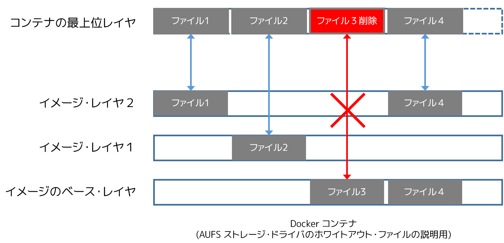

.. -*- coding: utf-8 -*-
.. URL: https://docs.docker.com/engine/userguide/storagedriver/aufs-driver/
.. SOURCE: https://github.com/docker/docker/blob/master/docs/userguide/storagedriver/aufs-driver.md
   doc version: 1.12
      https://github.com/docker/docker/commits/master/docs/userguide/storagedriver/aufs-driver.md
.. check date: 2016/06/14
.. Commits on Apr 29, 2016 24ec73f754da16e37726a3f1c6a59de508e255fc
.. ---------------------------------------------------------------------------

.. Docker and AUFS in practice

.. _docker-and-aufs-in-practice:

========================================
AUFS ストレージ・ドライバの使用
========================================

.. sidebar:: 目次

   .. contents:: 
       :depth: 3
       :local:

.. AUFS was the first storage driver in use with Docker. As a result, it has a long and close history with Docker, is very stable, has a lot of real-world deployments, and has strong community support. AUFS has several features that make it a good choice for Docker. These features enable:

AUFS は Docker に使われた初めてのストレージ・ドライバです。そのため、Docker の歴史で長く使われており、非常に安定し、多くの実際の開発に使われ、強力なコミュニティのサポートがあります。AUFS には複数の機能があります。これらは Docker の良い選択肢となるでしょう。次の機能を有効にします。

..    Fast container startup times.
    Efficient use of storage.
    Efficient use of memory.

* コンテナ起動時間の高速化
* ストレージの効率的な利用
* メモリの効率的な利用

.. Despite its capabilities and long history with Docker, some Linux distributions do not support AUFS. This is usually because AUFS is not included in the mainline (upstream) Linux kernel.

性能に拘わらず Docker で長い間使われてきていますが、いくつかのディストリビューションは AUFS をサポートしていません。たいていの場合、AUFS は Linux カーネルのメインライン（upstream）ではないためです。

.. The following sections examine some AUFS features and how they relate to Docker.

以下のセクションでは、AUFS 機能と Docker がどのように連携するか紹介します。

.. Image layering and sharing with AUFS

.. _image-layering-and-sharing-with-aufs:

AUFS でイメージのレイヤ化と共有
=================================

.. AUFS is a unification filesystem. This means that it takes multiple directories on a single Linux host, stacks them on top of each other, and provides a single unified view. To achieve this, AUFS uses union mount.

AUFS とは *統合ファイルシステム（unification filesystem）* です。つまり、１つの Linux ホスト上に複数のディレクトリが存在し、それぞれが互いに積み重なり、１つに結合された状態に見えます。これらを実現するため、 AUFS は *ユニオン・マウント（union mount）* を使います。

.. AUFS stacks multiple directories and exposes them as a unified view through a single mount point. All of the directories in the stack, as well as the union mount point, must all exist on the same Linux host. AUFS refers to each directory that it stacks as a branch.

AUFS は複数のディレクトリの積み重ねであり、１つのマウントポイントを通して、それらが統合されて見えます。全てのディレクトリが層（スタック）と結合したマウントポイントを形成しますので、全てが同一の Linux ホスト上に存在する必要があります。AUFS は各ディレクトリを、 *ブランチ（branch）* という層の積み重ねとして参照します。

.. Within Docker, AUFS union mounts enable image layering. The AUFS storage driver implements Docker image layers using this union mount system. AUFS branches correspond to Docker image layers. The diagram below shows a Docker container based on the ubuntu:latest image.

Docker 内部では、 AUFS ユニオン・マウントがイメージのレイヤ化を行います。AUFS ストレージ・ドライバは、ユニオン・マウント・システムを使って Docker イメージを扱います。AUFS ブランチが Docker イメージ・レイヤに相当します。以下の図は ``ubuntu:latest`` イメージをベースとする Docker コンテナです。

.. image:: ./images/aufs-layers.png
   :scale: 60%
   :alt: イメージ層

.. This diagram shows that each image layer, and the container layer, is represented in the Docker hosts filesystem as a directory under /var/lib/docker/. The union mount point provides the unified view of all layers. As of Docker 1.10, image layer IDs do not correspond to the names of the directories that contain their data.

この図は、Docker イメージ・レイヤと、Docker ホスト上の ``/var/lib/docker`` 以下にあるローカル・ストレージ領域との関係性を表しています。ユニオン・マウント・ポイントは、全てのレイヤを一体化して見えるようにします。Docker 1.10 からは、イメージ ID はデータが置かれるディレクトリ名と対応しなくなりました。

.. AUFS also supports the copy-on-write technology (CoW). Not all storage drivers do.

また、AUFS はコピー・オン・ライト技術（copy-on-write; CoW）もサポートしています。これは、全てのドライバがサポートしているものではありません。

.. Container reads and writes with AUFS

AUFS でコンテナの読み書き
==============================

.. Docker leverages AUFS CoW technology to enable image sharing and minimize the use of disk space. AUFS works at the file level. This means that all AUFS CoW operations copy entire files - even if only a small part of the file is being modified. This behavior can have a noticeable impact on container performance, especially if the files being copied are large, below a lot of image layers, or the CoW operation must search a deep directory tree.

Docker は AUFSのコピー・オン・ライト技術をテコに、イメージ共有とディスク使用量の最小化をできるようにします。AUFS はファイルレベルで動作します。つまり、AUFSのコピー・オン・ライト処理は、ファイル全体をコピーします。それがファイルの一部を変更する場合でもです。この処理はコンテナの性能に大きな影響を与えます。特に、コピーする対象のファイルが大きい場合は、配下のイメージ・レイヤが多くあるか、あるいは、コピー・オン・ライト処理により深いディレクトリ・ツリーを検索する必要なためです。

.. Consider, for example, an application running in a container needs to add a single new value to a large key-value store (file). If this is the first time the file is modified it does not yet exist in the container’s top writable layer. So, the CoW must copy up the file from the underlying image. The AUFS storage driver searches each image layer for the file. The search order is from top to bottom. When it is found, the entire file is copied up to the container’s top writable layer. From there, it can be opened and modified.

考えてみましょう。例えばコンテナで実行しているアプリケーションが、大きなキーバリュー・ストア（ファイル）に新しい値を追加したとします。これが初回であれば、コンテナの一番上の書き込み可能なレイヤに、まだ変更を加えるべきファイルが存在していません。そのため、 CoW 処理は、下部のイメージからファイルを *上にコピー* する必要があります。AUFS ストレージ・ドライバは、各イメージ・レイヤ上でファイルを探します。検索順番は、上から下にかけてです。ファイルが見つかれば、対象のファイルをコンテナの上にある書き込み可能なレイヤに *コピー* （copy up）します。そして、やっとファイルを開き、編集できるようになります。

.. Larger files obviously take longer to copy up than smaller files, and files that exist in lower image layers take longer to locate than those in higher layers. However, a copy up operation only occurs once per file on any given container. Subsequent reads and writes happen against the file’s copy already copied-up to the container’s top layer.

小さなファイルに比べて、大きなファイルであれば明らかにコピー時間がかかります。そして、高いイメージ・レイヤにファイルがあるよりも、低いレイヤにある場合も時間がかかります。しかしながら、コピー作業が発生するのは、対象のコンテナ上では１度だけです。次にファイルの読み書き処理が発生しても、コンテナの一番上のレイヤにコピー済みのファイルがある場合は、ファイルを再度コピーしません。

.. Deleting files with the AUFS storage driver

.. _deleting-files-with-the-aufs-storage-driver:

AUFS ストレージ・ドライバでのファイル削除
==================================================

.. The AUFS storage driver deletes a file from a container by placing a whiteout file in the container’s top layer. The whiteout file effectively obscures the existence of the file in image’s lower, read-only layers. The simplified diagram below shows a container based on an image with three image layers.

.. The AUFS storage driver deletes a file from a container by placing a whiteout file in the container’s top layer. The whiteout file effectively obscures the existence of the file in the read-only image layers below. The simplified diagram below shows a container based on an image with three image layers.

AUFS ストレージ・ドライバでコンテナからファイルを削除したら、コンテナの一番上のレイヤに *ホワイトアウト・ファイル（whiteout file）* が置かれます。読み込み専用のイメージ・レイヤの下にあるファイルを、ホワイトアウト・ファイルが効果的に隠します。以下の単純化した図は、３つのイメージ・レイヤのイメージに基づくコンテナを表しています。

.. The file3 was deleted from the container. So, the AUFS storage driver placed a whiteout file in the container’s top layer. This whiteout file effectively “deletes” file3 from the container by obscuring any of the original file’s existence in the image’s read-only layers. This works the same no matter which of the image’s read-only layers the file exists in.

``ファイル3`` はコンテナ上で削除されました。すると、AUFS ストレージ・ドライバは、コンテナの最上位レイヤにホワイトアウト・ファイルを置きます。このホワイトアウト・ファイルは、イメージの読み込み専用レイヤに存在するオリジナルのファイルを隠すことにより、コンテナ上から事実上 ``ファイル3`` が削除されたものとします。この処理はイメージの読み込み専用レイヤに対し何ら影響を与えません。

.. Configure Docker with AUFS

.. _configure-docker-with-aufs:

Docker で AUFS を使う設定
==============================

.. You can only use the AUFS storage driver on Linux systems with AUFS installed. Use the following command to determine if your system supports AUFS.

AUFS ストレージ・ドライバを使えるのは、AUFS がインストールされた Linux システム上でのみです。以下のコマンドを使い、システムが AUFS をサポートしているかどうか確認します。

.. code-block:: bash

   $ grep aufs /proc/filesystems
   nodev   aufs

.. This output indicates the system supports AUFS. Once you’ve verified your system supports AUFS, you can must instruct the Docker daemon to use it. You do this from the command line with the dockerd command:

この出力は、システムが AUFS をサポートしています。自分のシステムで AUFS をサポートしているのを確認したら、Docker デーモンに対して AUFS を使う指示が必要です。これには ``dockerd`` コマンドを使えます。

.. code-block:: bash

   $ sudo dockerd --storage-driver=aufs &

.. Alternatively, you can edit the Docker config file and add the --storage-driver=aufs option to the DOCKER_OPTS line.

あるいは、Docker の設定ファイルを編集し、 ``DOCKER_OPTS`` 行に ``--storage-driver=aufs`` オプションを追加します。

.. code-block:: bash

   # DOCKER_OPTS で、デーモン起動時のオプションを編集
   DOCKER_OPTS="--storage-driver=aufs"

.. Once your daemon is running, verify the storage driver with the docker info command.

デーモンを起動したら、 ``docker info`` コマンドでストレージ・ドライバを確認します。

.. code-block:: bash

   $ sudo docker info
   Containers: 1
   Images: 4
   Storage Driver: aufs
    Root Dir: /var/lib/docker/aufs
    Backing Filesystem: extfs
    Dirs: 6
    Dirperm1 Supported: false
   Execution Driver: native-0.2
   ...出力を省略...

.. The output above shows that the Docker daemon is running the AUFS storage driver on top of an existing ext4 backing filesystem.

このような出力から、起動中の Docker デーモンが既存の ext4 ファイルシステム上で AUFS ストレージ・ドライバを使っていることが分かります。

.. Local storage and AUFS

.. _local-storage-and-aufs:

ローカルのストレージと AUFS
==============================

.. As the dockerd runs with the AUFS driver, the driver stores images and containers on within the Docker host’s local storage area in the /var/lib/docker/aufs directory.

``dockerd`` を AUFS ドライバで実行したら、ドライバは Docker ホスト上のローカル・ストレージ領域である ``/var/lib/docker/aufs`` 内に、イメージとコンテナを保管します。

.. Images

イメージ
----------

.. Image layers and their contents are stored under /var/lib/docker/aufs/diff/. With Docker 1.10 and higher, image layer IDs do not correspond to directory names

イメージ・レイヤと各コンテナは、 ``/var/lib/docker/aufs/diff/<イメージID>`` ディレクトリ以下に保管されます。Docker 1.10 以降では、イメージ・レイヤ ID はディレクトリ名と一致しません。

.. The /var/lib/docker/aufs/layers/ directory contains metadata about how image layers are stacked. This directory contains one file for every image or container layer on the Docker host (though file names no longer match image layer IDs). Inside each file are the names of the directories that exist below it in the stack

``/var/lib/docker/aufs/layers/`` ディレクトリに含まれるのは、どのようにイメージ・レイヤを重ねるかというメタデータです。このディレクトリには、Docker ホスト上のイメージかコンテナごとに１つのファイルがあります（ファイル名はイメージのレイヤ ID と一致しません）。各ファイルの中にはイメージ・レイヤの名前があります。次の図は１つのイメージが４つのレイヤを持つのを示しています。

.. image:: ./images/aufs-metadata.png
   :scale: 60%
   :alt: AUFS メタデータ

.. Inspecting the contents of the file relating to the top layer of the image shows the three image layers below it. They are listed in the order they are stacked.

.. イメージの最上位レイヤのファイル内容を調べると、下層にある３つのイメージ・レイヤに関する情報が含まれています。これらは積み重ねられた順番で並べられています。

.. The command below shows the contents of a metadata file in /var/lib/docker/aufs/layers/ that lists the three directories that are stacked below it in the union mount. Remember, these directory names do no map to image layer IDs with Docker 1.10 and higher.

以下のコマンドは、 ``/var/lib/docker/aufs/layers/`` にあるメタデータ・ファイルを表示しています。ここで表示されるディレクトリの一覧は、ユニオン・マウントに積み重ねられている（スタックしている）ものです。ただし、覚えておかなくてはいけないのは、Docker 1.10 以上ではディレクトリ名とイメージ・レイヤ ID が一致しなくなりました。

.. code-block:: bash

   $ cat /var/lib/docker/aufs/layers/91e54dfb11794fad694460162bf0cb0a4fa710cfa3f60979c177d920813e267c
   d74508fb6632491cea586a1fd7d748dfc5274cd6fdfedee309ecdcbc2bf5cb82
   c22013c8472965aa5b62559f2b540cd440716ef149756e7b958a1b2aba421e87
   d3a1f33e8a5a513092f01bb7eb1c2abf4d711e5105390a3fe1ae2248cfde1391

.. The base layer in an image has no image layers below it, so its file is empty.

イメージのベース・レイヤは下層にイメージ・レイヤを持ちませんので、対象となるファイルの内容は空っぽです。

.. Containers

コンテナ
----------

.. Running containers are mounted below /var/lib/docker/aufs/mnt/<container-id>. This is where the AUFS union mount point that exposes the container and all underlying image layers as a single unified view exists. If a container is not running, it still has a directory here but it is empty. This is because AUFS only mounts a container when it is running. With Docker 1.10 and higher, container IDs no longer correspond to directory names under /var/lib/docker/aufs/mnt/<container-id>.

実行中のコンテナは ``/var/lib/docker/aufs/mnt/<コンテナ ID>`` 配下にマウントされます。これが AUFS ユニオン・マウント・ポイントであり、コンテナと下層のイメージ・レイヤが１つに統合されて公開されている場所です。コンテナが実行されていなければ、これらのディレクトリは存在しますが、内容は空っぽです。なぜなら、コンテナが実行する時のみマウントするための場所だからです。Docker 1.10 以上では、コンテナ ID はディレクトリ名 ``/var/lib/docker/aufs/mnt/<コンテナID>`` と対応しません。

.. Container metadata and various config files that are placed into the running container are stored in /var/lib/docker/containers/<container-id>. Files in this directory exist for all containers on the system, including ones that are stopped. However, when a container is running the container’s log files are also in this directory.

コンテナのメタデータやコンテナの実行に関する様々な設定ファイルは、 ``/var/lib/docker/containers/<コンテナ ID>`` に保管されます。ディレクトリ内に存在するファイルはシステム上の全コンテナに関するものであり、停止されたものも含みます。しかしながら、コンテナを実行したら、コンテナのログファイルもこのディレクトリに保存されます。

.. A container’s thin writable layer is stored in a directory under /var/lib/docker/aufs/diff/. With Docker 1.10 and higher, container IDs no longer correspond to directory names. However, the containers thin writable layer still exists under here and is stacked by AUFS as the top writable layer and is where all changes to the container are stored. The directory exists even if the container is stopped. This means that restarting a container will not lose changes made to it. Once a container is deleted, it’s thin writable layer in this directory is deleted.

コンテナの薄い書き込み可能なレイヤ（thin writable layer）は ``/var/lib/docker/aufs/diff/<コンテナ ID>`` に保存されます。Docker 1.10 以上では、コンテナ ID はディレクトリ名と対応しません。しかしながら、コンテナの薄い書き込み可能なレイヤは、まだこの配下に存在し続けています。このディレクトリは AUFS によってコンテナの最上位の書き込みレイヤとして積み重ねられるものであり、コンテナに対する全ての変更が保管されます。コンテナが停止しても、このディレクトリは存在し続けます。つまり、コンテナを再起動しても、その変更内容は失われません。コンテナが削除された時のみ、このディレクトリは削除されます。

.. Information about which image layers are stacked below a container’s top writable layer is stored in the following file /var/lib/docker/aufs/layers/<container-id>. The command below shows that the container with ID b41a6e5a508d has 4 image layers below it:
.. コンテナ最上位の書き込み可能なレイヤの下に、どのようなイメージ・レイヤが積み重ねられているかという情報は、ファイル ``/var/lib/docker/aufs/layers/<コンテナ ID>`` のファイルを調べます。以下のコマンドから、コンテナ ID ``b41a6e5a508d``  が４つのイメージ・レイヤを下層に持っているのが分かります。

.. AUFS and Docker performance

.. _aufs-and-docker-performance:

AUFS と Docker の性能
==============================

.. To summarize some of the performance related aspects already mentioned:

既に言及している性能面について、まとめます。

..     The AUFS storage driver is a good choice for PaaS and other similar use-cases where container density is important. This is because AUFS efficiently shares images between multiple running containers, enabling fast container start times and minimal use of disk space.

* AUFS ストレージ・ドライバは PaaS とコンテナの密度が重要な類似事例にとって、良い選択肢です。これは複数の実行中のコンテナ間で、 AUFS が効率的にイメージを共有するためです。それにより、コンテナの起動時間を早くし、ディスク使用量を最小化します。

..    The underlying mechanics of how AUFS shares files between image layers and containers uses the systems page cache very efficiently.

* AUFS がイメージ・レイヤとコンテナ間でどのように共有するのか、その根底にある仕組みは、システム・ページ・キャッシュを非常に効率的に使います。

..    The AUFS storage driver can introduce significant latencies into container write performance. This is because the first time a container writes to any file, the file has be located and copied into the containers top writable layer. These latencies increase and are compounded when these files exist below many image layers and the files themselves are large.

* AUFS ストレージ・ドライバはコンテナに対する書き込み性能に対し、著しい待ち時間をもたらし得ます。これはコンテナに何らかのファイルを書き込もうとすると、ファイルをコンテナ最上位の書き込み可能レイヤに対してコピーする必要があるためです。ファイルが多くのイメージ・レイヤに存在する場合や、ファイル自身が大きい場合には、待ち時間が増え、悪化するでしょう。

.. One final point. Data volumes provide the best and most predictable performance. This is because they bypass the storage driver and do not incur any of the potential overheads introduced by thin provisioning and copy-on-write. For this reason, you may want to place heavy write workloads on data volumes.

最後に１つだけ。データ・ボリュームは最高かつ最も予想可能な性能をもたらします。これはデータ・ボリュームがストレージ・ドライバを迂回するためであり、シン・プロビジョニングやコピー・オン・ライトによるオーバヘッドの影響を受けないためです。この理由のため、重い書き込み処理を行いたい場合には、データ・ボリュームの使用が適している場合もあるでしょう。

.. Related information

関連情報
==========

..     Understand images, containers, and storage drivers
    Select a storage driver
    Btrfs storage driver in practice
    Device Mapper storage driver in practice

* :doc:`imagesandcontainers`
* :doc:`selectadriver`
* :doc:`btrfs-driver`
* :doc:`device-mapper-driver`

.. seealso:: 

   Docker and AUFS in practice
      https://docs.docker.com/engine/userguide/storagedriver/aufs-driver/