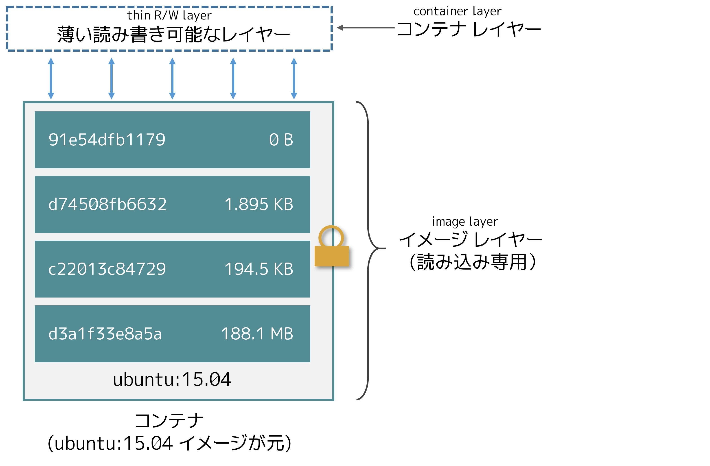
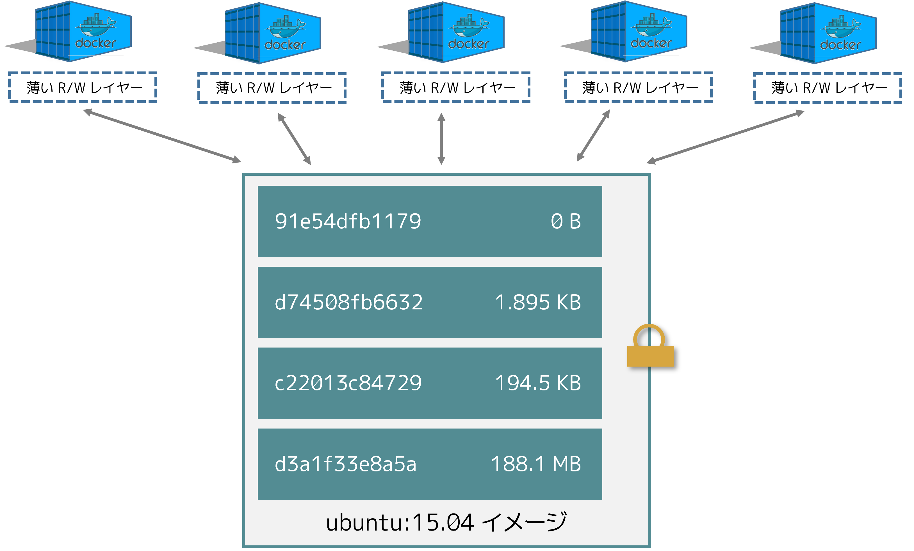

.. -*- coding: utf-8 -*-
.. URL: https://docs.docker.com/storage/storagedriver/
.. SOURCE: https://github.com/docker/docker/blob/master/docs/userguide/storagedriver/imagesandcontainers.md
   doc version: 1.12
      https://github.com/docker/docker/commits/master/docs/userguide/storagedriver/imagesandcontainers.md
   doc version: 20.10
      https://github.com/docker/docker/commits/master/docs/userguide/storagedriver/imagesandcontainers.md
      https://github.com/docker/docker.github.io/blob/master/storage/
.. check date: 2022/05/03
.. Commits on Jan 21, 2022 36428d09e73b6a8e2e93ef50f1483e1ef23aef77
.. ---------------------------------------------------------------------------

.. About storage drivers:
.. _about-storage-drivers:

============================================================
:ruby:`ストレージ ドライバ <storage driver>` について
============================================================

.. sidebar:: 目次

   .. contents:: 
       :depth: 3
       :local:

.. To use storage drivers effectively, it’s important to know how Docker builds and stores images, and how these images are used by containers. You can use this information to make informed choices about the best way to persist data from your applications and avoid performance problems along the way.

:ruby:`ストレージ ドライバ <storage driver>` を効率的に使うには、Docker がどのようしてイメージを構築・保存するのかを知り、そして、コンテナによってどのようにしてイメージが使われるのかを知るのは重要です。この知識を使えば、この先、アプリケーションがデータを保持しながら、パフォーマンスの問題をさけるための、ベストな方法を選択できるようになります。

.. Storage drivers versus Docker volumes
.. _storage-drivers-versus-docker-volumes:
ストレージ ドライバと Docker ボリュームの比較
==================================================

.. Docker uses storage drivers to store image layers, and to store data in the writable layer of a container. The container’s writable layer does not persist after the container is deleted, but is suitable for storing ephemeral data that is generated at runtime. Storage drivers are optimized for space efficiency, but (depending on the storage driver) write speeds are lower than native file system performance, especially for storage drivers that use a copy-on-write filesystem. Write-intensive applications, such as database storage, are impacted by a performance overhead, particularly if pre-existing data exists in the read-only layer.

:ruby:`イメージ レイヤー <image layer>` へのデータ保管と、コンテナの :ruby:`書き込み可能なレイヤー <writable layer>` にデータを保管するため、Docker はストレージ ドライバを使います。コンテナを削除すると、コンテナの書き込み可能なレイヤーは :ruby:`保持 <persist>` されません。ですが、実行時に生成される :ruby:`一時的なデータ <ephemeral data>` の保管には適しています。ストレージ ドライバは容量効率を最適化していますが、（ストレージ ドライバに依存しますが）本来の（ネイティブな）ファイルシステム性能よりも書き込み速度が低くなります。特に :ruby:`コピー オン ライト <copy-on-write>` ファイルシステムを使用するストレージ ドライバでは顕著です。データベースのような書き込みが集中するアプリケーションでは、パフォーマンスのオーバヘッド（性能上、余計な時間やリソースを必要）に影響があります。あらかじめデータが存在する :ruby:`読み込み専用のレイヤー <read-only laer>` の場合は、なおさらです。

.. Use Docker volumes for write-intensive data, data that must persist beyond the container’s lifespan, and data that must be shared between containers. Refer to the volumes section to learn how to use volumes to persist data and improve performance.

頻繁なデータの書き込みには Docker ボリュームを使うと、データをコンテナの利用期間を超えて保持されるようになります。また、データはコンテナ間でも共有可能になります。データの保持と性能改善に ボリュームを使う方法は :doc:`ボリュームのセクション </storage/volumes>` をご覧ください。

.. Images and layers
.. _images-and-layers:
:ruby:`イメージ <image>` と :ruby:`レイヤー <layer>`
============================================================

.. A Docker image is built up from a series of layers. Each layer represents an instruction in the image’s Dockerfile. Each layer except the very last one is read-only. Consider the following Dockerfile:

Docker :ruby:`イメージ <image>` とは、積み重なる :ruby:`レイヤー <layer>` の組み合わせです。それぞれのレイヤーは、イメージの Dockerfile 内の命令に相当します。それぞれのレイヤーは最後の1つを除き、読み込み専用です。以下の Dockerfile を見てみましょう。

.. code-block:: dockerfile

   # syntax=docker/dockerfile:1
   FROM ubuntu:18.04
   LABEL org.opencontainers.image.authors="org@example.com"
   COPY . /app
   RUN make /app
   RUN rm -r $HOME/.cache
   CMD python /app/app.py

.. This Dockerfile contains four commands. Commands that modify the filesystem create a layer. TheFROM statement starts out by creating a layer from the ubuntu:18.04 image. The LABEL command only modifies the image’s metadata, and does not produce a new layer. The COPY command adds some files from your Docker client’s current directory. The first RUN command builds your application using the make command, and writes the result to a new layer. The second RUN command removes a cache directory, and writes the result to a new layer. Finally, the CMD instruction specifies what command to run within the container, which only modifies the image’s metadata, which does not produce an image layer.

この Dockerfile には４つの命令が入っています。命令とは、ファイルシステムを変更して、レイヤーを作成するものです。 ``FROM`` 命令文は、 ``ubuntu:18.04`` イメージからレイヤーを作り始めます。 ``LABEL`` 命令は、イメージの :ruby:`メタデータ <metadata>` を変更するだけで、新しいレイヤーを作成しません。 ``COPY`` 命令は、 Docker クライアントが現在いる（カレント）ディレクトリにあるファイルを追加します。１つめの ``RUN`` 命令は、 ``make`` コマンドを使ってアプリケーションを構築し、それから、構築結果を新しいレイヤーに書き込みます。最終的に、 ``CMD`` 命令で、その（イメージを使って実行する）コンテナ内で何のコマンドを実行するか指定しますが、イメージのメタデータを変更するだけであり、新しいイメージを作成しません。

.. Each layer is only a set of differences from the layer before it. Note that both adding, and removing files will result in a new layer. In the example above, the $HOME/.cache directory is removed, but will still be available in the previous layer and add up to the image’s total size. Refer to the Best practices for writing Dockerfiles and use multi-stage builds sections to learn how to optimize your Dockerfiles for efficient images.

それぞれのレイヤーは、直前のレイヤーからの差分（違い）だけが集まったものです。そのため注意点としては、ファイルの追加と削除の結果、どちらも新しいレイヤーが作成されます。先の例では、 ``$HOME/.cache`` ディレクトリを削除しましたが、それ以前のレイヤーには残ったままであり、イメージの合計容量に加えられます。効率的なイメージのために Dockerfile を最適化する方法は、 :doc:`Dockerfile を書くベスト プラクティス </develop/develop-images/dockerfile_best-practices>` と :doc:`マルチステージ ビルドを使う </develop/develop-images/multistage-build>` のセクションをご覧ください。

.. The layers are stacked on top of each other. When you create a new container, you add a new writable layer on top of the underlying layers. This layer is often called the “container layer”. All changes made to the running container, such as writing new files, modifying existing files, and deleting files, are written to this thin writable container layer. The diagram below shows a container based on an ubuntu:15.04 image.

レイヤーとは、各レイヤーの一番上に積み上げられます。新しいコンテナを作成すると、元のレイヤー上に新しい :ruby:`書き込み可能なレイヤー <writable layer>` を追加します。このレイヤーは、たいてい「 :ruby:`コンテナ レイヤー <container layer>` 」と呼ばれます。新しいファイルの書き込み、既存ファイルの変更、ファイルの削除といった、実行中のコンテナに対する全ての変更は、この :ruby:`薄い <thin>` 書き込み可能なコンテナ レイヤーに書き込まれます。下図は ``ubuntu:15.04`` イメージを元にするコンテナを表します。

. . A storage driver handles the details about the way these layers interact with each other. Different storage drivers are available, which have advantages and disadvantages in different situations.

これらのレイヤーが、相互にやりとりできるようにする手法の詳細を、 *ストレージ ドライバ* が扱います。いろいろなストレージドライバが利用できますが、利用状況によってメリットとデメリットがあります。

.. Container and layers
.. _container-and-layers:

:ruby:`コンテナ <container>` と :ruby:`レイヤー <layer>`
============================================================

.. The major difference between a container and an image is the top writable layer. All writes to the container that add new or modify existing data are stored in this writable layer. When the container is deleted, the writable layer is also deleted. The underlying image remains unchanged.

:ruby:`コンテナ <container>` と :ruby:`レイヤー <layer>` の重要な違いは、最上部の書き込み可能なレイヤーです。新しいデータの書き込みや既存データの変更など、全ての書き込みは、この書き込み可能なレイヤー内に保存されます。また、コンテナが削除されると、その（コンテナが使用していた）書き込み可能なレイヤーも削除されます。ただし、元のイメージは変更されず、そのまま残ります。

.. Because each container has its own writable container layer, and all changes are stored in this container layer, multiple containers can share access to the same underlying image and yet have their own data state. The diagram below shows multiple containers sharing the same Ubuntu 15.04 image.

それぞれのコンテナは、自身の書き込み可能なコンテナ レイヤーを持ちます。また、このコンテナ レイヤーに全ての変更が保存されます。そのため、複数のコンテナが同じ元イメージを共有しながらアクセスでき、さらに、それぞれが自身のデータ状態を持てます。下図は、複数のコンテナが同じ Ubuntu 15.04 イメージを共有するのを表します。

..     Note
    Use Docker volumes if you need multiple containers to have shared access to the exact same data. Refer to the volumes section to learn about volumes.

.. note::

   複数のコンテナが、まったく同じデータに対し共有アクセスする必要がある場合は、 Docker ボリュームを使います。ボリュームについて学ぶには :doc:`ボリュームのセクション </storage/volumes>` をご覧ください。

.. Docker uses storage drivers to manage the contents of the image layers and the
   writable container layer. Each storage driver handles the implementation
   differently, but all drivers use stackable image layers and the copy-on-write
   (CoW) strategy.

Docker はストレージ・ドライバを利用して、イメージ・レイヤと書き込み可能なコンテナ・レイヤの各内容を管理します。
さまざまなストレージ・ドライバでは、異なる実装によりデータを扱います。
しかしどのようなドライバであっても、積み上げ可能な（stackable）イメージ・レイヤを取り扱い、コピー・オン・ライト（copy-on-write; CoW）方式を採用します。

.. Container size on disk
.. _container-size-on-disk:

ディスク上のコンテナ容量
==============================

.. To view the approximate size of a running container, you can use the docker ps -s command. Two different columns relate to size.

実行しているコンテナの、おおよその :ruby:`容量 <size>` を表示するには、 ``docker ps -s`` コマンドが使えます。容量に関連する２つの列があります。

..  size: the amount of data (on disk) that is used for the writable layer of each container.
    virtual size: the amount of data used for the read-only image data used by the container plus the container’s writable layer size. Multiple containers may share some or all read-only image data. Two containers started from the same image share 100% of the read-only data, while two containers with different images which have layers in common share those common layers. Therefore, you can’t just total the virtual sizes. This over-estimates the total disk usage by a potentially non-trivial amount.

* ``size`` （容量）：各コンテナの書き込み可能なレイヤーが使用する、（ディスク上の）データ量
* ``virtual size``（仮想容量）：コンテナによって使われている読み込み専用イメージが使用するデータ量に、コンテナの書き込み可能レイヤー ``size`` （容量）を加えたもの。複数のコンテナは、複数もしくは全ての読み込み専用イメージデータを共有する場合があります。同じイメージを使い、２つのコンテナ起動すると、読み込み専用データの 100% を共有します。一方で、共通するレイヤーを持つものの異なるイメージを使い、２つのコンテナを起動すると、共通するレイヤのみ共有します。つまり、仮想容量を合計できません。容量が少なくない可能性があるため、合計ディスク容量は多く見積もられます。

.. The total disk space used by all of the running containers on disk is some combination of each container’s size and the virtual size values. If multiple containers started from the same exact image, the total size on disk for these containers would be SUM (size of containers) plus one image size (virtual size- size).

全ての実行しているコンテナが、ディスク上で使用している合計ディスク容量は、おおよそ各コンテナの ``size`` と ``virtual size`` 値を合計した値です。完全に同じイメージから複数コンテナを起動した場合、各コンテナのディスク上での合計容量は、「合計」（ コンテナの ``size`` ）に、１つのイメージ容量（ ``virtual size`` - ``size``  ）を加えたものです。

.. This also does not count the following additional ways a container can take up disk space:

コンテナが次の手法でディスク容量を確保する場合は、（容量として）カウントしません。

..   Disk space used for log files stored by the logging-driver. This can be non-trivial if your container generates a large amount of logging data and log rotation is not configured.
    Volumes and bind mounts used by the container.
    Disk space used for the container’s configuration files, which are typically small.
    Memory written to disk (if swapping is enabled).
    Checkpoints, if you’re using the experimental checkpoint/restore feature.

* :doc:`ロギング ドライバ </config/containers/logging/index>` によって保存されるファイルは、ディスク容量を使用しない。ただし、コンテナが大容量のログデータを生成し、ログローテートを設定していなけｒば、問題になる可能性がある
* コンテナによって使われるボリュームとバインド マウント
* コンテナ用の設定ファイルは、非常に小さいため、ディスク容量を使わない
* ディスクに書き込まれるメモリ（スワップ機能が有効な場合）
* 実験的な checkpoint/restore 機能を使っている場合のチェックポイント

.. The copy-on-write (CoW) strategy
.. _the-copy-on-write-cow-strategy:
:ruby:`コピー オン ライト <copy-on-write>` (CoW) 方式
============================================================

.. Copy-on-write is a strategy of sharing and copying files for maximum efficiency. If a file or directory exists in a lower layer within the image, and another layer (including the writable layer) needs read access to it, it just uses the existing file. The first time another layer needs to modify the file (when building the image or running the container), the file is copied into that layer and modified. This minimizes I/O and the size of each of the subsequent layers. These advantages are explained in more depth below.

:ruby:`コピー オン ライト <copy-on-write>` とは、ファイルの共有とコピーの効率を最大化するための方式です。ファイルやディレクトリがイメージ内の :ruby:`低位のレイヤー <lower layer>` に存在し、それを他のレイヤー（書き込み可能なレイヤーを含みます）が読み込む必要がある場合は、その既存のファイルを使います。他のレイヤーから、そのファイルを始めて変更する時（イメージの構築時や、コンテナの実行中の場合）は、そのレイヤーの中にファイルがコピーされます。これが I/O を最小化し、以降に続く各レイヤーの容量も最小化します。これらの利点については、以降で詳しく説明します。

.. Sharing promotes smaller images
.. _Sharing promotes smaller images:
共有がイメージを小さくする
------------------------------

.. When you use docker pull to pull down an image from a repository, or when you create a container from an image that does not yet exist locally, each layer is pulled down separately, and stored in Docker’s local storage area, which is usually /var/lib/docker/ on Linux hosts. You can see these layers being pulled in this example:

リポジトリからのイメージ :ruby:`取得 <pull>` に ``docker pull`` を使う時や、イメージからコンテナを作成する時にローカルでイメージが存在していなければ、それぞれのレイヤーを別々に取得し、Docker のローカル保管領域に保存します。これは、 Linux ホスト上であれば、通常 ``/var/lib/docker/`` です。これらの取得するレイヤーは、以下の例から確認できます。

.. code-block:: bash

   $ docker pull ubuntu:18.04
   18.04: Pulling from library/ubuntu
   f476d66f5408: Pull complete
   8882c27f669e: Pull complete
   d9af21273955: Pull complete
   f5029279ec12: Pull complete
   Digest: sha256:ab6cb8de3ad7bb33e2534677f865008535427390b117d7939193f8d1a6613e34
   Status: Downloaded newer image for ubuntu:18.04

.. Each of these layers is stored in its own directory inside the Docker host’s local storage area. To examine the layers on the filesystem, list the contents of /var/lib/docker/<storage-driver>. This example uses the overlay2 storage driver:

Docker ホストのローカル保存領域内に、それぞれのレイヤーが保管されます。ファイルシステム上のレイヤーを調べるには、 ``/var/lib/docker/<storage-driver>`` の内容を確認します。こちらの例は ``overlay2`` ストレージ ドライバを使います。

.. code-block:: bash

   $ ls /var/lib/docker/overlay2
   16802227a96c24dcbeab5b37821e2b67a9f921749cd9a2e386d5a6d5bc6fc6d3
   377d73dbb466e0bc7c9ee23166771b35ebdbe02ef17753d79fd3571d4ce659d7
   3f02d96212b03e3383160d31d7c6aeca750d2d8a1879965b89fe8146594c453d
   ec1ec45792908e90484f7e629330666e7eee599f08729c93890a7205a6ba35f5
   l

.. The directory names do not correspond to the layer IDs.

ディレクトリ名とレイヤー ID は対応していません。

.. Now imagine that you have two different Dockerfiles. You use the first one to create an image called acme/my-base-image:1.0.

２つの異なる Dockerfile を持っていると想像してください。１つめは ``acme/my-base-image:1.0`` という名前のイメージを作成します。

.. code-block:: dockerfile

   # syntax=docker/dockerfile:1
   FROM alpine
   RUN apk add --no-cache bash

.. The second one is based on acme/my-base-image:1.0, but has some additional layers:

２つめのイメージは、 ``acme/my-base-image:1.0`` を元にしますが、レイヤーを追加します。

.. code-block:: dockerfile

   # syntax=docker/dockerfile:1
   FROM acme/my-base-image:1.0
   COPY . /app
   RUN chmod +x /app/hello.sh
   CMD /app/hello.sh

.. The second image contains all the layers from the first image, plus new layers created by the COPY and RUN instructions, and a read-write container layer. Docker already has all the layers from the first image, so it does not need to pull them again. The two images share any layers they have in common.

２つめのイメージは、１つめのイメージからのレイヤーを全て含み、さらに ``CMD`` と ``RUN`` 命令によって作成された新しいレイヤーと、読み書き可能なコンテナレイヤーが追加されました。Docker は１つめのイメージのレイヤーを既に全て持っているため、再度取得する必要はありません。共通しているレイヤーがあれば、すべて２つのイメージで共有します。

.. If you build images from the two Dockerfiles, you can use docker image ls and docker image history commands to verify that the cryptographic IDs of the shared layers are the same.

２つの Dockerfile からイメージを構築すると、 ``docker image ls`` と ``docker image history`` コマンドで、共有しているレイヤーの暗号化 ID が同じだと分かります。

.. Make a new directory cow-test/ and change into it.

1. 新しいディレクトリ ``cow-test/`` を作成し、そこに移動します。

.. Within cow-test/, create a new file called hello.sh with the following contents:

2. ``cow-test/`` 内で、 ``hello.sh`` という名前のファイルを作成し、以下の内容にします。

   .. code-block:: dockerfile
   
   #!/usr/bin/env bash
   echo "Hello world"

.. Copy the contents of the first Dockerfile above into a new file called Dockerfile.base.

3. １つめの Dockerfile として、 ``Dockerfile.base`` という名前の新しいファイルに、先の内容をコピーします。

.. Copy the contents of the second Dockerfile above into a new file called Dockerfile.

4. ２つめの Dockerfile として、 ``Dockerfile`` という名前のファイルに、先の内容をコピーします。

.. Within the cow-test/ directory, build the first image. Don’t forget to include the final . in the command. That sets the PATH, which tells Docker where to look for any files that need to be added to the image.

5. ``cow-test/`` ディレクトリ内で、１つめのイメージを構築します。コマンドの最後に ``.`` を入れるのを忘れないでください。これは Docker に対して、イメージに追加する必要がある、あらゆるファイルを探す場所を伝えます。

   .. code-block:: dockerfile

      $ docker build -t acme/my-base-image:1.0 -f Dockerfile.base .
      [+] Building 6.0s (11/11) FINISHED
      => [internal] load build definition from Dockerfile.base                                      0.4s
      => => transferring dockerfile: 116B                                                           0.0s
      => [internal] load .dockerignore                                                              0.3s
      => => transferring context: 2B                                                                0.0s
      => resolve image config for docker.io/docker/dockerfile:1                                     1.5s
      => [auth] docker/dockerfile:pull token for registry-1.docker.io                               0.0s
      => CACHED docker-image://docker.io/docker/dockerfile:1@sha256:9e2c9eca7367393aecc68795c671... 0.0s
      => [internal] load .dockerignore                                                              0.0s
      => [internal] load build definition from Dockerfile.base                                      0.0s
      => [internal] load metadata for docker.io/library/alpine:latest                               0.0s
      => CACHED [1/2] FROM docker.io/library/alpine                                                 0.0s
      => [2/2] RUN apk add --no-cache bash                                                          3.1s
      => exporting to image                                                                         0.2s
      => => exporting layers                                                                        0.2s
      => => writing image sha256:da3cf8df55ee9777ddcd5afc40fffc3ead816bda99430bad2257de4459625eaa   0.0s
      => => naming to docker.io/acme/my-base-image:1.0                                              0.0s

6. ２つめのイメージを構築します。

   .. code-block:: dockerfile

      $ docker build -t acme/my-final-image:1.0 -f Dockerfile .
      
      [+] Building 3.6s (12/12) FINISHED
      => [internal] load build definition from Dockerfile                                            0.1s
      => => transferring dockerfile: 156B                                                            0.0s
      => [internal] load .dockerignore                                                               0.1s
      => => transferring context: 2B                                                                 0.0s
      => resolve image config for docker.io/docker/dockerfile:1                                      0.5s
      => CACHED docker-image://docker.io/docker/dockerfile:1@sha256:9e2c9eca7367393aecc68795c671...  0.0s
      => [internal] load .dockerignore                                                               0.0s
      => [internal] load build definition from Dockerfile                                            0.0s
      => [internal] load metadata for docker.io/acme/my-base-image:1.0                               0.0s
      => [internal] load build context                                                               0.2s
      => => transferring context: 340B                                                               0.0s
      => [1/3] FROM docker.io/acme/my-base-image:1.0                                                 0.2s
      => [2/3] COPY . /app                                                                           0.1s
      => [3/3] RUN chmod +x /app/hello.sh                                                            0.4s
      => exporting to image                                                                          0.1s
      => => exporting layers                                                                         0.1s
      => => writing image sha256:8bd85c42fa7ff6b33902ada7dcefaaae112bf5673873a089d73583b0074313dd    0.0s
      => => naming to docker.io/acme/my-final-image:1.0  

.. Check out the sizes of the images:

7. イメージの容量を確認します。

   .. code-block:: bash

      $ docker image ls
      
      REPOSITORY             TAG     IMAGE ID         CREATED               SIZE
      acme/my-final-image    1.0     8bd85c42fa7f     About a minute ago    7.75MB
      acme/my-base-image     1.0     da3cf8df55ee     2 minutes ago         7.75MB

.. Check out the history of each image:

8. 各イメージの履歴を確認します。

   .. code-block:: bash

      $ docker image history acme/my-base-image:1.0
      
      IMAGE          CREATED         CREATED BY                                      SIZE      COMMENT
      da3cf8df55ee   5 minutes ago   RUN /bin/sh -c apk add --no-cache bash # bui…   2.15MB    buildkit.dockerfile.v0
      <missing>      7 weeks ago     /bin/sh -c #(nop)  CMD ["/bin/sh"]              0B
      <missing>      7 weeks ago     /bin/sh -c #(nop) ADD file:f278386b0cef68136…   5.6MB

   .. Some steps do not have a size (0B), and are metadata-only changes, which do not produce an image layer and do not take up any size, other than the metadata itself. The output above shows that this image consists of 2 image layers.

   ステップのいくつかは容量がありません（ ``0B`` ）。これは、メタデータのみが変更されたもので、イメージレイヤーは作成されておらず、メタデータ自身の容量以外は一切かかりません。先ほどの例では、このイメージは２つのイメージレイヤーで構成されています。

   .. code-block:: bash

      $ docker image history  acme/my-final-image:1.0
      
      IMAGE          CREATED         CREATED BY                                      SIZE      COMMENT
      8bd85c42fa7f   3 minutes ago   CMD ["/bin/sh" "-c" "/app/hello.sh"]            0B        buildkit.dockerfile.v0
      <missing>      3 minutes ago   RUN /bin/sh -c chmod +x /app/hello.sh # buil…   39B       buildkit.dockerfile.v0
      <missing>      3 minutes ago   COPY . /app # buildkit                          222B      buildkit.dockerfile.v0
      <missing>      4 minutes ago   RUN /bin/sh -c apk add --no-cache bash # bui…   2.15MB    buildkit.dockerfile.v0
      <missing>      7 weeks ago     /bin/sh -c #(nop)  CMD ["/bin/sh"]              0B
      <missing>      7 weeks ago     /bin/sh -c #(nop) ADD file:f278386b0cef68136…   5.6MB

   Notice that all steps of the first image are also included in the final image. The final image includes the two layers from the first image, and two layers that were added in the second image.
   １つめのイメージのステップ全てが、最終イメージにも含まれているのに注目します。最終イメージには、１つめのイメージにある２つのレイヤーを含んでおり、これは、２つめのイメージによって追加されたものです。

   .. What are the <missing> steps?
    The <missing> lines in the docker history output indicate that those steps were either built on another system and part of the alpine image that was pulled from Docker Hub, or were built with BuildKit as builder. Before BuildKit, the “classic” builder would produce a new “intermediate” image for each step for caching purposes, and the IMAGE column would show the ID of that image. BuildKit uses its own caching mechanism, and no longer requires intermediate images for caching. Refer to build images with BuildKit to learn more about other enhancements made in BuildKit.

   .. note::
   
      **<missing> ステップとは何でしょうか？**
      
      ``docker history`` の出力にある ``<missing>`` 行が示すのは、それらのステップが、他のシステムで構築されて、 Docker Hub から取得した ``alpine`` イメージの一部であるか、あるいは、 BuildKit を :ruby:`ビルダー <builder>` として構築されたかのどちらかです。BuildKit 以前は、「 :ruby:`古い <classic>` 」ビルダーはキャッシュ用途のため各ステップごとに、どちらも新しい「 :ruby:`中間 <intermediate>` 」イメージを作成していました。そして ``IMAGE`` 列でイメージの ID が見えていました。BuildKit は自身のキャッシュ機構を使うため、キャッシュ用途での中間イメージを必要としません。BuildKit での他の拡張モードについて学ぶには :doc:`BuildKit でイメージを構築 </develop/develop-images/build_enhancements>` をご覧ください。

.. Check out the layers for each image

9. 各イメージのレイヤーを確認します。

   .. Use the docker image inspect command to view the cryptographic IDs of the layers in each image:

   ``docker image inspect`` コマンドを使い、各イメージ内にあるレイヤーの暗号化 ID を表示します。

   .. code-block:: bash

      $ docker image inspect --format "{{json .RootFS.Layers}}" acme/my-base-image:1.0
      [
        "sha256:72e830a4dff5f0d5225cdc0a320e85ab1ce06ea5673acfe8d83a7645cbd0e9cf",
        "sha256:07b4a9068b6af337e8b8f1f1dae3dd14185b2c0003a9a1f0a6fd2587495b204a"
      ]

   .. code-block:: bash

      $ docker image inspect --format "{{json .RootFS.Layers}}" acme/my-final-image:1.0
      [
        "sha256:72e830a4dff5f0d5225cdc0a320e85ab1ce06ea5673acfe8d83a7645cbd0e9cf",
        "sha256:07b4a9068b6af337e8b8f1f1dae3dd14185b2c0003a9a1f0a6fd2587495b204a",
        "sha256:cc644054967e516db4689b5282ee98e4bc4b11ea2255c9630309f559ab96562e",
        "sha256:e84fb818852626e89a09f5143dbc31fe7f0e0a6a24cd8d2eb68062b904337af4"
      ]

   .. Notice that the first two layers are identical in both images. The second image adds two additional layers. Shared image layers are only stored once in /var/lib/docker/ and are also shared when pushing and pulling and image to an image registry. Shared image layers can therefore reduce network bandwidth and storage.

   はじめの２つのレイヤーは、どちらも同じイメージを示しているのに注目してください。２つめのイメージには、２つの追加されたレイヤーが入っています。共有イメージレイヤーは唯一 ``/var/lib/docker`` に保管され、また、イメージレジストリからの取得や送信時にも共有されます。共有イメージレイヤーは、このためにネットワーク帯域と容量を減らせられます。

   .. Tip: format output of Docker commands with the --format option
    The examples above use the docker image inspect command with the --format option to view the layer IDs, formatted as a JSON array. The --format option on Docker commands can be a powerful feature that allows you to extract and format specific information from the output, without requiring additional tools such as awk or sed. To learn more about formatting the output of docker commands using the --format flag, refer to the format command and log output section. We also pretty-printed the JSON output using the jq utility for readability.

   .. tip::
   
      **Tip: Docker コマンドに「--format」オプションで出力を成形**
      
      先の例では、レイヤー ID を JSON 配列形式で成形するため、 ``docker image inspect`` コマンドに ``--format`` オプションを付けて使いました。Docker コマンドの ``--format`` オプションは強力な機能であり、 ``awk`` や ``sed`` のような追加ツールを必要としなくても、出力結果を展開し、指定した情報に成形（フォーマット）できます。 ``--format`` フラグを docker 御マンドの出力に使い、出力形式を変えるには :doc:`コマンドとログ出力の成形 <config/formatting>` セクションをご覧ください。また、読みやすさのために `jq ユーティリティ <https://stedolan.github.io/jq/>`_ も使って JSON 出力を見やすくしています。

.. Copying makes containers efficient
.. _copying-makes-containers-efficient:
コピーでコンテナの効率化
------------------------------

.. When you start a container, a thin writable container layer is added on top of the other layers. Any changes the container makes to the filesystem are stored here. Any files the container does not change do not get copied to this writable layer. This means that the writable layer is as small as possible.

コンテナの起動時、薄い書き込み可能なレイヤーが、他のレイヤー上に追加されます。コンテナのファイルシステムに対するあらゆる変更は、そこ（のレイヤー）に保存されます。コンテナが変更しないファイルは、この書き込み可能なレイヤーにコピーされません。つまり、書き込み可能なレイヤーは可能な限り小さくします。

.. When an existing file in a container is modified, the storage driver performs a copy-on-write operation. The specifics steps involved depend on the specific storage driver. For the overlay2, overlay, and aufs drivers, the copy-on-write operation follows this rough sequence:

コンテナ内に存在するファイルを変更すると、ストレージ ドライバは :ruby:`コピー オン ライト <copy-on-write>` 処理を行います。この関連する具体的な手順は、指定されたストレージドライバに依存します。 ``overlay2`` 、 ``overlay`` 、 ``auts`` ドライバでは、コピー オン ライト処理の大まかな手順は以下の通りです。

..  Search through the image layers for the file to update. The process starts at the newest layer and works down to the base layer one layer at a time. When results are found, they are added to a cache to speed future operations.
    Perform a copy_up operation on the first copy of the file that is found, to copy the file to the container’s writable layer.
    Any modifications are made to this copy of the file, and the container cannot see the read-only copy of the file that exists in the lower layer.

* イメージレイヤーで更新するファイルを検索する。この処理は、最も新しいレイヤーから始まり、一度に１つのレイヤーずつ、ベースレイヤーまで処理する。対象が見つかると、後の処理を高速化するため、キャッシュに追加する。
* ファイルが見つかると、最初にファイルをコピーする ``copy_up`` 処理を開始し、その見つかったファイルをコンテナの書き込み可能なレイヤーにコピーします。
* あらゆる変更は、このコピーしたファイルに対して行われます。そして、コンテナからは下位のレイヤーに存在していた、読み込み専用のファイルを見られません。

.. Btrfs, ZFS, and other drivers handle the copy-on-write differently. You can read more about the methods of these drivers later in their detailed descriptions.

Btrfs、ZFS 、その他のドライバは、コピー オン ライトを異なる方法で扱います。各ドライバの手法については、後述する詳細で読めます。

.. Containers that write a lot of data consume more space than containers that do not. This is because most write operations consume new space in the container’s thin writable top layer. Note that changing the metadata of files, for example, changing file permissions or ownership of a file, can also result in a copy_up operation, therefore duplicating the file to the writable layer.

多くのデータを書き込むコンテナは、そうでないコンテナと比べて、容量をたくさん消費します。これは、コンテナの書き込み可能な最上位レイヤー内で、多くの書き込み処理が行われるためです。注意点として、ファイルのパーミッションや所有者の変更のような、ファイルのメタデータの変更でも、結果的に ``copy_up`` 処理を行いますので、書き込み可能なレイヤーにファイルが重複して存在します。

.. Tip: Use volumes for write-heavy applications
   For write-heavy applications, you should not store the data in the container. Applications, such as write-intensive database storage, are known to be problematic particularly when pre-existing data exists in the read-only layer.
   Instead, use Docker volumes, which are independent of the running container, and designed to be efficient for I/O. In addition, volumes can be shared among containers and do not increase the size of your container’s writable layer. Refer to the use volumes section to learn about volumes

.. tip::

   **Tip: 書き込みが多いアプリケーションにはボリュームを使う**
   
   書き込みが多いアプリケーションでは、コンテナ内にデータを保存すべきではありません。書き込みが多いデータベース ストレージのようなアプリケーション、特に読み込み専用のレイヤーに以前からあらかじめデータが存在している場合は、問題が起こりうるのが分かっています。
   
   その代わりに、 Docker ボリュームを使います。これは、実行中のコンテナとは独立し、効率的な I/O となるよう設計されています。さらに、ボリュームはコンテナ間で共有でき、コンテナの書き込み可能なレイヤーの容量も増えません。ボリュームについて学ぶには :doc:`ボリュームの使用 </storage/volumes>` を参照ください。

.. A copy_up operation can incur a noticeable performance overhead. This overhead is different depending on which storage driver is in use. Large files, lots of layers, and deep directory trees can make the impact more noticeable. This is mitigated by the fact that each copy_up operation only occurs the first time a given file is modified.

``copy_up`` 処理によって、顕著なパフォーマンスのオーバーヘッドを招く可能性があります。このオーバーヘッドとは、使用しているストレージ ドライバに依存し異なります。大きなファイル、多くのレイヤー、深いディレクトリ階層は、より顕著な影響を与える可能性があります。これを軽減するため、各 ``copy_up`` 処理は、対象ファイルを変更した初回のみ行われます。

.. To verify the way that copy-on-write works, the following procedures spins up 5 containers based on the acme/my-final-image:1.0 image we built earlier and examines how much room they take up.

コピー オン ライトがどのように行われるかを確認するため、以下の手順では、先ほど構築した ``acme/my-final-image:1.0`` イメージを元にしたコンテナを５つ起動し、とれだけ場所を取るか確認します。
..    From a terminal on your Docker host, run the following docker run commands. The strings at the end are the IDs of each container.

1. Docker ホスト上のターミナルから、以下の ``docker run`` コマンドを実行します。最後の文字列は、各コンテナの ID です。

   .. code-block:: bash

      $ docker run -dit --name my_container_1 acme/my-final-image:1.0 bash \
        && docker run -dit --name my_container_2 acme/my-final-image:1.0 bash \
        && docker run -dit --name my_container_3 acme/my-final-image:1.0 bash \
        && docker run -dit --name my_container_4 acme/my-final-image:1.0 bash \
        && docker run -dit --name my_container_5 acme/my-final-image:1.0 bash
      
      40ebdd7634162eb42bdb1ba76a395095527e9c0aa40348e6c325bd0aa289423c
      a5ff32e2b551168b9498870faf16c9cd0af820edf8a5c157f7b80da59d01a107
      3ed3c1a10430e09f253704116965b01ca920202d52f3bf381fbb833b8ae356bc
      939b3bf9e7ece24bcffec57d974c939da2bdcc6a5077b5459c897c1e2fa37a39
      cddae31c314fbab3f7eabeb9b26733838187abc9a2ed53f97bd5b04cd7984a5a

.. Run the docker ps command with the --size option to verify the 5 containers are running, and to see each container’s size.

2. ``docker ps`` コマンドに ``--size`` オプションをつけ、５つのコンテナが実行中なのを確認し、それぞれのコンテナの容量も調べます。

   .. code-block:: bash

      $ docker ps --size --format "table {{.ID}}\t{{.Image}}\t{{.Names}}\t{{.Size}}"
      
      CONTAINER ID   IMAGE                     NAMES            SIZE
      cddae31c314f   acme/my-final-image:1.0   my_container_5   0B (virtual 7.75MB)
      939b3bf9e7ec   acme/my-final-image:1.0   my_container_4   0B (virtual 7.75MB)
      3ed3c1a10430   acme/my-final-image:1.0   my_container_3   0B (virtual 7.75MB)
      a5ff32e2b551   acme/my-final-image:1.0   my_container_2   0B (virtual 7.75MB)
      40ebdd763416   acme/my-final-image:1.0   my_container_1   0B (virtual 7.75MB)

   .. The output above shows that all containers share the image’s read-only layers (7.75MB), but no data was written to the container’s filesystem, so no additional storage is used for the containers.

   上で表示した出力は、全てのコンテナがイメージの読み込み専用レイヤー (7.75MB) を共有していますが、コンテナのファイルシステムには何もデータがないため、コンテナに対する追加容量は使われていません。

   ..    Advanced: metadata and logs storage used for containers
      Note: This step requires a Linux machine, and does not work on Docker Desktop for Mac or Docker Desktop for Windows, as it requires access to the Docker Daemon’s file storage.
      While the output of docker ps provides you information about disk space consumed by a container’s writable layer, it does not include information about metadata and log-files stored for each container.
      More details can be obtained by exploring the Docker Daemon’s storage location (/var/lib/docker by default).

   ..  note::
   
      **高度なトピック：コンテナ用に使うメタデータとログの保存場所** 
      
      注意：この手順は Docker デーモンのファイル保存場所にアクセスする必要があるため、 Linux マシンが必要です。 Docker Desktop for Mac や Docker Desktop for Windows では動作しません。
      ``docker ps`` の出力は、コンテナの書き込み可能なレイヤーによって消費される、ディスク容量の情報を提供します。しかし、各コンテナ用のメタデータとログファイルを保管する情報を含みません。
      より詳細を把握するには、 Docker デーモンの保存場所（デフォルトでは ``/var/lib/docker`` ）を調査します。
      
      .. code-block:: bash
      
         $ sudo du -sh /var/lib/docker/containers/*
         36K  /var/lib/docker/containers/3ed3c1a10430e09f253704116965b01ca920202d52f3bf381fbb833b8ae356bc
         36K  /var/lib/docker/containers/40ebdd7634162eb42bdb1ba76a395095527e9c0aa40348e6c325bd0aa289423c
         36K  /var/lib/docker/containers/939b3bf9e7ece24bcffec57d974c939da2bdcc6a5077b5459c897c1e2fa37a39
         36K  /var/lib/docker/containers/a5ff32e2b551168b9498870faf16c9cd0af820edf8a5c157f7b80da59d01a107
         36K  /var/lib/docker/containers/cddae31c314fbab3f7eabeb9b26733838187abc9a2ed53f97bd5b04cd7984a5a

      .. Each of these containers only takes up 36k of space on the filesystem.

      これらの各コンテナは、ファイルシステム上に 36k の容量を使っています。

.. Per-container storage

3. コンテナごとの保存場所

   .. To demonstrate this, run the following command to write the word ‘hello’ to a file on the container’s writable layer in containers my_container_1, my_container_2, and my_container_3:

   確認をするため、以下のコマンドを実行すると、コンテナ ``my_container_1`` 、 ``my_container_2`` 、 ``my_container_3`` 内の書き込み可能なレイヤー上に、「hello」の文字を書きます。

   .. code-block:: bash

      $ for i in {1..3}; do docker exec my_container_$i sh -c 'printf hello > /out.txt'; done

   .. Running the docker ps command again afterward shows that those containers now consume 5 bytes each. This data is unique to each container, and not shared. The read-only layers of the containers are not affected, and are still shared by all containers.

   それからもう一度 ``docker ps`` コマンドを実行すると、それぞれのコンテナが 5 バイトづつ新しく消費しているのがわかります。このデータはコンテナごとにユニークであり、共有されません。コンテナの読み込み専用のレイヤーは影響をうけず、全てのコンテナは共有されたままです。

   .. code-block:: bash

         $ docker ps --size --format "table {{.ID}}\t{{.Image}}\t{{.Names}}\t{{.Size}}"
         
         CONTAINER ID   IMAGE                     NAMES            SIZE
         cddae31c314f   acme/my-final-image:1.0   my_container_5   0B (virtual 7.75MB)
         939b3bf9e7ec   acme/my-final-image:1.0   my_container_4   0B (virtual 7.75MB)
         3ed3c1a10430   acme/my-final-image:1.0   my_container_3   5B (virtual 7.75MB)
         a5ff32e2b551   acme/my-final-image:1.0   my_container_2   5B (virtual 7.75MB)
         40ebdd763416   acme/my-final-image:1.0   my_container_1   5B (virtual 7.75MB)

.. The examples above illustrate how copy-on-write filesystems help making containers efficient. Not only does copy-on-write save space, but it also reduces container start-up time. When you create a container (or multiple containers from the same image), Docker only needs to create the thin writable container layer.

上の例が示すのは、コピー オン ライト ファイルシステムが、コンテナをいかに効率化しているかです。コピー オン ライトは容量を確保するだけでなく、コンテナ起動時の時間も短縮します。コンテナ（あるいは、同じイメージから複数のコンテナ）の作成時、Docker が必要とするのは :ruby:`薄い書き込み可能なレイヤー <thin writable container layer>` の作成だけです。

.. If Docker had to make an entire copy of the underlying image stack each time it created a new container, container create times and disk space used would be significantly increased. This would be similar to the way that virtual machines work, with one or more virtual disks per virtual machine. The vfs storage does not provide a CoW filesystem or other optimizations. When using this storage driver, a full copy of the image’s data is created for each container.

もしも Docker が新しいコンテナの作成時、毎回元になるイメージの全体をコピーしていれば、コンテナの起動時間やディスク使用量が著しく増えるでしょう。これは、仮想マシンごとに１つまたは複数の仮想ディスクを必要とする、仮想マシンの処理と似ています。 :doc:`vfs ストレージ <vfs-storage>` は CoW ファイルシステムや他の最適化を提供しません。このストレージ ドライバの使用時は、作成するコンテナごとにイメージデータを丸コピーします。

.. Related information
関連情報
==========

..  Volumes
    Select a storage driver

* :doc:`ボリューム </storage/volumes>` 
* :doc:`ストレージ ドライバの選択 <select-storage-driver>`

.. seealso:: 

   About storage drivers
      https://docs.docker.com/storage/storagedriver/
