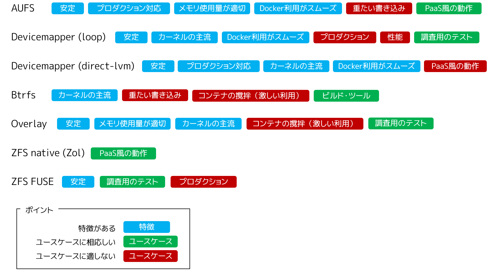

.. -*- coding: utf-8 -*-
.. URL: https://docs.docker.com/engine/userguide/storagedriver/selectadriver/
.. SOURCE: https://github.com/docker/docker/blob/master/docs/userguide/storagedriver/selectadriver.md
   doc version: 1.12
      https://github.com/docker/docker/commits/master/docs/userguide/storagedriver/selectadriver.md
.. check date: 2016/06/14
.. Commits on Jun 14, 2016 a546042b91f655c7cf53484cdb0c5c8b3cf12d33
.. ---------------------------------------------------------------------------

.. Select a storage driver

.. _select-a-storage-driver:

========================================
ストレージ・ドライバの選択
========================================

.. sidebar:: 目次

   .. contents:: 
       :depth: 3
       :local:

.. This page describes Docker’s storage driver feature. It lists the storage driver’s that Docker supports and the basic commands associated with managing them. Finally, this page provides guidance on choosing a storage driver.

このページは Docker のストレージ・ドライバ機能を説明します。Docker がサポートしているストレージ・ドライバの一覧と、ドライバ管理に関連する基本的なコマンドを扱います。ページの最後では、ストレージ・ドライバの選び方のガイドを提供します。

.. The material on this page is intended for readers who already have an understanding of the storage driver technology.

なお、このページは、既に :doc:`ストレージ・ドライバ技術を理解 <imagesandcontainers>` している読者を想定しています。

.. A pluggable storage driver architecture

.. _a-pluggable-storage-driver-architecture:

交換可能なストレージ・ドライバ構造
========================================

.. The Docker has a pluggable storage driver architecture. This gives you the flexibility to “plug in” the storage driver is best for your environment and use-case. Each Docker storage driver is based on a Linux filesystem or volume manager. Further, each storage driver is free to implement the management of image layers and the container layer in it’s own unique way. This means some storage drivers perform better than others in different circumstances.

Docker は接続可能な（pluggable）ストレージ・ドライバ構造を持っています。そのため、自分の環境や使い方に応じて、ベストなストレージ・ドライバを「プラグイン」（接続）として選べます。これが柔軟さをもたらします。Docker の各ストレージ・ドライバは、 Linux ファイルシステムやボリューム・マネージャの技術に基づいています。そのうえ、各ストレージ・ドライバはイメージ・レイヤとコンテナ・レイヤの管理を、各々の独自手法により自由に管理方法を実装できます。つまり、同じストレージ・ドライバであっても、異なった状況では性能が良くなるのを意味します。

.. Once you decide which driver is best, you set this driver on the Docker daemon at start time. As a result, the Docker daemon can only run one storage driver, and all containers created by that daemon instance use the same storage driver. The table below shows the supported storage driver technologies and their driver names:

どのドライバがベストかを決めたら、Docker デーモンの起動時にドライバを指定するだけです。Docker デーモンは対象のストレージ・ドライバを使って起動します。そして、デーモン・インスタンスによって作成される全てのコンテナは、全てその同じストレージ・ドライバを使っています。次の表はサポートされているストレージ・ドライバ技術とドライバ名です。

.. Technology 	Storage driver name
   SFS 	overlay
   AUFS 	aufs
   Btrfs 	btrfs
   Device Mapper 	devicemapper
   VFS* 	vfs
   ZFS 	zfs

.. list-table::
   :header-rows: 1
   
   * - 技術
     - ストレージ・ドライバ名
   * - OverlayFS
     - ``overlay`` または ``overlay2``
   * - AUFS
     - ``aufs``
   * - Btrfs
     - ``btrfs``
   * - Device Mapper
     - ``devicemapper``
   * - VFS*
     - ``vfs``
   * - ZFS
     - ``zfs``

.. To find out which storage driver is set on the daemon , you use the docker info command:

デーモンで何のストレージ・ドライバが設定されているかを確認するには、 ``docker info`` コマンドを使います。

.. code-block:: bash

   $ docker info
   Containers: 0
   Images: 0
   Storage Driver: overlay
    Backing Filesystem: extfs
   Execution Driver: native-0.2
   Logging Driver: json-file
   Kernel Version: 3.19.0-15-generic
   Operating System: Ubuntu 15.04
   ... 以下の出力は省略...

.. The info subcommand reveals that the Docker daemon is using the overlay storage driver with a Backing Filesystem value of extfs. The extfs value means that the overlay storage driver is operating on top of an existing (ext) filesystem. The backing filesystem refers to the filesystem that was used to create the Docker host’s local storage area under /var/lib/docker.

``info`` サブコマンドで分かるのは、Docker デーモンが ``overlay`` ストレージ・ドライバを使い、``Backing Filesystem`` を ``extfs`` の値にしています。 ``extfs`` の値は、 ``overlay`` ストレージ・ドライバを、既存の（ext）ファイルシステム上で行うという意味があります。

.. Which storage driver you use, in part, depends on the backing filesystem you plan to use for your Docker host’s local storage area. Some storage drivers can operate on top of different backing filesystems. However, other storage drivers require the backing filesystem to be the same as the storage driver. For example, the btrfs storage driver on a Btrfs backing filesystem. The following table lists each storage driver and whether it must match the host’s backing file system:

自分がどのストレージ・ドライバを使うか選ぶにあたり、Docker ホストのローカル・ストレージ領域で使おうとするファイルシステムに一部依存します。いくつかのストレージ・ドライバは、異なったファイルシステム技術の上でも操作できます。しかしながら、特定のストレージ・ドライバは特定のファイルシステム技術を必要とします。例えば、 ``btrfs`` ストレージ・ドライバを使うには ``btrfs`` ファイルシステム技術を使う必要があります。以下の表は、各ストレージ・ドライバが、それぞれホスト上の何のファイルシステム技術をサポートしているかの一覧です。

.. list-table::
   :header-rows: 1
   
   * - ストレージ・ドライバ
     - 一般的に使うファイルシステム
     - 無効なファイルシステム
   * - ``overlay``
     - ``ext4`` ``xfs``
     - ``btrfs`` ``aufs`` ``overlay`` ``overlay2`` ``zfs`` ``eCryptsfs``
   * - ``overlay2``
     - ``ext4`` ``xfs``
     - ``btrfs`` ``aufs`` ``overlay`` ``overlay2`` ``zfs`` ``eCryptsfs``
   * - ``aufs``
     - ``ext4`` ``xfs``
     - ``btrfs`` ``aufs`` ``eCryptsfs``
   * - ``btrfs``
     - ``btrfs`` のみ
     - N/A
   * - ``devicemapper``
     - ``direct-lvm``
     - N/A
   * - ``vfs``
     - デバッグ用途のみ
     - N/A
   * - ``zfs``
     - ``zfs`` のみ
     - N/A

.. Note "Disabled on" means some storage drivers can not run over certain backing filesystem.

.. note::

    「無効な」という意味は、対象のストレージ・ドライバが特定のファイルシステム上で実行できないのを意味します。

.. You can set the storage driver by passing the --storage-driver=<name> option to the dockerd command line or by setting the option on the DOCKER_OPTS line in /etc/default/docker file.

ストレージ・ドライバを設定するには ``dockerd`` コマンドで ``--storage-driver=<名前>`` オプションを使うか、あるいは、 ``/etc/default/docker`` ファイル中の ``DOCKER_OPTS`` 行を編集します。

.. The following command shows how to start the Docker daemon with the devicemapper storage driver using the dockerd command:

以下のコマンドは Docker デーモンの起動時、 ``dockerd`` コマンドで ``devicemapper`` ストレージ・ドライバを指定しています。

.. code-block:: bash

   $ dockerd --storage-driver=devicemapper &
   
   $ docker info
   Containers: 0
   Images: 0
   Storage Driver: devicemapper
    Pool Name: docker-252:0-147544-pool
    Pool Blocksize: 65.54 kB
    Backing Filesystem: extfs
    Data file: /dev/loop0
    Metadata file: /dev/loop1
    Data Space Used: 1.821 GB
    Data Space Total: 107.4 GB
    Data Space Available: 3.174 GB
    Metadata Space Used: 1.479 MB
    Metadata Space Total: 2.147 GB
    Metadata Space Available: 2.146 GB
    Thin Pool Minimum Free Space: 10.74 GB
    Udev Sync Supported: true
    Deferred Removal Enabled: false
    Data loop file: /var/lib/docker/devicemapper/devicemapper/data
    Metadata loop file: /var/lib/docker/devicemapper/devicemapper/metadata
    Library Version: 1.02.90 (2014-09-01)
   Execution Driver: native-0.2
   Logging Driver: json-file
   Kernel Version: 3.19.0-15-generic
   Operating System: Ubuntu 15.04
   <出力を省略>

.. Your choice of storage driver can affect the performance of your containerized applications. So it’s important to understand the different storage driver options available and select the right one for your application. Later, in this page you’ll find some advice for choosing an appropriate driver.

ストレージ・ドライバの選択は、コンテナ化されたアプリケーションの性能に影響を与えます。そのために大切になるのは、どのようなストレージ・ドライバのオプションが利用可能かを理解し、アプリケーションに対する正しい選択をすることです。このページの後半では、適切なドライバを選ぶためのアドバイスを扱います。

.. Shared storage systems and the storage driver

.. _shared-storage-system-and-the-storage-driver:

共有ストレージ・システムとストレージ・ドライバ
==================================================

.. Many enterprises consume storage from shared storage systems such as SAN and NAS arrays. These often provide increased performance and availability, as well as advanced features such as thin provisioning, deduplication and compression.

多くの商用システムでは、SAN や NAS アレイのような共有ストレージ・システムをストレージ容量に使います。性能や安定性を向上させるためだけでなく、プロビジョニング・冗長化・圧縮など、高度な機能を提供します。

.. The Docker storage driver and data volumes can both operate on top of storage provided by shared storage systems. This allows Docker to leverage the increased performance and availability these systems provide. However, Docker does not integrate with these underlying systems.

Docker ストレージ・ドライバとデータ・ボリュームは、共有ストレージ・システムが提供するストレージ上でも操作可能です。そのため、これらの提供されるシステムによって、Docker の性能と可用性を増大できます。しかしながら、 Docker はこれら基盤システムとは統合できません。

.. Remember that each Docker storage driver is based on a Linux filesystem or volume manager. Be sure to follow existing best practices for operating your storage driver (filesystem or volume manager) on top of your shared storage system. For example, if using the ZFS storage driver on top of XYZ shared storage system, be sure to follow best practices for operating ZFS filesystems on top of XYZ shared storage system.

各ストレージ・ドライバは Linux ファイルシステムやボリューム・マネージャを基盤としているのを覚えておいてください。自分の共有ストレージ・システム上で、ストレージ・ドライバ（ファイルシステムやボリューム）を操作するベスト・プラクティスを理解してください。例えば、ZFS ストレージ・ドライバを XYZ 共有ストレージ・システム上で使うのであれば、XYZ 共有ストレージ・システム上の ZFS ファイルシステムの操作のベストプラクティスを理解すべきです。

.. Which storage driver should you choose?

望ましいストレージ・ドライバの選択
========================================

.. ※以下 v1.9 用ドキュメントのため、削除予定 @zembutsu
.. As you might expect, the answer to this question is “it depends”. While there are some clear cases where one particular storage driver outperforms other for certain workloads, you should factor all of the following into your decision:
.. 予想されているかもしれませんが、この疑問に対する答えは「その場合による」です。あるストレージ・ドライバの使用例が、特定の処理をする場合には優れていることもあります。決定にあたっては、以下の全ての要素を検討すべきでしょう。
.. Choose a storage driver that you and your team/organization are comfortable with. Consider how much experience you have with a particular storage driver. There is no substitute for experience and it is rarely a good idea to try something brand new in production. That’s what labs and laptops are for!
.. あなたやチーム/組織が満足するストレージ・ドライバを選択します。そのストレージ・ドライバを、どれだけ（これまでに）経験してきたかを検討してください。相応の経験が無いのであれば、まったく新しいプロダクション環境で挑むのは、良い考えとは滅多にも言えないでしょう。研究やノート PC 上の利用であれば、そうではありませんが。
.. If your Docker infrastructure is under support contracts, choose an option that will get you good support. You probably don’t want to go with a solution that your support partners have little or no experience with.
.. もしあなたの Docker インフラが何らかのサポート契約を受けているのであれば、より良いサポートを受けるという選択肢もあります。あるいは、サポート・パートナーの経験が無いまたは少なければ、ソリューションを必要としない場合もあるでしょう。
.. Whichever driver you choose, make sure it has strong community support and momentum. This is important because storage driver development in the Docker project relies on the community as much as the Docker staff to thrive.
.. どのドライバを選択したとしても、強いコミュニティのサポートと勢いがあるのを覚えておいてください。
.. ※ここまで削除予定

.. Several factors influence the selection of a storage driver. However, these two facts must be kept in mind:

ストレージ・ドライバの選択には、複数の要素が影響を与えます。しかしながら、２つの事実を覚え続けなくてはけません。

..    No single driver is well suited to every use-case
    Storage drivers are improving and evolving all of the time

1. 全てのユースケースに適用できるドライバは存在しない
2. ストレージ・ドライバは常に改良・進化し続けている

.. With these factors in mind, the following points, coupled with the table below, should provide some guidance.

これらの要素を頭に入れつつ、以下で扱うポイントと表が、検討にあたっての材料になるでしょう。

.. Stability

.. _stability:

安定性
----------

.. For the most stable and hassle-free Docker experience, you should consider the following:

Docker の利用にあたり、最も安定かつ手間がかからないという面では、以下の点が考えられます。

..    Use the default storage driver for your distribution. When Docker installs, it chooses a default storage driver based on the configuration of your system. Stability is an important factor influencing which storage driver is used by default. Straying from this default may increase your chances of encountering bugs and nuances.

* **ディストリビューションの標準ストレージ・ドライバを使います** 。Docker をインストールする時、システム上の設定に応じてデフォルトのストレージ・ドライバを選択します。デフォルトのストレージ・ドライバの使用は、安定性に対する重要な要素になります。デフォルトのものを使わなければ、バグや微妙な差違に遭遇する可能性が増えるかもしれません。

..    Follow the configuration specified on the CS Engine compatibility matrix. The CS Engine is the commercially supported version of the Docker Engine. It’s code-base is identical to the open source Engine, but it has a limited set of supported configurations. These supported configurations use the most stable and mature storage drivers. Straying from these configurations may also increase your chances of encountering bugs and nuances.

* **CS Engine 互換表の詳細内容をご確認ください** （ `互換表 <https://www.docker.com/compatibility-maintenance>`_ ）。CS Engine とは商用サポート版の Docker Engine です。コード基盤はオープンソース版の Docker Engine と同じですが、ある範囲における設定をサポートしてます。これら *サポートしている設定の範囲* では、最も安定かつ成熟したストレージ・ドライバを使います。これらの設定から外れれば、バグや微妙な差違に遭遇する可能性が増えるかもしれません。

.. Experience and expertise

.. _experience-and-expertise:

経験と専門知識
--------------------

.. Choose a storage driver that you and your team/organization have experience with. For example, if you use RHEL or one of its downstream forks, you may already have experience with LVM and Device Mapper. If so, you may wish to use the devicemapper driver.

ストレージ・ドライバの選択には、あなたと皆さんのチーム・組織で使ったことがあるものを選びます。例えば、RHEL や派生ディストリビューションを使っている場合は、既に LVM と Device Mapper の使用経験があるでしょう。その場合は、 ``devicemapper`` ドライバの使用が望ましいでしょう。

.. If you do not feel you have expertise with any of the storage drivers supported by Docker, and you want an easy-to-use stable Docker experience, you should consider using the default driver installed by your distribution’s Docker package.

Docker がサポートしているストレージ・ドライバの利用経験がないのであれば、どうしたら良いでしょうか。簡単に使える安定した Docker を使いたいのであれば、ディストリビューションが提供する Docker パッケージを使い、そこで使われているデフォルトのドライバの使用を検討すべきでしょう。

.. Future-proofing

.. _future-proofing:

将来性の考慮
--------------------

.. Many people consider OverlayFS as the future of the Docker storage driver. However, it is less mature, and potentially less stable than some of the more mature drivers such as aufs and devicemapper. For this reason, you should use the OverlayFS driver with caution and expect to encounter more bugs and nuances than if you were using a more mature driver.

多くの方が OverlayFS こそが Docker ストレージ・ドライバの未来だと考えています。ですが、まだ成熟しておらず、安定性に関しては ``aufs`` や ``devicemapper`` のような成熟したドライバより劣るかもしれません。そのため、OverlayFS を注意して使用すべきであり、成熟したドライバを使うよりも多くのバグや差違に遭遇することが予想されます。

.. The following diagram lists each storage driver and provides insight into some of their pros and cons. When selecting which storage driver to use, consider the guidance offered by the table below along with the points mentioned above.

以下の図はストレージ・ドライバの一覧にしたものです。それぞれの良い点・悪い点に関する洞察をもたらすでしょう。

.. Overlay vs Overlay2

.. _overlay-vs-overlay2:

.. OverlayFS has 2 storage drivers which both make use of the same OverlayFS technology but with different implementations and incompatible on disk storage. Since the storage is incompatible, switching between the two will require re-creating all image content. The overlay driver is the original implementation and the only option in Docker 1.11 and before. The overlay driver has known limitations with inode exhaustion and commit performance. The overlay2 driver addresses this limitation, but is only compatible with Linux kernel 4.0 and later. For users on a pre-4.0 kernel or with an existing overlay graph, it is recommended to stay on overlay. For users with at least a 4.0 kernel and no existing or required overlay graph data, then overlay2 may be used.

OverlayFS は２つのストレージ・ドライバがあります。どちらも同じ OverlayFS 技術を使っていますが、実装が異なり、ディスク・ストレージ上の互換性がありません。ストレージに互換性がないため、両者を切り替えるためには、全てのイメージ内容の再構築が必要です。 ``overlay`` ドライバはオリジナルの実装であり、Docker 1.11 より以前のバージョンでのみ指定可能です。 ``overlay`` ドライバにはｉノード増大とパフォーマンス維持に対する限界が分かっています。 ``overlay2`` ドライバはこの限界に対応するものですが、Linux カーネル 4.0 以降にのみ互換性があります。カーネル 4.0 よりも低いバージョンのユーザや、現在 ``overlay`` グラフを使っているのであれば、そのまま ``overlay`` の利用を推奨します。カーネル 4.0 以上のユーザや、既存の ``overlay`` グラフ・データが無いまたは不要であれば ``overlay2`` を使うのが良いかもしれません。

..    Note overlay2 graph data will not interfere with overlay graph data. However when switching to overlay2, the user is responsible for removing overlay graph data to avoid storage duplication.

.. note::

   ``overlay2`` グラフ・データは ``overlay`` グラフ・データに干渉しません。しかしながら ``overlay2`` に切り替える時は、ストレージの重複を避けるため ``overlay`` グラフ・データの削除が必要です。

.. Related information

関連情報
==========

..    Understand images, containers, and storage drivers
    AUFS storage driver in practice
    Btrfs storage driver in practice
    Device Mapper storage driver in practice

* :doc:`imagesandcontainers`
* :doc:`aufs-driver`
* :doc:`btrfs-driver`
* :doc:`device-mapper-driver`

.. seealso:: 

   Select a storage driver
      https://docs.docker.com/engine/userguide/storagedriver/selectadriver/
