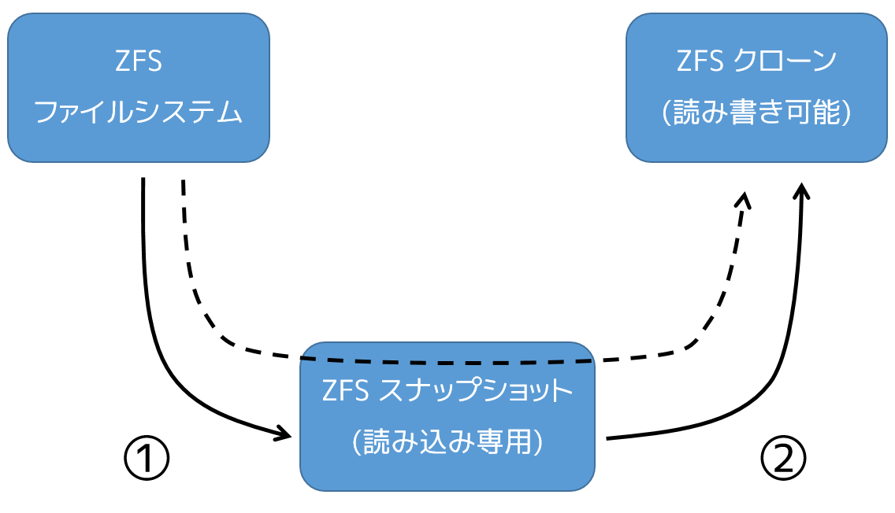

.. -*- coding: utf-8 -*-
.. URL: https://docs.docker.com/engine/userguide/storagedriver/zfs-driver/
.. SOURCE: https://github.com/docker/docker/blob/master/docs/userguide/storagedriver/zfs-driver.md
   doc version: 1.12
      https://github.com/docker/docker/commits/master/docs/userguide/storagedriver/zfs-driver.md
.. check date: 2016/06/14
.. Commits on Feb 29, 2016 30c2770a736e6c731f4046431f0f4275dadbd536
.. ---------------------------------------------------------------------------

.. Docker and ZFS in practice

.. _docker-and-zfs-in-practice:

========================================
ZFS ストレージの使用
========================================

.. sidebar:: 目次

   .. contents:: 
       :depth: 3
       :local:

.. ZFS is a next generation filesystem that supports many advanced storage technologies such as volume management, snapshots, checksumming, compression and deduplication, replication and more.

ZFS は次世代のファイルシステムです。ボリューム管理、スナップショット、チェックサム処理、圧縮、重複除外（deduplication）、レプリケーションなどの高度なストレージ技術をサポートしています。

.. It was created by Sun Microsystems (now Oracle Corporation) and is open sourced under the CDDL license. Due to licensing incompatibilities between the CDDL and GPL, ZFS cannot be shipped as part of the mainline Linux kernel. However, the ZFS On Linux (ZoL) project provides an out-of-tree kernel module and userspace tools which can be installed separately.

ZFS はサン・マイクロシステムズ（現オラクル・コーポレーション）によって開発され、CDDL ライセンスの下でオープンソース化されています。CDDL と GPL 間でライセンスの互換性がないため、ZFS は Linux カーネル・モジュールのメインラインに取り込まれません。しかし、ZFS On Linux （ZoL）プロジェクトにより、外部のカーネル・モジュールとユーザ用のツールを別々にインストールできるように提供されています。

.. The ZFS on Linux (ZoL) port is healthy and maturing. However, at this point in time it is not recommended to use the zfs Docker storage driver for production use unless you have substantial experience with ZFS on Linux.

ZFS on Linux (ZoL) への移植は正常かつ成熟しています。しかし ZFS on Linux に対する十分な経験がないのであれば、現時点では ``zfs`` Docker ストレージ・ドライバをプロダクションで使うことを推奨しません。

..    Note: There is also a FUSE implementation of ZFS on the Linux platform. This should work with Docker but is not recommended. The native ZFS driver (ZoL) is more tested, more performant, and is more widely used. The remainder of this document will relate to the native ZoL port.

.. note::

   Linux プラットフォーム上では、FUSE で ZFS を実装する方法もあります。Docker とも動作するでしょうが、推奨されません。ネイティブな ZFS ドライバ（ZoL）の方がよりテストされ、性能も良く、より幅広く使われています。このドキュメントでは、ネイティブな ZoL 移植版について言及してるのでご注意ください。

.. Image layering and sharing with ZFS

.. _image-layering-and-sharing-with-zfs:

ZFS でイメージのレイヤ化と共有
==============================

.. The Docker zfs storage driver makes extensive use of three ZFS datasets:

Docker ``zfs`` ストレージ・ドライバは、３種類の豊富な ZFS データセットを使えます。

..    filesystems
    snapshots
    clones

* ファイルシステム（filesystems）
* スナップショット（snapshots）
* クローン（clones）

.. ZFS filesystems are thinly provisioned and have space allocated to them from a ZFS pool (zpool) via allocate on demand operations. Snapshots and clones are space-efficient point-in-time copies of ZFS filesystems. Snapshots are read-only. Clones are read-write. Clones can only be created from snapshots. This simple relationship is shown in the diagram below.

ZFS ファイルシステムはシン・プロビジョニング（訳者注：データ書き込みの領域が、初期環境では薄く構築される）であり、ZFS プール（zpool）から要求処理があるごとに、領域を割り当てます。スナップショットとクローンは、その時々で ZFS ファイルシステムのコピーをするため、領域を効率的に使います。スナップショットは読み込み専用です。クローンは読み書きできます。クローンはスナップショットからのみ作成可能です。以下の図は、これらの関係性を簡単にしたものです。

.. The solid line in the diagram shows the process flow for creating a clone. Step 1 creates a snapshot of the filesystem, and step two creates the clone from the snapshot. The dashed line shows the relationship between the clone and the filesystem, via the snapshot. All three ZFS datasets draw space form the same underlying zpool.

図の実線はクローン作成手順の流れです。手順１はファイルシステムのスナップショットを作成します。手順２はスナップショットからクローンを作成します。図の点線はクローンとスナップショットの関係であり、スナップショットを経由しています。

.. On Docker hosts using the zfs storage driver, the base layer of an image is a ZFS filesystem. Each child layer is a ZFS clone based on a ZFS snapshot of the layer below it. A container is a ZFS clone based on a ZFS Snapshot of the top layer of the image it’s created from. All ZFS datasets draw their space from a common zpool. The diagram below shows how this is put together with a running container based on a two-layer image.

Docker ホストで ``zfs`` ストレージ・ドライバを使えば、イメージのベース・レイヤは ZFS ファイルシステムになります。それぞれの子レイヤとは、下にあるレイヤの ZFS スナップショットをベースとした ZFS クローンです。コンテナとは、作成するにあたってイメージの最上位レイヤの ZFS スナップショットをベースとした ZFS クローンです。全ての ZFS データセットは、共通の zpool から領域を取り込みます。以下の図は２つのレイヤ・イメージをベースにまとめたもので、コンテナを実行しています。

.. image:: ./images/zfs-pool.png
   :scale: 60%
   :alt: ZFS pool

.. The following process explains how images are layered and containers created. The process is based on the diagram above.

以下で説明する手順は、どのようにイメージをレイヤ化し、コンテナを作成するかです。手順は先ほどの図を元にしています。

..    The base layer of the image exists on the Docker host as a ZFS filesystem.

1. イメージのベース・レイヤは Docker ホスト上に ZFS ファイルシステムとして存在しています。

..    This filesystem consumes space from the zpool used to create the Docker host’s local storage area at /var/lib/docker.

ファイルシステムが要領を使うのは、Docker ホスト上のローカル・ストレージ領域 ``/var/lib/docker`` に zpool を作成する時です。。

..    Additional image layers are clones of the dataset hosting the image layer directly below it.

2. 追加のイメージ・レイヤは、直下にあるイメージ・レイヤが保存されているデータセットのクローンにあたります。

..    In the diagram, “Layer 1” is added by making a ZFS snapshot of the base layer and then creating a clone from that snapshot. The clone is writable and consumes space on-demand from the zpool. The snapshot is read-only, maintaining the base layer as an immutable object.

図において、「レイヤ１」にはベース・レイヤの ZFS スナップショットによって追加されたものです。そして、スナップショットからクローンを作成します。クローンは書き込み可能であり、必要があれば zpool の容量を使います。スナップショットは読み込み専用であり、ベース・レイヤが変更できない（イミュータブルな）ものとして管理されます。

..    When the container is launched, a read-write layer is added above the image.

3. コンテナが起動したら、そのイメージ上に読み書き可能なレイヤが追加されます。

..    In the diagram above, the container’s read-write layer is created by making a snapshot of the top layer of the image (Layer 1) and creating a clone from that snapshot.

先ほどの図では、コンテナの読み書きレイヤは、イメージ（レイヤ１）の最上位レイヤのスナップショットの上に作成されます。そして、スナップショットからクローンが作成されます。

..    As changes are made to the container, space is allocated to it from the zpool via allocate-on-demand operations. By default, ZFS will allocate space in blocks of 128K.

コンテナに対して変更が発生したら、オンデマンドの割り当て（allocate-on-demand）処理によって zpool から領域が割り当てられます。デフォルトでは、ZFS が割り当てる領域は 128KB のブロックです。

.. This process of creating child layers and containers from read-only snapshots allows images to be maintained as immutable objects.

子レイヤの作成と、読み込み専用のスナップショットからコンテナを作成する手順において、イメージを不変な（イミュータブルな）オブジェクトとして扱えます。

.. Container reads and writes with ZFS

.. _container-reads-and-writes-with-zfs:

コンテナを ZFS で読み書き
==============================

.. Container reads with the zfs storage driver are very simple. A newly launched container is based on a ZFS clone. This clone initially shares all of its data with the dataset it was created from. This means that read operations with the zfs storage driver are fast -- even if the data being read was copied into the container yet. This sharing of data blocks is shown in the diagram below.

コンテナが ``zfs`` ストレージ・ドライバから読み込むのは、非常にシンプルです。直近で起動したコンテナは、ZFS クローンを元にしています。このクローンは作成時、まず全てのデータセットを共有します。つまり、 ``zfs`` ストレージ・ドライバの読み込み処理が高速なことを意味します。これは、読み込み対象のデータがコンテナ内にコピーされていなくてもです。データブロックの共有は、次のような図になります。

.. image:: ./images/zpool-blocks.png
   :scale: 60%
   :alt: ZFS zpool ブロック

.. Writing new data to a container is accomplished via an allocate-on-demand operation. Every time a new area of the container needs writing to, a new block is allocated from the zpool. This means that containers consume additional space as new data is written to them. New space is allocated to the container (ZFS Clone) from the underlying zpool.

コンテナに対する新規データの書き込みは、オンデマンドの割り当て処理によって完了します。コンテナが書き込みのために新しい領域が必要であれば、その都度、新しいブロックが zpool から割り当てられます。つまりコンテナに対する書き込みによって、新しいデータ用の領域が追加される時のみ、容量を消費します。新しい領域は、根底にある zpool からコンテナ（ZFS クローン）に対して割り当てられるものです。

.. Updating existing data in a container is accomplished by allocating new blocks to the containers clone and storing the changed data in those new blocks. The original are unchanged, allowing the underlying image dataset to remain immutable. This is the same as writing to a normal ZFS filesystem and is an implementation of copy-on-write semantics.

コンテナ内に *存在するデータ* に対する更新は、コンテナのクローンに新しいブロックを割り当て、変更したデータを新しいブロックに保管したら、処理が完了となります。オリジナルのデータに対する変更は行われません。元になったイメージのデータセットは、変わらない（イミュータブルな）ままです。つまり、通常の ZFS ファイルシステムに対する書き込みと同じであり、そこにコピー・オンライトの仕組みが実装されています。

.. Configure Docker with the ZFS storage driver

.. _configure-docker-with-the-zfs-storage-driver:

Docker で ZFS ストレージ・ドライバを使う設定
==================================================

.. The zfs storage driver is only supported on a Docker host where /var/lib/docker is mounted as a ZFS filesystem. This section shows you how to install and configure native ZFS on Linux (ZoL) on an Ubuntu 14.04 system.

``zfs`` ストレージ・ドライバがサポートされるのは、Docker ホスト上で ``/var/lib/docker`` が ZFS ファイルシステムでマウントされている場合のみです。このセクションでは、Ubuntu 14.04 システム上に、ネイティブな ZFS on Linux (ZoL) のインストールと設定方法を紹介します。

.. Prerequisites

動作条件
----------

.. If you have already used the Docker daemon on your Docker host and have images you want to keep, push them Docker Hub or your private Docker Trusted Registry before attempting this procedure.

既に Docker ホスト上で Docker デーモンを使っている場合は、イメージをどこかに保存する必要があります。そのため、処理を進める前に、それらのイメージを Docker Hub やプライベート Docker Trusted Registry に送信しておきます。

.. Stop the Docker daemon. Then, ensure that you have a spare block device at /dev/xvdb. The device identifier may be be different in your environment and you should substitute your own values throughout the procedure.

まず、Docker デーモンを停止します。それから別のブロックデバイス ``/dev/xvdb`` があることを確認します。このデバイス識別子は皆さんの環境によって異なるかもしれません。そのような場合は、以降の処理で適切なものに置き換えてください。

.. Install Zfs on Ubuntu 14.04 LTS

Ubuntu 14.04 LTS に Zfs をインストール
----------------------------------------

..    If it is running, stop the Docker daemon.

1. Docker ``daemon`` を実行中であれば、停止します。

..    Install the software-properties-common package.

2. ``software-properties-common`` パッケージをインストールします。

この時 ``apt-get-repository``  コマンドが必要です。

..    This is required for the add-apt-repository command.

.. code-block:: bash

   $ sudo apt-get install -y software-properties-common
   Reading package lists... Done
   Building dependency tree
   <出力を省略>

..    Add the zfs-native package archive.

3. ``zfs-native`` パッケージ・アーカイブを追加します。

.. code-block:: bash

   $ sudo add-apt-repository ppa:zfs-native/stable
    The native ZFS filesystem for Linux. Install the ubuntu-zfs package.
   <出力を省略>
   gpg: key F6B0FC61: public key "Launchpad PPA for Native ZFS for Linux" imported
   gpg: Total number processed: 1
   gpg:               imported: 1  (RSA: 1)
   OK

..    Get the latest package lists for all registered repositories and package archives.

4. 全ての登録リポジトリとパッケージ・アーカイブから、最新のパッケージ一覧を取得します。

.. code-block:: bash

   $ sudo apt-get update
   Ign http://us-west-2.ec2.archive.ubuntu.com trusty InRelease
   Get:1 http://us-west-2.ec2.archive.ubuntu.com trusty-updates InRelease [64.4 kB]
   <output truncated>
   Fetched 10.3 MB in 4s (2,370 kB/s)
   Reading package lists... Done

..    Install the ubuntu-zfs package.

5. ``ubuntu-zfs`` パッケージをインストールします。

.. code-block:: bash

   $ sudo apt-get install -y ubuntu-zfs
   Reading package lists... Done
   Building dependency tree
   <出力を省略>

..    Load the zfs module.

6. ``zfs`` モジュールを読み込みます。

.. code-block:: bash

   $ sudo modprobe zfs

..    Verify that it loaded correctly.

7. 正常に読み込まれていることを確認します。

.. code-block:: bash

   $ lsmod | grep zfs
   zfs                  2768247  0
   zunicode              331170  1 zfs
   zcommon                55411  1 zfs
   znvpair                89086  2 zfs,zcommon
   spl                    96378  3 zfs,zcommon,znvpair
   zavl                   15236  1 zfs

.. Configure ZFS for Docker

.. _configure-zfs-for-docker:

ZFS を Docker に設定
==============================

.. Once ZFS is installed and loaded, you’re ready to configure ZFS for Docker.

ZFS をインストールして読み込んだので、Docker で ZFS 設定をする準備が整いました。

..    Create a new zpool.

1. 新しい ``zpool`` を作成します。

.. code-block:: bash

   $ sudo zpool create -f zpool-docker /dev/xvdb

..    The command creates the zpool and gives it the name “zpool-docker”. The name is arbitrary.

このコマンドは ``zpool`` を作成し、そこに「zpool-docker」という名前を割り当てています。この名前は任意です。

..    Check that the zpool exists.

2. ``zpool`` が存在しているかどうか確認します。

.. code-block:: bash

   $ sudo zfs list
   NAME            USED  AVAIL    REFER  MOUNTPOINT
   zpool-docker    55K   3.84G    19K    /zpool-docker

..    Create and mount a new ZFS filesystem to /var/lib/docker.

3. ``/var/lib/docker`` に新しい ZFS ファイルシステムを作成・マウントします。

.. code-block:: bash

   $ sudo zfs create -o mountpoint=/var/lib/docker zpool-docker/docker

..    Check that the previous step worked.

4. 直前の手順が正常に行われたか確認します。

.. code-block:: bash

   $ sudo zfs list -t all
   NAME                 USED  AVAIL  REFER  MOUNTPOINT
   zpool-docker         93.5K  3.84G    19K  /zpool-docker
   zpool-docker/docker  19K    3.84G    19K  /var/lib/docker

..    Now that you have a ZFS filesystem mounted to /var/lib/docker, the daemon should automatically load with the zfs storage driver.

これで ZFS ファイルシステムを ``/var/lib/docker`` にマウントしました。デーモンは自動的に ``zfs`` ストレージを読み込むでしょう。

..    Start the Docker daemon.

5. Docker デーモンを起動します。

.. code-block:: bash

    $ sudo service docker start
    docker start/running, process 2315

..    The procedure for starting the Docker daemon may differ depending on the Linux distribution you are using. It is possible to force the Docker daemon to start with the zfs storage driver by passing the --storage-driver=zfs flag to the docker daemon command, or to the DOCKER_OPTS line in the Docker config file.

使用している Linux ディストリビューションによっては、この Docker デーモンの開始手順は少し異なる場合があります。Docker デーモンに対して ``zfs`` ストレージ・ドライバの利用を明示する場合は、 ``docker daemon`` コマンドで ``--storage-driver=zfs`` フラグを使うか、Docker 設定ファイル中の ``DOCKER_OPTS`` 行を編集します。

..    Verify that the daemon is using the zfs storage driver.

6. デーモンが ``zfs`` ストレージ・ドライバを使っているのを確認します。

.. code-block:: bash

   $ sudo docker info
   Containers: 0
   Images: 0
   Storage Driver: zfs
    Zpool: zpool-docker
    Zpool Health: ONLINE
    Parent Dataset: zpool-docker/docker
    Space Used By Parent: 27648
    Space Available: 4128139776
    Parent Quota: no
    Compression: off
   Execution Driver: native-0.2
   [...]

..    The output of the command above shows that the Docker daemon is using the zfs storage driver and that the parent dataset is the zpool-docker/docker filesystem created earlier.

先ほどの出力は、Docker デーモンが ``zfs`` ストレージ・ドライバを使っており、親データセットは先ほど作成した ``zpool-docker/docker``  ファイルシステムだと分かります。

.. Your Docker host is now using ZFS to store to manage its images and containers.

これで Docker ホストは、イメージとコンテナの管理・保管に ZFS を使います。

.. ZFS and Docker performance

.. _zfs-and-docker-performance:

ZFS と Docker 性能
====================

.. There are several factors that influence the performance of Docker using the zfs storage driver.

Docker で ``zfs`` ストレージ・ドライバを使うにあたり、パフォーマンスに影響を与えるいくつかの要素があります。

..    Memory. Memory has a major impact on ZFS performance. This goes back to the fact that ZFS was originally designed for use on big Sun Solaris servers with large amounts of memory. Keep this in mind when sizing your Docker hosts.

* **メモリ** 。ZFS の性能に、メモリはとても大きな影響があります。そもそもの事実として、本来の ZFS は、大きな Sun Solaris サーバ上で大容量のメモリを使うよう設計されていました。Docker ホストのサイジング時には、この点を忘れないでください。

..    ZFS Features. Using ZFS features, such as deduplication, can significantly increase the amount of memory ZFS uses. For memory consumption and performance reasons it is recommended to turn off ZFS deduplication. However, deduplication at other layers in the stack (such as SAN or NAS arrays) can still be used as these do not impact ZFS memory usage and performance. If using SAN, NAS or other hardware RAID technologies you should continue to follow existing best practices for using them with ZFS.

* **ZFS の機能** 。ZFS の機能、例えば重複削除（deduplication）は ZFS が使うメモリ容量が明らかに増加します。メモリの消費と性能面から、ZFS 重複削除の機能を無効にすることを推奨します。しかし、別のスタック上（SAN や NAS アレイ）のレイヤに対する重複削除は、ZFS のメモリ使用や性能に関する影響がありませんので、利用できるでしょう。もし SAN、NAS、その他のハードウェア RAID 技術を使うのであれば、ZFS の利用にあたり、以下にある既知のベストプラクティスをご利用ください。

..    ZFS Caching. ZFS caches disk blocks in a memory structure called the adaptive replacement cache (ARC). The Single Copy ARC feature of ZFS allows a single cached copy of a block to be shared by multiple clones of a filesystem. This means that multiple running containers can share a single copy of cached block. This means that ZFS is a good option for PaaS and other high density use cases.

* **ZFS キャッシュ** 。ZFS はディスク・ブロックを、アダプティブ・リプレースメント・キャッシュ（ARC; adaptive replacement cache）と呼ばれるメモリ上の構造にキャッシュします。ZFS の *Single Copy ARC* 機能により、ブロックをコピーした単一キャッシュが、ファイルシステムの複数のクローンから共有されます。つまり、複数の実行中のコンテナは、キャッシュされたブロックのコピーを共有できるのです。これが意味するのは、ZFS は PaaS や他の高密度の利用例にとっては良い選択肢となるでしょう。

..    Fragmentation. Fragmentation is a natural byproduct of copy-on-write filesystems like ZFS. However, ZFS writes in 128K blocks and allocates slabs (multiple 128K blocks) to CoW operations in an attempt to reduce fragmentation. The ZFS intent log (ZIL) and the coalescing of writes (delayed writes) also help to reduce fragmentation.

* **断片化** 。断片化は ZFS のようなコピー・オン・ライトなファイルシステムにおける、自然な副産物です。ZFS は 128KB のブロックに書き込みますが、slabs（複数の 128KB ブロック）をコピー・オン・ライト処理に割り当てますので、断片化を減らそうとしています。また、 ZFS intent log (ZIL) と書き込みの一体化も断片化を減らすものです。

..    Use the native ZFS driver for Linux. Although the Docker zfs storage driver supports the ZFS FUSE implementation, it is not recommended when high performance is required. The native ZFS on Linux driver tends to perform better than the FUSE implementation.

* **ネイティブな Linux 用 ZFS ドライバの使用** 。Docker ``zfs`` ストレージ・ドライバは ZFS FUSE 実装をサポートしているとはいえ、高い性能が必要な場合は推奨されません。ネイティブな Linux 用 ZFS ドライバは、FUSE 実装よりも良い性能でしょう。

.. The following generic performance best practices also apply to ZFS.

以下の一般的な性能に関するベストプラクティスは、ZFS でも適用できます。

..    Use of SSD. For best performance it is always a good idea to use fast storage media such as solid state devices (SSD). However, if you only have a limited amount of SSD storage available it is recommended to place the ZIL on SSD.

* **SSD** 。ベストな性能のために、SSD（ソリッド・ステート・デバイス）のような高速なストレージ・メディアを使うのは常に良い考えです。十分に利用可能な SSD ストレージ容量があるのなら、ZIL を SSD 上に置くことを推奨します。

..    Use Data Volumes. Data volumes provide the best and most predictable performance. This is because they bypass the storage driver and do not incur any of the potential overheads introduced by thin provisioning and copy-on-write. For this reason, you should place heavy write workloads on data volumes.

* **データ・ボリュームの使用** 。データ・ボリュームは最上かつ最も予測可能な性能を提供します。これは、ストレージ・ドライバを迂回し、シン・プロビジョニングやコピー・オン・ライト処理を行わないためです。そのため、データ・ボリューム上で重たい書き込みを場合に使うべきでしょう。

.. seealso:: 

   Docker and ZFS in practice
      https://docs.docker.com/engine/userguide/storagedriver/zfs-driver/