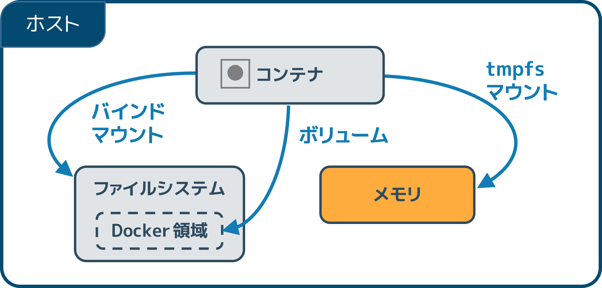

.. -*- coding: utf-8 -*-
.. URL: https://docs.docker.com/storage/tmpfs/
.. SOURCE: https://github.com/docker/docker.github.io/blob/master/storage/tmpfs.md
   doc version: 20.10
.. check date: 2022/05/02
.. Commits on Aug 7, 2021 4afcaf3b2d8656e3fed75ca9fda445a02efcfc04
.. ---------------------------------------------------------------------------

.. Use tmpfs mounts
.. _use-tmpfs-mounts:

==================================================
tmpfs マウントの使用
==================================================

.. sidebar:: 目次

   .. contents:: 
       :depth: 3
       :local:

.. Volumes and bind mounts let you share files between the host machine and container so that you can persist data even after the container is stopped.
:doc:`ボリューム <volumes>` と :doc:`バインド マウント <bind-mounts>` はホストマシンとコンテナ間でファイルを共有できるようにするため、コンテナを停止した後もデータを保持できます。

.. If you’re running Docker on Linux, you have a third option: tmpfs mounts. When you create a container with a tmpfs mount, the container can create files outside the container’s writable layer.

Linux 上で Docker を動かしている場合は、3つめのオプション ``tmpfs`` マウントがあります。 ``tmpfs`` マウントを使ってコンテナを起動すると、コンテナの書き込み可能なレイヤーの外で、コンテナはファイルを作成できます。

.. As opposed to volumes and bind mounts, a tmpfs mount is temporary, and only persisted in the host memory. When the container stops, the tmpfs mount is removed, and files written there won’t be persisted.

ボリュームやバインドマウントとは違い、 ``tmpfs`` マウントは一時的なもので、ホストメモリ上にのみ保持します。コンテナを停止すると、 ``tmpfs`` マウントは削除され、また、書き込まれたデータは保持されません。

.. This is useful to temporarily store sensitive files that you don’t want to persist in either the host or the container writable layer.

ホスト上やコンテナの書き込み可能なレイヤーのどちらにも保持したくない、機微ファイルの一時的な保存に便利です。

.. Limitations of tmpfs mounts
.. _limitations-of-tmpfs-mounts:
tmpfs マウントの制限
====================

..  nlike volumes and bind mounts, you can’t share tmpfs mounts between containers.
    This functionality is only available if you’re running Docker on Linux.

* ボリュームやバインド マウントとは異なり、コンテナ間で ``tmpfs`` マウントを共有できません。
* この機能は、 Linux 上で Docker を実行している場合のみ利用できます。

.. Choose the --tmpfs or --mount flag
.. _tmpfs-choose-the-tmpfs-or-mount-flag:
--tmpfs か --mount フラグの選択
========================================

.. In general, --mount is more explicit and verbose. The biggest difference is that the --tmpfs flag does not support any configurable options.

一般的に、 ``--mount`` は明示的で冗長です。最も大きな違いは、 ``--tmpfs`` は設定用オプションのフラグをサポートしていません。

..    --tmpfs: Mounts a tmpfs mount without allowing you to specify any configurable options, and can only be used with standalone containers.

* ``--tmpfs`` ： ``tmpfs`` マウントのマウントは、設定用オプションの指定ができません。また、スタンドアロン コンテナにのみ利用できます。

..    --mount: Consists of multiple key-value pairs, separated by commas and each consisting of a <key>=<value> tuple. The --mount syntax is more verbose than --tmpfs:
        The type of the mount, which can be bind, volume, or tmpfs. This topic discusses tmpfs, so the type is always tmpfs.
        The destination takes as its value the path where the tmpfs mount is mounted in the container. May be specified as destination, dst, or target.
        The tmpfs-size and tmpfs-mode options. See tmpfs options.

* ``--mounts`` ：複数のキーバリューのペアで構成され、各 ``<key>=<value>`` の組み合わせは、カンマで区切ります。 ``--mount`` 構文は ``--tmpfs`` よりも冗長です。

  * マウント ``type`` （型）は ``bind`` 、 ``volume`` 、 ``tmpfs`` です。このトピックでは ``tmpfs`` を扱うため、マウント型は常に ``tmpfs`` です。
  * ``destination`` の値は、 ``tmpfs`` がコンテナ内のどこにマウントするかのパスを指定します。指定は ``destination`` 、 ``dst`` 、 ``target`` のいずれかです。
  * ``tmpfs-size`` と ``tmpfs-mode`` オプションがあります。 :ref:`tmpfs オプション <specify-tmpfs-options>` をご覧ください。

.. The examples below show both the --mount and --tmpfs syntax where possible, and --mount is presented first.

以下の例では ``--mount`` と ``--tmpfs`` 構文の両方が出てきますが、利用可能な場合は ``--mount`` が始めに出ます。

.. Differences between --tmpfs and --mount behavior
.. _difference-between-tmpfs-and-mount-behavior:
``--tmpfs`` と ``--mount`` との挙動の違い
==================================================

..  The --tmpfs flag does not allow you to specify any configurable options.
    The --tmpfs flag cannot be used with swarm services. You must use --mount.

* ``--tmpfs`` フラグには、設定可能なオプションはありません。
* ``--tmpfs`` フラグは swarm サービスに使えません。 その場合は ``--mount`` を使います。

.. Use a tmpfs mount in a container
.. _use-a-tempfs-mount-in-a-container:
tmpfs マウントをコンテナで使用
========================================

.. To use a tmpfs mount in a container, use the --tmpfs flag, or use the --mount flag with type=tmpfs and destination options. There is no source for tmpfs mounts. The following example creates a tmpfs mount at /app in a Nginx container. The first example uses the --mount flag and the second uses the --tmpfs flag.

コンテナで ``tmpfs`` マウントを使うには、 ``--tmpfs`` フラグを使うか、 ``--mount`` フラグで ``type=tmpfs`` と ``destinaiton`` オプションを使います。 ``tmpfs`` マウントには ``source`` がありません。以下の例は Nginx コンテナ内の ``/app`` に ``tmpfs`` マウントを作成します。1つめの例は ``--mount`` フラグを使い、2つめは ``--tmpfs`` フラグを使います。

* ``--mount``

  .. code-block:: bash

     $ docker run -d \
       -it \
       --name tmptest \
       --mount type=tmpfs,destination=/app \
       nginx:latest

* ``--tmpfs``

  .. code-block:: bash

     $ docker run -d \
       -it \
       --name tmptest \
       --tmpfs /app \
       nginx:latest

.. Verify that the mount is a tmpfs mount by running docker container inspect tmptest and looking for the Mounts section:

``tmpfs`` マウントを確認するには、 ``docker container inspect tmptest`` を実行し、 ``Mounts`` セクションをさがします。

.. code-block:: json

   "Tmpfs": {
       "/app": ""
   },

.. Remove the container:

コンテナを削除します。

.. code-block:: bash

   $ docker container stop tmptest
   
   $ docker container rm tmptest

.. Specify tmpfs options
.. _specify-tmpfs-options:
tmpfs オプションの指定
==============================

.. tmpfs mounts allow for two configuration options, neither of which is required. If you need to specify these options, you must use the --mount flag, as the --tmpfs flag does not support them.

``--tmpfs`` マウントは2つの設定可能なオプションがあり、どちらも必須ではありません。それぞれのオプションを指定する必要があれば、 ``--mount`` フラグを使う必要があります。 ``--tmpfs`` フラグはオプション指定をサポートしていません。

.. Option 	Description
   tmpfs-size 	Size of the tmpfs mount in bytes. Unlimited by default.
   tmpfs-mode 	File mode of the tmpfs in octal. For instance, 700 or 0770. Defaults to 1777 or world-writable.

.. list-table::
   :header-rows: 1

   * - オプション
     - 説明
   * - ``tmpfs-size``
     - tmpfs マウントの容量をバイトで指定。デフォルトは無制限
   * - ``tmpfs-mode``
     - tmpfs のファイルモードを8進数で指定。たとえば、 ``700`` や ``0700`` です。デフォルトは ``1777`` であり、だれでも書き込みできます。

.. The following example sets the tmpfs-mode to 1770, so that it is not world-readable within the container.

以下の例は ``tmpfs-mode`` を ``1770`` に設定しますので、コンテナ内では誰でも読み込みできません（world-readable ではありません）。

.. code-block:: bash

   $ docker run -d \
     -it \
     --name tmptest \
     --mount type=tmpfs,destination=/app,tmpfs-mode=1770 \
     nginx:latest

.. Next steps
次のステップ
====================

* :doc:`ボリューム <volumes>` について学ぶ
* :doc:`バインド マウント <bind-mounts>` について学ぶ
* :doc:`ストレージ ドライバ <storagedriver/index>`  について学ぶ

.. seealso:: 

   Use tmpfs mounts
      https://docs.docker.com/storage/tmpfs/