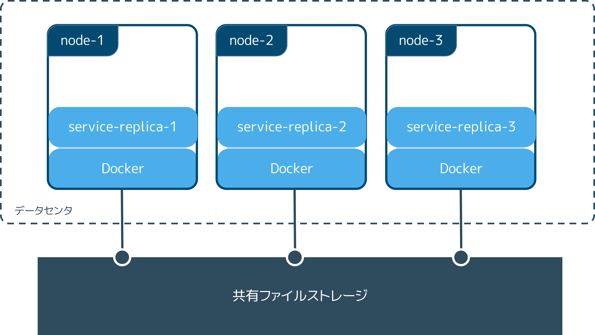

.. -*- coding: utf-8 -*-
.. URL: https://docs.docker.com/storage/volumes/
.. SOURCE: https://github.com/docker/docker.github.io/blob/master/storage/volumes.md
   doc version: 20.10
.. check date: 2022/04/30
.. Commits on Dec 23, 2021 eaab1382be2dd42578a02a66801b36b08e51db9f
.. ---------------------------------------------------------------------------

.. Use volumes
.. _use-volumes:

==================================================
ボリュームの使用
==================================================

.. sidebar:: 目次

   .. contents:: 
       :depth: 3
       :local:

.. Volumes are the preferred mechanism for persisting data generated by and used by Docker containers. While bind mounts are dependent on the directory structure and OS of the host machine, volumes are completely managed by Docker. Volumes have several advantages over bind mounts:

Docker コンテナによって作成され、かつ、使われるデータを保持するために、ボリュームは適した仕組みです。 :doc:`バインド マウント <bind-mounts>` はホストマシン上のディレクトリ構造と OS に依存しますが、ボリュームは Docker によって完全に管理されます。バインド マウントと比べ、ボリュームには複数の利点があります。

..  Volumes are easier to back up or migrate than bind mounts.
    You can manage volumes using Docker CLI commands or the Docker API.
    Volumes work on both Linux and Windows containers.
    Volumes can be more safely shared among multiple containers.
    Volume drivers let you store volumes on remote hosts or cloud providers, to encrypt the contents of volumes, or to add other functionality.
    New volumes can have their content pre-populated by a container.
    Volumes on Docker Desktop have much higher performance than bind mounts from Mac and Windows hosts.

* ボリュームはバインド マウントに比べ、バックアップや :ruby:`移動 <migrate>` が簡単
* Docker CLI コマンドや Docker API を使ってボリュームを管理可能
* ボリュームは Linux と Windows コンテナの両方で動作
* ボリュームは複数のコンテナ間で、より安全に共有可能
* ボリューム ドライバによって、リモートホストやクラウドプロバイダに保管でき、ボリューム内容の暗号化や、他の機能性も追加可能
* 新しいボリュームは、コンテナによって内容を事前に入力可能
* Docker Desktop 上のボリュームは、Mac と Windows ホストからのバインド マウントに比べ、より高い性能

.. In addition, volumes are often a better choice than persisting data in a container’s writable layer, because a volume does not increase the size of the containers using it, and the volume’s contents exist outside the lifecycle of a given container.

加えて、コンテナの書き込み可能なレイヤーにデータを保持するためには、ボリュームがより良い選択です。これは、ボリュームによってコンテナが使用する容量が増えませんし、対象となるコンテナのライフサイクル外でボリュームの内容が存在し続けます。

.. image:: ./images/todo-list-sample.png
   :width: 60%
   :alt: Docker ホスト上のボリューム

.. If your container generates non-persistent state data, consider using a tmpfs mount to avoid storing the data anywhere permanently, and to increase the container’s performance by avoiding writing into the container’s writable layer.

もしもコンテナが保持する必要がない状態のデータを生成する場合は、 :doc:`tmpfs マウント <tmpfs>` の使用を検討ください。それにより、データがどこかに保持される続けるのを防止し、さらに、コンテナの書き込み可能なレイヤーへの書き込みを避けるため、コンテナのパフォーマンスを向上します。

.. Volumes use rprivate bind propagation, and bind propagation is not configurable for volumes.

ボリュームは ``rprivate`` :ruby:`バインド プロパゲーション <bind propagation>` を使いますが、バインド プロパゲーションはボリューム用に設定できません。

.. Choose the -v or --mount flag
.. _choose-the-v-or-mount-flag:
-v と --mount フラグの選択
==============================

.. In general, --mount is more explicit and verbose. The biggest difference is that the -v syntax combines all the options together in one field, while the --mount syntax separates them. Here is a comparison of the syntax for each flag.

一般的に、 ``--mount`` は説明的かつ冗長です。最大の違いは、 ``-v`` 構文は１つのフィールドに全てのオプションをつなげるのに対し、 ``--mount`` 構文はそれらを分けます。以下は各フラグの比較です。

.. If you need to specify volume driver options, you must use --mount.

ボリューム ドライバのオプションの指定が必要であれば、 ``--mount`` を使う必要があります。

..    -v or --volume: Consists of three fields, separated by colon characters (:). The fields must be in the correct order, and the meaning of each field is not immediately obvious.
        In the case of named volumes, the first field is the name of the volume, and is unique on a given host machine. For anonymous volumes, the first field is omitted.
        The second field is the path where the file or directory are mounted in the container.
        The third field is optional, and is a comma-separated list of options, such as ro. These options are discussed below.

* ``-v`` か ``--volume`` ：コロン記号（ ``:`` ）で区切られた、３つのフィールドで構成。フィールドは正しい順番で記述する必要があり、それぞれのフィールドの意味は直ちに分からない

  * 名前付きボリュームの場合、１つめのフィールドはボリューム名であり、ホストマシン上でユニークな必要がある。無名ボリュームでは、１つめのフィールドは省略する。
  * ２つめのフィールドは、コンテナ内にマウントされるファイルやディレクトリがどこにあるかのパス。
  * ３つめのフィールドはオプションで、 ``ro`` のようなオプションをカンマで区切ったリスト。これらオプションについては、後ほど扱う。

..    --mount: Consists of multiple key-value pairs, separated by commas and each consisting of a <key>=<value> tuple. The --mount syntax is more verbose than -v or --volume, but the order of the keys is not significant, and the value of the flag is easier to understand.
        The type of the mount, which can be bind, volume, or tmpfs. This topic discusses volumes, so the type is always volume.
        The source of the mount. For named volumes, this is the name of the volume. For anonymous volumes, this field is omitted. May be specified as source or src.
        The destination takes as its value the path where the file or directory is mounted in the container. May be specified as destination, dst, or target.
        The readonly option, if present, causes the bind mount to be mounted into the container as read-only. May be specified as readonly or ro.
        The volume-opt option, which can be specified more than once, takes a key-value pair consisting of the option name and its value.

* ``--mount``  ：複数のキーバリューのペアで構成。それらは、カンマで区切られ、かつ、それぞれが ``<key>=<value>`` のセットで構成。 ``--mount`` 構文は ``-v`` や ``--volume`` よりも冗長だが、キーの順番は意味が無く、フラグの値は理解しやすい。

  * マウントの ``type`` （形式）は、 ``bind`` 、 ``volume`` 、 ``tmpfs`` のどれか。このトピックで扱うのはボリュームのため、形式は常に ``volume`` 。
  * マウントの ``source`` （マウント元）。名前付きボリュームでは、これがボリューム名になる。無名ボリュームでは、このフィールドは省略。 ``source`` もしくは ``src`` として指定。
  * ``destination`` （マウント先）の値は、コンテナ内にマウントされるファイルやディレクトリのパスがどこかを示す。 ``destination`` 、 ``dst`` 、 ``target`` のどれかを指定。
  * ``readonly`` （読み込み専用）オプションがあれば、バインド マウントは  :ref:`読み込み専用としてコンテナ内にマウント <use-a-read-only-volume>` される。 ``readonly か ``ro`` で指定。
  * ``volume-opt`` オプションは複数回指定でき、オプション名と値で構成されるキーバリューのペアをとる。

.. Escape values from outer CSV parser
   If your volume driver accepts a comma-separated list as an option, you must escape the value from the outer CSV parser. To escape a volume-opt, surround it with double quotes (") and surround the entire mount parameter with single quotes (').
   For example, the local driver accepts mount options as a comma-separated list in the o parameter. This example shows the correct way to escape the list.

.. warning::

   **外部の CSV パーサから値をエスケープ**
   
   ボリューム ドライバが、オプションでカンマ区切りのリストを受け付ける場合、外部の CSV パーサから値をエスケープする必要があります。 ``volume-opt`` をエスケープするには、ダブルクォート（ ``"`` ）で囲み、マウント パラメータ全体をシングルクォート（ ``'`` ）で囲みます。
   たとえば、 ``local`` ドライバは ``o`` パラメータ内でカンマで区切ったマウントオプションを受け入れます。以下の例は、リストをエスケープするための正しい方法を表します。
   
   .. code-block:: bash

      $ docker service create \
          --mount 'type=volume,src=<VOLUME-NAME>,dst=<CONTAINER-PATH>,volume-driver=local,volume-opt=type=nfs,volume-opt=device=<nfs-server>:<nfs-path>,"volume-opt=o=addr=<nfs-address>,vers=4,soft,timeo=180,bg,tcp,rw"'
          --name myservice \
          <IMAGE>

.. The examples below show both the --mount and -v syntax where possible, and --mount is presented first.

以降の例では ``--mount`` と ``-v`` 構文の両方を可能であれば表し、かつ、 ``--mount`` を先に表します。

.. Differences between -v and --mount behavior
.. _differences-between-v-and-mount-behavior:
``-v`` と ``--mount`` との挙動の違い
========================================

.. As opposed to bind mounts, all options for volumes are available for both --mount and -v flags.

バインド マウントとは異なり、 ``--mount`` と ``-v`` フラグの両方がボリュームに対するオプションを全て利用できます。

.. When using volumes with services, only --mount is supported.

サービスにボリュームを使う場合は、 ``--mount`` のみサポートされます。

.. Create and manage volumes
.. _create-and-manage-volumes:
ボリュームの作成と管理
==============================

.. Unlike a bind mount, you can create and manage volumes outside the scope of any container.

バインド マウントとは異なり、あらゆるコンテナの範囲外でボリュームの作成や管理ができます。

.. Create a volume:

**ボリューム作成：**

.. code-block:: bash

   $ docker volume create my-vol

.. List volumes:

**ボリューム一覧：**

.. code-block:: bash

   $ docker volume ls
   
   local               my-vol

.. Inspect a volume:

**ボリュームの :ruby:`調査 <inspect>` ：**

.. code-block:: bash

   $ docker volume inspect my-vol
   [
       {
           "Driver": "local",
           "Labels": {},
           "Mountpoint": "/var/lib/docker/volumes/my-vol/_data",
           "Name": "my-vol",
           "Options": {},
           "Scope": "local"
       }
   ]

.. Remove a volume:

**ボリュームを削除：**

.. code-block:: bash

   $ docker volume rm my-vol

.. Start a container with a volume
.. _start-a-container-with-a-volume:
ボリュームを使ってコンテナを起動
========================================

.. If you start a container with a volume that does not yet exist, Docker creates the volume for you. The following example mounts the volume myvol2 into /app/ in the container.

起動するコンテナにボリュームが存在していなければ、 Docker はボリュームを作成します。以下の例はボリューム ``myvol2`` をコンテナ内の ``/app`` にマウントします。

.. The -v and --mount examples below produce the same result. You can’t run them both unless you remove the devtest container and the myvol2 volume after running the first one.

以下の ``-v`` と ``--mount`` 例は、どちらも同じ結果になります。一度実行すると、 ``devtest`` コンテナと ``myvol2`` ボリュームを削除しないと、両方実行できません。

* ``--mount``

.. code-block:: bash

   $ docker run -d \
     --name devtest \
     --mount source=myvol2,target=/app \
     nginx:latest

* ``-v``

.. code-block:: bash

   $ docker run -d \
     --name devtest \
     -v myvol2:/app \
     nginx:latest

.. Use docker inspect devtest to verify that the volume was created and mounted correctly. Look for the Mounts section:

``docker inspect devtest`` を使い、ボリュームが作成され、正しくマウントされているのを確認します。 ``Mounts`` セクションを見ます。

.. code-block:: json

   "Mounts": [
       {
           "Type": "volume",
           "Name": "myvol2",
           "Source": "/var/lib/docker/volumes/myvol2/_data",
           "Destination": "/app",
           "Driver": "local",
           "Mode": "",
           "RW": true,
           "Propagation": ""
       }
   ],

.. This shows that the mount is a volume, it shows the correct source and destination, and that the mount is read-write.

この表示は、マウントしているのはボリュームであり、正しいマウント元（Source）とマウント先（Destination）が指定され、かつ、マウントは読み書きできます。

.. Stop the container and remove the volume. Note volume removal is a separate step.

コンテナを停止し、ボリュームを削除します。ボリュームの削除は別の手順なので注意してください。

.. code-block:: bash

   $ docker container stop devtest
   
   $ docker container rm devtest
   
   $ docker volume rm myvol2

.. Use a volume with docker-compose
.. _use-a-volume-with-docker-compose:
docker-compose でボリュームを使う
========================================

.. A single docker compose service with a volume looks like this:

単一の docker compose サービスとボリュームは，次のようなものです。

.. code-block:: yaml

   version: "3.9"
   services:
     frontend:
       image: node:lts
       volumes:
         - myapp:/home/node/app
   volumes:
     myapp:

.. On the first invocation of docker-compose up the volume will be created. The same volume will be reused on following invocations.

``docker-compose up`` を始めて実行すると、ボリュームが作成されます。続く実行でも、同じボリュームが再利用されます。

.. A volume may be created directly outside of compose with docker volume create and then referenced inside docker-compose.yml as follows:

ボリュームは ``docker volume create`` によって、 compose の外でも直接作成できます。その場合、以下のように ``docker-compose.yml`` の中で参照します。

.. code-block:: yaml

   version: "3.9"
   services:
     frontend:
       image: node:lts
       volumes:
         - myapp:/home/node/app
   volumes:
     myapp:
       external: true

.. For more information about using volumes with compose see the compose reference.

compose でボリュームを使うための詳しい情報は、 :ref:`compose リファレンス <compose-file-v3-volume-configuration-reference>` をご覧ください。

.. Start a service with volumes
.. _start-a-service-with-volumes:
ボリュームとサービスを起動
------------------------------

.. When you start a service and define a volume, each service container uses its own local volume. None of the containers can share this data if you use the local volume driver, but some volume drivers do support shared storage. Docker for AWS and Docker for Azure both support persistent storage using the Cloudstor plugin.

サービスの起動とボリュームの定義時、各サービス コンテナは自身のローカルボリュームを使います。 ``local`` ボリューム ドライバを使う場合は、コンテナ間でデータを共有できませんが、いくつかのボリューム ドライバは共有ストレージをサポートします。Docker for AWS と Docker for Azure の両方で、 Cloudstor プラグインを使ってのデータ保管をサポートします。

.. The following example starts a nginx service with four replicas, each of which uses a local volume called myvol2.

以下の例は、４つのレプリカを持つ ``nginx`` サービスを起動し、それぞれが ``myvol2`` と呼ぶローカルボリュームを使います。

.. code-block:: bash

   $ docker service create -d \
     --replicas=4 \
     --name devtest-service \
     --mount source=myvol2,target=/app \
     nginx:latest

.. Use docker service ps devtest-service to verify that the service is running:

サービスが実行中かどうかを確認するには、 ``docker service ps devtest-service`` を使います。

.. code-block:: bash

   $ docker service ps devtest-service
   
   ID                  NAME                IMAGE               NODE                DESIRED STATE       CURRENT STATE            ERROR               PORTS
   4d7oz1j85wwn        devtest-service.1   nginx:latest        moby                Running             Running 14 seconds ago

.. Remove the service, which stops all its tasks:

サービスを削除すると、全てのタスクも停止します。

.. code-block:: bash

   $ docker service rm devtest-service

.. Removing the service does not remove any volumes created by the service. Volume removal is a separate step.

サービスを削除しても、サービスによって作成されたボリュームは削除されません。ボリュームの削除とは、別のステップです。

.. Syntax differences for services
.. _syntax-difference-for-services:
サービスに対する構文の違い
^^^^^^^^^^^^^^^^^^^^^^^^^^^^^^

.. The docker service create command does not support the -v or --volume flag. When mounting a volume into a service’s containers, you must use the --mount flag.

``docker service create`` コマンドは ``-v`` や ``--volume`` フラグをサポートしません。ボリュームをサービスのコンテナ内にマウントするには、 ``--mount`` フラグを使用する必要があります。

.. Populate a volume using a container
.. _populate-a-volume-using-a-container:
コンテナを使ってボリュームを加える
----------------------------------------

.. If you start a container which creates a new volume, as above, and the container has files or directories in the directory to be mounted (such as /app/ above), the directory’s contents are copied into the volume. The container then mounts and uses the volume, and other containers which use the volume also have access to the pre-populated content.

コンテナの作成時、先述の通り新しいボリュームを作成し、コンテナが持っているファイルやディレクトリ内に、ディレクトリとしてマウントされます（先ほどの ``/app/`` のように）。このディレクトリの内容は、ボリュームからコピーされたものです。コンテナがマウントした後にボリュームを使用すると、同じボリュームを使う他のコンテナからも、作成された内容にアクセスできます。

.. To illustrate this, this example starts an nginx container and populates the new volume nginx-vol with the contents of the container’s /usr/share/nginx/html directory, which is where Nginx stores its default HTML content.

これを説明するために、以下の例では ``nginx`` コンテナを起動し、コンテナの ``/usr/share/nginx/html`` ディレクトリ内に新しいボリューム ``nginx-vol`` を作成します。このディレクトリは Nginx の HTML コンテンツをデフォルトで置く場所です。

.. The --mount and -v examples have the same end result.

例にある ``--mount`` と ``-v`` は、どちらも同じ結果になります。

* ``--mount``

.. code-block:: bash

   $ docker run -d \
     --name=nginxtest \
     --mount source=nginx-vol,destination=/usr/share/nginx/html \
     nginx:latest

* ``-v``

   $ docker run -d \
     --name=nginxtest \
     -v nginx-vol:/usr/share/nginx/html \
     nginx:latest

.. After running either of these examples, run the following commands to clean up the containers and volumes. Note volume removal is a separate step.

これらの例を試した後は、以下のコマンドでコンテナとボリュームを削除します。ボリュームの削除は別のステップなので、気を付けてください。

.. code-block:: bash

   $ docker container stop nginxtest
   
   $ docker container rm nginxtest
   
   $ docker volume rm nginx-vol

.. Use a read-only volume
. _use-a-read-only-volume:
読み込み専用のボリュームを使用
==============================

.. For some development applications, the container needs to write into the bind mount so that changes are propagated back to the Docker host. At other times, the container only needs read access to the data. Remember that multiple containers can mount the same volume, and it can be mounted read-write for some of them and read-only for others, at the same time.

アプリケーション開発では、コンテナがバインド マウントへの書き込みを必要とするなら、変更は Docker ホスト側へと反映されます。一方で、コンテナがデータの読み込みだけを必要とする場合があります。複数のコンテナは同じボリュームをマウントできるのを思い出してください。これがあれば、一方は読み書きできるようにマウントし、もう一方では読み込み専用としてのマウントが、同時に行えます。

.. This example modifies the one above but mounts the directory as a read-only volume, by adding ro to the (empty by default) list of options, after the mount point within the container. Where multiple options are present, separate them by commas.

以下は前述の例を変更したもので、コンテナ内へのマウントポイントの後に、 ``ro`` をオプションのリスト（デフォルトは空）に追加し、ディレクトリを :ruby:`読み込み専用 <read only>` のボリュームとしてマウントします。複数のオプションを指定するには、それらをカンマで区切ります。

.. The --mount and -v examples have the same result.

例にある ``--mount`` と ``-v`` は、どちらも同じ結果になります。

* ``--mount``

  .. code-block:: bash
  
     $ docker run -d \
       --name=nginxtest \
       --mount source=nginx-vol,destination=/usr/share/nginx/html,readonly \
       nginx:latest

* ``--v``

  .. code-block:: bash
  
     $ docker run -d \
       --name=nginxtest \
       -v nginx-vol:/usr/share/nginx/html:ro \
       nginx:latest

.. Use docker inspect nginxtest to verify that the readonly mount was created correctly. Look for the Mounts section:

読み込み専用のマウントが正しく作成されたかどうかを確認するには、 ``docker inspect nginxtest`` を使います。 ``Mounts`` セクションを探します。

.. code-block:: json

   "Mounts": [
       {
           "Type": "volume",
           "Name": "nginx-vol",
           "Source": "/var/lib/docker/volumes/nginx-vol/_data",
           "Destination": "/usr/share/nginx/html",
           "Driver": "local",
           "Mode": "",
           "RW": false,
           "Propagation": ""
       }
   ],

.. Stop and remove the container, and remove the volume. Volume removal is a separate step.

コンテナを停止、削除してから、ボリュームを削除します。ボリュームの削除は別のステップです。

.. code-block:: bash

   $ docker container stop nginxtest
   
   $ docker container rm nginxtest
   
   $ docker volume rm nginx-vol

.. Share data among machines
.. _share-data-among-machines:
マシン間のデータ共有
====================

.. When building fault-tolerant applications, you might need to configure multiple replicas of the same service to have access to the same files.

:ruby:`耐障害性 <fault-tolerant>` のアプリケーションを構築する場合は、同じファイルにアクセスするために、同じサービスにタイして複数のレプリカの設定が必要になるでしょう。

.. There are several ways to achieve this when developing your applications. One is to add logic to your application to store files on a cloud object storage system like Amazon S3. Another is to create volumes with a driver that supports writing files to an external storage system like NFS or Amazon S3.

これをアプリケーションの開発時に実現するには、いくつかの方法があります。1つは Amazon S3 のようなクラウド オブジェクト ストレージ システム上に、アプリケーションがファイルを保存するような仕組み（ロジック）の追加です。他の手法は、NFS や Amazon S3 のような外部のストレージ システム上への書き込みをサポートしているドライバを使っての、ボリュームの作成です。

.. Volume drivers allow you to abstract the underlying storage system from the application logic. For example, if your services use a volume with an NFS driver, you can update the services to use a different driver, as an example to store data in the cloud, without changing the application logic.

ボリュームドライバにより、アプリケーションの仕組みから、基礎となるストレージシステムを抽象化できるようになります。たとえば、サービスが NFS ドライバでボリュームを使う場合であれば、アプリケーションの仕組みを変更しなくても、クラウド上にデータを保管するなど、異なるドライバを使ってもサービスを更新できます。

.. Use a volume driver
.. _use-a-volume-driver:
ボリュームドライバをの使用
==============================

.. When you create a volume using docker volume create, or when you start a container which uses a not-yet-created volume, you can specify a volume driver. The following examples use the vieux/sshfs volume driver, first when creating a standalone volume, and then when starting a container which creates a new volume.

``docker volume create`` を使ってボリュームの作成時や、まだ作成していないボリュームを使うコンテナの起動時に、ボリュームドライバを指定できます。以下は ``vienx/sshfs`` ボリュームドライバを使う例であり、第一に、スタンドアロン ボリュームを作成し、それから新しいボリュームを作成するコンテナを起動します。

.. Initial set-up
.. _volume-driver-initial-set-up:
初期セットアップ
--------------------

.. This example assumes that you have two nodes, the first of which is a Docker host and can connect to the second using SSH.

この例では2つのノードがあるものと想定しています。そのうち1つは Docker ホストであり、2つめに SSH を使って接続できます。

.. On the Docker host, install the vieux/sshfs plugin:

Docker ホスト上で、 ``vienx/sshfs`` プラグインをインストールします。

.. code-block:: bash

   $ docker plugin install --grant-all-permissions vieux/sshfs

.. Create a volume using a volume driver
ボリュームドライバを使ってボリュームを作成
--------------------------------------------------

.. This example specifies a SSH password, but if the two hosts have shared keys configured, you can omit the password. Each volume driver may have zero or more configurable options, each of which is specified using an -o flag.

この例では SSH パスワードを指定しますが、2つのホストで鍵設定を共有していれば、パスワードを省略できます。各ボリュームドライバでには設定可能なオプションが無い場合と複数ある場合があり、指定する場合は ``-o`` フラグを使います。

.. code-block:: bash

   $ docker volume create --driver vieux/sshfs \
     -o sshcmd=test@node2:/home/test \
     -o password=testpassword \
     sshvolume

.. Start a container which creates a volume using a volume driver
.. _start-a-container-which-creates-a-volume-using-a-volume-driver:
ボリュームドライバを使い、ボリュームを作成するコンテナを起動
----------------------------------------------------------------------

.. This example specifies a SSH password, but if the two hosts have shared keys configured, you can omit the password. Each volume driver may have zero or more configurable options. If the volume driver requires you to pass options, you must use the --mount flag to mount the volume, rather than -v.

この例では SSH パスワードを指定しますが、2つのホストで鍵設定を共有していれば、パスワードを省略できます。各ボリュームドライバでには設定可能なオプションが無い場合と複数ある場合があります。 **ボリュームドライバにオプションを渡す必要がある場合は、ボリュームのマウントに -v ではなく --mount フラグを使う必要があります** 。

.. code-block:: bash

   $ docker run -d \
     --name sshfs-container \
     --volume-driver vieux/sshfs \
     --mount src=sshvolume,target=/app,volume-opt=sshcmd=test@node2:/home/test,volume-opt=password=testpassword \
     nginx:latest

.. Create a service which creates an NFS volume
.. _create-a-service-which-creates-an-nfs-volume:

.. This example shows how you can create an NFS volume when creating a service. This example uses 10.0.0.10 as the NFS server and /var/docker-nfs as the exported directory on the NFS server. Note that the volume driver specified is local.

この例は、サービスの作成時に NFS ボリュームを作成する方法を表します。例では NFS サーバとして ``10.0.0.10`` を使い、 NFS サーバ上に公開するディレクトリを ``/var/docker-nfs`` とします。ボリュームドライバは ``local`` なので注意します。

.. NFSv3
NFSv3
^^^^^^^^^^

.. code-block:: bash

   $ docker service create -d \
     --name nfs-service \
     --mount 'type=volume,source=nfsvolume,target=/app,volume-driver=local,volume-opt=type=nfs,volume-opt=device=:/var/docker-nfs,volume-opt=o=addr=10.0.0.10' \
     nginx:latest

.. NFSv4
NFSv4
^^^^^^^^^^

.. code-block:: bash

   $ docker service create -d \
       --name nfs-service \
       --mount 'type=volume,source=nfsvolume,target=/app,volume-driver=local,volume-opt=type=nfs,volume-opt=device=:/var/docker-nfs,"volume-opt=o=addr=10.0.0.10,rw,nfsvers=4,async"' \
       nginx:latest

.. Create CIFS/Samba volumes
.. _create-cifs-samba-volumes:
CIFS/Samba ボリュームの作成
------------------------------

.. You can mount a Samba share directly in docker without configuring a mount point on your host.

ホスト上のマウントポイントを変更しなくても、Docker で直接 Samba 共有ディレクトリをマウントできます。

.. code-block:: bash

   $ docker volume create \
   	--driver local \
   	--opt type=cifs \
   	--opt device=//uxxxxx.your-server.de/backup \
   	--opt o=addr=uxxxxx.your-server.de,username=uxxxxxxx,password=*****,file_mode=0777,dir_mode=0777 \
   	--name cif-volume

.. Notice the addr option is required if using a hostname instead of an IP so docker can perform the hostname lookup.
注意として、IP アドレスの代わりにホスト名を使う場合は、docker がホスト名の名前解決をできるようにするため、 ``addr`` オプションが必要になります。

.. Backup, restore, or migrate data volumes
.. _backup-restore-or-migrate-data-volumes:
データボリュームのバックアップ、復旧、移行
==================================================

.. Volumes are useful for backups, restores, and migrations. Use the --volumes-from flag to create a new container that mounts that volume.

ボリュームはバックアップ、 :ruby:`復旧 <restore>` 、 :ruby:`移行 <migrate>` に役立ちます。新しいコンテナの作成に ``--volumes-from`` フラグを使うと、そのボリュームをマウントします。

.. Back up a volume
.. _back-up-a-volume:
ボリュームのバックアップ
------------------------------

.. For example, create a new container named dbstore:

たとえば、 ``dbstore`` という名前の新しいコンテナを作成します。

.. code-block:: bash

   $ docker run -v /dbdata --name dbstore ubuntu /bin/bash

.. Then in the next command, we:

それから次のコマンドで行うのは、

..  Launch a new container and mount the volume from the dbstore container
    Mount a local host directory as /backup
    Pass a command that tars the contents of the dbdata volume to a backup.tar file inside our /backup directory.

* 新しいコンテナを起動し、 ``dbstore`` コンテナからボリュームをマウント
* ローカルホストディレクトリを ``/backup`` としてマウント
* ``dbdata`` ボリュームの内容を tar を使い、手元の ``/backup`` ディレクトリ内の ``backup.tar`` へ出力するコマンドを渡す

.. code-block:: bash

   $ docker run --rm --volumes-from dbstore -v $(pwd):/backup ubuntu tar cvf /backup/backup.tar /dbdata

.. When the command completes and the container stops, we are left with a backup of our dbdata volume.

コマンドの処理が終わると、コンテナは終了し、手元の ``dbdata`` ボリュームにバックアップが残されます。

.. Restore volume from backup
.. _restore-volume-from-backup:
バックアップからボリュームを復旧
----------------------------------------

.. With the backup just created, you can restore it to the same container, or another that you made elsewhere.

作成したバックアップを使えば、同じコンテナや他の別の場所で作ったコンテナにも復旧できます。

.. For example, create a new container named dbstore2:

たとえば、 ``dbstore2`` という名前の新しいコンテナを作成します。

.. code-block:: bash

   $ docker run -v /dbdata --name dbstore2 ubuntu /bin/bash

.. Then un-tar the backup file in the new container`s data volume:

それから、新しいコンテナ内のデータボリュームに、バックアップファイルを tar で展開します。

.. code-block:: bash

   $ docker run --rm --volumes-from dbstore2 -v $(pwd):/backup ubuntu bash -c "cd /dbdata && tar xvf /backup/backup.tar --strip 1"

.. You can use the techniques above to automate backup, migration and restore testing using your preferred tools.

このテクニックは自動バックアップや移行、復旧テストに、自分の好きなツールを使って行えます。

.. Remove volumes
.. _remove-volumes:
ボリューム削除
====================

.. A Docker data volume persists after a container is deleted. There are two types of volumes to consider:

Docker のデータボリュームはコンテナを削除した後も残り続けます。2つのボリュームタイプについて考えます。

..  Named volumes have a specific source from outside the container, for example awesome:/bar.
    Anonymous volumes have no specific source so when the container is deleted, instruct the Docker Engine daemon to remove them.

* **名前付きボリューム** は、コンテナ外に  ``awsome:/bar`` のような指定された参照元がある
* **無名ボリューム** は明示的な参照元が無いため、コンテナの削除時、Docker Engine デーモンに対し、ボリュームを削除するよう指示する

.. Remove anonymous volumes
:ruby:`無名ボリューム <anonymous volume>` の削除
--------------------------------------------------

.. To automatically remove anonymous volumes, use the --rm option. For example, this command creates an anonymous /foo volume. When the container is removed, the Docker Engine removes the /foo volume but not the awesome volume.

無名ボリュームを自動的に削除するには、 ``--rm`` オプションを使います。たとえば、このコマンドは無名の ``/foo`` ボリュームを作成します。コンテナの削除時、 Docker Engine は ``/foo`` ボリュームを削除しますが、 ``awesome`` ボリュームは削除しません。

.. code-block:: bash

   $ docker run --rm -v /foo -v awesome:/bar busybox top

..  Note:
    If another container binds the volumes with --volumes-from, the volume definitions are copied and the anonymous volume also stays after the first container is removed.

.. note::

   他のコンテナが ``--volumes-from`` でボリュームをバインドすると、ボリュームの定義は「コピーされ」、1つめのコンテナを削除した後も無名ボリュームは残り続けます。

.. Remove all volumes
.. _remove-all-volumes:
全てのボリュームを削除
------------------------------

.. To remove all unused volumes and free up space:

全ての未使用ボリュームを削除し、空き容量を拡げます。

.. code-block:: bash

   $ docker volume prune

.. Next steps
次のステップ
====================

* :doc:`バインド マウント <bind-mounts>` について学ぶ
* :doc:`tmpfs マウント <tmpfs>` について学ぶ
* :doc:`ストレージ ドライバ <storagedriver/index>`  について学ぶ
* :doc:`サードパーティ製ボリュームドライバ プラグイン </engine/extend/legacy_plugins>` について学ぶ

.. seealso:: 

   Use volumes
      https://docs.docker.com/storage/volumes/