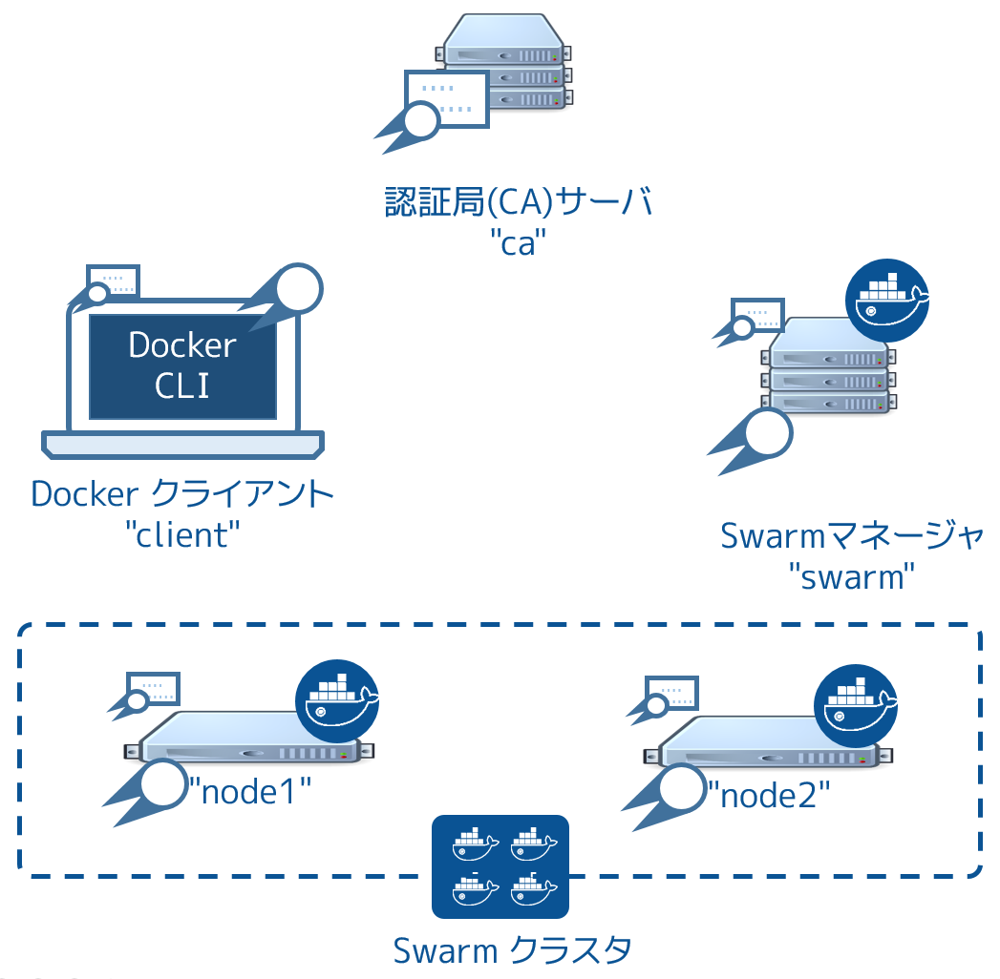
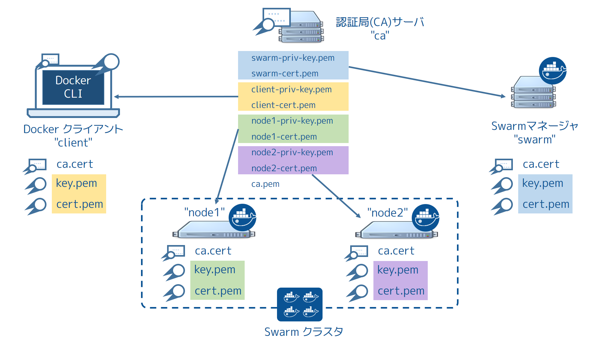

.. -*- coding: utf-8 -*-
.. URL: https://docs.docker.com/swarm/configure-tls/
.. SOURCE: https://github.com/docker/swarm/blob/master/docs/configure-tls.md
   doc version: 1.11
      https://github.com/docker/swarm/commits/master/docs/configure-tls.md
.. check date: 2016/06/01
.. Commits on Apr 13, 2016 ce1dffa58aaa881db0f5b41ee5032f259acaa303
.. -------------------------------------------------------------------

.. Configure Docker Swarm for TLS

.. _configure-docker-swarm-for-tls:

==============================
Docker Swarm の TLS 設定
==============================

.. sidebar:: 目次

   .. contents:: 
       :depth: 3
       :local:

.. In this procedure you create a two-node Swarm cluster, a Docker Engine CLI, a Swarm Manager, and a Certificate Authority as shown below. All the Docker Engine hosts (client, swarm, node1, and node2) have a copy of the CA’s certificate as well as their own key-pair signed by the CA.

この手順では下図のように、 Swarm クラスタにSwarm マネージャと認証局（CA）の２つのノードを作成します。全ての Docker Engine ホスト（ ``client`` 、 ``swarm`` 、 ``node1``  、 ``node2``  ）は、認証局の証明書のコピーと、自分自身で認証局の署名をしたキーペアのコピーも持ちます。

以下の手順で作業を進めていきます。

* :ref:`step-1-set-up-the-prerequisites`
* :ref:`step-2-create-a-certificate-authority-ca-server`
* :ref:`step-3-create-and-sign-keys`
* :ref:`step-4-install-the-keys`
* :ref:`step-5-configure-the-engine-daemon-for-tls`
* :ref:`step-6-create-a-swarm-cluster`
* :ref:`step-7-create-the-swarm-manager-using-tls`
* :ref:`step-8-test-the-swarm-manager-configuration`
* :ref:`step-9-configure-the-engine-cli-to-use-tls`

.. Before you begin

始める前に
==========

.. The article includes steps to create your own CA using OpenSSL. This is similar to operating your own internal corporate CA and PKI. However, this must not be used as a guide to building a production-worthy internal CA and PKI. These steps are included for demonstration purposes only - so that readers without access to an existing CA and set of certificates can follow along and configure Docker Swarm to use TLS.

この記事には OpenSSL で自分自身で認証局(CA)を作成する手順を含みます。これは簡単な社内の認証局や PKI と似ています。しかしながら、プロダクション級の内部の認証局・PKI としては ``使うべきではありません`` 。以降の手順は検証用（デモンストレーション）目的のみです。つまり、皆さんが既に適切な証明局や証明書をお持ちであれば、Docker Swarm で TLS を利用する際には置き換えてお読みください。

.. Step 1: Set up the prerequisites

.. _step-1-set-up-the-prerequisites:

ステップ１：動作環境のセットアップ
========================================

.. To complete this procedure you must stand up 5 (five) Linux servers. These servers can be any mix of physical and virtual servers; they may be on premises or in the public cloud. The following table lists each server name and its purpose.

この手順を進めるには、５つの Linux サーバの起動が必要です。これらのサーバは物理と仮想を組み合わせても構いません。以下の表はサーバ名と役割の一覧です。

.. Server name 	Description
   ca 	Acts as the Certificate Authority (CA) server.
   swarm 	Acts as the Swarm Manager.
   node1 	Act as a Swarm node.
   node2 	Act as a Swarm node.
   client 	Acts as a remote Docker Engine client

.. list-table::
   :header-rows: 1
   
   * - サーバ名
     - 説明
   * - ca
     - 認証局(CA)サーバとして動作
   * - swarm
     - Swarm マネージャとして動作
   * - node1
     - Swarm ノードとして動作
   * - node2
     - Swarm ノードとして動作
   * - client
     - リモートの Docker Engine クライアントとして動作

.. Make sure that you have SSH access to all 5 servers and that they can communicate with each other using DNS name resolution. In particular:

５台全てのサーバに SSH 接続が可能なのを確認し、DNS の名前解決でお互いに通信できるようにします。特に、次の２点に気を付けます。

..    Open TCP port 2376 between the Swarm Manager and Swarm nodes
    Open TCP port 3376 between the Docker Engine client and the Swarm Manager

* Swarm マネージャと Swarm ノード間は TCP ポート 2376 を開く
* Docker Engine クライアントと Swarm マネージャ間は TCP ポート 3376 を開く

.. You can choose different ports if these are already in use. This example assumes you use these ports though.

既に使用中であれば、他のポートも選べます。この例ではこれらのポートを使う想定です。

.. Each server must run an operating system compatible with Docker Engine. For simplicity, the steps that follow assume all servers are running Ubuntu 14.04 LTS.

各サーバは Docker Engine と互換性のあるオペレーティング・システムを実行します。簡単にするため、以降のステップでは全てのサーバを Ubuntu 14.04 LTS で動かすと想定します。

.. _step-2-create-a-certificate-authority-ca-server:

ステップ２：認証局(CA)サーバの作成
========================================

.. Note:If you already have access to a CA and certificates, and are comfortable working with them, you should skip this step and go to the nex

.. note::

   既に認証局にアクセス可能で証明書があるならば、それらを使ったほうが便利です。その場合、次のステップにスキップしてください。

.. In this step, you configure a Linux server as a CA. You use this CA to create and sign keys. This step included so that readers without access to an existing CA (external or corporate) and certificates can follow along and complete the later steps that require installing and using certificates. It is not intended as a model for how to deploy production-worthy CA.

このステップでは Linux サーバを認証局として設定します。認証局は鍵の作成と署名に使います。読者が既存の（外部または企業の）認証局へのアクセスや証明書が無くても、このステップでは必要な環境のインストールと証明書を使えるようにします。しかし、プロダクションへのデプロイには適切では「ない」モデルです。

..    Logon to the terminal of your CA server and elevate to root.

1. 認証局サーバのターミナルに入り、root に昇格します。

.. code-block:: bash

   $ sudo su

..    Create a private key called ca-priv-key.pem for the CA:

2. 認証局用の秘密鍵 ``ca-priv-key.pem`` を作成します。

.. code-block:: bash

   # openssl genrsa -out ca-priv-key.pem 2048
   Generating RSA private key, 2048 bit long modulus
   ...........................................................+++
   .....+++
   e is 65537 (0x10001)

..    Create a public key called ca.pem for the CA.

3. 認証局用の公開鍵 ``ca.pem`` を作成します。

..    The public key is based on the private key created in the previous step.

公開鍵の作成は、直前の手順で作成した秘密鍵を元にします。

.. code-block:: bash

   # openssl req -config /usr/lib/ssl/openssl.cnf -new -key ca-priv-key.pem -x509 -days 1825 -out ca.pem
   You are about to be asked to enter information that will be incorporated
   into your certificate request.
   What you are about to enter is what is called a Distinguished Name or a DN.
   There are quite a few fields but you can leave some blank
   For some fields there will be a default value,
   If you enter '.', the field will be left blank.
   -----
   Country Name (2 letter code) [AU]:US
   <output truncated>

.. You have now configured a CA server with a public and private keypair. You can inspect the contents of each key. To inspect the private key:

公開鍵・秘密鍵のペアを持つ認証局のサーバを設定しました。

.. code-block:: bash

   # openssl rsa -in ca-priv-key.pem -noout -text

.. To inspect the public key (cert): `

公開鍵（認証済み）を調べるには、次のようにします。

.. code-block:: bash

   # openssl x509 -in ca.pem -noout -text`

.. The following command shows the partial contents of the CA’s public key.

次のコマンドは、認証局の公開鍵情報を一部表示します。

.. code-block:: bash

   # openssl x509 -in ca.pem -noout -text
   Certificate:
       Data:
           Version: 3 (0x2)
           Serial Number: 17432010264024107661 (0xf1eaf0f9f41eca8d)
       Signature Algorithm: sha256WithRSAEncryption
           Issuer: C=US, ST=CA, L=Sanfrancisco, O=Docker Inc
           Validity
               Not Before: Jan 16 18:28:12 2016 GMT
               Not After : Jan 13 18:28:12 2026 GMT
           Subject: C=US, ST=CA, L=San Francisco, O=Docker Inc
           Subject Public Key Info:
               Public Key Algorithm: rsaEncryption
                   Public-Key: (2048 bit)
                   Modulus:
                       00:d1:fe:6e:55:d4:93:fc:c9:8a:04:07:2d:ba:f0:
                       55:97:c5:2c:f5:d7:1d:6a:9b:f0:f0:55:6c:5d:90:
   <output truncated>

.. Later, you’ll use this to certificate to sign keys for other servers in the infrastructure.

後ほど、他のインフラ上にあるサーバの鍵に対する署名で使います。

.. _step-3-create-and-sign-keys:

ステップ３：鍵の作成と署名
==============================

.. Now that you have a working CA, you need to create key pairs for the Swarm Manager, Swarm nodes, and remote Docker Engine client. The commands and process to create key pairs is identical for all servers. You’ll create the following keys:

これで認証局が動きました。次は Swarm マネージャ、Swarm ノード、リモートの Docker Engine クライアント用の鍵ペアを作成する必要があります。鍵ペア作成の命令と手順は、全てのサーバで同一です。次の鍵を作成します。

.. list-table::

   * - ca-priv-key.pem
     - 認証局の秘密鍵であり、安全に保つ必要があります。後ほど環境上にある他ノード用の新しい鍵の署名で使います。 ca.pem ファイルと認証局の鍵ペアを構成します。
   * - ca.pem
     - 認証局の公開鍵であり、証明書（certificate）とも呼ばれます。このファイルは環境上全てのノード上にインストールします。つまり、全てのノードは認証局が署名した信頼できる鍵を持っています。 ca-priv-key.pem ファイルと認証局の鍵ペアを構成します。
   * - node.csr
     - 証明書署名要求（certificate signing request；CSR）です。認証局に対して個々のノードごとに新しい鍵ペアを作成時、CSR を効率的に使います。認証局は指定した CSR から情報を取得し、ノード用の公開鍵と秘密鍵の鍵ペアを作成します。
   * - node-priv.key
     - 認証局で署名した秘密鍵。ノードはリモートの Docker Engine との認証に使います。 node-cert.pem ファイルとノードの鍵ペアを構成します。
   * - node-cert.pem
     - 認証局で署名した証明書。今回のサンプルでは使いません。node-priv.key ファイルとノードの鍵ペアを構成します。

.. The commands below show how to create keys for all of your nodes. You perform this procedure in a working directory located on your CA server.

以下で紹介するのは、ノード全てに対する鍵を作成するコマンドの使い方です。認証局サーバ上のディレクトリで、この手順を進めます。

..    Logon to the terminal of your CA server and elevate to root.

1. 認証局サーバのターミナルにログインし、root に昇格します。

.. code-block:: bash

   $ sudo su

..    Create a private key swarm-priv-key.pem for your Swarm Manager

2. Swarm マネージャ用の秘密鍵 ``swarm-priv-key.pem`` を作成します。

.. code-block:: bash

   # openssl genrsa -out swarm-priv-key.pem 2048
   Generating RSA private key, 2048 bit long modulus
   ............................................................+++
   ........+++
   e is 65537 (0x10001)

..    Generate a certificate signing request (CSR) swarm.csr using the private key you create in the previous step.

3. 証明書署名要求(CSR) ``swarm.csr`` を作成します。

.. code-block:: bash

   # openssl req -subj "/CN=swarm" -new -key swarm-priv-key.pem -out swarm.csr

..    Remember, this is only for demonstration purposes. The process to create a CSR will be slightly different in real-world production environments.

この手順はデモンストレーション目的専用です。ご注意ください。実際のプロダクション環境における CSR 作成手順とは若干異なります。

..    Create the certificate swarm-cert.pem based on the CSR created in the previous step.

4. 前のステップで作成した CSR を元に、証明書 ``swarm-cert.pem`` を作成します。

.. code-block:: bash

   # openssl x509 -req -days 1825 -in swarm.csr -CA ca.pem -CAkey ca-priv-key.pem -CAcreateserial -out swarm-cert.pem -extensions v3_req -extfile /usr/lib/ssl/openssl.cnf
   <省略>
   # openssl rsa -in swarm-priv-key.pem -out swarm-priv-key.pem

.. You now have a keypair for the Swarm Manager.

これで Swarm マネージャの鍵ペアを作成しました。

..    Repeat the steps above for the remaining nodes in your infrastructure (node1, node2, and client).

5. これまでのステップを各インフラ上（ ``node1`` 、 ``node2`` 、 ``client``  ）で繰り返します。

..    Remember to replace the swarm specific values with the values relevant to the node you are creating the key pair for.

各ノードで鍵ペアの作成時は、 ``swarm`` の値を各ノードのものへ置き換えてください。

..    Server name 	Private key 	CSR 	Certificate
    node1 	node1-priv-key.pem 	node1.csr 	node1-cert.pem
    node2 	node2-priv-key.pem 	node2.csr 	node2-cert.pem
    client 	client-priv-key.pem 	client.csr 	client-cert.pem

.. list-table::
   :header-rows: 1
   
   * - サーバ名
     - 秘密鍵
     - CSR
     - 証明書
   * - node1
     - node1-priv-key.pem
     - node1.csr
     - node1-cert.pem
   * - node2
     - node2-priv-key.pem
     - node2.csr
     - node2-cert.pem
   * - client
     - client-priv-key.pem
     - client.csr
     - client-cert.pem

..    Verify that your working directory contains the following files:

6. 自分の作業用ディレクトリ上に、以下のファイルがあるのを確認します。

.. code-block:: bash

   # ls -l
   total 64
   -rw-r--r-- 1 root   root   1679 Jan 16 18:27 ca-priv-key.pem
   -rw-r--r-- 1 root   root   1229 Jan 16 18:28 ca.pem
   -rw-r--r-- 1 root   root     17 Jan 18 09:56 ca.srl
   -rw-r--r-- 1 root   root   1086 Jan 18 09:56 client-cert.pem
   -rw-r--r-- 1 root   root    887 Jan 18 09:55 client.csr
   -rw-r--r-- 1 root   root   1679 Jan 18 09:56 client-priv-key.pem
   -rw-r--r-- 1 root   root   1082 Jan 18 09:44 node1-cert.pem
   -rw-r--r-- 1 root   root    887 Jan 18 09:43 node1.csr
   -rw-r--r-- 1 root   root   1675 Jan 18 09:44 node1-priv-key.pem
   -rw-r--r-- 1 root   root   1082 Jan 18 09:49 node2-cert.pem
   -rw-r--r-- 1 root   root    887 Jan 18 09:49 node2.csr
   -rw-r--r-- 1 root   root   1675 Jan 18 09:49 node2-priv-key.pem
   -rw-r--r-- 1 root   root   1082 Jan 18 09:42 swarm-cert.pem
   -rw-r--r-- 1 root   root    887 Jan 18 09:41 swarm.csr
   -rw-r--r-- 1 root   root   1679 Jan 18 09:42 swarm-priv-key.pem

.. You can inspect the contents of each of the keys. To inspect a private key:

それぞれの鍵の内容を自分で確認できます。秘密鍵を調べるには、次のようにします。

.. code-block:: bash

   openssl rsa -in <key-name> -noout -text

.. To inspect a public key (cert):

公開鍵の確認は、次のようにします。

.. code-block:: bash

   openssl x509 -in <key-name> -noout -text

.. The following commands shows the partial contents of the Swarm Manager’s public swarm-cert.pem key.

次のコマンドは、 Swarm マネージャ公開鍵 ``swarm-cert.pem`` の内容を表示する一部です。

.. code-block:: bash

   # openssl x509 -in ca.pem -noout -text
   Certificate:
   Data:
       Version: 3 (0x2)
       Serial Number: 9590646456311914051 (0x8518d2237ad49e43)
   Signature Algorithm: sha256WithRSAEncryption
       Issuer: C=US, ST=CA, L=Sanfrancisco, O=Docker Inc
       Validity
           Not Before: Jan 18 09:42:16 2016 GMT
           Not After : Jan 15 09:42:16 2026 GMT
       Subject: CN=swarm
   
   <出力を省略>

.. _step-4-install-the-keys:

ステップ４：鍵のインストール
==============================

.. In this step, you install the keys on the relevant servers in the infrastructure. Each server needs three files:

このステップは、インフラ上の各サーバに鍵をインストールします。各サーバは３つのファイルが必要です。

..    A copy of the Certificate Authority’s public key (ca.pem)
    It’s own private key
    It’s own public key (cert)

* 認証局公開鍵（ ``ca.pem`` ）のコピー
* 自分の秘密鍵
* 自分の公開鍵（証明書）

.. The procedure below shows you how to copy these files from the CA server to each server using scp. As part of the copy procedure, you’ll rename each file as follows on each node:

以下の手順では、認証局サーバから各サーバに ``scp`` を使い、３つのファイルをコピーします。コピーの段階で、各ノードごとにファイル名を変更します。

.. Original name 	Copied name
   ca.pem 	ca.pem
   <server>-cert.pem 	cert.pem
   <server>-priv-key.pem 	key.pem

.. list-table::
   :header-rows: 1
   
   * - オリジナル名
     - コピー名
   * - ca.pem
     - ca.pem
   * - <サーバ名>-cert.pem
     - cert.pem
   * - <サーバ名>-priv-key.pem
     - key.pem

..    Logon to the terminal of your CA server and elevate to root.

1. 認証局サーバのターミナルにログインし、root に昇格します。

.. code-block:: bash

   $ sudo su

..    Create a~/.certs directory on the Swarm manager. Here we assume user account is ubuntu.

2. Swarm マネージャ上で ``~/.certs`` ディレクトリを作成します。

.. code-block:: bash

   $ ssh ubuntu@swarm 'mkdir -p /home/ubuntu/.certs'

..    Copy the keys from the CA to the Swarm Manager server.

3. 認証局から Swarm マネージャ・サーバに鍵をコピーします。

.. code-block:: bash

   $ scp ./ca.pem ubuntu@swarm:/home/ubuntu/.certs/ca.pem
   $ scp ./swarm-cert.pem ubuntu@swarm:/home/ubuntu/.certs/cert.pem
   $ scp ./swarm-priv-key.pem ubuntu@swarm:/home/ubuntu/.certs/key.pem

..    Note: You may need to provide authentication for the scp commands to work. For example, AWS EC2 instances use certificate-based authentication. To copy the files to an EC2 instance associated with a public key called nigel.pem, modify the scp command as follows: scp -i /path/to/nigel.pem ./ca.pem ubuntu@swarm:/home/ubuntu/.certs/ca.pem.

.. note::

   ``scp`` コマンドの動作には認証情報の指定が必要になるかもしれません。例えば、AWS EC2 インスタンスは証明書ベースでの認証を使います。公開鍵 ``nigel.pem`` を関連付けている EC2 インスタンスにファイルをコピーするには、 ``scp`` コマンドを次のように変更します。
   
   .. code-block:: bash
   
      scp -i /path/to/nigel.pem ./ca.pem ubuntu@swarm:/home/ubuntu/.certs/ca.pem

..    Repeat step 2 for each remaining server in the infrastructure.
        node1
        node2
        client

4. インフラ上の各サーバに対して２つの手順を繰り返します。

* node1
* node2
* client

..    Verify your work.

5. 動作確認をします。

..    When the copying is complete, each machine should have the following keys.

コピーが完了したら、各マシンは以下の鍵を持ちます。

..    Each node in your infrastructure should have the following files in the /home/ubuntu/.certs/ directory:

インフラ上の各ノードでは、 ``/home/ubuntu/.certs/`` ディレクトリに次のファイルがあるでしょう。

.. code-block:: bash

   # ls -l /home/ubuntu/.certs/
   total 16
   -rw-r--r-- 1 ubuntu ubuntu 1229 Jan 18 10:03 ca.pem
   -rw-r--r-- 1 ubuntu ubuntu 1082 Jan 18 10:06 cert.pem
   -rw-r--r-- 1 ubuntu ubuntu 1679 Jan 18 10:06 key.pem

.. _step-5-configure-the-engine-daemon-for-tls:

ステップ５：Engine デーモンに TLS 設定
========================================

.. In the last step, you created and installed the necessary keys on each of your Swarm nodes. In this step, you configure them to listen on the network and only accept connections using TLS. Once you complete this step, your Swarm nodes will listen on TCP port 2376, and only accept connections using TLS.

先ほどのステップでは、各 Swarm ノードで必要な鍵をインストールしました。このステップでは、ネットワーク上で通信可能に調整し、TLS を使う通信のみ受け付けるようにします。このステップが終われば、Swarm ノードは TCP ポート 2376 をリッスンし、TLS を使う接続のみ受け付けます。

.. On node1 and node2 (your Swarm nodes), do the following:

``node1`` と ``node2`` （Swarmノード）上で以下の作業を行います。

..    Open a terminal on node1 and elevate to root.

1. ``node1`` のターミナルを開き、root に昇格します。

.. code-block:: bash

   $ sudo su

..    Edit Docker Engine configuration file.

2. Docker Engine 設定ファイルを編集します。

..    If you are following along with these instructions and using Ubuntu 14.04 LTS, the configuration file is /etc/default/docker. The Docker Engine configuration file may be different depending on the Linux distribution you are using.

以降の手順を Ubuntu 14.04 LTS で進めるのであれば、設定ファイルは ``/etc/default/docker`` です。Docker Engine の設定ファイルは、お使いの Linux ディストリビューションに依存します。

..    Add the following options to the DOCKER_OPTS line.

3. ``DOCKER_OPTS`` 行に以下のオプションを追加します。

.. code-block:: bash

   -H tcp://0.0.0.0:2376 --tlsverify --tlscacert=/home/ubuntu/.certs/ca.pem --tlscert=/home/ubuntu/.certs/cert.pem --tlskey=/home/ubuntu/.certs/key.pem

..    Restart the Docker Engine daemon.

4. Docker Engine デーモンを再起動します。

.. code-block:: bash

   $ service docker restart

..    Repeat the procedure on node2 as well.

5. ``node2`` でも同様の設定を繰り返します。

.. _step-6-create-a-swarm-cluster:

ステップ６：Swarm クラスタの作成
========================================

.. Next create a Swarm cluster. In this procedure you create a two-node Swarm cluster using the default hosted discovery backend. The default hosted discovery backend uses Docker Hub and is not recommended for production use.

次は Swarm クラスタを作成します。以降の手順では、２つのノードを持つ Swarm クラスタを、デフォルトのホステッド・ディスカバリ・バックエンドで作成します。デフォルトのホステッド・ディスカバリは Docker Hub を使います。また、プロダクション環境での利用は非推奨です。

..    Logon to the terminal of your Swarm manager node.

1. Swarm マネージャ用ノードのターミナルにログインします。

..    Create the cluster and export it’s unique ID to the TOKEN environment variable.

2. ``TOKEN`` 環境変数にユニークな ID を取り込み、クラスタを作成します。

.. code-block:: bash

   $ sudo export TOKEN=$(docker run --rm swarm create)
   Unable to find image 'swarm:latest' locally
   latest: Pulling from library/swarm
   d681c900c6e3: Pulling fs layer
   <省略>
   986340ab62f0: Pull complete
   a9975e2cc0a3: Pull complete
   Digest: sha256:c21fd414b0488637b1f05f13a59b032a3f9da5d818d31da1a4ca98a84c0c781b
   Status: Downloaded newer image for swarm:latest

..    Join node1 to the cluster.

3. ``node1`` をクラスタに追加します。

..    Be sure to specify TCP port 2376 and not 2375.

TCP ポート ``2376`` を指定します。 ``2375`` ではありません。

.. code-block:: bash

   $ sudo docker run -d swarm join --addr=node1:2376 token://$TOKEN
   7bacc98536ed6b4200825ff6f4004940eb2cec891e1df71c6bbf20157c5f9761

..    Join node2 to the cluster.

4. ``node2`` をクラスタに追加します。

.. code-block:: bash

   $ sudo docker run -d swarm join --addr=node2:2376 token://$TOKEN
   db3f49d397bad957202e91f0679ff84f526e74d6c5bf1b6734d834f5edcbca6c

.. _step-7-create-the-swarm-manager-using-tls:

ステップ７：TLS を使う Swarm マネージャの作成
==================================================

..    Launch a new container with TLS enables

1. TLS を有効にした新しいコンテナを起動します。

.. code-block:: bash

   $ docker run -d -p 3376:3376 -v /home/ubuntu/.certs:/certs:ro swarm manage --tlsverify --tlscacert=/certs/ca.pem --tlscert=/certs/cert.pem --tlskey=/certs/key.pem --host=0.0.0.0:3376 token://$TOKEN

..    The command above launches a new container based on the swarm image and it maps port 3376 on the server to port 3376 inside the container. This mapping ensures that Docker Engine commands sent to the host on port 3376 are passed on to port 3376 inside the container. The container runs the Swarm manage process with the --tlsverify, --tlscacert, --tlscert and --tlskey options specified. These options force TLS verification and specify the location of the Swarm manager’s TLS keys.

このコマンドは ``swarm`` イメージを元にした新しいコンテナを起動します。そして、サーバ側のポート ``3376`` をコンテナ内のポート ``3376`` に割り当てます。コンテナは Swarm の ``manage``  プロセスを実行し、オプションとして ``--tlsverify`` 、 ``--tlscacert`` 、``--tlscert`` 、 ``--tlskey``  を指定します。これらのオプションは TLS 認証を強制するものであり、Swarm マネージャの TLS 鍵の場所を指定します。

..    Run a docker ps command to verify that your Swarm manager container is up and running.

2. ``docker ps`` コマンドを実行し、Swarm マネージャ用コンテナが起動して実行中かを確認します。

.. code-block:: bash

   $ docker ps
   CONTAINER ID   IMAGE               COMMAND                  CREATED          STATUS          PORTS                              NAMES
   035dbf57b26e   swarm               "/swarm manage --tlsv"   7 seconds ago    Up 7 seconds    2375/tcp, 0.0.0.0:3376->3376/tcp   compassionate_lovelace

.. Your Swarm cluster is now configured to use TLS.

これで Swarm クラスタが TLS を使う設定になりました。

.. _step-8-test-the-swarm-manager-configuration:

ステップ８：Swarm マネージャの設定を確認
==================================================

.. Now that you have a Swarm cluster built and configured to use TLS, you’ll test that it works with a Docker Engine CLI.

TLS を使う Swarm クラスタを構築しました。次は、Docker Engine CLI で動作するかを確認します。

..    Open a terminal onto your client server.

1. ``client`` サーバのターミナルを開きます。

..    Issue the docker version command.

2. ``docker version`` コマンドを実行します。

..    When issuing the command, you must pass it the location of the clients certifications.

コマンドの実行には、クライアント証明書の場所指定が必須です。

.. code-block:: bash

   $ sudo docker --tlsverify --tlscacert=/home/ubuntu/.certs/ca.pem --tlscert=/home/ubuntu/.certs/cert.pem --tlskey=/home/ubuntu/.certs/key.pem -H swarm:3376 version
   Client:
    Version:      1.9.1
    API version:  1.21
    Go version:   go1.4.2
    Git commit:   a34a1d5
    Built:        Fri Nov 20 13:12:04 UTC 2015
    OS/Arch:      linux/amd64
   
   Server:
    Version:      swarm/1.0.1
    API version:  1.21
    Go version:   go1.5.2
    Git commit:   744e3a3
    Built:
    OS/Arch:      linux/amd64

..    The output above shows the Server version as “swarm/1.0.1”. This means that the command was successfully issued against the Swarm manager.

``Server`` バージョンの出力は "swarm/1.0.1" を表示します。つまり、Swarm マネージャに対するコマンドの実行が成功したのを意味します。

..    Verify that the same command does not work without TLS.

3. TLS の指定がなくてもコマンドが動作するか確認します。

..    This time, do not pass your certs to the Swarm manager.

今回は Swarm マネージャ用の証明書を指定しません。

.. code-block:: bash

   $ sudo docker -H swarm:3376 version
   :
    Version:      1.9.1
    API version:  1.21
    Go version:   go1.4.2
    Git commit:   a34a1d5
    Built:        Fri Nov 20 13:12:04 UTC 2015
    OS/Arch:      linux/amd64
   Get http://swarm:3376/v1.21/version: malformed HTTP response "\x15\x03\x01\x00\x02\x02".
   * Are you trying to connect to a TLS-enabled daemon without TLS?

..    The output above shows that the command was rejected by the server. This is because the server (Swarm manager) is configured to only accept connections from authenticated clients using TLS.

サーバ側のコマンドを拒否したと表示されます。つまり、サーバ（Swarm マネージャ）と通信できるのは TLS を用いるクライアントのみです。

.. _step-9-configure-the-engine-cli-to-use-tls:

ステップ９：TLS を使う Engilne CLI の設定
==================================================

.. You can configure the Engine so that you don’t have to pass the TLS options when you issue a command. To do this, you’ll configure the Docker Engine host and TLS settings as defaults on your Docker Engine client.

コマンド実行時に TLS オプションを指定し無くても良いよう、Engine側に設定できます。設定のためには、Docker Engineクライアントがデフォルトで ``TLS`` を使うように、Docker Engine のホストの設定をします。

.. To do this, you place the client’s keys in your ~/.docker configuration folder. If you have other users on your system using the Engine command line, you’ll need to configure their account’s ~/.docker as well. The procedure below shows how to do this for the ubuntu user on your Docker Engine client.

そのためには、クライアントの鍵を自分の ``~/.docker`` 設定ディレクトリに置きます。システム上で他にも Engine コマンドを使っているユーザがいる場合は、それぞれのアカウントでも同様に ``~/.docker`` の設定が必要です。以降は、 ``ubuntu`` ユーザで Docker Engine クライアントを使う手順です。

..    Open a terminal onto your client server.

1. ``client`` サーバのターミナルを開きます。

..    If it doesn’t exist, create a .docker directory in the ubuntu user’s home directory.

2. ``ubuntu`` ユーザのホームディレクトリに ``.docker`` ディレクトリが存在しなければ作成します。

.. code-block:: bash

   $ mkdir /home/ubuntu/.docker

..    Copy the Docker Engine client’s keys from /home/ubuntu/.certs to /home/ubuntu/.docker

3. ``/home/ubuntu/.certs`` にある Docker Engine クライアントの鍵を、 ``/home/ubuntu/.docker`` にコピーします。

.. code-block:: bash

   $ cp /home/ubuntu/.certs/{ca,cert,key}.pem /home/ubuntu/.docker

..    Edit the account’s ~/.bash_profile.

4. アカウントの ``~/.bash_profile`` を編集します。

..    Set the following variables:

5. 以下の環境変数を指定します。

..    Variable 	Description
    DOCKER_HOST 	Sets the Docker host and TCP port to send all Engine commands to.
    DOCKER_TLS_VERIFY 	Tell's Engine to use TLS.
    DOCKER_CERT_PATH 	Specifies the location of TLS keys.

.. list-table::
   :header-rows: 1
   
   * - 変数
     - 説明
   * - ``DOCKER_HOST``
     - 全ての Engine 用コマンドが送信する Docker ホストと TCP ポートを指定します。
   * - ``DOCKER_TLS_VERIFY``
     - Engine に TLS を使うと伝えます。
   * - ``DOCKER_CERT_PATH``
     - TLS 鍵の場所を指定します。

..    For example:

例：

.. code-block:: bash

   export DOCKER_HOST=tcp://swarm:3376
   export DOCKER_TLS_VERIFY=1
   export DOCKER_CERT_PATH=/home/ubuntu/.docker/

..    Save and close the file.

6. ファイルを保存して閉じます。

..    Source the file to pick up the new variables.

7. 新しい環境変数をファイルから読み込みます。

.. code-block:: bash

   $ source ~/.bash_profile

..    Verify that the procedure worked by issuing a docker version command

8. ``docker version`` コマンドを実行して動作確認します。

.. code-block:: bash

   $ docker version
   Client:
    Version:      1.9.1
    API version:  1.21
    Go version:   go1.4.2
    Git commit:   a34a1d5
    Built:        Fri Nov 20 13:12:04 UTC 2015
    OS/Arch:      linux/amd64
   
   Server:
    Version:      swarm/1.0.1
    API version:  1.21
    Go version:   go1.5.2
    Git commit:   744e3a3
    Built:
    OS/Arch:      linux/amd64

..    The server portion of the output above command shows that your Docker client is issuing commands to the Swarm Manager and using TLS.

コマンド実行結果のサーバ情報にある部分から、Docker クライアントは TLS を使う Swarm マネージャに命令していると分かります。

.. Congratulations! You have configured a Docker Swarm cluster to use TLS.

おつかれ様でした。これで TLS を使う Docker Swarm クラスタができました。

関連情報
==========

* :doc:`secure-swarm-tls`
* :doc:`/engine/security/security`

.. seealso:: 

   Configure Docker Swarm for TLS
      https://docs.docker.com/swarm/configure-tls/
