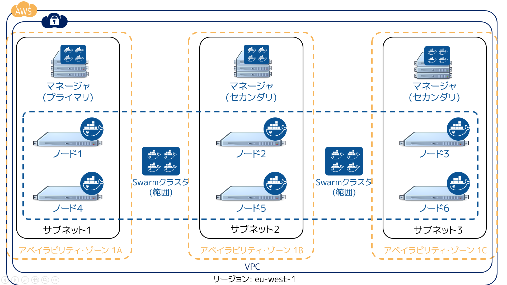

.. -*- coding: utf-8 -*-
.. URL: https://docs.docker.com/swarm/plan-for-production/
.. SOURCE: https://github.com/docker/swarm/blob/master/docs/plan-for-production.md
   doc version: 1.11
      https://github.com/docker/swarm/commits/master/docs/plan-for-production.md
.. check date: 2016/04/29
.. Commits on Apr 13, 2016 ce1dffa58aaa881db0f5b41ee5032f259acaa303
.. -------------------------------------------------------------------

.. Plan for Swarm in production

.. _plan-for-swarm-in-production:

=======================================
プロダクションで Swarm 利用時の考慮
=======================================

.. sidebar:: 目次

   .. contents:: 
       :depth: 3
       :local:

.. This article provides guidance to help you plan, deploy, and manage Docker Swarm clusters in business critical production environments. The following high level topics are covered:

この記事は Docker Swarm クラスタを計画・デプロイ・管理の手助けとなるガイダンスを提供します。想定しているのは、ビジネスにおけるクリティカルなプロダクション環境です。次のハイレベルな項目を扱います。

..    Security
    High Availability
    Performance
    Cluster ownership

* :ref:`セキュリティ <swarm-production-security>`
* :ref:`高可用性（HA） <swarm-production-high-availability>`
* :ref:`性能 <swarm-production-performance>`
* :ref:`クラスタの所有 <swarm-production-cluster-ownership>`

.. Security

.. _swarm-production-security:

セキュリティ
====================

.. There are many aspects to securing a Docker Swarm cluster. This section covers:

Docker Swarm クラスタを安全にする様々な方法があります。このセクションは以下の内容を扱います。

..    Authentication using TLS
    Network access control

* TLS を使った認証
* ネットワークのアクセス制御

.. These topics are not exhaustive. They form part of a wider security architecture that includes: security patching, strong password policies, role based access control, technologies such as SELinux and AppArmor, strict auditing, and more.

これらのトピックだけでは完全ではありません。広範囲にわたるセキュリティ・アーキテクチャにおける一部分です。セキュリティ・アーキテクチャに含まれるのは、セキュリティ・パッチ、強力なパスワード・ポリシー、ロールをベースとしたアクセス制御、SELinux や AppArmor のように厳格な監査を行う技術、等々です。

.. Configure Swarm for TLS

Swarm 用の TLS 設定
--------------------

.. All nodes in a Swarm cluster must bind their Docker Engine daemons to a network port. This brings with it all of the usual network related security implications such as man-in-the-middle attacks. These risks are compounded when the network in question is untrusted such as the internet. To mitigate these risks, Swarm and the Engine support Transport Layer Security(TLS) for authentication.

Swarm クラスタ内にある全てのノードは、Docker Engine デーモンの通信用にポートを開く必要があります。そのため、中間者攻撃（man-in-the-middle attacks）のように、通常のネットワークに関連するセキュリティの問題をもたらします。対象のネットワークがインターネットのような信頼できない環境であれば、これらの危険性が倍増します。危険性を逓減するために、Swarm と Engine は TLS 認証（Transport Layer Security）をサポートしています。

.. The Engine daemons, including the Swarm manager, that are configured to use TLS will only accept commands from Docker Engine clients that sign their communications. The Engine and Swarm support external 3rd party Certificate Authorities (CA) as well as internal corporate CAs.

Engine デーモンおよび Swarm マネージャは、TLS を使う設定をすることで、署名された Docker Engine クライアントからのみ通信を受け付けるようにできます。Engine と Swarm は組織内部の認証局（CA; Certificate Authorities）だけでなく、外部のサード・パーティー製による認証局もサポートしています。

.. The default Engine and Swarm ports for TLS are:

Engine と Swarm が TLS に使うデフォルトのポート番号：

..    Engine daemon: 2376/tcp
    Swarm manager: 3376/tcp

* Engine デーモン：2376/tcp
* Swarm マネージャ：3376/tcp

.. For more information on configuring Swarm for TLS, see the Overview Docker Swarm with TLS page.

Swarm に TLS 設定を行うための詳しい情報は、 :doc:`secure-swarm-tls` ページをご覧ください。

.. Network access control

ネットワークのアクセス制御
------------------------------

.. Production networks are complex, and usually locked down so that only allowed traffic can flow on the network. The list below shows the network ports that the different components of a Swam cluster listen on. You should use these to configure your firewalls and other network access control lists.

プロダクションにおけるネットワークは複雑であり、通常は特定のトラフィックのみがネットワーク上に流れるように固定します。以下のリストは Swarm クラスタの各コンポーネントが公開しているポート情報です。ファイアウォールや、他のネットワーク・アクセス管理リストの設定に、これらが使えるでしょう。

..    Swarm manager.
        Inbound 80/tcp (HTTP). This allows docker pull commands to work. If you plan to pull image from Docker Hub you must allow Internet connections through port 80 from the internet.
        Inbound 2375/tcp. This allows Docker Engine CLI commands direct to the Engine daemon.
        Inbound 3375/tcp. This allows Engine CLI commands to the Swarm manager.
        Inbound 22/tcp. This allows remote management via SSH

* **Swarm マネージャ** ：

  * **Inbound 80/tcp (HTTP)**： ``docker pull`` コマンドが動作するために使います。Docker Hub からイメージを取得するためには、インターネット側のポート 80 を通す通信の許可が必要です。
  * **Inbound 2375/tcp** ：Docker Engine CLI が Engine デーモンと直接通信します。 
  * **Inbound 3375/tcp** ：Docker Engine CLI が Swarm マネージャと通信します。 
  * **Inbound 22/tcp** ：SSH を経由したリモート管理を行います。 

* **サービス・ディスカバリ** ：

  * **Inbound 80/tcp (HTTP)** ： ``docker pull`` コマンドが動作するために使います。Docker Hub からイメージを取得するためには、インターネット側のポート 80 を通す通信の許可が必要です。
  * **Inbound （ディスカバリ・サービス用のポート番号）** ：バックエンド・ディスカバリ・サービス（consul、etcd、zookeeper）が公開するポートの設定が必要です。 
  * **Inbound 22/tcp** ：SSH を経由したリモート管理を行います。 

* **Swarm  ノード** ：

  * **Inbound 80/tcp (HTTP)** ： ``docker pull`` コマンドが動作するために使います。Docker Hub からイメージを取得するためには、インターネット側のポート 80 を通す通信の許可が必要です。
  * **Inbound 2375/tcp** ：Docker Engine CLI が Engine デーモンと直接通信します。
  * **Inbound 22/tcp** ：SSH を経由したリモート管理を行います。

* **その他、ホスト横断コンテナ・ネットワーク** ：

  * **Inbound 7946/tcp** ： 他のコンテナ・ネットワークから発見（ディスカバリ）されるために必要です。 
  * **Inbound 7946/udp** ： 他のコンテナ・ネットワークから発見（ディスカバリ）されるために必要です。
  * **Inbound /tcp** ： キーバリュー・ストアのサービス用ポートに接続します。
  * **7489/udp** ： コンテナのオーバレイ・ネットワーク用です。

.. If your firewalls and other network devices are connection state aware, they will allow responses to established TCP connections. If your devices are not state aware, you will need to open up ephemeral ports from 32768-65535. For added security you can configure the ephemeral port rules to only allow connections from interfaces on known Swarm devices.

もしもファイアウォールがネットワーク・デバイスとの接続状態を検出（state aware）すると、TCP 接続を確立するための応答を許可します。デバイスが検出できなければ、 23768 ～ 65525 までのエフェメラル・ポート（訳者注：短時間のみ利用するポート）を自分でオープンにする必要があります。エフェメラル・ポートのルールという、セキュリティ設定の追加のみが、既知の Swarm デバイス上のインターフェースからの接続を受け付けるようにします。

.. If your Swarm cluster is configured for TLS, replace 2375 with 2376, and 3375 with 3376.

Swarm クラスタが TLS 用の設定を行っている場合、 ``2375`` は ``2376`` に、 ``3375`` は ``3376`` に置き換えます。

.. The ports listed above are just for Swarm cluster operations such as; cluster creation, cluster management, and scheduling of containers against the cluster. You may need to open additional network ports for application-related communications.

クラスタ作成やクラスタ管理、クラスタ上でコンテナをスケジューリングといった Swarm クラスタの操作には、先ほどのリストにあるポートの調整が必要です。アプリケーションに関連する通信のために、追加で通信用ポートの公開も必要になる場合があります。

.. It is possible for different components of a Swarm cluster to exist on separate networks. For example, many organizations operate separate management and production networks. Some Docker Engine clients may exist on a management network, while Swarm managers, discovery service instances, and nodes might exist on one or more production networks. To offset against network failures, you can deploy Swarm managers, discovery services, and nodes across multiple production networks. In all of these cases you can use the list of ports above to assist the work of your network infrastructure teams to efficiently and securely configure your network.

Swarm クラスタのコンポーネントは、別のネットワークに接続する可能性があります。例えば、多くの組織が管理用のネットワークとプロダクション用のネットワークを分けています。ある Docker Engine クライアントは管理ネットワーク上に存在しており、 Swarm マネージャ、ディスカバリ・サービス用インスタンスやノードが１つまたは複数のネットワークにあるかもしれません。ネットワーク障害を埋め合わせるために、Swarm マネージャ、ディスカバリ・サービス、ノードが複数のプロダクション用ネットワークを横断することも可能です。先ほどのポート番号の一覧は、皆さんのネットワーク基盤チームがネットワークを効率的・安全に設定するために役立つでしょう。

.. High Availability (HA)

.. _swarm-production-high-availability:

高可用性（HA）
====================

.. All production environments should be highly available, meaning they are continuously operational over long periods of time. To achieve high availability, an environment must the survive failures of its individual component parts.

全てのプロダクション環境は高可用性（HA; Highly available ）であるべきでしょう。つまり、長期間にわたる継続的な運用を意味します。高可用性を実現するのは、個々のコンポーネントで障害が発生しても切り抜ける環境です。

.. The following sections discuss some technologies and best practices that can enable you to build resilient, highly-available Swarm clusters. You can then use these cluster to run your most demanding production applications and workloads.

回復力のある高可用性 Swarm クラスタを構築するために、以下のセクションでは、いくつかの技術やベストプラクティスについて議論します。これらクラスタは、要求の厳しいプロダクションにおけるアプリケーションやワークロードで利用可能です。

.. Swarm manager HA

.. _swarm-manager-ha:

Swarm マネージャ HA
--------------------

.. The Swarm manager is responsible for accepting all commands coming in to a Swarm cluster, and scheduling resources against the cluster. If the Swarm manager becomes unavailable, some cluster operations cannot be performed until the Swarm manager becomes available again. This is unacceptable in large-scale business critical scenarios.

Swarm マネージャは Swarm クラスタに対する全ての命令を受け付ける責任を持ちます。それと、クラスタ内のリソースをスケジューリングする役割があります。もしも Swarm マネージャが利用不可能になれば、再び Swarm マネージャが使えるようになるまでクラスタに対する操作が不可能になります。これは大きくスケールするビジネスにおいては致命的なシナリオであり、許されません。

.. Swarm provides HA features to mitigate against possible failures of the Swarm manager. You can use Swarm’s HA feature to configure multiple Swarm managers for a single cluster. These Swarm managers operate in an active/passive formation with a single Swarm manager being the primary, and all others being secondaries.

Swarm が提供する HA 機能は、Swarm マネージャで発生しうる障害を緩和します。クラスタ上に複数の Swarm マネージャを設定することで、Swarm の HA 機能を利用できます。３つの Swarm マネージャがアクティブ／パッシブ（活動中／受け身）を形成します。この時、１つのマネージャが *プライマリ* であり、残りの全てが *セカンダリ* になります。

.. Swarm secondary managers operate as warm standby’s, meaning they run in the background of the primary Swarm manager. The secondary Swarm managers are online and accept commands issued to the cluster, just as the primary Swarm manager. However, any commands received by the secondaries are forwarded to the primary where they are executed. Should the primary Swarm manager fail, a new primary is elected from the surviving secondaries.

Swarm のセカンダリ・マネージャは *ウォーム・スタンバイ* として扱われます。つまり、プライマリ Swarm マネージャのバックグラウンドで動作することを意味します。セカンダリ Swarm マネージャはオンラインのままであり、プライマリ Swarm マネージャと同様、クラスタに対するコマンドを受け付けます。しかしながら、セカンダリが受信したコマンドはプライマリに転送され、その後に実行されます。プライマリ Swarm マネージャが落ちたとしても、残ったセカンダリの中から新しいプライマリが選出されます。

.. When creating HA Swarm managers, you should take care to distribute them over as many failure domains as possible. A failure domain is a network section that can be negatively affected if a critical device or service experiences problems. For example, if your cluster is running in the Ireland Region of Amazon Web Services (eu-west-1) and you configure three Swarm managers (1 x primary, 2 x secondary), you should place one in each availability zone as shown below.

HA Swarm マネージャの作成時は、 *障害範囲 (failure domains)* の影響を受けないよう、可能な限り分散するよう注意を払う必要があります。障害範囲とは、デバイスまたはサービスに対する致命的な問題が発生すると影響があるネットワーク区分です。仮にクラスタが Amazon Web Services のアイルランド・リージョン（eu-west-1）で動いているとします。３つの Swarm マネージャを設定するにあたり（１つはプライマリ、２つはセカンダリ）、次の図のように各アベイラビリティ・ゾーンに置くべきでしょう。

.. In this configuration, the Swarm cluster can survive the loss of any two availability zones. For your applications to survive such failures, they must be architected across as many failure domains as well.

この設定であれば、Swarm クラスタは２つのアベイラビリティ・ゾーンが失われても稼働し続けられます。あなたのアプリケーションが障害を乗り越えるためには、アプリケーションの障害範囲も重複しないよう設計する必要があります。

.. For Swarm clusters serving high-demand, line-of-business applications, you should have 3 or more Swarm managers. This configuration allows you to take one manager down for maintenance, suffer an unexpected failure, and still continue to manage and operate the cluster.

事業部で需要の高いアプリケーション向けに Swarm クラスタを使う場合は、３つ以上の Swarm マネージャを準備すべきです。そのように設定しておけば、１つのマネージャがメンテナンスのために停止しても、あるいは障害に直面したとしても、クラスタを管理・運用し続けられます。

.. Discovery service HA

ディスカバリ・サービス HA
------------------------------

.. The discovery service is a key component of a Swarm cluster. If the discovery service becomes unavailable, this can prevent certain cluster operations. For example, without a working discovery service, operations such as adding new nodes to the cluster and making queries against the cluster configuration fail. This is not acceptable in business critical production environments.

ディスカバリ・サービスは Swarm クラスタにおける重要なコンポーネントです。ディスカバリ・サービスが使えなくなると、適切なクラスタ操作ができなくなります。例えば、ディスカバリ・サービスが動作しなくなったら、クラスタに新しいノードの追加といった操作や、クラスタ設定に関する問い合わせに失敗します。これはビジネスにおけるクリティカルなプロダクション環境では許容できません。

.. Swarm supports four backend discovery services:

Swarm は４つのバックエンド・ディスカバリ・サービスをサポートしています。

..    Hosted (not for production use)
    Consul
    etcd
    Zookeeper

* ホステッド（プロダクション向けではない）
* Consul
* etcd
* Zookeeper

.. Consul, etcd, and Zookeeper are all suitable for production, and should be configured for high availability. You should use each service’s existing tools and best practices to configure these for HA.

Consul 、 etcd 、 Zookeeper はどれもプロダクションにふさわしく、高可用性のために設定されるべきです。HA 向けのベスト・プラクティスを設定するためには、これら各サービスのツールを使うべきでしょう。

.. For Swarm clusters serving high-demand, line-of-business applications, it is recommended to have 5 or more discovery service instances. This due to the replication/HA technologies they use (such as Paxos/Raft) requiring a strong quorum. Having 5 instances allows you to take one down for maintenance, suffer an unexpected failure, and still be able to achieve a strong quorum.

事業部で高い需要のアプリケーション向けに Swarm を使う場合は、５つ以上のディスカバリ・サービス・インスタンスの用意を推奨します。これはレプリケーション/HA で用いられている（Paxos や Raft のような）技術が強力なクォーラム（quorum）を必要とするためです。５つのインスタンスがあれば、１つがメンテナンスや予期しない障害に直面しても、強力なクォーラムを形成し続けられます。

.. When creating a highly available Swarm discovery service, you should take care to distribute each discovery service instance over as many failure domains as possible. For example, if your cluster is running in the Ireland Region of Amazon Web Services (eu-west-1) and you configure three discovery service instances, you should place one in each availability zone.

高い可用性を持つ Swarm ディスカバリ・サービスを作成する場合には、各ディスカバリ・サービス・インスタンスを可能な限り障害範囲を重複しないようにすべきでしょう。例えば、クラスタを Amazon Web Service のアイルランド・リージョン（eu-west-1）で動かしているとします。３つのディスカバリ・サービス用インスタンス設定する時、それぞれを各アベイラビリティ・ゾーンに置くべきです。

.. The diagram below shows a Swarm cluster configured for HA. It has three Swarm managers and three discovery service instances spread over three failure domains (availability zones). It also has Swarm nodes balanced across all three failure domains. The loss of two availability zones in the configuration shown below does not cause the Swarm cluster to go down.

次の図は HA を設定した Swarm クラスタ設定を表しています。３つの Swarm マネージャと３つのディスカバリ・サービス・インスタンスが３つの障害領域（アベイラビリティ・ゾーン）に展開してます。また、 Swarm ノードは３つの障害領域を横断しています。２つのアベイラビリティ・ゾーンで障害が発生したとしても、Swarm クラスタは停止しない設定を表しています。

.. image:: ./images/swarm-ha-cluster-discovery-aws.png
   :scale: 60%

.. It is possible to share the same Consul, etcd, or Zookeeper containers between the Swarm discovery and Engine container networks. However, for best performance and availability you should deploy dedicated instances -- a discovery instance for Swarm and another for your container networks.

 Swarm ディスカバリ用の Consul 、 etcd 、 Zookeeper コンテナは、Engine コンテナ・ネットワークは共有できるかもしれません。しかし最高の性能と可用性のためには、Swarm のディスカバリ用に専用のインスタンスをデプロイし、他はコンテナのネットワーク用に使うべきでしょう。
 
 .. Multiple clouds
 
 .. _multiple-clouds:

複数のクラウド
--------------------

 .. You can architect and build Swarm clusters that stretch across multiple cloud providers, and even across public cloud and on premises infrastructures. The diagram below shows an example Swarm cluster stretched across AWS and Azure.
 
 Swarm クラスタを複数のクラウド・プロバイダを横断するよう設計・構築できます。これはパブリック・クラウドでも、オンプレミスの基盤でもです。次の図は Swarm クラスタを AWS と Azure に横断しています。

 .. image:: ./images/swarm-across-aws-and-azure.png
   :scale: 60%

.. While such architectures may appear to provide the ultimate in availability, there are several factors to consider. Network latency can be problematic, as can partitioning. As such, you should seriously consider technologies that provide reliable, high speed, low latency connections into these cloud platforms -- technologies such as AWS Direct Connect and Azure ExpressRoute.

このアーキテクチャは究極の可用性を提供しているように見えるかもしれませんが、考慮すべき複数の要素があります。ネットワークのレイテンシ（応答遅延）は問題になりがちです。パーティショニング（分割）も問題になりうるでしょう。クラウド・プラットフォームにおいて信頼性、高スピード、低いレイテンシを実現する技術の考慮が必要となるでしょう。例えば AWS ダイレクト・コネクトや Azure ExpressRoute といった技術です。

.. If you are considering a production deployment across multiple infrastructures like this, make sure you have good test coverage over your entire system.

このように、プロダクションを複数のインフラに横断する検討する場合は、あなたのシステム全体にわたるテストを確実に行うべきでしょう。

.. Isolated production environments

.. _isolated-production-environment:

プロダクション環境の分離
------------------------------

.. It is possible to run multiple environments, such as development, staging, and production, on a single Swarm cluster. You accomplish this by tagging Swarm nodes and using constraints to filter containers onto nodes tagged as production or staging etc. However, this is not recommended. The recommended approach is to air-gap production environments, especially high performance business critical production environments.

開発、ステージング、プロダクションのような複数の環境を、１つの Swarm クラスタ上で動かせるでしょう。そのためには Swarm ノードをタグ付けし、 ``production`` や ``staging`` 等のようにタグ付けされたコンテナを制約フィルタ（constraint filter）で使う方法があります。しかしながら、これは推奨しません。ビジネスにおけるクリティカルなプロダクション環境において高いパフォーマンスが必要な時は、エアギャップ・プロダクション環境の手法を推奨します。

.. For example, many companies not only deploy dedicated isolated infrastructures for production -- such as networks, storage, compute and other systems. They also deploy separate management systems and policies. This results in things like users having separate accounts for logging on to production systems etc. In these types of environments, it is mandatory to deploy dedicated production Swarm clusters that operate on the production hardware infrastructure and follow thorough production management, monitoring, audit and other policies.

例えば、多くの会社では、プロダクション用に分離された専用環境にデプロイするでしょう。専用環境とは、ネットワーク、ストレージ、計算資源、その他のシステムです。デプロイは別の管理システムやポリシーで行われます。その結果、プロダクション・システム等にログインするために、別のアカウント情報を持つ必要があります。この種の環境では、プロダクション専用の Swarm クラスタへデプロイする義務があるでしょう。プロダクションのハードウェア基盤で Swarm クラスタを動かし、そこでプロダクションにおける管理・監視・監査・その他のポリシーに従うことになります。

.. Operating system selection

.. _operating-system-selection:

オペレーティング・システムの選択
----------------------------------------

.. You should give careful consideration to the operating system that your Swarm infrastructure relies on. This consideration is vital for production environments.

Swarm 基盤が依存するオペレーティング・システムの選択には重要な考慮をすべきです。考慮こそがプロダクション環境における核心となります。

.. It is not unusual for a company to use one operating system in development environments, and a different one in production. A common example of this is to use CentOS in development environments, but then to use Red Hat Enterprise Linux (RHEL) in production. This decision is often a balance between cost and support. CentOS Linux can be downloaded and used for free, but commercial support options are few and far between. Whereas RHEL has an associated support and license cost, but comes with world class commercial support from Red Hat.

開発環境とプロダクション環境でオペレーティング・システムを変えて使う会社は珍しくありません。よくあるのが、開発環境では CentOS を使いますが、プロダクション環境では Red Hat Enterprise Linux (RHEL) を使う場合です。しばしコストとサポートのバランスが決め手になります。CentOS Linux は自由にダウンロードして利用できますが、商用サポートのオプションは僅かなものです。一方の RHEL であればサポートに対してライセンスのコストが想定されますが、Red Hat による世界的な商用サポートが受けられます。

.. When choosing the production operating system to use with your Swarm clusters, you should choose one that closely matches what you have used in development and staging environments. Although containers abstract much of the underlying OS, some things are mandatory. For example, Docker container networks require Linux kernel 3.16 or higher. Operating a 4.x kernel in development and staging and then 3.14 in production will certainly cause issues.

プロダクション向けの Swarm クラスタで使うオペレーティング・システムの選定にあたっては、開発環境とステージング環境で使っているものに近いものを選ぶべきでしょう。コンテナが根本となる OS を抽象化するといえども、避けられない課題があるためです。例えば、Docker コンテナのネットワークには Linux カーネル 3.16 以上が必要です。開発・ステージング環境でカーネル 4.x 系を使っているのに、プロダクションが 3.14 であれば何らかの問題が発生します。

.. You should also consider procedures and channels for deploying and potentially patching your production operating systems.

他にも考慮すべき点として、手順、デプロイの順序、プロダクション用オペレーティング・システムへのパッチ適用の可能性があるでしょう。

.. Performance

.. _swarm-production-performance:

性能
==========

.. Performance is critical in environments that support business critical line of business applications. The following sections discuss some technologies and best practices that can help you build high performance Swarm clusters.

重要な商用アプリケーションを扱う環境にとって、性能（パフォーマンス）が非常に重要です。以下のセクションでは高性能な Swarm クラスタを構築する手助けとなるような議論と手法を紹介します。

.. Container networks

.. _swarm-container-networks:

コンテナ・ネットワーク
------------------------------

.. Docker Engine container networks are overlay networks and can be created across multiple Engine hosts. For this reason, a container network requires a key-value (KV) store to maintain network configuration and state. This KV store can be shared in common with the one used by the Swarm cluster discovery service. However, for best performance and fault isolation, you should deploy individual KV store instances for container networks and Swarm discovery. This is especially so in demanding business critical production environments.

Docker Engine のコンテナ・ネットワークがオーバレイ・ネットワークであれば、複数の Engine ホスト上を横断して作成可能です。そのためには、コンテナ・ネットワークがキーバリュー（KV）・ストアを必要とします。これは  Swarm クラスタのディスカバリ・サービスで情報を共有するために使います。しかしながら、最高の性能と障害の分離のためには、コンテナ・ネットワーク用と Swarm ディスカバリ用に別々の KV インスタンスをデプロイすべきでしょう。特に、ビジネスにおけるクリティカルなプロダクション環境においては重要です。

.. Engine container networks also require version 3.16 or higher of the Linux kernel. Higher kernel versions are usually preferred, but carry an increased risk of instability because of the newness of the kernel. Where possible, you should use a kernel version that is already approved for use in your production environment. If you do not have a 3.16 or higher Linux kernel version approved for production, you should begin the process of getting one as early as possible.

Engine のコンテナ・ネットワークは Linux カーネルの 3.16 以上を必要とします。より高いカーネル・バージョンの利用が望ましいのですが、新しいカーネルには不安定さというリスクが増えてしまいます。可能であれば、皆さんがプロダクション環境で既に利用しているカーネルのバージョンを使うべきです。もしも Linux カーネル 3.16 以上をプロダクションで使っていなければ、可能な限り早く使い始めるべきでしょう。

.. Scheduling strategies

.. _perfomance-scheduling-strategies:

スケジューリング・ストラテジ
------------------------------

.. Scheduling strategies are how Swarm decides which nodes on a cluster to start containers on. Swarm supports the following strategies:

スケジューリング・ストラテジとは、 Swarm がコンテナを開始する時に、どのノードか、どのクラスタ上で実行するかを決めるものです。

..    spread
    binpack
    random (not for production use)

* spread
* binpack
* random （プロダクション向けではありません）

.. You can also write your own.

自分自身で書くこともできます。

.. Spread is the default strategy. It attempts to balance the number of containers evenly across all nodes in the cluster. This is a good choice for high performance clusters, as it spreads container workload across all resources in the cluster. These resources include CPU, RAM, storage, and network bandwidth.

**spread** （スプレッド）はデフォルトのストラテジです。クラスタ上の全てのノードにわたり、均一な数のコンテナになるようバランスを取ろうとします。高い性能を必要とするクラスタでは良い選択肢です。コンテナのワークロードをクラスタ全体のリソースに展開するからです。リソースには CPU 、メモリ、ストレジ、ネットワーク帯域が含まれます。

.. If your Swarm nodes are balanced across multiple failure domains, the spread strategy evenly balance containers across those failure domains. However, spread on its own is not aware of the roles of any of those containers, so has no intelligence to spread multiple instances of the same service across failure domains. To achieve this you should use tags and constraints.

もし Swarm ノードで障害が発生したら、Swarm は障害領域を避けてコンテナを実行するようにバランスを取ります。しかしながら、コンテナの役割には注意が払われないため、関係なく展開されます。そのため、サービス展開先を複数の領域に分けたくても、Swarm は把握できません。このような操作を行うには、タグと制限（constraint）を使うべきです。

.. The binpack strategy runs as many containers as possible on a node, effectively filling it up, before scheduling containers on the next node.

**binpack** （ビンバック）ストラテジは、ノードに次々とコンテナをスケジュールするのではなく、可能な限り１つのノード上にコンテナを詰め込もうとします。

.. This means that binpack does not use all cluster resources until the cluster fills up. As a result, applications running on Swarm clusters that operate the binpack strategy might not perform as well as those that operate the spread strategy. However, binpack is a good choice for minimizing infrastructure requirements and cost. For example, imagine you have a 10-node cluster where each node has 16 CPUs and 128GB of RAM. However, your container workload across the entire cluster is only using the equivalent of 6 CPUs and 64GB RAM. The spread strategy would balance containers across all nodes in the cluster. However, the binpack strategy would fit all containers on a single node, potentially allowing you turn off the additional nodes and save on cost.

つまり、binpack はクラスタを使い切るまで全てのクラスタ・リソースを使いません。そのため、binpack ストラテジの Swarm クラスタ上で動作するアプリケーションによっては、性能が出ないかもしれません。しかしながら、binpack は必要なインフラとコストの最小化のために良い選択肢です。例えば10ノードのクラスタがあり、それぞれ 16 CPU ・128 GB のメモリを持っていると想像してみましょう。コンテナのワークロードが必要になるのは、6 CPU と 64 GB のメモリとします。spread ストラテジであれば、クラスタ上の全てのノードにわたってバランスを取ります。一方、binpack ストラテジであれば、コンテナが１つのノード上を使い切ります。そのため、追加ノードを停止することで、コストの節約ができるかもしれません。

.. Ownership of Swarm clusters

.. _swarm-production-cluster-ownership:

クラスタの所有
====================

.. The question of ownership is vital in production environments. It is therefore vital that you consider and agree on all of the following when planning, documenting, and deploying your production Swarm clusters.

所有者が誰なのかというのは、プロダクション環境において極めて重要です。Swarm クラスタでプロダクションの計画、ドキュメントか、デプロイに至る全てにおける熟慮と合意が重要になります。

..    Whose budget does the production Swarm infrastructure come out of?
    Who owns the accounts that can administer and manage the production Swarm cluster?
    Who is responsible for monitoring the production Swarm infrastructure?
    Who is responsible for patching and upgrading the production Swarm infrastructure?
    On-call responsibilities and escalation procedures?

* プロダクションの Swarm 基盤に対し、誰が予算を持っているのか？
* プロダクションの Swarm クラスタを誰が管理・運用するのか？
* プロダクションの Swarm 基盤に対する監視は誰の責任か？
* プロダクションの Swarm 基盤のパッチあてやアップグレードは誰の責任か？
* 24 時間対応やエスカレーション手順は？

.. The above is not a complete list, and the answers to the questions will vary depending on how your organization’s and team’s are structured. Some companies are along way down the DevOps route, while others are not. Whatever situation your company is in, it is important that you factor all of the above into the planning, deployment, and ongoing management of your production Swarm clusters.

このリストは完全ではありません。何が答えなのかは、皆さんの組織やチーム構成によって様々に依存します。ある会社は DevOps の流れに従うかもしれませんし、そうではない場合もあるでしょう。重要なのは、皆さんの会社がどのような状況なのかです。プロダクション用 Swarm クラスタの計画、デプロイ、運用管理に至るまで、全ての要素の検討が重要です。

関連情報
==========

..    Try Swarm at scale
    Swarm and container networks
    High availability in Docker Swarm
    Universal Control plane

* :doc:`swarm_at_scale/index`
* :doc:`networking`
* :doc:`multi-manager-setup`
* `ユニバーサル・コントロール・プレーン（英語） <https://www.docker.com/products/docker-universal-control-plane>`_

.. seealso:: 

   Plan for Swarm in production
      https://docs.docker.com/swarm/plan-for-production/

