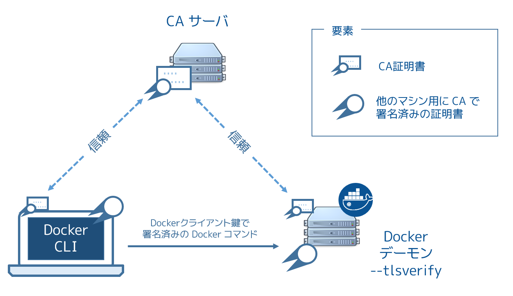

.. -*- coding: utf-8 -*-
.. URL: https://docs.docker.com/swarm/secure-swarm-tls/
.. SOURCE: https://github.com/docker/swarm/blob/master/docs/secure-swarm-tls.md
   doc version: 1.11
      https://github.com/docker/swarm/commits/master/docs/secure-swarm-tls.md
.. check date: 2016/04/29
.. Commits on Apr 19, 2016 7e119761d4405e46d208f63d2895264722680c0e
.. -------------------------------------------------------------------

.. Overview Swarm with TLS

.. _overview-swarm-with-tls:

==============================
Swarm と TLS の概要
==============================

.. sidebar:: 目次

   .. contents:: 
       :depth: 3
       :local:

.. All nodes in a Swarm cluster must bind their Docker daemons to a network port. This has obvious security implications. These implications are compounded when the network in question is untrusted such as the internet. To mitigate these risks, Docker Swarm and the Docker Engine daemon support Transport Layer Security (TLS).

Swam クラスタの全てのノードでは、それぞれの Docker デーモンが通信用のポートを公開（バインド）する必要があります。そのため、これがセキュリティ上の懸念となるのは明らかです。インターネットのような信頼を疑うべきネットワークにおいて、懸念は倍増します。これらのリスクを減らすため、Docker Swarm と Docker Engine のデーモンは TLS （Transport Layer Security；トランスポート・レイヤ・セキュリティ）をサポートしています。

..    Note: TLS is the successor to SSL (Secure Sockets Layer) and the two terms are often used interchangeably. Docker uses TLS, this term is used throughout this article.

.. note::

   TLS は SSL （Secure Sockets Layer）の後継であり、この２つは相互に互換性があります。この記事の中では、Docker は TLS を使います。

.. Learn the TLS concepts

.. _learn-the-tls-concept:

TLS の概念を学ぶ
====================

.. Before going further, it is important to understand the basic concepts of TLS and public key infrastructure (PKI).

先に進む前に、TLS と PKI (Public Key Infrastructure；公開鍵基盤) の基本概念を理解しておくことが重要です。

.. Public key infrastructure is a combination of security related technologies, policies, and procedures, that are used to create and manage digital certificates. These certificates and infrastructure secure digital communication using mechanisms such as authentication and encryption.

公開鍵基盤はセキュリティに関連する技術・ポリシー・手続きを組み合わせたものです。これらが電子証明書の作成や管理に使われます。認証や暗号化のような仕組みにおいて、これらの証明書とインフラの安全なデジタル通信が使われます。

.. The following analogy may be useful. It is common practice that passports are used to verify an individual’s identity. Passports usually contain a photograph and biometric information that identify the owner. A passport also lists the country that issued it, as well as valid from and valid to dates. Digital certificates are very similar. The text below is an extract from a a digital certificate:

もしかすると、次の例えが分かりやすいかもしれません。個人を認識する手段としてパスポートを使うことは一般的です。通常のパスポートには個人を特定するための写真や生体情報が記録されています。また、パスポートには有効な国名だけでなく、有効・無効に関する日付も記録されています。この仕組みと電子証明は非常に似ています。ある電子証明書を展開したのが、次のテキストです。

.. code-block:: bash

   Certificate:
   Data:
       Version: 3 (0x2)
       Serial Number: 9590646456311914051 (0x8518d2237ad49e43)
   Signature Algorithm: sha256WithRSAEncryption
       Issuer: C=US, ST=CA, L=Sanfrancisco, O=Docker Inc
       Validity
           Not Before: Jan 18 09:42:16 2016 GMT
           Not After : Jan 15 09:42:16 2026 GMT
       Subject: CN=swarm

.. This certificate identifies a computer called swarm. The certificate is valid between January 2016 and January 2026 and was issued by Docker Inc. based in the state of California in the US.

この証明書で **swarm** という名称のコンピュータを識別します。証明書の有効期間は 2016年1月から2026年1月までです。そしてこれを発行したのは米国カリフォルニア州を拠点としている Docker, Inc. です。

.. Just as passports authenticate individuals as they board flights and clear customs, digital certificates authenticate computers on a network.

パスポートを使った個人認証が使われるのは、飛行機の搭乗や、板で囲まれた税関においてです。電子証明書はネットワーク上のコンピュータを認証するために使います。

.. Public key infrastructure (PKI) is the combination of technologies, policies, and procedures that work behind the scenes to enable digital certificates. Some of the technologies, policies and procedures provided by PKI include:

公開鍵基盤(PKI)とは、電子証明書を有効に機能させるため、その背後で使われる技術・ポリシー・手順の組み合わせなのです。PKI によって提供される技術・ポリシー・手続きには、以下の項目が含まれます。

..    Services to securely request certificates
    Procedures to authenticate the entity requesting the certificate
    Procedures to determine the entity’s eligibility for the certificate
    Technologies and processes to issue certificates
    Technologies and processes to revoke certificates

* 証明書を安全に要求するためのサービス
* 要求された証明書が、実在しているかどうか確認するための手順
* 証明書の実体が、適格かどうか決めるための手順
* 証明書を発行する技術と手順
* 証明書を破棄する技術と手順

.. How does Docker Engine authenticate using TLS

.. _how-does-docker-engine-authenticate-using-tls:

Docker Engine で TLS 認証を使うには
========================================

.. In this section, you’ll learn how Docker Engine and Swarm use PKI and certificates to increase security.

このセクションは Docker Engine と Swarm のセキュリティを高めるために、 PKI と証明書を使う方法を学びます。

.. You can configure both the Docker Engine CLI and the Docker Engine daemon to require TLS for authentication. Configuring TLS means that all communications between the Docker Engine CLI and the Docker Engine daemon must be accompanied with, and signed by a trusted digital certificate. The Engine CLI must provide its digital certificate before the Engine daemon will accept incoming commands from it.

TLS 認証を使うためには、 Docker Engine CLI と Docker Engine デーモンの両方で設定が必要です。TLS の設定を行うというのは、Docker Engine CLI と Docker Engine デーモン間の全ての通信を、信頼のある電子証明書で署名された状態で行うことを意味します。Docker Engine CLI は Docker Engine デーモンと通信する前に、電子証明書の提出が必要です。

.. The Docker Engine daemon must also trust the certificate that the Docker Engine CLI uses. This trust is usually established by way of a trusted third party. The Docker Engine CLI and daemon in the diagram below are configured to require TLS authentication.

また、Docker Engine デーモンも Docker Engine CLI が使う証明証を信頼する必要があります。信頼とは、通常は第三者の信頼機関によって担保されます。下図は Docker Engine CLI とデーモンが TLS 通信に必要となる設定です。

.. The trusted third party in this diagram is the the Certificate Authority (CA) server. Like the country in the passport example, a CA creates, signs, issues, revokes certificates. Trust is established by installing the CA’s root certificate on the host running the Docker Engine daemon. The Engine CLI then requests its own certificate from the CA server, which the CA server signs and issues to the client.

図中における信頼できる第三者とは認証局（CA; Certificate Authority）サーバです。認証局（CA）とは、パスポートを例にすると国に相当します。認証局は証明証を作成・署名・発行・無効化します。Docker Engine デーモンを実行するホスト上では、信頼を確立するために、認証局のルート証明書をインストールします。Docker Engine CLI は認証局のサーバに対して証明書を要求します。認証局サーバはクライアントに対して証明書の署名・発行を行います。

.. The Engine CLI sends its certificate to the Docker Engine daemon before issuing commands. The daemon inspects the certificate, and because daemon trusts the CA, the daemon automatically trusts any certificates signed by the CA. Assuming the certificate is in order (the certificate has not expired or been revoked etc.) the Docker Engine daemon accepts commands from this trusted Docker Engine CLI.

Docker Engine CLI はコマンドを実行する前に、この（認証局で署名された）証明書を Docker Engine デーモンに送ります。デーモンは証明書を調査します。その証明書がデーモンの信頼する認証局が署名したものであれば、デーモンは自動的に信頼します。証明書が適切であるとみなすと（証明書が有効期間内であり、破棄されたものでないと分かれば）、Docker Engine デーモンは信頼できる Engine CLI からの要求とみなしコマンドを受け付けます。

.. The Docker Engine CLI is simply a client that uses the Docker Remote API to communicate with the Docker Engine daemon. Any client that uses this Docker Remote API can use TLS. For example, other Engine clients such as Docker Universal Control Plane (UCP) have TLS support built-in. Other, third party products, that use Docker’s Remote API, can also be configured this way.

Docker Engine CLI はシンプルなクライアントです。Docker Engine デーモンと通信するために Docker リモート API を使います。Docker リモート API を利用可能なクライアントであれば、どれも TLS が使えます。例えば、TLS をサポートしている Docker ユニバーサル・コントロール・プレーン (UCP) に他のクライアントからもアクセス可能です。他のクライアントとは、Docker リモート API を使うサードパーティー製のプロダクトでも、同様に設定ができます。

.. TLS modes with Docker and Swarm

.. _tls-modes-with-docker-and-swarm:

Docker と Swarm の TLS モード
==============================

.. Now that you know how certificates are used by the Docker Engine daemon for authentication, it’s important to be aware of the three TLS configurations possible with Docker Engine daemon and its clients:

Docker Engine デーモンが認証に使う証明書について学んできました。重要なのは、Docker Engine デーモンとクライアントで利用できる TLS 設定には３種類あることに注意すべきです。

..    External 3rd party CA
    Internal corporate CA
    Self-signed certificates

* 外部のサードパーティー製の証明局(CA)
* 社内にある証明局(CA)
* 証明書に対する自己署名

.. These configurations are differentiated by the type of entity acting as the Certificate Authority (CA).

どの証明局(CA) を使うかにより、実際の設定内容が異なります。

.. External 3rd party CA

.. _external-3rd-party-ca:

外部のサードパーティー製の証明局
----------------------------------------

.. An external CA is a trusted 3rd party company that provides a means of creating, issuing, revoking, and otherwise managing certificates. They are trusted in the sense that they have to fulfill specific conditions and maintain high levels of security and business practices to win your business. You also have to install the external CA’s root certificates for you computers and services to trust them.

外部の証明局とは、信頼できる第三者による会社を指します。そこが証明書の作成、発行、無効化、その他の管理を行います。信頼されているという言葉が意味するのは、高いレベルのセキュリティを実現・維持し、ビジネスに対する成功をもたらすものです。また、外部の認証局のルート証明書をインストールすることにより、皆さんのコンピュータやサーバも信頼できうるものとします。

.. When you use an external 3rd party CA, they create, sign, issue, revoke and otherwise manage your certificates. They normally charge a fee for these services, but are considered an enterprise-class scalable solution that provides a high degree of trust.

外部のサードパーティー認証局を使えば、その認証局によって、皆さんの証明書が作成・署名・発行・無効化など管理が行われます。通常はサービスの利用に料金が発生します。しかし、エンタープライズ・クラスの安定したソリューションを考慮した、高度な信頼をもたらすでしょう。

.. Internal corporate CA

.. _internal-corporate-ca:

社内にある証明局
--------------------

.. Many organizations choose to implement their own Certificate Authorities and PKI. Common examples are using OpenSSL and Microsoft Active Directory. In this case, your company is its own Certificate Authority with all the work it entails. The benefit is, as your own CA, you have more control over your PKI.

多くの組織で、その組織内で認証局や PKI を運用することが選ばれています。そのために OpenSSL もしくは Microsoft Active Directory を使うのが一般的な例です。このような場合、皆さんの会社自身が自信で証明機関を運用しています。この利点は、自分自身が証明局ですのので、更なる PKI を管理できる点です。

.. Running your own CA and PKI requires you to provide all of the services offered by external 3rd party CAs. These include creating, issuing, revoking, and otherwise managing certificates. Doing all of this yourself has its own costs and overheads. However, for a large corporation, it still may reduce costs in comparison to using an external 3rd party service.

外部のサードパーティー認証局が提供するサービスを使い、自身の認証局や PKI を必要に応じて運用できます。これには証明書の作成・発行・破棄などの管理が含まれています。全てを自分たちで運用するとコストやオーバヘッドが必要となるでしょう。しかし、大規模な企業であれば、全てサードパーティーによるサービスを使うよりはコストを削減できるかもしれません。

.. Assuming you operate and manage your own internal CAs and PKI properly, an internal, corporate CA can be a highly scalable and highly secure option.

自分たち自身で認証局や PKI の内部運用・管理を考えているのであれば、企業における認証局を実現するため、高い可用性や高いセキュリティについて考慮が必要になるでしょう。

.. Self-signed certificates

自己署名した証明書
--------------------

.. As the name suggests, self-signed certificates are certificates that are signed with their own private key rather than a trusted CA. This is a low cost and simple to use option. If you implement and manage self-signed certificates correctly, they can be better than using no certificates.

その名前の通り、自己署名した証明書とは、信頼できる認証局のかわりに、自分自身の秘密鍵で署名するものです。これは低いコストかつ簡単に使えるものです。もし自分自身で署名した証明書を適切に運用したいのであれば、証明書を使わないのも良い方法かもしれません。

.. Because self-signed certificates lack of a full-blown PKI, they do not scale well and lack many of the advantages offered by the other options. One of their disadvantages is that cannot revoke self-signed certificates. Due to this, and other limitations, self-signed certificates are considered the least secure of the three options. Self-signed certificates are not recommended for public facing production workloads exposed to untrusted networks.

なぜならば、自己署名した証明書が本来の PKI を損ねる可能性があるためです。この手法はスケールしませんし、他の選択肢に比べますと、多くの点で不利です。不利な点の１つに、自分自身で自己署名した証明書を無効化できません。これだけでなく、他にも制限があるため、自己署名の証明書は、この３つの選択肢の中で最低のセキュリティと考えられます。信頼できないネットワーク上でプロダクション用のワークロードを公開する必要があれば、自己署名の証明書の利用は推奨されません。

.. Related information

関連情報
====================

..    Configure Docker Swarm for TLS
    Docker security

* :doc:`configure-tls`
* :doc:`/engine/security/security`

.. seealso:: 

   Overview Swarm with TLS
      https://docs.docker.com/swarm/secure-swarm-tls/
