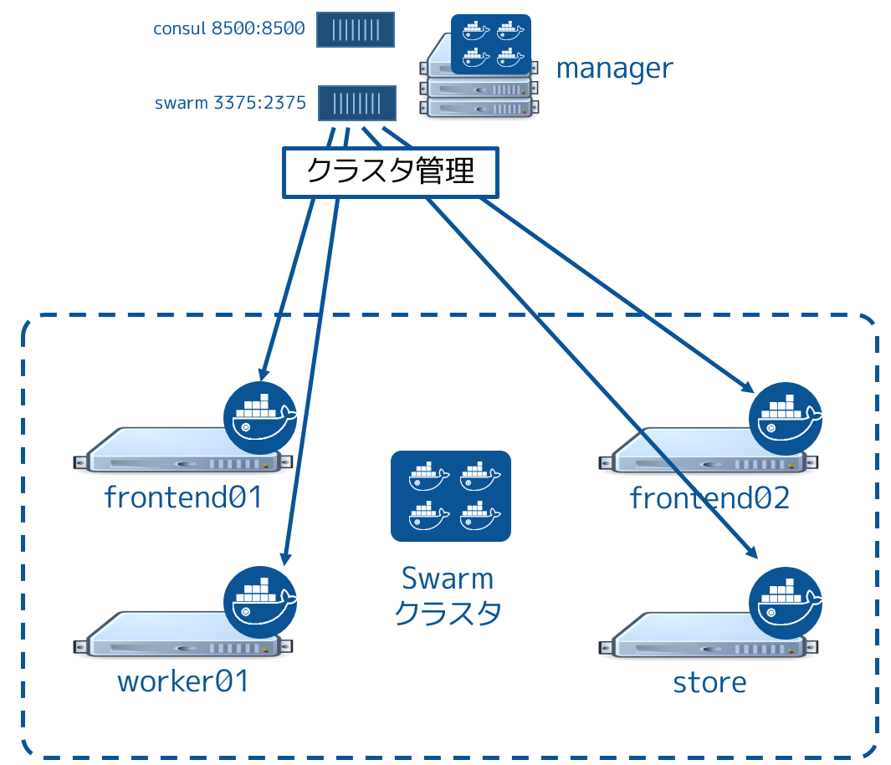

.. *- coding: utf-8 -*-
.. URL: https://docs.docker.com/swarm/swarm_at_scale/
.. SOURCE: https://github.com/docker/swarm/blob/master/docs/swarm_at_scale.md
   doc version: 1.10
      https://github.com/docker/swarm/commits/master/docs/swarm_at_scale.md
.. check date: 2016/02/27
.. Commits on Feb 10, 2016 a08742eb7225372cd014ef8952844d32f1eeedd8
.. -------------------------------------------------------------------

.. Try Swarm at scale

.. _try-swam-at-scale

=======================================
swarm のスケールを試す
=======================================

.. Using this example, you’ll deploy a voting application on a Swarm cluster. The example walks you through creating a Swarm cluster and deploying the application against the cluster. This walk through is intended to illustrate one example of a typical development process.

ここで扱う例は、 Swarm クラスタ上に投票アプリケーションをデプロイします。例の流れは Swarm クラスタを作り、クラスタ上にアプリケーションをデプロイします。典型的なデプロイ手順例として説明するのを意図しているため、この流れを通します。

.. After building and manually deploying the voting application, you’ll construct a Docker Compose file. You (or others) can use the file to deploy and scale the application further. The article also provides a troubleshooting section you can use while developing or deploying the voting application.

投票アプリケーションの構築と手動でデプロイした後、Docker Compose ファイルを作成します。あなた（もしくは誰か）はこのファイルを使い、アプリケーションの更なるデプロイやスケールが可能になります。

.. About the example

.. _swarm-about-the-example:

サンプルについて
====================

.. Your company is a pet food company that has bought an commercial during the Superbowl. The commercial drives viewers to a web survey that asks users to vote – cats or dogs. You are developing the web survey. Your survey must ensure that millions of people can vote concurrently without your website becoming unavailable. You don’t need real-time results, a company press release announces the results. However, you do need confidence that every vote is counted.

あなたの会社はペットフード会社です。スーパーボウルのコマーシャル枠を購入します！　コマーシャルでは、視聴者に対して調査のために犬か猫かの投票を呼びかけます。この調査は100万人もの人々が投票してもウェブサイトが止まらないようにする必要があります。結果をリアルタイムで知る必要はなく、結果は会社のプレスリリースで公開します。しかし、どれだけ投票されたかは、投票後とに確実に把握する必要があります。

.. The example assumes you are deploying the application to a Docker Swarm cluster running on top of Amazon Web Services (AWS). AWS is an example only. There is nothing about this application or deployment that requires it. You could deploy the application to a Docker Swarm cluster running on; a different cloud provider such as Microsoft Azure, on premises in your own physical data center, or in a development environment on your laptop.

このサンプルでは Amazon Web Services (AWS) 上で動く Docker Swarm クラスタに、アプリケーションをデプロイします。AWS は単なる例です。このアプリケーションにとって必須ではなく、デプロイのために使うだけです。Docker swarm クラスタ上にアプリケーションを展開するには、Microsoft Azure のような他のクラウド・プロバイダや、物理データセンタ上のオンプレミスや、あるいは、自分のノート PC 上の開発環境でも構いません。

.. The example requires you to perform the following high-level steps:

このサンプルでは以下のハイレベルなステップを進めていきます。

..    Deploy your infrastructure
    Create the Swarm cluster
    Overlay a container network on the cluster
    Deploy the voting application
    Test the application

* :ref:`deploy-your-infrastructure`
* :ref:`create-the-swarm-cluster`
* :ref:`overlay-a-container-network-on-the-cluster`
* :ref:`deploy-the-voting-application`
* :ref:`test-the-application`

.. Before working through the sample, make sure you understand the application and Swarm cluster architecture.

サンプルを動かす前に、アプリケーションと Swarm クラスタのアーキテクチャを理解していきます。

.. Application architecture

アプリケーションのアーキテクチャ
========================================

.. The voting application is a Dockerized microservice application. It uses a parallel web frontend that sends jobs to asynchronous background workers. The application’s design can accommodate arbitrarily large scale. The diagram below shows the high level architecture of the application.

投票アプリケーションは Docker 化されたマイクロサービス・アプリケーションです。並列なウェブ・フロントエンドを使い、ジョブを非同期のバックグラウンド・ワーカに送ります。アプリケーションは任意に大きくスケール可能な設計です。次の図はアプリケーションのハイレベルなアーキテクチャです。

.. image:: ./images/app-architecture.png
   :scale: 60%

.. The application is fully Dockerized with all services running inside of containers.

このアプリケーションは完全に Docker 化（Dockerized）しており、全てのサービスをコンテナ内で実行します。

.. The frontend consists of an Interlock load balancer with n frontend web servers and associated queues. The load balancer can handle an arbitrary number of web containers behind it (frontend01- frontendN). The web containers run a simple Python Flask application. Each container accepts votes and queues them to a Redis container on the same node. Each web container and Redis queue pair operates independently.

フロントエンドは interlock ロード・バランサと n 台のフロントエンド・ウェブサーバで構成され、クエリを作成します。ロードバランサは任意の数のウェブ・コンテナを背後で扱えます（ ``frontend01`` ～ ``frontendN`` ）。Webコンテナはシンプルな Python Flask アプリケーションです。各コンテナは投票を受け付け、同じノード上の Redis コンテナにキューを渡します。各ウェブ・コンテナと Redis キューのペアは独立して処理されます。

.. The load balancer together with the independent pairs allows the entire application to scale to an arbitrary size as needed to meet demand.

このペアはロードバランサと個別に連係できます。そのため、アプリケーション全体を需要に応じて任意の大きさにスケール可能です。

.. Behind the frontend is a worker tier which runs on separate nodes. This tier:

フロントエンドの背後にはワーカ層があり、別々のノードが動いています。この層は、

..    scans the Redis containers
    dequeues votes
    deduplicates votes to prevent double voting
    commits the results to a Postgres container running on a separate node

* Redis コンテナをスキャン
* 投票のキューを回収
* 重複投票を防ぐために投票結果を複製
* 別のノードにある PostgreSQL が動いているコンテナに結果をコミットする

.. Just like the front end, the worker tier can also scale arbitrarily.

フロントエンドと同様に、ワーカー層も任意にスケールできます。

.. Swarm Cluster Architecture

.. _swarm-cluster-architecture:

Swarm クラスタのアーキテクチャ
------------------------------

.. To support the application the design calls for a Swarm cluster that with a single Swarm manager and 4 nodes as shown below.

アプリケーションの設計をサポートするのが、１つの Swarm マネージャと４つのノードで構成される Swarm クラスタです。

.. image:: ./images/swarm-cluster-arch.png
   :scale: 60%

.. All four nodes in the cluster are running the Docker daemon, as is the Swarm manager and the Interlock load balancer. The Swarm manager exists on a Docker host that is not part of the cluster and is considered out of band for the application. The Interlock load balancer could be placed inside of the cluster, but for this demonstration it is not.

クラスタの４つのノードすべてで Docker デーモンが動作します。Swarm マネージャと interlock ロードバランサも同様です。Swarm マネージャは Docker ホスト上に存在します。これはクラスタの一部ではなく、アプリケーションの外にあるものと考えます。Interlock ロードバランサはクラスタ内に設置可能ですが、今回のサンプルでは扱いません。

.. The diagram below shows the application architecture overlayed on top of the Swarm cluster architecture. After completing the example and deploying your application, this is what your environment should look like.

以下の図は Swarm クラスタのアーキテクチャ上に、アプリケーションのアプリケーションを重ねています。このサンプルを終え、アプリケーションをデプロイすると、次のような環境が整います。

.. image:: ./images/final-result.png
   :scale: 60%

.. As the previous diagram shows, each node in the cluster runs the following containers:

この図にあるように、クラスタの各ノードでは次のコンテナを実行します。

..    frontend01:
        Container: Pyhton flask web app (frontend01)
        Container: Redis (redis01)
    frontend02:
        Container: Python flask web app (frontend02)
        Container: Redis (redis02)
    worker01: vote worker app (worker01)
    store:
        Container: Postgres (pg)
        Container: results app (results-app)

* ``frontend01`` ：

  * コンテナ：Python flask ウェブアプリ（frontend01）
  * コンテナ：Redis（redis01）

* ``frontend02`` ：

  * コンテナ：Python flask ウェブアプリ（frontend02）
  * コンテナ：Redis（redis02）

* ``worker01`` ：投票ワーカーアプリ（worker01）
* ``store`` ：

  * コンテナ：Postgres（pg）
  * コンテナ：reslutsアプリ（results-app）

.. Deploy your infrastructure

.. _deploy-your-infrastructure:

インフラのデプロイ
====================

.. As previously stated, this article will walk you through deploying the application to a Swam cluster in an AWS Virtual Private Cloud (VPC). However, you can reproduce the environment design on whatever platform you wish. For example, you could place the application on another public cloud platform such as DigitalOcean, on premises in your data center, or even in in a test environment on your laptop.

先だって述べたとおり、この記事ではアプリケーションを AWS の VPC （バーチャル・プライベート・クラスタ）上の Swarm クラスタにデプロイします。しかしながら、任意のプラットフォーム上で環境設計を再現可能です。例えば、 Digital Ocean のような別のパブリック・クラウド・プラットフォームや、データセンタ内のオンプレミス上や、ノート PC 上のテスト環境にもアプリケーションをデプロイできます。

.. Deploying the AWS infrastructure requires that you first build the VPC and then apply apply the CloudFormation template. While you cloud create the entire VPC and all instances via a CloudFormation template, splitting the deployment into two steps allows the CloudFormation template to be easily used to build instances in existing VPCs.

AWS 基盤にデプロイする時に必要なのは、まず VPC を準備し、それから `CloudFourmation <https://github.com/docker/swarm-microservice-demo-v1/blob/master/AWS/cloudformation.json>`_ 用テンプレートの適用です。

.. The diagram below shows the VPC infrastructure required to run the CloudFormation template.

以下の図は CloudFormation テンプレートを実行するために必要となる VPC 基盤です。

.. image:: ./images/cloud-formation-tmp.png
   :scale: 60%

.. The AWS configuration is a single VPC with a single public subnet. The VPC must be in the us-west-1 Region (N. California). This Region is required for this particular CloudFormation template to work. The VPC network address space is 192.168.0.0/16 and single 24-bit public subnet is carved out as 192.168.33.0/24. The subnet must be configured with a default route to the internet via the VPC’s internet gateway. All 6 EC2 instances are deployed into this public subnet.

AWS の設定は１つの VPC 上で１つのパブリック・サブネットを使います。VPC は ``us-west-1`` リージョン（N.California）の必要があります。CloudFormation テンプレートを動作させるために、このリージョンの指定が要ります。VPC ネットワーク・アドレス空間は ``192.168.0.0/16`` であり、１つの 24 ビットのパブリック・サブセットが 192.168.33.0/24 として切り出されています。このサブセットからインターネットへのデフォルト経路は、VPC の内部ゲートウェイを経由する必要があります。６つの EC2 インスタンスの全てを、このバブリック・サブセットにデプロイします。

.. Once the VPC is created you can deploy the EC2 instances using the CloudFormation template located here.

VPC を作成したら、 `こちら <https://github.com/docker/swarm-microservice-demo-v1/blob/master/AWS/cloudformation.json>`_ に置かれている CloudFormation テンプレートを使って EC2 インスタンスをデプロイできます。

..    Note: If you are not deploying to AWS, or are not using the CloudFormation template mentioned above, make sure your Docker hosts are running a 3.16 or higher kernel. This kernel is required by Docker’s container networking feature.

.. note::

   AWS へデプロイしないのであれば、この CloudFormation テンプレートは使いません。Docker ホストのカーネルが 3.16 以上であることを確認してください。このカーネルは Docker のコンテナ・ネットワーク機能を使うために必要です。

.. Step 1. Build and configure the VPC

.. _step-1-build-and-configure-the-vpc:

ステップ１. VPC の構築と設定
------------------------------

.. This step assumes you know how to configure a VPC either manually or using the VPC wizard on Amazon. You can build the VPC manually or by using using the VPC Wizard. If you use the wizard, be sure to choose the VPC with a Single Public Subnet option.

このステップでは Amazon 上で  VPC を手動または VPC ウイザードを使って設定します。VPC の構築は手動でも VPC ウイザードを使っても構いません。もしもウイザードを使うのであれば、 **１個のパブリックサブネットを持つ VPC （VPC with a Single Public Subnet）** の選択必要です。

.. Configure your VPC with the following values:

VPC の設定には以下の値を使います。

..    Region: N. California (us-west-1)
    VPC Name: Swarm-scale
    VPC Network (CIDR): 192.168.0.0/16
        DNS resolution: Yes
    Subnet name: PublicSubnet
        Subnet type: Public (with route to the internet)
        Subnet network (CIDR): 192.168.33.0/24
        Auto-assign public IP: Yes
        Availability Zone: Any
    Router: A single router with a route for local traffic and default route for traffic to the internet
    Internet gateway: A single internet gateway used as default route for the subnet’s routing table

* リージョン： バージニア北部（N. California; us-west-1）
* VPC 名： Swarm-scale
* VPC ネットワーク (CIDR)： 192.168.0.0/16

  * DNS 解決：はい

* サブネット名： パブリックサブネット

  * サブネット・タイプ： パブリック（インターネットへの経路なし）
  * サブネット・ネットワーク (CIDR)： 192.168.33.0/24
  * IP アドレスの自動割り当て： はい
  * アベイラビリティゾーン： 指定なし

* ルータ： *ローカル* のトラフィックを導くルータであり、デフォルトの経路はインターネットに対して流れます。
* インターネット・ゲートウェイ： インターネット・ゲートウェイであり、サブネットのルーティング・テーブルに流すために使います。

.. You’ll configure the remaining AWS settings in the next section as part of the CloudFormation template.

引き続き CloudFormation テンプレートを使う次のセクションに進みましょう。

.. Step 2. Apply the CloudFormation template

.. _step2-apply-the-cloudformation-template:

ステップ２. CloudFormation テンプレートの適用
--------------------------------------------------

.. Before you can apply the CloudFormation template, you will need to have created a VPC as per instructions in the previous section. You will also need access to the private key of an EC2 KeyPair associated with your AWS account in the us-west-1 Region. Follow the steps below to build the remainder of the AWS infrastructure using the CloudFormation template.

CloudFourmation テンプレートを適用する前に、前のセクションの指示に従い VPC を作成しておく必用があります。また、 ``us-west-1`` リージョンの AWS アカウントに、EC2 キーペアと自分の秘密鍵を関連づけておく必要があります。以下の手順では、AWS 基盤上で残っている手順を、 CloudFormation テンプレートを使って構築します。

..    Choose Create Stack from the CloudFormation page in the AWS Console
    Click the Choose file button under the Choose a template section
    Select the swarm-scale.json CloudFormation template available from the application’s GitHub repo
    Click Next
    Give the Stack a name. You can name the stack whatever you want, though it is recommended to use a meaningful name
    Select a KeyPair form the dropdown list
    Select the correct Subnetid (PublicSubnet) and Vpcid (SwarmCluster) from the dropdowns
    Click Next
    Click Next again
    Review your settings and click Create AWS displays the progress of your stack being created

1. AWS コンソールの CloudFormation ページから **Create Stack** （スタックの作成）を選びます。
2. **Choose a template** （テンプレートの選択）セクションにある **Upload a template to Amazon S3** （テンプレートを Amazon S3 にアップロード）を選び、 **選択** ボタンを押します。
3. `アプリケーションの GitHub リポジトリ`_ からダウンロードした **swarm-scale.json** CloudFormation テンプレートを選びます。
4. **Next** を押します。
5. stack に名前を付けます。stack には任意の名前を指定できますが、意味のある名前の指定を推奨します。
6. ドロップダウン・リストからキーペアを選びます。
7. ドロップダウンから適切な **Subnetid** （パブリック・サブネット）と **Vpcid** （SwarmCluster）を選びます。
8. **Next** を押します。
9. もう一度 **Next** を押します。
10. 設定内容を確認し、 **Create** をクリックし、AWS の表示でスタック構築が進行するのを確認します。

Step 3. Check your deployment

.. _step3-check-your-deployment:

ステップ３. デプロイを確認
------------------------------

.. When completed, the CloudFormation populates your VPC with the following six EC2 instances:

完了すると、CloudFormation は VPC 上に６つの EC2 インスタンスを追加しています。

* ``manager`` : t2.micro / 192.168.33.11
* ``interlock`` : t2.micro / 192.168.33.12
* ``frontend01`` : t2.micro / 192.168.33.20
* ``frontend02`` : t2.micro / 192.168.33.21
* ``worker01`` : t2.micro / 192.168.33.200
* ``store`` : m3.medium / 192.168.33.250

.. Your AWS infrastructure should look like this.

AWS 基盤は次のようになっているでしょう。

.. image:: ./images/aws-infrastructure.png
   :scale: 60%

.. All instances are based on the ami-56f59e36 AMI. This is an Ubuntu 14.04 image with a 3.16 kernel and 1.9.1 of the Docker Engine installed. It also has the following parameters added to the DOCKER_OPTS line in /etc/default/docker:

インスタンスは ``ami-56f59e36`` AMI をベースにしています。これは カーネル 3.16 の Ubuntu 14.04 イメージであり、Docker Engine 1.9.1 が院素ot-ルされています。また、 ``/etc/default/docker`` の ``DOCKER_OPTS`` 行に、次のパラメータを追加しています。

.. code-block:: bash

   --cluster-store=consul://192.168.33.11:8500 --cluster-advertise=eth0:2375 -H=tcp://0.0.0.0:2375 -H=unix:///var/run/docker.sock\

.. Once your stack is created successfully you are ready to progress to the next step and build the Swarm cluster. From this point, the instructions refer to the AWS EC2 instances as “nodes”.

スタックの作成に成功すると、 Swarm クラスタ作成という次のステップに進む準備が整いました。移行の手順では、 AWS EC2 インスタンスを「ノード」と言及します。

.. Create the Swarm cluster

.. _crate-the-swarm-cluster:

Swarm クラスタの作成
====================

.. Now that your underlying network infrastructure is built, you are ready to build and configure the Swarm cluster.

これで基礎となるネットワーク基盤は構築できましたので、Swarm クタスタの構築と設定を行う準備が整いました。

.. Step 1: Construct the cluster

.. _step1-construct-the-cluster:

ステップ１： クラスタの構築
------------------------------

.. The steps below construct a Swarm cluster by:

Swarm クラスタの構築は、以下の手順で進めます。

..    using Consul as the discovery backend
    join the frontend, worker
    store EC2 instances to the cluster
    use the spread scheduling strategy.

* Consul をディスカバリ・バックエンドに使います。
* ``frontend`` と ``worker`` を追加します。
* ``store`` EC2 インスタンスをクラスタに追加します。
* ``spread`` スケジューリング・ストラテジを使います。

.. Perform all of the following commands from the manager node.

以下のコマンドは、すべて ``manager`` ノード上で実行します。

..    Start a new Consul container that listens on TCP port 8500

1. 新しい Consul コンテナを起動し、TCP ポート 8500 をリッスンします。

.. code-block:: bash

   $ sudo docker run --restart=unless-stopped -d -p 8500:8500 -h consul progrium/consul -server -bootstrap

..     This starts a Consul container for use as the Swarm discovery service. This backend is also used as the K/V store for the container network that you overlay on the Swarm cluster in a later step.

ここで起動した Consul コンテナは、 Swarm ディスカバリ・サービスのために使います。このバックエンドはコンテナ・ネットワークのバックエンドとしても使います。こちらは後の手順で Swarm クラスタ上に重ねます。

..    Start a Swarm manager container.

2. Swarm マネージャのコンテナを起動します。

..    This command maps port 3375 on the manager node to port 2375 in the Swarm manager container

次のコマンドは ``manager`` ノード上のポート 3375 を Swarm マネージャ・コンテナのポート 2375 に割り当てます。

.. code-block:: bash

   $ sudo docker run --restart=unless-stopped -d -p 3375:2375 swarm manage consul://192.168.33.11:8500/

..     This Swarm manager container is the heart of your Swarm cluster. It is responsible for receiving all Docker commands sent to the cluster, and for scheduling resources against the cluster. In a real-world production deployment you would configure additional replica Swarm managers as secondaries for high availability (HA).

この Swarm マネージャ・コンテナは、 Swarm クラスタの中心です。全ての Docker コマンドを受け取り、クラスタに対して送信し、クラスタに対するリソースをスケジューリングする役割です。実際のプロダクション環境では、高可用性のために２つめの Swarm マネージャをレプリカとしてデプロイするでしょう。

..    Set the DOCKER_HOST environment variable.

3. ``DOCKER_HOST`` 環境変数を設定します。

..    This ensures that the default endpoint for Docker commands is the Docker daemon running on the manager node

Docker コマンド用のデフォルト・エンドポイントを Docker デーモンが動作している ``manager``  ノードに指定します。

.. code-block:: bash

   $ export DOCKER_HOST="tcp://192.168.33.11:3375"

..    While still on the manager node, join the nodes to the cluster.

4. ``manager`` ノード上のまま、ノードをクラスタに追加します。

..    You can run these commands form the manager node because the -H flag sends the commands to the Docker daemons on the nodes. The command joins a node to the cluster and registers it with the Consul discovery service.

これらのコマンドは ``manager`` ノード上で実行できます。なぜなら、コマンド実行時に ``-H`` フラグで Docker デーモンの動作しているノードを指定しているためです。次のコマンドは Consul ディスカバリ・サービスのクラスタにノードを追加・登録します。

.. code-block:: bash

   sudo docker -H=tcp://<node-private-ip>:2375 run -d swarm join --advertise=<node-private-ip>:2375 consul://192.168.33.11:8500/

..    Substitute <node-private-ip in the command with the private IP of the you are adding. Repeat step 4 for every node you are adding to the cluster - frontend01, frontend02, worker01, and store.

コマンドの ``<node-private-ip>`` は適切なプライベート IP に置き換えます。このステップ４をクラスタに追加したい各ノードで行います。それぞれ ``frontend01`` 、 ``frontend02`` 、 ``worker01`` 、 ``store`` に対して行います。

.. Step 2: Review your work

.. _step2-review-your-work:

ステップ２：動作確認
--------------------

.. The diagram below shows the Swarm cluster that you created.

次の図は、これまでに作成した Swarm クラスタです。

.. The diagram shows the manager node is running two containers: consul and swarm. The consul container is providing the Swarm discovery service. This is where nodes and services register themselves and discover each other. The swarm container is running the swarm manage process which makes it act as the cluster manager. The manager is responsible for accepting Docker commands issued against the cluster and scheduling resources on the cluster.

この図は ``manager`` ノードで ``consul`` と ``swarm`` という２つのコンテナを実行しています。 ``consul`` コンテナは Swarm ディスカバリ・サービスを提供します。これはどこにノードやサービスがあるかお互いに登録するもので、お互いを発見できるようにします。 ``swarm`` コンテナは ``swarm manage`` プロセスとして実行されます。これはクラスタ・マネージャとして動作する状態です。マネージャはクラスタに対する Docker コマンドの実行を受付、クラスタ上のリソースに対してスケジューリングする役割です。

.. You mapped port 3375 on the manager node to port 2375 inside the swarm container. As a result, Docker clients (for example the CLI) wishing to issue commands against the cluster must send them to the manager node on port 3375. The swarm container then executes those commands against the relevant node(s) in the cluster over port 2375.

先ほど ``manager`` ノード上のポート 3375 を ``swarm`` コンテナ内の 2375 に割り当てました。そのため、Docker クライアント（例えば CLI ）でクラスタに対してコマンドを実行しようとする時は、 ``manager`` ノード上のポート 3375 に送信する必要があります。 ``swarm`` コンテナはクラスタ上の適切なノードに対し、ポート 2375 を通してコマンドを実行します。

.. Now that you have your Swarm cluster configured, you’ll overlay the container network that the application containers will be part of.

これで Swarm クラスタの設定は完了です。アプリケーション・コンテナの一部として使うコンテナ・ネットワークを被せましょう。

.. Overlay a container network on the cluster

.. _overlay-a-container-network-on-the-cluster:

クラスタにコンテナ・ネットワークを被せる
========================================

.. All containers that are part of the voting application belong to a container network called mynet. This will be an overlay network that allows all application containers to easily communicate irrespective of the underlying network that each node is on.

全てのコンテナは投票アプリケーションの一部であり、 ``mynet`` という名前のコンテナ・ネットワークに所属しています。これはオーバレイ・ネットワークといい、ノードがどのようなネットワーク上に構成されているかに拘わらず、アプリケーション・コンテナが簡単に通信できるようにするためのものです。

.. Step 1: Create the network

.. _step1-create-the-network:

ステップ１：ネットワーク作成
------------------------------

.. You can create the network and join the containers from any node in your VPC that is running Docker Engine. However, best practice when using Docker Swarm is to execute commands from the manager node, as this is where all management tasks happen.

VPC 上で Docker Engine を動かすためのネットワーク作成や、あら

ネットワークを作成し、Docker Engine が動くあらゆる VPC ノート上のコンテナを追加できます。しかしながら、Docker Swarm に対してコマンドを実行するベスト・プラクティスは、 ``manager`` ノードから全ての管理タスクが実行されることです。

(ToDo)