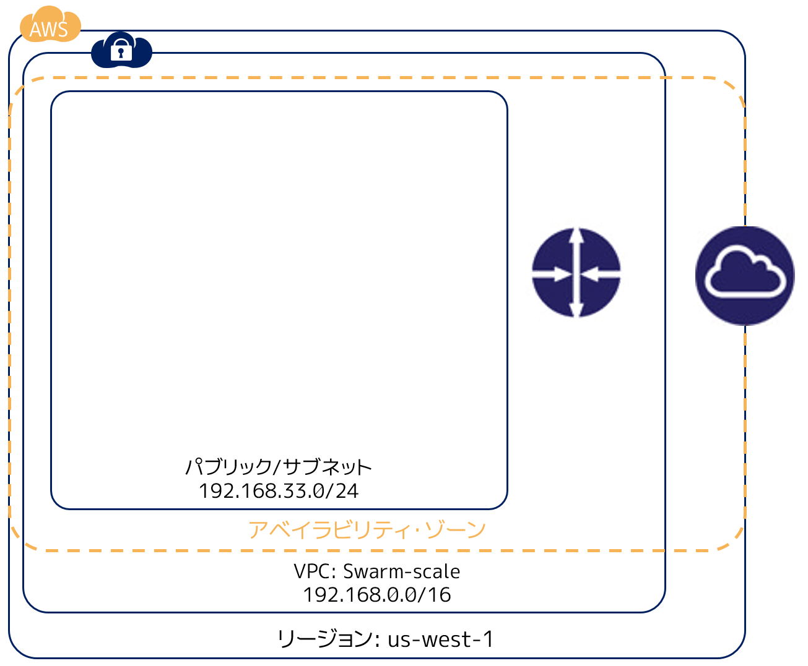
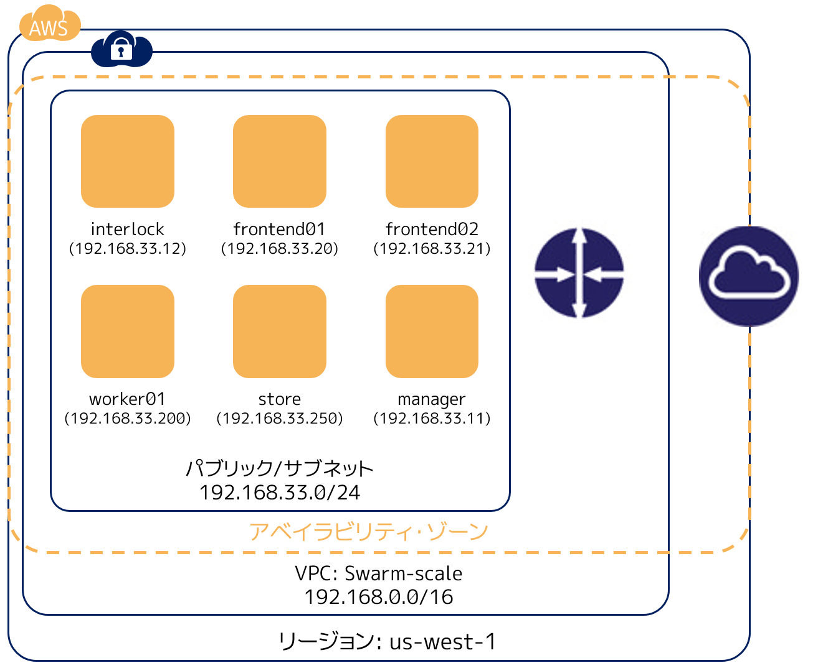

.. -*- coding: utf-8 -*-
.. URL: https://docs.docker.com/swarm/swarm_at_scale/02-infra-deploy/
.. SOURCE: https://github.com/docker/swarm/blob/master/docs/swarm_at_scale/02-infra-deploy.md
   doc version: 1.10
      https://github.com/docker/swarm/commits/master/docs/swarm_at_scale/02-infra-deploy.md
.. check date: 2016/03/09
.. Commits on Feb 28, 2016 ec8ceae209c54091065c8f9e50439bd76255b022
.. -------------------------------------------------------------------

.. Deploy your infrastructure

====================
インフラのデプロイ
====================

.. In this step, you create an AWS Virtual Private Cloud (VPC) to run your application stack on. Before you continue, make sure you have taken the time to learn the application architecture.

このステップでは、AWS バーチャル・プライベート・クラウド (VPC) 上にアプリケーション・スタックを走らせます。このまま進める前に、 :doc:`アプリケーション・アーキテクチャを学ぶ <01-about>` 必要があります。

.. This example uses AWS but the AWS provider is only one example of an infrastructure you can use. You can create the environment design on whatever infrastructure you wish. For example, you could place the application on another public cloud platform such as Azure or DigitalOcean, on premises in your data center, or even in in a test environment on your laptop.

このサンプルではアプリケーションを Amazon Web Services (AWS) 上の Swarm クラスタにデプロイします。AWS を使うのは単なる例です。このアプリケーションやデプロイに必要なだけです。皆さん自身で、任意のプラットフォーム上で環境設計を再現可能です。例えば、 Digital Ocean のような別のパブリック・クラウド・プラットフォームや、データセンタ内のオンプレミス上や、ノート PC 上のテスト環境にもアプリケーションをデプロイできます。

.. Note: If you are not deploying to AWS, or are not using the CloudFormation template used in the instructions below, make sure your Docker hosts are running a 3.16 or higher kernel. This kernel is required by Docker’s container networking feature.

.. note::

   AWS にデプロイしないか、以降の手順で CloudFormation テンプレートを使わない場合は、Docker ホストを実行するカーネルを 3.16 以上にしてください。Docker コンテナのネットワーク機能を使うためには、このバージョンのカーネルが必要です。

.. Overview of the deployment process

デプロイ手順の概要
====================

.. To deploy on an AWS infrastructure, you first build a VPC and then apply apply the CloudFormation template prepared for you. The template describes the hosts in the example’s stack. While you could create the entire VPC and all instances via a CloudFormation template, splitting the deployment into two steps lets you use the CloudFormation template to build the stack on an existing VPCs.

AWS 基盤にデプロイする時に必要なのは、まず VPC を準備し、それから `CloudFormation <https://github.com/docker/swarm-microservice-demo-v1/blob/master/AWS/cloudformation.json>`_ 用テンプレートを適用します。テンプレートにはサンプル・スタックで使うホストの詳細が記述されています。VPC を作成したあとは、CloudFormation テンプレートを通して全てのインスタンスを VPC 上に構築するように、デプロイを２つの手順に分けています。

.. The diagram below shows the VPC infrastructure required to run the CloudFormation template.

以下の図は CloudFormation テンプレートを実行するために必要となる VPC インフラです。

.. The configuration is a single VPC with a single public subnet. The VPC deployment relies on a cloudformation.json template which specifies in the us-west-1 Region (N. California) or us-west-2 (Oregon). The ability to create instances one of these regions is required for this particular CloudFormation template to work. If you want to use a different region, edit the template before the import step.

AWS の設定は１つの VPC 上で１つのパブリック・サブネットを使います。 `CloudFormation テンプレート <https://raw.githubusercontent.com/docker/swarm-microservice-demo-v1/master/AWS/cloudformation.json>`_ を動作させるために、VPC は ``us-west-1`` リージョン（N.California）か ``us-west-2`` （Oregon） にする必要があります。この CloudFormation テンプレートを動かすためには、これらのリージョンが **必要** です。別のリージョンを使いたい場合は、テンプレートをインポートする前にテンプレートのリージョン情報を変更してください。

.. The VPC network address space is 192.168.0.0/16 and single 24-bit public subnet is carved out as 192.168.33.0/24. The subnet must be configured with a default route to the internet via the VPC’s internet gateway. All six EC2 instances are deployed into this public subnet.

VPC ネットワーク・アドレス空間は ``192.168.0.0/16`` であり、１つの 24 ビットのパブリック・サブセットが 192.168.33.0/24 として切り出されています。このサブセットからインターネットへのデフォルト経路は、VPC の内部ゲートウェイを経由する必要があります。６つの EC2 インスタンスの全てを、このバブリック・サブセットにデプロイします。

.. Once the VPC is created, you deploy the EC2 instances using the CloudFormation template located in the docker/swarm-microservice-demo-v1 repository.

VPC を作成した後は、 ``docker/swarm-microservice-demo-v1`` `リポジトリ <https://github.com/docker/swarm-microservice-demo-v1/blob/master/AWS/cloudformation.json>`_ にある CloudFormation テンプレートを使って EC2 インスタンスをデプロイします。

.. Prerequisites

動作条件
==========

.. You’ll need to have an Amazon AWS account. This account can be personal or through a corporate instance. The account must be able to deploy EC2 instances in the us-west-1 region (N. California).

Amazon AWS アカウントを持っている必要があります。このアカウントとは、個人のものでも会社のものでも構いません。アカウントは EC2 インスタンスを ``us-west-1`` リージョン（N.california）にデプロイできる必要があります。

.. Before starting through this procedure, make sure you have an existing EC2 key pair in the us-west-1 region and that you have download its .pem file. If you aren’t sure, login into AWS. Then, follow the AWS documentation to ensure you have the key pair and have downloaded the .pem file.

以下の手順を進める前に、 ``us-west-1`` リージョンに EC2 キーペアが存在しているかどうかを確認し、 ``.pem`` ファイルをダウンロードします。もしまだであれば AWS にログインし、 `キーペアの作成手順 <http://docs.aws.amazon.com/ja_jp/AWSEC2/latest/UserGuide/ec2-key-pairs.html>`_ を読み、キーペアを作成してから、 ``.pem`` ファイルをダウンロードします。

.. Git clone the example application’s GitHub repo to your local machine. If you prefer, you can instead download a zip file and unzip the code in your local environment.

自分のローカルマシン上に `サンプル・アプリケーションの GitHub リポジトリ <https://github.com/docker/swarm-microservice-demo-v1>`_ を git clone （コピー作成）します。あるいは、ローカル環境に ``zip`` ファイルを `ダウンロード <https://github.com/docker/swarm-microservice-demo-v1/archive/master.zip>`_ し、展開する方法もあります。

.. Step 1. Build and configure the VPC

.. _step-1-build-and-configure-the-vpc:

ステップ１：VPC の構築と設定
==============================

.. This step shows you using the VPC wizard on Amazon. If you prefer to build the VPC manually, configure your VPC with the following values:

このステップでは Amazon 上の VPC ウィザードを使います。VPC を手動で構築したい場合は、以下の値で VPC を設定します。

.. list-table::
   :header-rows: 1

   * - フィールド
     - 値
   * - **VPC Network (CIDR)**
     - 192.168.0.0/16
   * - **VPC Name**
     - swarm-scale
   * - **Subnet network (CIDR)**
     - 192.168.33.0/24
   * - **Availability Zone**
     - N. California (us-west-1a or b)
   * - **Subnet name**
     - publicSwarm
   * - **DNS resolution**
     - Yes
   * - **Subnet type**
     - Public (with route to the internet)
   * - **Availability Zone**
     - Any
   * - **Auto-assign public IP**
     - Yes
   * - **Router**
     - A single router with a route for local traffic and default route for traffic to the internet
   * - **internet gateway**
     - A single internet gateway used as default route for the subnet’s routing table

To build the VPC, with the wizard.

VPC の作成にはウィザードを使います。

.. Go to the VPC dashboard.

1. VPC ダッシュボードに移動します。

.. Choose Start VPC Wizard.

2. **Start VPC Wizard** を選びます。

.. Make sure VPC with a Single Public Subnet is selected.

3. **VPC with a Single Public Subnet** を選びます。

.. Click Select.

4. **Select** をクリックします。

.. The browser displays the Step 2: VPC with a Single Public Subnet dialog.

ブラウザは **Step 2: VPC with a Single Public Subnet** ダイアログを表示します。

.. Complete the dialog as follows:

5. ダイアログを埋めます。

.. Click Create VPC.

6. **Create VPC** をクリックします。

.. AWS works to build the VPC and then presents you with the VPC Successfully Created page.

AWS が VPC を構築すると **VPC Successfully Created** ページが表示されます。

.. Click OK.

7. **OK** をクリックします。

.. Choose Subnets from the VPC Dashboard menu.

8. **VPC ダッシュボード** メニューから **Subnets** を選択します。

.. Locate your publicSwarm subnet.

9. ``publicSwarm`` サブネットを探します。

.. Choose Subnet Actions > Modify Auto-Assign Public IP.

10. ``Subnet Actions > Modify Auto-Assign Public IP`` を選びます。

..    Select Enable auto-assign Public IP and click Save.

11. **Enable auto-assign Public IP**を選び、 **Save** をクリックします。

.. In the next step, you configure the remaining AWS settings by using a CloudFormation template.

次のステップでは CloudFormation テンプレートを使って残りの AWS 設定を進めていきます。

.. Step 2. Build the network stack

ステップ２：ネットワーク・スタックの構築
========================================

.. In this step, you use CloudFormation template to build a stack on AWS. Before you begin, make sure you have the prerequisites:

このステップは CloudFormation テンプレートを使い AWS 上にスタックを構築します。始める前に、動作条件を確認します。

..    access to a private key pair associated with your AWS account.
    a clone or download of the the example code on your local machine.

* 自分の AWS アカウントに個人のキー・ペアを関連づけていること
* ローカルマシン上に `サンプル・コード <https://github.com/docker/swarm-microservice-demo-v1>` をダウンロードするか複製する

.. Then, do the following:

それから、以下の手順に進みます。

..    Go to the AWS console and choose CloudFormation.

1. AWS コンソールの CloudFormation ページから **Create Stack** （スタックの作成）を選びます。

..    Click Create Stack.

2. **Create Stack** をクリックします。

..    Under Choose a template click the Choose file button.

3. **Choose a template** （テンプレートの選択）セクションにある  **選択** ボタンを押します。

..    Browse to the download sample code and choose the the swarm-microservice-demo-v1/AWS/cloudformation.json CloudFormation template.

4. ダウンロードしたサンプル・コードを探したし、CloudFormation テンプレートにある ``swarm-microservice-demo-v1/AWS/cloudformation.json`` を指定します。

..    Click Next.

5. **Next** をクリックします。

..    The system pre-populates most of the Specify Details dialog from the template.

テンプレートの **Specify Details** ダイアログの詳細から対象システムを指定します。

..    Name the stack VotingAppStack.

6. スタックの名前は ``VotingAppStack`` です。

..    You can name the stack something else if you want just make sure it is meaningful.

この名前を使っても構いませんし、他にも意味のある名前を指定できます。

..    Select your key pair from the KeyName dropdown.

7. **KeyName** ドロップダウンからキーペアを選びます。

..    Select the publicSwarm for the Subnetid dropdown menu.

8. **Subnetid** ドロップダウン・メニューから ``publicSwarm`` を選びます。

..    Select swarm-scale from the Vpcid dropdown menu.

9. **Vpcid** ドロップダウン・メニューから ``swarm-scale`` を選びます。

..    Click Next twice to reach the Review page.

10. **Next** を２回押し、 **Review** ページを表示します。

..    Check the values.

11. 値を確認します。

..    The Template URL,SubnetId and VpcId are always unique, so yours will not match, but otherwise you should see the following:

**Template URL** 、 **SubnetId** 、 **VpcId** は常にユニークであり、毎回違いますが、以下のように表示されます。

(ToDo: 図）

..    Click Create.

12. **Create** を押します。

..    AWS displays the progress of your stack being created

スタックの作成が開始され、進行状況が表示されます。

.. Step 3. Check your deployment

ステップ３：デプロイの確認
==============================

.. When completed, the CloudFormation populates your VPC with six EC2 instances.

処理が終わると、CloudFormation は VPC と６つの EC2 インスタンスを投入しています。

.. Instance 	Size 	Private IP Address
   frontend01 	t2.micro 	192.168.33.20
   frontend02 	t2.micro 	192.168.33.21
   interlock 	t2.micro 	192.168.33.12
   manager 	t2.micro 	192.168.33.11
   store 	m3.medium 	192.168.33.250
   worker01 	t2.micro 	192.168.33.200

.. list-table::
   :header-rows: 1

   * - インスタンス名
     - サイズ
     - プライベート IP アドレス
   * - ``frontend01``
     - t2.micro
     - 192.168.33.20
   * - ``frontend02``
     - t2.micro
     - 192.168.33.21
   * - ``interlock``
     - t2.micro
     - 192.168.33.12
   * - ``manager``
     - t2.micro
     - 192.168.33.11
   * - ``store``
     - m3.medium
     - 192.168.33.250
   * - ``worker01``
     - t2.micro
     - 192.168.33.200

.. Navigate to the EC2 dashboard to view them running.

EC2 ダッシュボードに移動すると、各マシンが動いているのが分かります。

.. The underlying AWS infrastructure has this configuration.

AWS のインフラは次のような状態です。

.. All instances are based on the ami-56f59e36 AMI. This is an Ubuntu 14.04 image with a 3.13 kernel and 1.10.2 version of the Docker Engine installed. Each Engine daemon was pre-configured via the /etc/default/docker file using the following DOCKER_OPTS values.

インスタンスは ``ami-56f59e36`` AMI をベースにしています。これは カーネル 3.16 の Ubuntu 14.04 イメージであり、Docker Engine 1.10.2 がインストールされています。また、 ``/etc/default/docker`` の ``DOCKER_OPTS`` 行に、次のパラメータを追加しています。

.. code-block:: bash

   --cluster-store=consul://192.168.33.11:8500 --cluster-advertise=eth0:2375 -H=tcp://0.0.0.0:2375 -H=unix:///var/run/docker.sock

.. Next step

次のステップ
====================

.. At this point your infrastructure stack is created successfully. You are ready to progress to the next step and build the Swarm cluster.

これでインフラのスタックを作成完了しました。次のステップ :doc:`Swarm クラスタの構築 <03-create-cluster>` に進む準備が整いました。

.. seealso::

   Deploy your infrastructure
      https://docs.docker.com/swarm/swarm_at_scale/02-deploy-infra/
