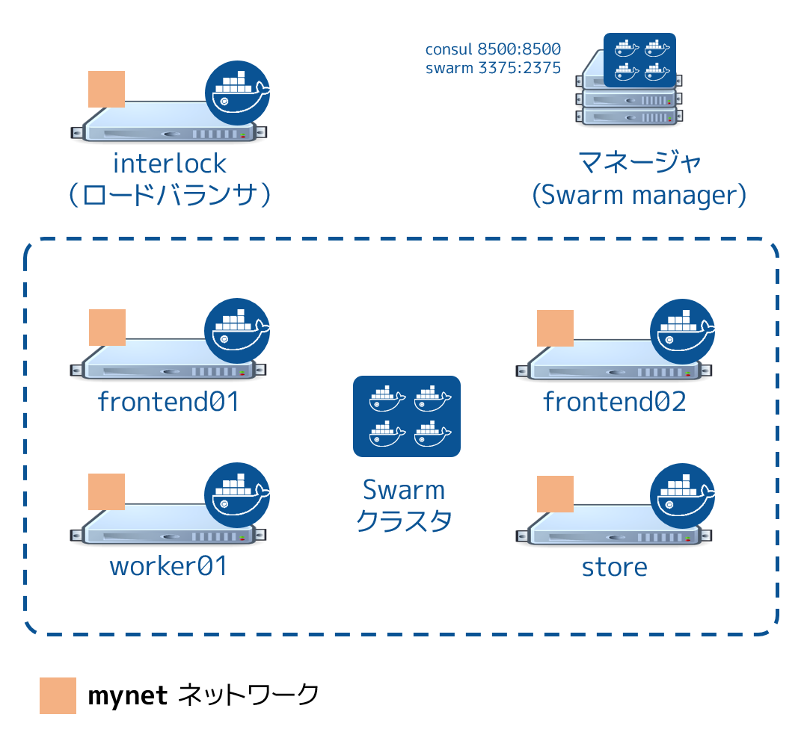

.. -*- coding: utf-8 -*-
.. URL: https://docs.docker.com/swarm/swarm_at_scale/03-crate-cluster/
.. SOURCE: https://github.com/docker/swarm/blob/master/docs/swarm_at_scale/03-create-cluster.md
   doc version: 1.10
      https://github.com/docker/swarm/commits/master/docs/swarm_at_scale/03-create-cluster.md
.. check date: 2016/03/09
.. Commits on Feb 28, 2016 ec8ceae209c54091065c8f9e50439bd76255b022
.. -------------------------------------------------------------------

.. Setup cluster resources

.. _setup-cluster-resources:

========================================
クラスタ・リソースのセットアップ
========================================

.. Now that your underlying network infrastructure is built, you can deploye and configure the Swarm cluster. A host in a Swarm cluster is called a node. So, these instructions refer to each AWS EC2 instances as a node and refers to each node by the Name it appears as in your EC2 Dashboard**.

:doc:`基礎となるネットワーク基盤を構築 <02-deploy-infra>` できましたので、Swarm クラスタの構築と設定を行う準備が整いました。以後、Swarm クラスタ上のホストを *ノード* と呼びます。そのため、AWS EC2 インスタンスをノードとして言及し、それぞれのノードを EC2 ダッシュボード上に表示されるノードの **名前** で呼びます。

.. The steps on this page construct a Swarm cluster by:

Swarm クラスタの構築は、以下の手順で進めます。

..    using Consul as the discovery backend
    join the frontend, worker
    store EC2 instances to the cluster
    use the spread scheduling strategy

* Consul をディスカバリ・バックエンドに使います。
* ``frontend`` と ``worker`` を追加します。
* ``store`` EC2 インスタンスをクラスタに追加します。
* ``spread`` スケジューリング・ストラテジを使います。

.. You’ll perform all the configuration steps from the Swarm manager node. The manager node has access to all the instances in the cluster.

すべての作業は Swarm マネージャ・ノード上で行います。マネージャ・ノードはクラスタ上の全てのインスタンスにアクセス可能です。

.. Step 1: Construct the cluster

.. _step-1-construct-the-cluster:

ステップ１：クラスタの構築
==============================

.. In this step, you create a Consul container for use as the Swarm discovery service. The Consul backend is also used as the K/V store for the container network that you overlay on the Swarm cluster in a later step. After you launch the Consul container, you launch a Swarm manager container.

このステップでは Consul コンテナを使い Swarm ディスカバリ・サービスを作成します。また、Consul バックエンドをコンテナ・ネットワーク用のキーバリュー・ストアとしても使います。これは後ろの方のステップで、Swarm クラスタをオーバレイします（覆います）。Consul コンテナを起動した後、Swarm マネージャ用コンテナを起動します。

..    Select the manager node and click Connect to display the ssh command you’ll need.

1. ``manager`` ノードを選び、 **Connect** を押すと``ssh`` に必要なコマンドが表示されます。

..    Open a terminal on your manager node with the ssh command.

2. ターミナルを開き、``manager`` ノードに ``ssh`` コマンドで接続します。

..    Start a Consul container that listens on TCP port 8500.

3. TCP ポート ``8500`` をリッスンする Consul コンテナを起動します。

.. code-block:: bash

   $ docker run --restart=unless-stopped -d -p 8500:8500 -h consul progrium/consul -server -bootstrap
   Unable to find image 'progrium/consul:latest' locally
   latest: Pulling from progrium/consul
   3b4d28ce80e4: Pull complete
   ...<output snip>...
   d9125e9e799b: Pull complete
   Digest: sha256:8cc8023462905929df9a79ff67ee435a36848ce7a10f18d6d0faba9306b97274
   Status: Downloaded newer image for progrium/consul:latest
   6136de6829916430ee911cc14e3f067624fcf6d3041d404930f6dbcbf5399f7d

..    Confirm the container is running.

4. コンテナが実行中なのを確認します。

.. code-block:: bash

   $ docker ps
   IMAGE               COMMAND                  CREATED              STATUS              PORTS                                                                            NAMES
   6136de682991        progrium/consul     "/bin/start -server -"   About a minute ago   Up About a minute   53/tcp, 53/udp, 8300-8302/tcp, 8400/tcp, 0.0.0.0:8500->8500/tcp, 8301-8302/udp   goofy_jepsen

..    Start a Swarm manager container.

5. Swarm マネージャ・コンテナを起動します。

..    This command maps port 3375 on the manager node to port 2375 in the Swarm manager container.

次のコマンドは ``manager`` ノード上のポート ``3375`` に Swarm マネージャ・コンテナのポート ``2375`` を割り当てます。

.. code-block:: bash

   $ docker run --restart=unless-stopped -d -p 3375:2375 swarm manage consul://192.168.33.11:8500/
   Unable to find image 'swarm:latest' locally
   latest: Pulling from library/swarm
   887115b43fc0: Pull complete
   ...<output snip>...
   f3f134eb6413: Pull complete
   Digest: sha256:51a8eba9502f1f89eef83e10b9f457cfc67193efc3edf88b45b1e910dc48c906
   Status: Downloaded newer image for swarm:latest
   f5f093aa9679410bee74b7f3833fb01a3610b184a530da7585c990274bd65e7e

..    The Swarm manager container is the heart of your Swarm cluster. It is responsible for receiving all Docker commands sent to the cluster, and for scheduling resources against the cluster. In a real-world production deployment you would configure additional replica Swarm managers as secondaries for high availability (HA).

Swarm マネージャ・コンテナは Swarm クラスタの中心です。クラスタに送信された全ての Docker コマンドを受信する役割を持ちます。また、クラスタに対してリソースをスケジューリングする役割もあります。プロダクション環境へ実際にデプロイする場合は、高可用性（HA）のためにセカンダリとしての複製（replica） Swarm マネージャを設定すべきでしょう。

..    Get information about your Docker installation.

6. Docker のインストール情報を確認します。

.. code-block:: bash

   $ docker info
   Containers: 2
   Images: 26
   Server Version: 1.9.1
   Storage Driver: aufs
    Root Dir: /var/lib/docker/aufs
    Backing Filesystem: extfs
    Dirs: 30
    Dirperm1 Supported: true
   Execution Driver: native-0.2
   Logging Driver: json-file
   Kernel Version: 3.16.0-57-generic
   Operating System: Ubuntu 14.04.3 LTS
   CPUs: 1
   Total Memory: 992.2 MiB
   Name: manager
   ID: IISM:V4KJ:VXCT:ONN3:MFIJ:2ZLD:VI6I:UYB3:FJZ4:3O7J:FHKA:P3XS
   WARNING: No swap limit support
   Cluster store: consul://192.168.33.11:8500
   Cluster advertise: 192.168.33.11:2375

..     The command information returns the information about the Engine and its daemon.

コマンドを実行すると Docker Engine とデーモンに関する情報を返します。

..    Confirm that you have the consul and swarm manage containers running.

7. ``consul`` と ``swarm manage`` コンテナの実行を確認します。

.. code-block:: bash

   $ docker ps
   CONTAINER ID        IMAGE               COMMAND                  CREATED              STATUS              PORTS                                                                            NAMES
   f5f093aa9679        swarm               "/swarm manage consul"   About a minute ago   Up About a minute   0.0.0.0:3375->2375/tcp                                                           sad_goldstine
   6136de682991        progrium/consul     "/bin/start -server -"   9 minutes ago        Up 9 minutes        53/tcp, 53/udp, 8300-8302/tcp, 8301-8302/udp, 8400/tcp, 0.0.0.0:8500->8500/tcp   goofy_jepsen

..    Set the DOCKER_HOST environment variable.

8. ``DOCKER_HOST`` 環境変数をセットします。

..    This ensures that the default endpoint for Docker Engine CLI commands is the Engine daemon running on the manager node.

これは Docker Engine CLI コマンド実行時のデフォルト・エンドポイントを、 ``manager`` ノード上で実行している Engine デーモンに変更します。

.. code-block:: bash

   $ export DOCKER_HOST="tcp://192.168.33.11:3375"

..    Now that your terminal environment is set to the Swarm port, rerun the docker info command.

9. これでターミナル環境が Swarm のポートにセットされました。 ``docker info`` コマンドの結果を確認します。

.. code-block:: bash

   $ docker info
   Containers: 0
   Images: 0
   Role: primary
   Strategy: spread
   Filters: health, port, dependency, affinity, constraint
   Nodes: 0
   Kernel Version: 3.16.0-57-generic
   Operating System: linux
   CPUs: 0
   Total Memory: 0 B
   Name: f5f093aa9679

..    The command is acting on the Swarm port, so it returns information about the entire cluster. You have a manager and no nodes.

コマンドは Swarm のポートに対して処理しまし。つまり、ここで表示されたのはクラスタ全体の情報です。管理するマネージャはありますが、ノードはまだありません。

..    While still on the master node, join each node one-by-one to the cluster.

10. ``master`` ノード上で、クラスタ上の各ノードを１つ１つクラスタに追加します。

..    You can run these commands to join each node from the manager node command line. The -H flag with the docker command specifies a node IP address and the Engine port. Each command goes over the cluster to the node’s Docker daemon. The join command joins a node to the cluster and registers it with the Consul discovery service.

``manager`` ノードのコマンドライン上で、各ノード向けのコマンドを実行します。 ``docker`` コマンドで ``-H`` フラグを使いノードの IP アドレスと Engine のポート番号を指定できます。各コマンドは各ノード上の Docker デーモンをクラスタに追加します。 ``join`` コマンドはクラスタにノードを追加・登録します。これを Consul ディスカバリ・サービスを使って行います。

**frontend01:**

.. code-block:: bash

   docker -H=tcp://192.168.33.20:2375 run -d swarm join --advertise=192.168.33.20:2375 consul://192.168.33.11:8500/

**frontend02:**

.. code-block:: bash

   docker -H=tcp://192.168.33.21:2375 run -d swarm join --advertise=192.168.33.21:2375 consul://192.168.33.11:8500/

**worker01:**

.. code-block:: bash

   docker -H=tcp://192.168.33.200:2375 run -d swarm join --advertise=192.168.33.200:2375 consul://192.168.33.11:8500/

**store:**

.. code-block:: bash

   docker -H=tcp://192.168.33.250:2375 run -d swarm join --advertise=192.168.33.250:2375 consul://192.168.33.11:8500/

..    Run the docker info command again to view your cluster with all its nodes.

11. ``docker info`` コマンドをもう一度実行し、クラスタ内の全てのノード情報を表示します。

.. code-block:: bash

   $ docker info
   Containers: 4
   Images: 4
   Role: primary
   Strategy: spread
   Filters: health, port, dependency, affinity, constraint
   Nodes: 4
    frontend01: 192.168.33.20:2375
     └ Status: Healthy
     └ Containers: 1
     └ Reserved CPUs: 0 / 1
     └ Reserved Memory: 0 B / 1.017 GiB
     └ Labels: executiondriver=native-0.2, kernelversion=3.16.0-57-generic, operatingsystem=Ubuntu 14.04.3 LTS, storagedriver=aufs
     └ Error: (none)
     └ UpdatedAt: 2016-02-14T19:02:53Z
    frontend02: 192.168.33.21:2375
     └ Status: Healthy
     └ Containers: 1
     └ Reserved CPUs: 0 / 1
     └ Reserved Memory: 0 B / 1.017 GiB
     └ Labels: executiondriver=native-0.2, kernelversion=3.16.0-57-generic, operatingsystem=Ubuntu 14.04.3 LTS, storagedriver=aufs
     └ Error: (none)
     └ UpdatedAt: 2016-02-14T19:02:58Z
    store: 192.168.33.250:2375
     └ Status: Healthy
     └ Containers: 1
     └ Reserved CPUs: 0 / 1
     └ Reserved Memory: 0 B / 3.86 GiB
     └ Labels: executiondriver=native-0.2, kernelversion=3.16.0-57-generic, operatingsystem=Ubuntu 14.04.3 LTS, storagedriver=aufs
     └ Error: (none)
     └ UpdatedAt: 2016-02-14T19:02:58Z
    worker01: 192.168.33.200:2375
     └ Status: Healthy
     └ Containers: 1
     └ Reserved CPUs: 0 / 1
     └ Reserved Memory: 0 B / 1.017 GiB
     └ Labels: executiondriver=native-0.2, kernelversion=3.16.0-57-generic, operatingsystem=Ubuntu 14.04.3 LTS, storagedriver=aufs
     └ Error: (none)
     └ UpdatedAt: 2016-02-14T19:03:21Z
   Kernel Version: 3.16.0-57-generic
   Operating System: linux
   CPUs: 4
   Total Memory: 6.912 GiB
   Name: f5f093aa9679

.. Step 2: Review your work

.. _step-2-review-your-work:

ステップ２：作業内容の確認
==============================

.. The diagram below shows the Swarm cluster that you created.

次の図は、これまでに作成した Swarm クラスタです。

.. image:: ../images/review-work.png
   :scale: 60%

.. The manager node is running two containers: consul and swarm. The consul container is providing the Swarm discovery service. This is where nodes and services register themselves and discover each other. The swarm container is running the swarm manage process which makes it act as the cluster manager. The manager is responsible for accepting Docker commands issued against the cluster and scheduling resources on the cluster.

``manager`` ノードで ``consul`` と ``swarm`` という２つのコンテナを実行しています。 ``consul`` コンテナは Swarm ディスカバリ・サービスを提供します。これはどこにノードやサービスがあるかお互いに登録するもので、お互いを発見できるようにします。 ``swarm`` コンテナは ``swarm manage`` プロセスとして実行されます。これはクラスタ・マネージャとして動作する状態です。マネージャはクラスタに対する Docker コマンドの実行を受付、クラスタ上のリソースに対してスケジューリングする役割です。

..You mapped port 3375 on the manager node to port 2375 inside the swarm container. As a result, Docker clients (for example the CLI) wishing to issue commands against the cluster must send them to the manager node on port 3375. The swarm container then executes those commands against the relevant node(s) in the cluster over port 2375.

先ほど ``manager`` ノード上のポート 3375 を ``swarm`` コンテナ内の 2375 に割り当てました。そのため、Docker クライアント（例えば CLI ）でクラスタに対してコマンドを実行しようとする時は、 ``manager`` ノード上のポート 3375 に送信する必要があります。 ``swarm`` コンテナはクラスタ上の適切なノードに対し、ポート 2375 を通してコマンドを実行します。

.. Now that you have your Swarm cluster configured, you’ll overlay the container network that the application containers will be part of.

これで Swarm クラスタの設定は完了です。アプリケーション・コンテナの一部として使うコンテナ・ネットワークを被せましょう。

.. Step 2: Overlay a container network

ステップ２：コンテナ・ネットワークを被せる
==================================================

.. All containers that are part of the voting application should belong to a container network called mynet. Container networking is a Docker Engine feature. Themynet network is a overlay network type that runs on top of the communication network.

全てのコンテナは投票アプリケーションの一部であり、 ``mynet`` という名前のコンテナ・ネットワークに所属しています。コンテナのネットワークは Docker Engine の機能です。 ``mynet`` ネットワークはオーバレイ・ネットワーク・タイプであり、ネットワーク通信上に構築します。

.. A container network can span multiple hosts on multiple networks. As a result, the mynet container network allows all the voting application containers to easily communicate irrespective of the underlying communication network that each node is on.

コンテナのネットワークは、複数ネットワーク上の複数ホストを横断できます。そのため、投票アプリケーション用コンテナは、 ``mynet`` コンテナ・ネットワークを通して、どのノード上に存在していても簡単に通信できるようにします。

.. You can create the network and join the containers from any node in your VPC that is running Docker Engine. However, best practice when using Docker Swarm is to execute commands from the manager node, as this is where all management tasks happen.

ネットワークを作成し、Docker Engine が動くあらゆる VPC ノート上のコンテナを追加できます。しかしながら、Docker Swarm に対してコマンドを実行するベスト・プラクティスは、 ``manager`` ノードから全ての管理タスクが実行されることです。

..    If you haven’t already, ssh into a terminal on your manager node.

1. ``manager`` ノードに ``ssh`` のターミナルで接続していなければ、接続します。

..    Get information about the network running on just the manager node.

2. ``manager`` ノード上でネットワークの情報を確認します。

..    You do this by passing the -H flag to restrict the Engine CLI to just the manager node.

CLI がマネージャ・ノードの Engine を参照するように、 ``-H``  フラグを使います。

.. code-block:: bash

   $ docker -H=tcp://192.168.33.11:2375 network ls
   NETWORK ID          NAME                DRIVER
   d01e8f0303a9        none                null                
   bab7a9c42a23        host                host                
   12fd2a115d85        bridge              bridge   

..    Now, run the same command to get cluster information.

3. 同様にクラスタの情報を取得します。

..    Provided you set export DOCKER_HOST="tcp://192.168.33.11:3375"`, the command directs to the Swarm port and returns information from each node in the cluster.

``export DOCKER_HOST="tcp://192.168.33.11:3375"`` を実行します。このコマンドで Swarm のポートに接続すると、クラスタ上にある各ノードの情報を返します。

.. code-block:: bash

   $ docker network ls
   NETWORK ID          NAME                DRIVER
   82ce2adce6a7        store/bridge        bridge              
   c3ca43d2622d        store/host          host                
   d126c4b1e092        frontend01/host     host                
   6ea89a1a5b6a        frontend01/bridge   bridge              
   d3ddb830d7f5        frontend02/host     host                
   44f238353c14        frontend02/bridge   bridge              
   c500baec447e        frontend02/none     null                
   77897352f138        store/none          null                
   8060bd575770        frontend01/none     null                
   429e4b8c2c8d        worker01/bridge     bridge              
   57c5001aca83        worker01/none       null                
   2101103b8494        worker01/host       host        

..     Create the overlay network with the docker network command

4. ``docker network`` コマンドでオーバレイ・ネットワークを作成します。

.. code-block:: bash

   $ docker network create --driver overlay mynet

..    Repeat the two network commands again to see how the network list has changed.

5. ２つのネットワークコマンドを実行して、どのようにネットワークが変わったのかを確認します。

.. code-block:: bash

   docker network ls
   docker -H=tcp://192.168.33.11:2375 network ls

..    As all Swarm nodes in your environment are configured to use the Consul discovery service at consul://192.168.33.11:8500, they all should see the new overlay network. Verify this with the next step.

Swarm ノードの全てが ``consul://192.168.33.11:8500`` の Consul ディスカバリ・サービスを使って設定されたものです。これらは新しいオーバレイ・ネットワーク上でも見えます。詳細は次のステップで確認します。

..    Try running a network command on an individual node, for example to run it on the frontend01 node:

6. 個々のノード上で network コマンドを試してみましょう。例えば、 ``frontend01`` ノード上で実行するには、次のようにします。

.. code-block:: bash

   docker -H=tcp://192.168.33.20:2375 network ls

..    You should see an entry for the mynet network using the overlay driver as shown above. You would get the same output if your ran the command from node’s command line.

出力結果から ``mynet`` ネットワークは ``overlay`` ドライバを使っているのが分かります。どのノードでコマンドを実行しても、同じオーバレイ・ネットワークが有効なことが分かるでしょう。

.. Step 4: Review your work

.. _step-4-review-your-work:

ステップ４：作業内容の確認
==============================

.. The diagram below shows the complete cluster configuration including the overlay container network, mynet. The mynet is shown as red and is available to all Docker hosts using the Consul discovery backend. Later in the procedure you will connect containers to this network.

以下の図は ``mynet``オーバレイ・コンテナ・ネットワーク設定が行われ、クラスタ設定が完了した状態です。 ``mynet`` は図中の赤いマークとして確認できるところで、Docker ホストは Consul ディスカバリ・バックエンドを使っています。後の手順でコンテナをこのネットワークに接続します。

.. The swarm and consul containers on the manager node are not attached to the mynet overlay network. These containers are running on manager nodes default bridge network. To verify this try using these two commands:

``manager`` ノード上の ``swarm`` と ``consul`` コンテナは ``mynet`` オーバレイ・ネットワークに接続していません。これらのコンテナは ``manager`` ノード上のデフォルト・ブリッジ・ネットワーク上で動作しています。この状態を確認するには２つのコマンドを実行します。

.. code-block:: bash

   docker -H=tcp://192.168.33.11:2375 network inspect bridge
   docker -H=tcp://192.168.33.11:2375 network inspect mynet

.. You should find two containers running on the manager node’s bridge network but nothing yet on the mynet network.

２つのコンテナは ``manager`` ノード上の ``bridge``  ネットワークで動いていますが、まだ ``mynet`` ネットワークには所属していません。

.. Next Step

次のステップ
====================

.. Your Swarm cluster is now built and you are ready to build and run the voting application on it.

Swarm クラスタの構築が終わりましたので、ここに  :doc:`投票アプリケーションを構築・実行 <04-deploy-app>` する準備が整いました。

.. seealso:: 

   Setup cluster resources
      https://docs.docker.com/swarm/swarm_at_scale/03-create-cluster/
