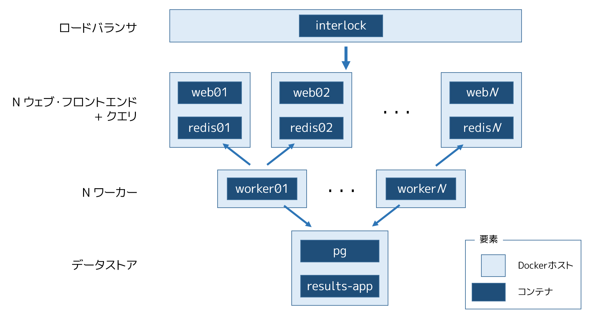
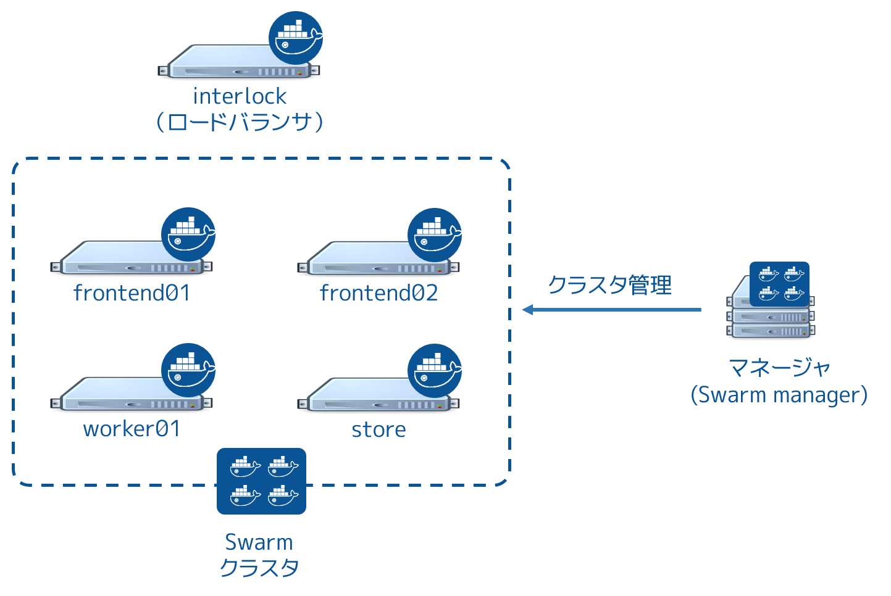
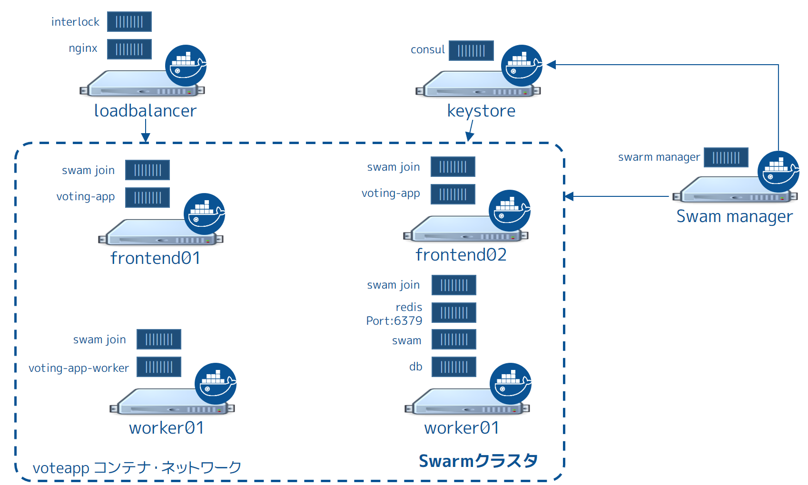

.. -*- coding: utf-8 -*-
.. URL: https://docs.docker.com/swarm/swarm_at_scale/about/
.. SOURCE: https://github.com/docker/swarm/blob/master/docs/swarm_at_scale/about.md
   doc version: 1.11
      https://github.com/docker/swarm/commits/master/docs/swarm_at_scale/about.md
.. check date: 2016/04/29
.. Commits on Apr 29, 2016 d2c9f8bc9a674a4f215afe3651a09ee5c42c713c
.. -------------------------------------------------------------------

.. Learn the application architecture

.. _learn-the-application-architecture:

=======================================
アプリケーションのアーキテクチャを学ぶ
=======================================

.. sidebar:: 目次

   .. contents:: 
       :depth: 3
       :local:

.. On this page, you learn about the Swarm at scale example. Make sure you have read through the introduction to get an idea of the skills and time required first.

このページでは、Swarm をスケールさせるサンプルについて学びます。まず :doc:`導入ページ <index>` を読み、必要となるスキルや時間を検討ください。

.. Learn the example back story

サンプルの背景を学ぶ
====================

.. Your company is a pet food company that has bought a commercial during the Superbowl. The commercial drives viewers to a web survey that asks users to vote -- cats or dogs. You are developing the web survey.

あなたの会社はペットフード会社であり、スーパーボウルのコマーシャル枠を購入しようとしています。コマーシャルでは、視聴者に対して調査のために犬か猫かの投票を呼びかけます。あなたはウェブ投票システムを開発します。

.. Your survey must ensure that millions of people can vote concurrently without your website becoming unavailable. You don’t need real-time results, a company press release announces the results. However, you do need confidence that every vote is counted.

この調査では100万人もの人々が投票してもウェブサイトが止まらないようにする必要があります。結果をリアルタイムで知る必要は無く、結果は会社のプレスリリースで公開します。しかし、どれだけ投票されたかは、投票の度に確実に把握する必要があります。

.. Understand the application architecture

.. _understand-the-application-architecture:

アプリケーションのアーキテクチャを理解
========================================

.. The voting application is composed of several microservices. It uses a parallel web frontend that sends jobs to asynchronous background workers. The application’s design can accommodate arbitrarily large scale. The diagram below shows the appliation’s high level architecture:

投票アプリケーションは複数のマイクロサービスで構成されます。並列なウェブ・フロントエンドを使い、ジョブを非同期のバックグラウンド・ワーカに送ります。アプリケーションは任意に大きくスケール可能な設計です。次の図はアプリケーションのハイレベルなアーキテクチャです。

.. All the servers are running Docker Engine. The entire application is fully “Dockerized” in that all services are running inside of containers.

全てのサーバで Docker Engine が動いています。アプリケーション全体は完全に Docker 化（Dockerized）しており、全てのサービスをコンテナ内で実行します。

.. The frontend consists of an load balancer with N frontend instances. Each frontend consists of a web server and a Redis queue. The load balancer can handle an arbitrary number of web containers behind it (frontend01- frontendN). The web containers run a simple Python application that takes a vote between two options. It queus the votes to a Redist container running on the datastore.

フロントエンドはロードバランサと N 台のフロントエンド・インスタンスで構成します。各フロントエンドはウェブ・サーバと Redis キューで構成します。ロードバランサは任意の数のウェブ・コンテナを背後で扱えます（ ``frontend01`` ～ ``frontendN`` ）。Webコンテナは２つの選択肢から投票するシンプルな Python アプリケーションです。キューに入った投票は datasotre 上の Redis コンテナに送られます。

.. The load balancer together with the independent pairs allows the entire application to scale to an arbitrary size as needed to meet demand.

.. このペアはロードバランサと個別に連係できます。そのため、アプリケーション全体を需要に応じて任意の大きさにスケール可能です。

.. Behind the frontend is a worker tier which runs on separate nodes. This tier:

フロントエンドの背後にはワーカ層があり、別々のノードが動いています。この層は次の機能があります。

..    scans the Redis containers
    dequeues votes
    deduplicates votes to prevent double voting
    commits the results to a Postgres database

* Redis コンテナをスキャン
* 投票のキューを回収
* 重複投票を防ぐために投票結果を複製
* 結果を Postgres データベースにコミットする

.. Just like the frontend, the worker tier can also scale arbitrarily. The worker count and frontend count are independent from each other.

フロントエンドと同様に、ワーカ層も任意にスケールできます。ワーカの数とフロントエンドの数は、お互い独立しています。

.. The applications Dockerized microservices are deployed to a container network. Container networks are a feature of Docker Engine that allows communication between multiple containers across multiple Docker hosts.

Docker 化したマイクロサービスのアプリケーションを、コンテナ・ネットワークにデプロイします。コンテナ・ネットワークは Docker Engine の機能です。これは複数の Docker ホスト上を横断して複数のコンテナ間で通信を可能にします。

.. Swarm Cluster Architecture

.. _swarm-cluster-architecture:

Swarm クラスタのアーキテクチャ
------------------------------

.. To support the application, the design calls for a Swarm cluster with a single Swarm manager and four nodes as shown below.

アプリケーションをサポートするのは、次の図のように、１つの Swarm マネージャと４つのノードで構成する設計の Swarm クラスタです。

.. All four nodes in the cluster are running the Docker daemon, as is the Swarm manager and the load balancer. The Swarm manager is part of the cluster and is considered out of band for the application. A single host running the Consul server acts as a keystore for both Swarm discovery and for the container network. The load balancer could be placed inside of the cluster, but for this demonstration it is not.

クラスタの４つのノード全てで Docker デーモンが動作します。Swarm マネージャと ロードバランサも同様です。Swarm マネージャはクラスタの一部であり、アプリケーションの範囲外であると考えます。１つのホスト上で Consul サーバはキーストア（keystore）として動作します。これは Swarm ディスカバリ用と、コンテナ・ネットワーク用の両方のためです。ロードバランサはクラスタ内に設置可能ですが、今回のサンプルでは扱いません。

.. After completing the example and deploying your application, this is what your environment should look like.

サンプルとアプリケーションのデプロイを完了したら、皆さんの環境は下図のようになります。

.. As the previous diagram shows, each node in the cluster runs the following containers:

この図にあるように、クラスタの各ノードでは次のコンテナを実行します。

..    frontend01:
        Container: voting-app
        Container: Swarm agent
    frontend02:
        Container: voting-app
        Container: Swarm agent
    worker01:
        Container: voting-app-worker
        Container: Swarm agent
    dbstore:
        Container: voting-app-result-app
        Container: db (Postgres 9.4)
        Container: redis
        Container: Swarm agent

* ``frontend01`` ：

  * コンテナ：voting-app（投票アプリ）
  * コンテナ：Swarm エージェント

* ``frontend02`` ：

  * コンテナ：voting-app（投票アプリ）
  * コンテナ：Swarm エージェント

* ``worker01`` ：

  * コンテナ：voting-app-worker（投票ワーカ・アプリ）
  * コンテナ：Swarm エージェント

* ``dbstore`` ：

  * コンテナ：voting-app-result-app（投票結果用アプリ）
  * コンテナ：db (Postgres 9.4)
  * コンテナ：redis
  * コンテナ：Swarm エージェント

.. After you deploy the application, you’ll configure your local system so that you can test the application from your local browser. In production, of course, this step wouldn’t be needed.

アプリケーションのデプロイ時、ローカル・システムを設定したら、ローカルのブラウザ上でアプリケーションをテスト可能です。プロダクションでは、もちろんこの手順は不要です。

.. Next step

次のステップ
====================

.. Now that you understand the application architecture, you need to deploy a network configuration that can support it. In the next step, you use AWS to deploy network infrastructure for use in this sample.

.. Now that you understand the application architecture, you need to deploy a network configuration that can support it. In the next step, you deploy network infrastructure for use in this sample.

これでアプリケーションのアーキテクチャを理解しました。デプロイするにあたり、どのようなネットワーク設定をサポートする必要があるのか理解したと思います。次のステップでは、このサンプルが使つ :doc:`ネットワーク・インフラをデプロイ <deploy-infra>` します。

.. seealso:: 

   Learn the application architecture
      https://docs.docker.com/swarm/swarm_at_scale/about/
