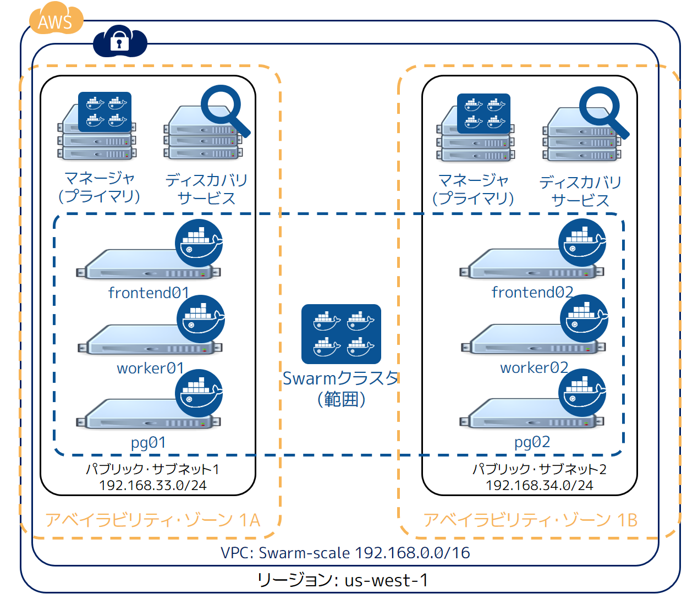
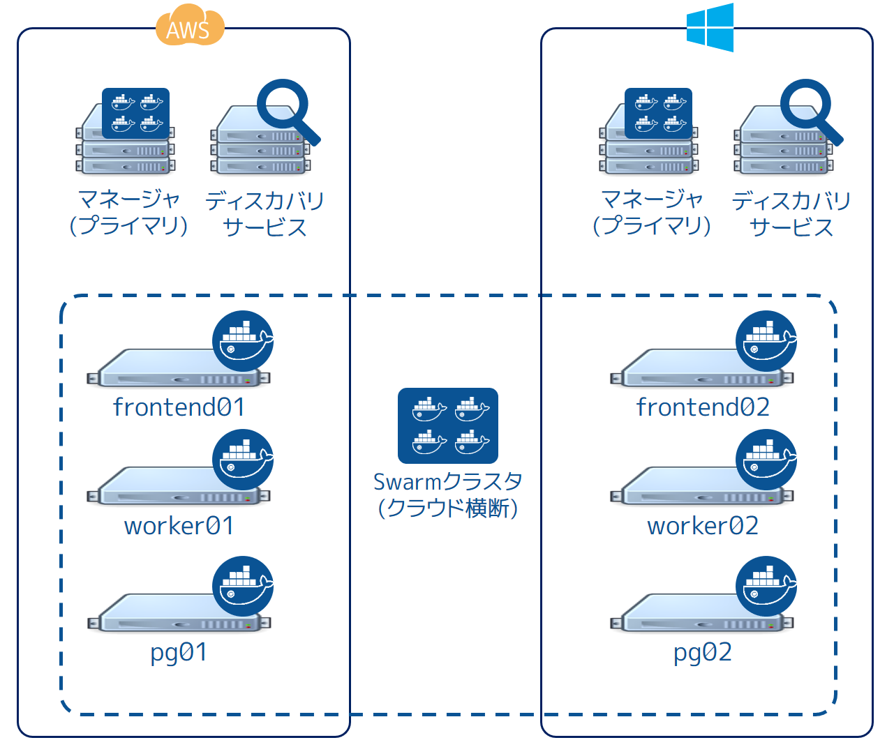

.. -*- coding: utf-8 -*-
.. URL: https://docs.docker.com/swarm/swarm_at_scale/troubleshoot/
.. SOURCE: https://github.com/docker/swarm/blob/master/docs/swarm_at_scale/troubleshoot.md
   doc version: 1.11
      https://github.com/docker/swarm/commits/master/docs/swarm_at_scale/troubleshoot.md
.. check date: 2016/05/26
.. Commits on Apr 14, 2016 70a180cb30ea4593b8f69d14c544cf278bf54ddd
.. -------------------------------------------------------------------

.. Troubleshoot the application

.. _troubleshoot-the-application:

========================================
アプリケーションのトラブルシュート
========================================

.. It’s a fact of life that things fail. With this in mind, it’s important to understand what happens when failures occur and how to mitigate them. The following sections cover different failure scenarios:

何事も失敗するのが、人生における現実です。これを前提に、障害が発生したらどのように対処すべきか考えるのは重要です。以下のセクションでは、いくつかの障害シナリオを扱います。

* :ref:`swarm-manager-failures`
* :ref:`consul-discovery-backend-failures`
* :ref:`interlock-load-balancer-failures`
* :ref:`web-web-vote-app-failures`
* :ref:`redis-failures`
* :ref:`worker-vote-worker-failures`
* :ref:`postgres-failures`
* :ref:`results-app-failures`
* :ref:`infrastructure-failures`

.. Swarm manager failures

.. _swarm-manager-failures:

Swarm マネージャ障害
====================

.. In it’s current configuration, the Swarm cluster only has single manager container running on a single node. If the container exits or the node fails, you will not be able to administer the cluster until you either; fix it, or replace it.

現在の設定では、 Swarm クラスタには１つのホスト上で１つのマネージャ用コンテナしかありません。コンテナが終了したりノード障害が発生したりしますと、クラスタを管理できなくなるだけでなく、修復や入れ替えも不可能になります。

.. If the failure is the Swarm manager container unexpectedly exiting, Docker will automatically attempt to restart it. This is because the container was started with the --restart=unless-stopped switch.

Swarm マネージャ・コンテナが予期せず終了して障害になった場合、Docker は自動的にコンテナの再起動を試みます。これはコンテナ起動時に ``--restart=unless-stopped`` に切り替える設定をしたからです。

.. While the Swarm manager is unavailable, the application will continue to work in its current configuration. However, you will not be able to provision more nodes or containers until you have a working Swarm manager.

Swarm マネージャが利用不可能になれば、アプリケーションは現状の設定で実行し続けます。しかし、Swarm マネージャが使えるようになるまで、ノードやコンテナをプロビジョンできなくなります。

.. Docker Swarm supports high availability for Swarm managers. This allows a single Swarm cluster to have two or more managers. One manager is elected as the primary manager and all others operate as secondaries. In the event that the primary manager fails, one of the secondaries is elected as the new primary, and cluster operations continue gracefully. If you are deploying multiple Swarm managers for high availability, you should consider spreading them across multiple failure domains within your infrastructure.

Docker Swarm は Swarm マネージャの高可用性をサポートしています。そのため、１つのクラスタ上に２つ以上のマネージャを追加可能です。あるマネージャがプライマリ・マネージャとして選ばれたら、その他のものはセカンダリになります。プライマリ・マネージャで障害が発生したら、他のセカンダリから新しいプライマリ・マネージャが選び出され、クラスタの操作をし続けることが可能になります。高可用性に対応した Swarm マネージャを複数デプロイする場合は、インフラ上で複数の領域を横断する障害発生を考慮したほうが良いでしょう。

.. Consul (discovery backend) failures

.. _consul-discovery-backend-failures:

Consul（ディスカバリ・バックエンド）障害
========================================

.. The Swarm cluster that you have deployed has a single Consul container on a single node performing the cluster discovery service. In this setup, if the Consul container exits or the node fails, the application will continue to operate in its current configuration. However, certain cluster management operations will fail. These include registering new containers in the cluster and making lookups against the cluster configuration.

この Swarm クラスタは、クラスタのディスカバリ・サービスとして、１つのノード上で Consul コンテナを１つデプロイしました。このセットアップ方法では、もし Consul コンテナを終了するかノード障害が発生しても、現在の状態のままアプリケーションを実行できるかもしれません。しかしながら、クラスタ管理に関する処理は障害になります。障害範囲は、クラスタ上に新しいコンテナの登録ができなくなり、クラスタに対して設定確認も行えません。

.. If the failure is the consul container unexpectedly exiting, Docker will automatically attempt to restart it. This is because the container was started with the --restart=unless-stopped switch.

``consul`` コンテナが予期せず終了して障害になった場合、Docker は自動的にコンテナの再起動を試みます。これはコンテナ起動時に ``--restart=unless-stopped`` に切り替える設定をしたからです。

.. The Consul, etcd, and Zookeeper discovery service backends support various options for high availability. These include Paxos/Raft quorums. You should follow existing best practices for deploying HA configurations of your chosen discover service backend. If you are deploying multiple discovery service instances for high availability, you should consider spreading them across multiple failure domains within your infrastructure.

``consul`` 、 ``etcd`` 、 ``Zookeeper``  の各ディスカバリ・サービス・バックエンドは、様々な高可用性のオプションをサポートしています。これらには Paxos/Raft クォーラムが組み込まれています。高可用性に対応した設定をするには、あなたが選んだディスカバリ・サービス・バックエンドに対する既存のベスト・プラクティスを確認すべきです。高可用性のために複数のディスカバリ・サービス・バックエンドをデプロイするのであれば、インフラ上で複数の領域に横断した障害発生への対処を考えるべきです。

.. If you operate your Swarm cluster with a single discovery backend service and this service fails and is unrecoverable, you can start a new empty instance of the discovery backend and the Swarm agents on each node in the cluster will repopulate it.

１つのディスカバリ・バックエンド・サービスで Swarm クラスタを操作する場合、このサービスが停止すると修復不可能になります。そのような場合は、新しいディスカバリ・バックエンド用のインスタンスを起動し直し、クラスタの各ノード上で Swarm エージェントを実行し直す必要があります。

.. Handling failures

.. _handling-failures:

障害の取り扱い
--------------------

.. There are many reasons why containers can fail. However, Swarm does not attempt to restart failed containers.

コンテナの障害には様々な理由が考えられます。しかしながら、Swarm はコンテナで障害が発生しても再起動を試みません。

.. One way to automatically restart failed containers is to explicitly start them with the --restart=unless-stopped flag. This will tell the local Docker daemon to attempt to restart the container if it unexpectedly exits. This will only work in situations where the node hosting the container and it’s Docker daemon are still up. This cannot restart a container if the node hosting it has failed, or if the Docker daemon itself has failed.

コンテナの障害発生時、自動的に再起動する方法の１つは、コンテナ起動時に ``--restart=unless-stopped`` フラグを付けることです。これはローカルの Docker デーモンに対して、コンテナで不意な終了が発生した場合に再起動するよう命令します。これが正常に機能するのは、コンテナを実行するノードと Docker デーモンが正常に稼働し続ける状況のみです。コンテナを実行するホスト自身で障害が発生したら、コンテナを再起動できません。あるいは、Docker デーモン自身が障害となっているでしょう。

.. Another way is to have an external tool (external to the cluster) monitor the state of your application, and make sure that certain service levels are maintained. These service levels can include things like “have at least 10 web server containers running”. In this scenario, if the number of web containers drops below 10, the tool will attempt to start more.

別の方法としては、外部のツール（クラスタ外にあるツール）を使ってアプリケーションの状態を監視し、適切なサービス・レベルを維持する方法があります。サービス・レベルとは「少なくともウェブサーバのコンテナを10動かす」といったものです。このシナリオでは、ウェブ・コンテナの実行数が10以下になれば、ツールが何らかの方法で足りない数だけコンテナの起動を試みます。

.. In our simple voting-app example, the front-end is scalable and serviced by a load balancer. In the event that on the of the two web containers fails (or the AWS instance that is hosting it), the load balancer will stop routing requests to it and send all requests the surviving web container. This solution is highly scalable meaning you can have up to n web containers behind the load balancer.

今回のサンプル投票アプリケーションでは、フロントエンドはロードバランサがあるためスケーラブル（スケール可能）です。２つのウェブ・コンテナで障害が発生すると（あるいは実行している AWS ホスト自身での障害が起これば）、ウェブ・コンテナに対するリクエストがあってもロードバランサは障害対象へのルーティングを停止し、別の経路に振り分けできます。ロードバランサの背後にｎ個のウェブ・コンテナを起動できるますのでで、この方法は高い拡張性を持つと言えるでしょう。

.. Interlock load balancer failures

.. _interlock-load-balancer-failures:

Interlock ロードバランサ障害
==============================

.. The environment that you have provisioned has a single interlock load balancer container running on a single node. In this setup, if the container exits or node fails, the application will no longer be able to service incoming requests and the application will be unavailable.

今回の例では、１つのノード上で１つの `interlock <https://github.com/ehazlett/interlock>`_  ロードバランサを実行する環境を構築しました。このセットアップ方法では、コンテナが終了するかノード障害が発生したら、アプリケーションはサービスに対するリクエストを受け付けできなくなり、アプリケーションが利用不可能になります。

.. If the failure is the interlock container unexpectedly exiting, Docker will automatically attempt to restart it. This is because the container was started with the --restart=unless-stopped switch.

``interlock`` コンテナが不意に終了すると障害になり、Docker は自動的に再起動を試みます。これはコンテナ起動時に ``--restart=unless-stopped`` フラグを付けたからです。

.. It is possible to build an HA Interlock load balancer configuration. One such way is to have multiple Interlock containers on multiple nodes. You can then use DNS round robin, or other technologies, to load balance across each Interlock container. That way, if one Interlock container or node goes down, the others will continue to service requests.

高可用性のある Interlock ロードバランサを構築可能です。複数のノード上に複数の Interlock コンテナを実行する方法があります。後は DNS ラウンドロビンの使用や、その他の技術により、Interlock コンテナに対するアクセスを負荷分散します。この方法であれば、１つの Interlock コンテナやノードがダウンしたとしても、他のサービスがリクエストを処理し続けます。

.. If you deploy multiple interlock load balancers, you should consider spreading them across multiple failure domains within your infrastructure.

複数の Interlock ロードバランサをデプロイする場合は、インフラ上で複数の領域に横断した障害発生への対処を考えるべきです。

.. Web (web-vote-app) failures

.. _web-web-vote-app-failures:

ウェブ（web-vote-app）障害
==============================

.. The environment that you have configured has two web-vote-app containers running on two separate nodes. They operate behind an Interlock load balancer that distributes incoming connections across both.

今回の環境では、２つのノードで２つのウェブ投票用コンテナを実行するように設定しました。これらは Interlock ロードバランサの背後にあるため、受信した接続は両者にまたがって分散されます。

.. In the event that one of the web containers or nodes fails, the load balancer will start directing all incoming requests to surviving instance. Once the failed instance is back up, or a replacement is added, the load balancer will add it to the configuration and start sending a portion of the incoming requests to it.

もし１つのウェブコンテナもしくはノードで障害が発生しても、ロードバランサは生存しているコンテナに全てのトラフィックを流し続けますので、サービスは継続します。障害のあったインスタンスが復旧するか、あるいは追加した所に切り替えれば、受信したリクエストを適切に処理するようロードバランサの設定を変更します。

.. For highest availability you should deploy the two frontend web services (frontend01 and frontend02) in different failure zones within your infrastructure. You should also consider deploying more.

最も高い可用性を考えるのであれば、２つのフロントエンド・ウェブ・サービス（ ``frontend01`` と ``frontend02`` ）をインフラ上の異なった障害ゾーンへデプロイすることになるでしょう。あるいは、更なるデプロイの検討も良いかもしれません。

.. Redis failures

.. _redis-failures:

Redis 障害
==========

.. If the a redis container fails, it’s partnered web-vote-app container will not function correctly. The best solution in this instance might be to configure health monitoring that verifies the ability to write to each Redis instance. If an unhealthy redis instance is encountered, remove the web-vote-app and redis combination and attempt remedial actions.

``redis`` コンテナで障害が発生したら、一緒に動作している ``web-vote-app`` コンテナも正常に機能しなくなります。一番良い方法は対象インスタンスの正常性を監視するよう設定し、各 Redis インスタンスに対して正常な書き込みができるかどうか確認することです。もし問題のある ``redis`` インスタンスが発見されれば、 ``web-vote-app`` と ``redis`` の連係を切り離し、復旧作業にあたるべきです。

.. Worker (vote-worker) failures

.. _worker-vote-worker-failures:

ワーカ（vote-worker）障害
==============================

.. If the worker container exits, or the node that is hosting it fails, the redis containers will queue votes until the worker container comes back up. This situation can prevail indefinitely, though a worker needs to come back at some point and process the votes.

ワーカ・コンテナが終了するか、実行しているノードで障害が発生したら、redis コンテナは worker コンテナが復旧するまで投票キューを保持します。ワーカが復旧するまでその状態が維持され、投票も継続できます。

.. If the failure is the worker01 container unexpectedly exiting, Docker will automatically attempt to restart it. This is because the container was started with the --restart=unless-stopped switch.

もし ``worker01`` コンテナが不意に停止して障害になれば、Docker は自動的に再起動を試みます。これはコンテナ起動時に ``--restart=unless-stopped`` フラグを付けたからです。

.. Postgres failures

.. _postgres-failures:

Postgres 障害
====================

.. This application does not implement any for of HA or replication for Postgres. Therefore losing the Postgres container would cause the application to fail and potential lose or corrupt data. A better solution would be to implement some form of Postgres HA or replication.

今回のアプリケーションでは HA や Postgres のレプリケーションを実装していません。つまり Postgres コンテナの喪失とは、アプリケーションの障害だけでなく、データの損失または欠損を引き起こす可能性があります。何らかの Postgres HA やレプリケーションのような実装をすることが望ましい解決策です。

.. Results-app failures

.. _results-app-failures:

results-app 障害
====================

.. If the results-app container exits, you will not be able to browse to the results of the poll until the container is back up and running. Results will continue to be collected and counted, you will just not be able to view results until the container is back up and running.

results-app コンテナが終了したら、コンテナが復旧するまで結果をブラウザで表示できなくなります。それでも投票データを集めてカウントを継続できるため、復旧は純粋にコンテナを立ち上げるだけで済みます。

.. The results-app container was started with the --restart=unless-stopped flag meaning that the Docker daemon will automatically attempt to restart it unless it was administratively stopped.

results-app コンテナは起動時に ``--restart=unless-stopped`` フラグを付けています。つまり Docker デーモンは自動的にコンテナの再起動を試みます。たとえそれが管理上の停止だったとしてもです。

.. Infrastructure failures

.. _infrastructure-failures:

インフラ障害
====================

.. There are many ways in which the infrastructure underpinning your applications can fail. However, there are a few best practices that can be followed to help mitigate and offset these failures.

アプリケーションの障害は、その支えとなるインフラによって様々な要因があります。しかしながら、いくつかのベストプラクティスは移行の手助けや障害の緩和に役立つでしょう。

.. One of these is to deploy infrastructure components over as many failure domains as possible. On a service such as AWS, this often translates into balancing infrastructure and services across multiple AWS Availability Zones (AZ) within a Region.

方法の１つは、可能な限り多くの障害領域にインフラのコンポーネントを分けてデプロイします。AWS のようなサービスでは、しばしインフラの分散や、複数のリージョン AWS アベイラビリティ・ゾーン（AZ）を横断することです。

.. To increase the availability of our Swarm cluster you could:

Swarm クラスタのアベイラビリティ・ゾーンを増やすには：

..    Configure the Swarm manager for HA and deploy HA nodes in different AZs
    Configure the Consul discovery service for HA and deploy HA nodes in different AZs
    Deploy all scalable components of the application across multiple AZs

* HA 用の Swarm マネージャを、異なった AZ にある HAノードにデプロイ
* HA 用の Consul ディスカバリ・サービスを、異なった AZ にある HA ノードにデプロイ
* 全てのスケーラブルなアプリケーションのコンポーネントを、複数の AZ に横断させる

.. This configuration is shown in the diagram below.

この設定を反映したものが、次の図です。

.. This will allow us to lose an entire AZ and still have our cluster and application operate.

この手法であれば AZ 全体を喪失しても、クラスタとアプリケーションを処理可能です。

.. But it doesn’t have to stop there. Some applications can be balanced across AWS Regions. In our example we might deploy parts of our cluster and application in the us-west-1 Region and the rest in us-east-1. It’s even becoming possible to deploy services across cloud providers, or have balance services across public cloud providers and your on premises date centers!

しかし全く止まらない訳ではありません。アプリケーションによっては AWS リージョンを横断して分散されているかもしれません。私たちのサンプルでは、クラスタとアプリケーションを ``us-west-1`` リージョンにデプロイし、データを ``us-east-1`` に置いています。この状態から、更にクラウド・プロバイダを横断するデプロイや、あるいはパブリック・クラウド・プロバイダや自分のデータセンタにあるオンプレミスに対して分散することもできるでしょう！

.. The diagram below shows parts of the application and infrastructure deployed across AWS and Microsoft Azure. But you could just as easily replace one of those cloud providers with your own on premises data center. In these scenarios, network latency and reliability is key to a smooth and workable solution.

以下の図はアプリケーションとインフラを AWS と Microsoft Azure にデプロイしたものです。ですが、クラウドプロバイダはデータセンタにあるオンプレミスに置き換えても構いません。これらのシナリオでは、ネットワークのレイテンシと信頼性がスムーズに動作させるための鍵となります。

.. Related information

関連情報
====================

.. The application in this example could be deployed on Docker Universal Control Plane (UCP) which is currently in Beta release. To try the application on UCP in your environment, request access to the UCP Beta release. Other useful documentation:

このサンプル・アプリケーションは Docker Universal Control Plane (UCP) にもデプロイできます。UCP を皆さんの環境で試したい場合は、 `UCP へのアクセス・リクエスト <https://www.docker.com/products/docker-universal-control-plane>`_ のページをご覧ください。

..    Plan for Swarm in production
    Swarm and container networks
    High availability in Docker Swarm

* :doc:`/swarm/plan-for-production`
* :doc:`/swarm/networking`
* :doc:`/swarm/multi-manager-setup`

.. seealso:: 

   Troubleshoot the application
      https://docs.docker.com/swarm/swarm_at_scale/05-troubleshoot/
