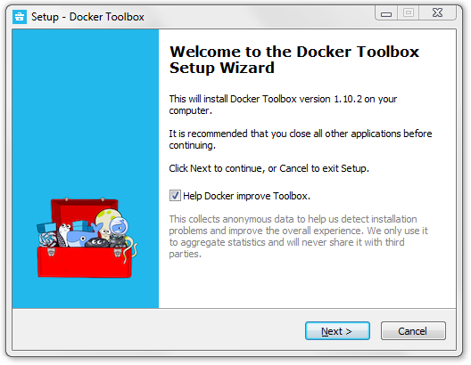

.. *- coding: utf-8 -*-
.. URL: https://docs.docker.com/toolbox/overview/
.. check date: 2016/04/04
.. -------------------------------------------------------------------

.. Docker Toolbox Overview:

.. _docker-toolbox-overview:

========================================
Docker Toolbox 概要
========================================

.. sidebar:: 目次

   .. contents:: 
       :depth: 3
       :local:

.. Docker Toolbox is an installer for quick setup and launch of a Docker environment on Mac and Windows systems.

Docker Toolbox は Mac と Windows システム上に Docker 環境を迅速にインストールして起動します。

.. What’s in the box

.. _whats-in-the-box:

何が入っていますか
====================

.. Toolbox includes these Docker tools:

Toolbox には以下の Docker ツールが入っています。

..    Docker Machine for running docker-machine commands
    Docker Engine for running the docker commands
    Docker Compose for running the docker-compose commands
    Kitematic, the Docker GUI
    a shell preconfigured for a Docker command-line environment
    Oracle VirtualBox

* Docker Machine を操作する ``docker-machine`` コマンド
* Docker Engine を操作する ``docker`` コマンド
* Docker Compose を操作する ``docker-compose`` コマンド
* Docker GUI である Kitematic
* シェルに接続できる Docker コマンドライン環境
* Oracle VirtualBox

.. Ready to get started?

.. _ready-to-get-started:

使い始めるには？
====================

.. Download Docker Toolbox from the product page.

プロダクトのページから `Docker Toolbox をダウンロード <https://www.docker.com/products/docker-toolbox>`_ します。

.. Next Steps

次のステップ
====================

..    Get Started with Docker for Mac OS X
    Get Started with Docker for Windows
    Learn about Kitematic
    Learn about Docker Machine
    Learn about Docker Compose

* :doc:`/mac/index`
* :doc:`/windows/index`
* :doc:`Kitematic を学ぶ </kitematic/userguide/index>`
* :doc:`Docker Machine を学ぶ </machine/overview>`
* :doc:`Docker Compose を学ぶ </compose/overview>`

.. seealso:: 

   Docker Toolbox Overview
      https://docs.docker.com/toolbox/overview/

